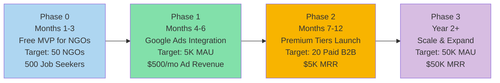
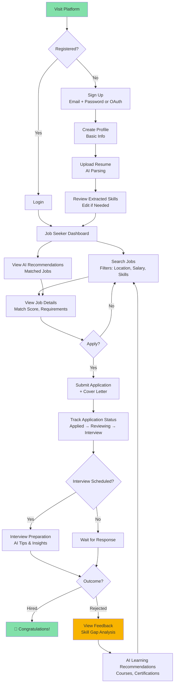
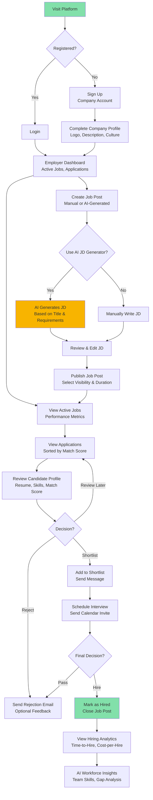
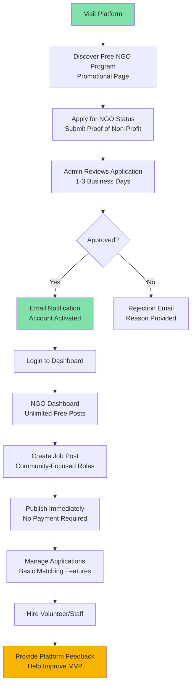
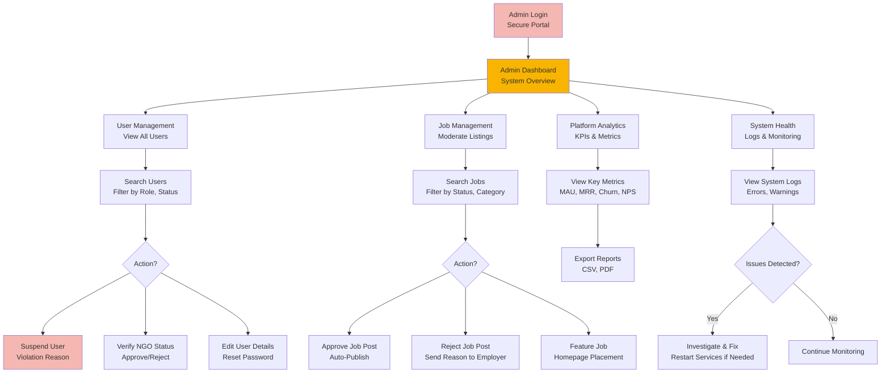
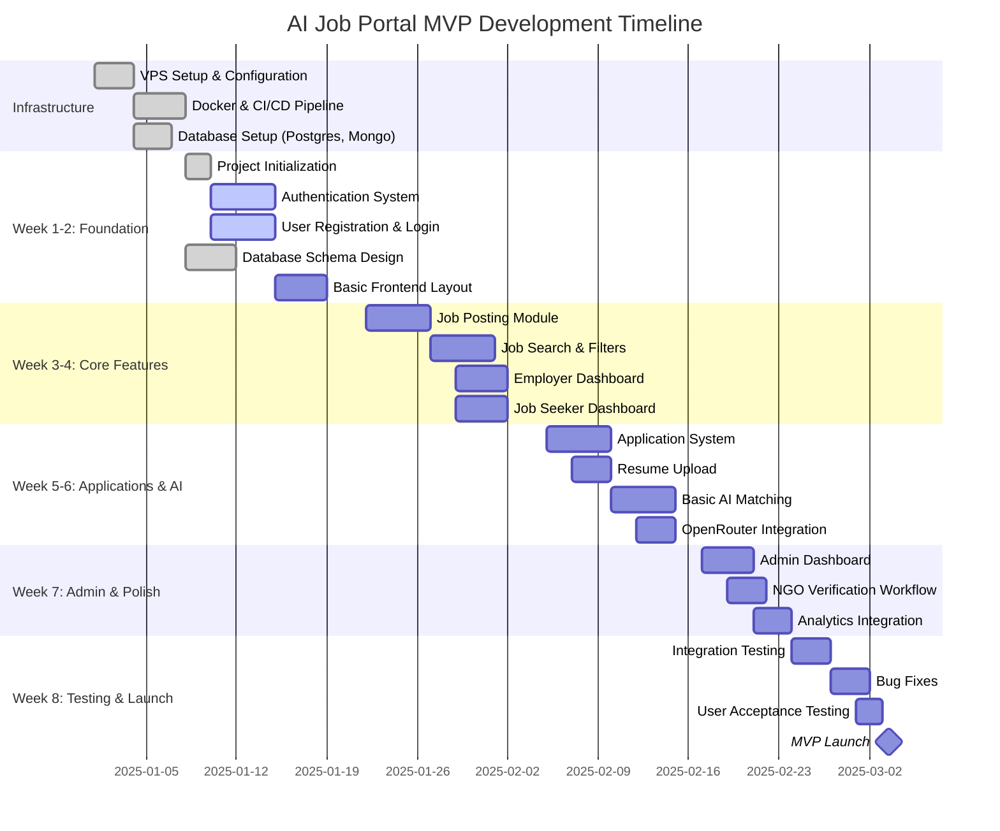
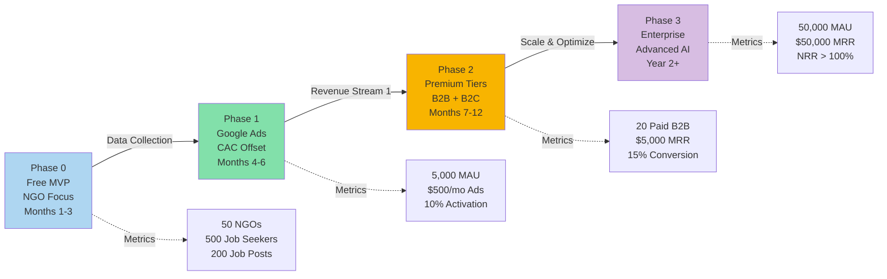

# Strategic and Technical Blueprint for a Next-Generation AI Job Portal SaaS

## Quick Reference: MVP at a Glance

| Metric                 | Target                                             |
| ---------------------- | -------------------------------------------------- |
| **Timeline**           | 8 weeks to MVP launch                              |
| **Initial Budget**     | $10,000-15,000 (dev + infrastructure)              |
| **Phase 0 Target**     | 50 NGOs, 500 job seekers, 200 job posts            |
| **Tech Stack**         | Next.js, NestJS, PostgreSQL, MongoDB, Docker       |
| **MVP Features**       | Auth, job posting, applications, basic AI matching |
| **Monetization Start** | Month 4 (Google Ads), Month 7 (Premium tiers)      |

---

## Table of Contents

1. [Executive Summary](#i-executive-summary-the-disruptive-ai-job-portal-thesis)
2. [Strategic AI Imperative](#ii-strategic-ai-imperative-and-competitive-positioning)
3. [Technical Architecture](#iii-technical-architecture-and-stack-justification)
4. [User Roles & Permissions](#iv-user-roles--permissions)
5. [MVP Feature Specification](#v-mvp-feature-specification)
6. [8-Week Development Timeline](#vi-8-week-development-timeline)
7. [Minimum Viable Product Strategy](#vii-minimum-viable-product-strategy-phase-zero)
8. [Phased Monetization Roadmap](#viii-phased-monetization-roadmap)
9. [Pricing Model Specification](#ix-pricing-model-specification)
10. [Growth & Acquisition Strategy](#x-growth--acquisition-strategy)
11. [Success Metrics & KPIs](#xi-success-metrics--kpis)
12. [Risk Assessment & Mitigation](#xii-risk-assessment--mitigation)
13. [Financial Modeling](#xiii-financial-modeling-and-profitability-outlook)
14. [Next Steps & Action Plan](#xiv-next-steps--action-plan)

---

## I. Executive Summary: The Disruptive AI Job Portal Thesis

The deployment of a new Software as a Service (SaaS) platform targeting the recruitment sector is a strategic move capitalizing on the rapid acceleration of the AI job search tool market. The core thesis of this project rests on exploiting a significant competitive gap: the failure of incumbent job boards to transition from static, reactive data models to dynamic, predictive career intelligence systems. Traditional skill gap analysis is often rendered "obsolete by the time they're reviewed" because insights are based on annual or biannual data collection, which cannot keep pace with the swift changes induced by digital transformation and emerging technologies.

The proposed platform will establish its unique value proposition (UVP) by offering proactive, AI-driven solutions for both employers and job seekers. The architecture, leveraging the high-performance Next.js and scalable NestJS frameworks, utilizes a strategic **Polyglot Persistence** model pairing PostgreSQL for high-integrity transactional data with MongoDB for flexible, high-velocity AI data processing. This architectural decision is an essential enabler for the advanced AI features that will differentiate the service.

### Strategic Roadmap Overview

The recommended deployment strategy involves three phases: **Phase Zero** focuses on a free Minimum Viable Product (MVP) offered to non-profit organizations, designed primarily as a low-cost, high-yield **data acquisition engine**. **Phase One** introduces programmatic advertising (optimized with Header Bidding) to subsidize operational costs and Customer Acquisition Cost (CAC). **Phase Two** establishes the core profitability engine through a tiered subscription model, segmenting B2B employers and B2C job seekers based on access to proprietary AI tools and usage limits. Immediate strategic focus must be placed on ethical data governance and legal compliance to ensure a smooth, transparent transition from the free MVP to the paid subscription model.

---

## II. Strategic AI Imperative and Competitive Positioning

### II.A. The Current Market Gap: From Reactive to Predictive

The current employment landscape is defined by escalating disruption, where cycles of technological change have displaced traditional economic cycles as the primary business challenge. Established job portals, still relying on outdated technology and static data, provide insufficient value, leaving organizations reacting to workforce challenges rather than proactively addressing them.

This competitive gap necessitates a fundamental shift in the platform's offering. Since skills change rapidly, especially in digitally transformed sectors, a basic job board merely offers a temporary fix. The highest perceived value proposition must therefore transition from a reactive tool used merely for _finding a job_ to a proactive, continuous platform dedicated to _managing a career journey_ and future-proofing the workforce. This requires delivering features such as "Personalized Employee Skill Journeys" and "AI-Driven Career Path Recommendations" which anticipate necessary skills rather than reacting to current demands. This predictive approach is the mechanism that justifies premium pricing and high customer lifetime value (CLTV) in the B2C paid tiers.

Strategic planning requires continuous competitive gap analysis to evaluate how the business measures up against rivals in areas like product features, pricing, and technology. For this project, a systematic approach to competitive intelligence gathering is required. Artificial intelligence is most effective for this purpose when it analyzes structured data derived from specific queries-for example, prompting the AI to identify the "top 3 pain points users mention about [competitor]" based on customer reviews, rather than asking open-ended questions. Analyzing this structured external feedback during the MVP phase will allow the platform to precisely target known weaknesses in existing solutions, thereby refining the feature roadmap and securing strong competitive positioning.

### II.B. Unique Value Proposition (UVP) via Enhanced AI Integration

The platform's differentiation hinges on implementing AI features that deliver superior efficiency and personalized insights across the recruitment lifecycle.

#### II.B.1. B2B Value Proposition: Efficiency and Sourcing Automation

For employers, AI must solve high-cost administrative and sourcing challenges. The most popular use cases already adopted by companies in the HR space involve automating administrative tasks like scheduling interviews (a use case cited by 70% of early AI/GenAI adopters). Furthermore, the platform will integrate sophisticated generative AI for content creation, specifically by writing tailored, on-brand job descriptions with enriched contextual information (e.g., tone-of-voice and employer branding materials) at the click of a button, saving HR teams significant time. Crucially, the AI will streamline the evaluation process through automated resume screening, shortlisting, and candidate profile creation, expediting decision-making while ensuring a more objective, standardized evaluation process.

#### II.B.2. B2C Value Proposition: Personalized Growth and Predictive Insight

For the job seeker, the platform must move beyond basic filtering. The value centers on career growth and personalized insight. This includes providing personalized role matches and career suggestions based on deep analysis of skills and market trends. This proprietary analysis-the identification of skill gaps and the recommendation of actionable steps for professional development-justifies the B2C subscription model. Furthermore, B2B features like Real-Time Workforce Mapping and Gap Analytics, which help employers visualize skills across teams and pinpoint deficiencies, are repurposed as powerful B2C tools, allowing job seekers to strategically plan their professional development to meet market demand.

---

## III. Technical Architecture and Stack Justification

The selected technology stack-Next.js, NestJS, MongoDB, PostgreSQL, and Docker/VPS-is designed specifically for maximum scalability, modularity, and optimized data handling, which is essential for a data-intensive SaaS relying on machine learning.

### III.A. Monolithic vs. Modular: Next.js (Frontend) & NestJS (Backend)

The use of both Next.js and NestJS, both of which feature excellent TypeScript support, establishes a modern, type-safe development environment.

- **Next.js (Frontend):** Next.js is employed as the robust presentation layer, supporting Server-Side Rendering (SSR) and Static Site Generation (SSG). This is crucial for a content-heavy job board, ensuring high performance, fast loading times, and optimal Search Engine Optimization (SEO). Next.js also offers the flexibility of utilizing its API routes for simple backend operations, efficiently tackling tenant-specific logic when tight coupling between the frontend and backend is beneficial.

- **NestJS (Backend):** NestJS provides a highly modular and scalable architecture, making it ideal for the microservices required to handle the complex business logic of an AI platform. This structure allows for the separation of core services (e.g., User Authentication, Billing) from specialized, high-load services (e.g., AI Matching, Data Ingestion), promoting code reusability and maintainability.

The entire application will be deployed using **Docker** containers on a Virtual Private Server (VPS). Docker is fundamental for building scalable microservices, ensuring that each component of the NestJS application remains stateless, which is a best practice for modern application development and essential for horizontal scaling under heavy traffic load. Prior to deployment, the TypeScript code is compiled into JavaScript, typically generating a dist directory, confirming the application is production-ready.

### III.B. The Polyglot Persistence Mandate: PostgreSQL and MongoDB

The decision to utilize both PostgreSQL and MongoDB is a deliberate implementation of **polyglot persistence**-a strategic architectural pattern that employs multiple database technologies, each selected for its fitness for specific data characteristics and access patterns. Forcing all diverse data workloads into a single data model would inevitably lead to compromises in performance and scalability.

| **Data Type / Use Case**                                            | **Recommended Database** | **Justification**                                                 | **NestJS Module Context**             |
| ------------------------------------------------------------------- | ------------------------ | ----------------------------------------------------------------- | ------------------------------------- |
| Transactional Data (Billing, User Authentication, Core Job Posts)   | PostgreSQL               | ACID Compliance, Data Integrity, Mature Joins for Reporting       | AuthModule, BillingModule, JobsModule |
| AI Data (Skill Graph, Recommendation Vectors, Unstructured Resumes) | MongoDB                  | Flexible Schema, Rapid Iteration, High Read/Write for AI Services | AI/ML Service, RecommendationModule   |
| Caching/Session Management                                          | Redis/Memcached          | High-speed temporary data storage for Next.js SSR performance     | CacheModule, SessionGuard             |

#### III.B.1. PostgreSQL for Core Integrity

PostgreSQL is a fully ACID-compliant relational database, making its reliability non-negotiable for data integrity. It is optimally suited for complex transactional workflows involving financial records (billing), user authorization, and the core transactional records of job postings and application status. Furthermore, PostgreSQL's superior handling of relationships and joins is essential for generating complex management reports, such as connecting user history to billing records or calculating high-level analytics for employers.

#### III.B.2. MongoDB for AI Flexibility

MongoDB, a document database, is ideally suited for the unstructured and semi-structured data essential to the AI engine. This includes storing raw candidate resumes, complex candidate profiles, and the vectors used in matching and recommendation algorithms. The flexible schema of MongoDB allows the development team to rapidly iterate on machine learning features where data structures may need frequent adjustments, aligning perfectly with the lean startup approach.

The high complexity inherent in the AI's core functionality-identifying nuanced skill gaps, running real-time workforce mapping, and generating dynamic career recommendations-relies on processing and traversing flexible, highly related data structures, often resembling a graph. Attempting to manage this complexity within a purely relational database would result in slow, overly complex queries, severely inhibiting the real-time performance of the "Predictive Matching" UVP. Therefore, the strategic adoption of MongoDB is not merely preferential, but a critical architectural enabler for achieving competitive AI feature parity.

---

## IV. User Roles & Permissions

### Role Definitions

The platform supports four distinct user roles, each with specific permissions and access levels:

| Role                   | Description                                     | Primary Goals                                           |
| ---------------------- | ----------------------------------------------- | ------------------------------------------------------- |
| **Job Seeker**         | Individual looking for employment opportunities | Find jobs, apply, track applications, improve skills    |
| **Employer**           | Company representative hiring for positions     | Post jobs, review candidates, manage hiring pipeline    |
| **NGO Representative** | Non-profit organization user (free tier)        | Post unlimited jobs, access platform for free           |
| **Platform Admin**     | System administrator                            | Manage users, moderate content, monitor platform health |

---

### Permission Matrix

| Feature/Action          | Job Seeker | Employer   | NGO        | Admin |
| ----------------------- | ---------- | ---------- | ---------- | ----- |
| **Authentication**      |
| Register/Login          | ✅         | ✅         | ✅         | ✅    |
| Manage own profile      | ✅         | ✅         | ✅         | ✅    |
| **Job Management**      |
| View public jobs        | ✅         | ✅         | ✅         | ✅    |
| Create job posts        | ❌         | ✅         | ✅         | ✅    |
| Edit own job posts      | ❌         | ✅         | ✅         | ✅    |
| Delete own job posts    | ❌         | ✅         | ✅         | ✅    |
| Feature/promote jobs    | ❌         | ✅ (Paid)  | ❌         | ✅    |
| **Applications**        |
| Apply to jobs           | ✅         | ❌         | ❌         | ❌    |
| View own applications   | ✅         | ❌         | ❌         | ✅    |
| View job applications   | ❌         | ✅         | ✅         | ✅    |
| Shortlist candidates    | ❌         | ✅         | ✅         | ✅    |
| Message candidates      | ❌         | ✅         | ✅         | ✅    |
| **AI Features**         |
| Resume parsing          | ✅         | ❌         | ❌         | ✅    |
| Job matching (basic)    | ✅         | ✅ (Basic) | ✅ (Basic) | ✅    |
| Job matching (advanced) | ✅ (Paid)  | ✅ (Paid)  | ❌         | ✅    |
| Skill gap analysis      | ✅ (Paid)  | ❌         | ❌         | ✅    |
| JD generation           | ❌         | ✅ (Paid)  | ❌         | ✅    |
| **Analytics**           |
| View own analytics      | ✅         | ✅         | ✅         | ✅    |
| View platform analytics | ❌         | ❌         | ❌         | ✅    |
| Export reports          | ❌         | ✅ (Paid)  | ❌         | ✅    |
| **Billing**             |
| View subscription       | ✅         | ✅         | N/A        | ✅    |
| Manage payment methods  | ✅         | ✅         | N/A        | ✅    |
| Upgrade/downgrade       | ✅         | ✅         | N/A        | ✅    |
| **Administration**      |
| Moderate content        | ❌         | ❌         | ❌         | ✅    |
| Manage users            | ❌         | ❌         | ❌         | ✅    |
| System configuration    | ❌         | ❌         | ❌         | ✅    |

---

### User Journey Diagrams

#### Journey 1: Job Seeker Flow

---

#### Journey 2: Employer Flow

---

#### Journey 3: NGO Representative Flow

---

#### Journey 4: Platform Admin Flow

---

## V. MVP Feature Specification

### Core Features Breakdown

#### Module 1: User Management

**Must Have (MVP):**

- ✅ User registration (email/password)
- ✅ Email verification
- ✅ Login with JWT authentication
- ✅ Password reset flow
- ✅ Basic profile creation (name, email, role)
- ✅ Role selection (Job Seeker vs. Employer vs. NGO)
- ✅ Profile photo upload
- ✅ Account settings

**Should Have (Phase 2):**

- OAuth integration (Google, LinkedIn)
- Two-factor authentication (2FA)
- Profile completion progress bar
- Account deletion request

**Could Have (Phase 3):**

- SSO for enterprise clients
- Multi-language support
- Dark mode preference

**Won't Have (MVP):**

- Social media integration
- Advanced personalization settings

---

#### Module 2: Job Seeker Features

**Must Have (MVP):**

- ✅ Resume/CV upload (PDF, DOCX)
- ✅ Basic profile fields (experience, education, skills)
- ✅ Manual skill addition
- ✅ Job search with filters (location, job type, salary range)
- ✅ View job details
- ✅ Apply to jobs with one-click
- ✅ Track application status
- ✅ Basic job recommendations (keyword-based)
- ✅ Saved jobs list

**Should Have (Phase 2):**

- AI resume parsing with skill extraction
- Advanced job matching with match scores
- Skill gap analysis
- Career path recommendations
- Email alerts for new matching jobs
- Application cover letter templates

**Could Have (Phase 3):**

- Video resume upload
- Portfolio integration
- Interview preparation AI coach
- Salary negotiation tips
- Professional network building

**Won't Have (MVP):**

- Live chat with employers
- Video interview scheduling
- Reference management

---

#### Module 3: Employer Features

**Must Have (MVP):**

- ✅ Company profile creation (name, logo, description)
- ✅ Manual job post creation (title, description, requirements, salary)
- ✅ Job post management (edit, delete, expire)
- ✅ View applications for posted jobs
- ✅ Candidate profile viewing
- ✅ Application status management (reviewing, shortlisted, rejected, hired)
- ✅ Basic messaging with candidates
- ✅ Dashboard with job performance metrics (views, applications)

**Should Have (Phase 2):**

- AI job description generator
- Advanced candidate filtering with match scores
- Bulk actions on applications
- Interview scheduling integration
- Team collaboration (multiple users per company)
- Candidate database access

**Could Have (Phase 3):**

- Automated interview scheduling
- Video interview integration
- Assessment test creation
- Workforce skills analytics
- Talent pool building
- Integration with ATS systems

**Won't Have (MVP):**

- Programmatic job advertising
- Background check integration
- Offer letter generation

---

#### Module 4: AI/ML Features

**Must Have (MVP):**

- ✅ Basic keyword matching for job recommendations
- ✅ Simple skill extraction from resumes (rule-based)
- ✅ Match score calculation (keyword overlap)

**Should Have (Phase 2):**

- Advanced resume parsing with OpenRouter API
- Semantic job matching (embeddings)
- Skill gap analysis
- Job description generation
- Career path recommendations
- Salary prediction

**Could Have (Phase 3):**

- Predictive candidate success scoring
- Cultural fit analysis
- Interview question generation
- Real-time workforce mapping
- Market trend analysis
- Automated candidate outreach

**Won't Have (MVP):**

- Video interview analysis
- Personality assessment AI
- Bias detection in job descriptions

---

#### Module 5: NGO Program

**Must Have (MVP):**

- ✅ NGO application form (proof of non-profit status)
- ✅ Admin review and approval workflow
- ✅ Free unlimited job posts for approved NGOs
- ✅ Basic job management features
- ✅ Application management

**Should Have (Phase 2):**

- Expedited verification for registered 501(c)(3) orgs
- NGO-specific analytics dashboard
- Community job board section
- NGO badge on job posts

**Could Have (Phase 3):**

- NGO partnership program
- Volunteer management features
- Impact reporting
- Donation integration

**Won't Have (MVP):**

- Grant management
- Volunteer scheduling
- Fundraising features

---

#### Module 6: Admin Dashboard

**Must Have (MVP):**

- ✅ Admin authentication
- ✅ User management (view, suspend, delete)
- ✅ NGO verification workflow
- ✅ Job post moderation
- ✅ Basic platform analytics (user count, job count, applications)
- ✅ System health monitoring

**Should Have (Phase 2):**

- Advanced analytics dashboard
- Content moderation tools
- Feature flag management
- User activity logs
- Bulk user operations

**Could Have (Phase 3):**

- A/B testing interface
- Revenue analytics
- Churn analysis
- Fraud detection
- Customer support ticketing

**Won't Have (MVP):**

- Machine learning model training interface
- Data science notebooks
- Advanced BI integrations

---

### Feature Comparison: MVP vs. Phase 2 vs. Phase 3

| Feature Category      | MVP (Month 0-3)                | Phase 2 (Month 4-9)                | Phase 3 (Month 10+)                    |
| --------------------- | ------------------------------ | ---------------------------------- | -------------------------------------- |
| **Authentication**    | Email/password, basic profiles | OAuth, 2FA, profile completion     | SSO, multi-language, advanced security |
| **Job Search**        | Basic filters, keyword search  | Advanced filters, semantic search  | AI-powered predictive search           |
| **Matching**          | Keyword overlap                | AI semantic matching, match scores | Cultural fit, success prediction       |
| **Resume Processing** | Manual upload                  | AI parsing, skill extraction       | Video resumes, portfolio integration   |
| **AI Features**       | Basic recommendations          | Skill gap analysis, JD generation  | Career coaching, workforce analytics   |
| **Employer Tools**    | Manual job posting             | AI JD generator, candidate scoring | ATS integration, automated workflows   |
| **Analytics**         | Basic metrics                  | Advanced dashboards                | Predictive analytics, market insights  |
| **Monetization**      | Free for all                   | Google Ads                         | Premium subscriptions                  |
| **Support**           | Email support                  | Knowledge base, chat               | Dedicated account managers             |

---

## VI. 8-Week Development Timeline

### Milestone-Based Development Plan

---

### Week-by-Week Breakdown

#### Week 1-2: Foundation & Authentication (Days 1-14)

**Infrastructure Setup (Days 1-3):**

- ✅ Provision VPS (DigitalOcean, Hetzner)
- ✅ Configure domain and DNS
- ✅ Install Docker and Docker Compose
- ✅ Set up SSL with Let's Encrypt
- ✅ Configure Nginx reverse proxy

**Project Initialization (Days 1-4):**

- ✅ Initialize Next.js frontend repository
- ✅ Initialize NestJS backend repository
- ✅ Set up TypeScript, ESLint, Prettier
- ✅ Configure environment variables
- ✅ Set up Git branching strategy
- ✅ Create GitHub Actions CI/CD pipeline

**Database Design (Days 3-7):**

- ✅ Design PostgreSQL schema (users, jobs, applications)
- ✅ Create TypeORM entities
- ✅ Design MongoDB collections (AI data)
- ✅ Create database migrations
- ✅ Set up Redis for caching

**Authentication System (Days 8-14):**

- ✅ Implement user registration endpoint
- ✅ Email verification flow
- ✅ JWT token generation and validation
- ✅ Refresh token mechanism
- ✅ Password hashing with bcrypt
- ✅ Password reset flow
- ✅ Auth guards and decorators
- ✅ Role-based access control (RBAC) setup

**Frontend Foundation (Days 10-14):**

- ✅ Set up component library (shadcn/ui or Chakra UI)
- ✅ Create layout components (header, footer, sidebar)
- ✅ Build authentication pages (login, register, forgot password)
- ✅ Set up routing with Next.js App Router
- ✅ Implement form validation

**Deliverables:**

- ✅ Working authentication system
- ✅ User can register, login, reset password
- ✅ Basic frontend layout
- ✅ Database schema implemented
- ✅ CI/CD pipeline operational

---

#### Week 3-4: Core Job Features (Days 15-28)

**Job Posting Module (Days 15-19):**

- Backend:

  - ✅ Jobs entity and repository
  - ✅ Create job endpoint (POST /api/jobs)
  - ✅ List jobs endpoint (GET /api/jobs)
  - ✅ Get job details (GET /api/jobs/:id)
  - ✅ Update job endpoint (PATCH /api/jobs/:id)
  - ✅ Delete job endpoint (DELETE /api/jobs/:id)
  - ✅ Job status management (draft, published, expired)

- Frontend:
  - ✅ Job creation form
  - ✅ Rich text editor for job description
  - ✅ Job preview
  - ✅ Employer job management dashboard

**Job Search & Discovery (Days 20-24):**

- Backend:

  - ✅ Search endpoint with filters (location, salary, job type)
  - ✅ PostgreSQL full-text search implementation
  - ✅ Pagination logic
  - ✅ Sort options (date, salary, relevance)
  - ✅ Redis caching for search results

- Frontend:
  - ✅ Job listing page with filters
  - ✅ Search bar with autocomplete
  - ✅ Filter sidebar (location, salary range, job type)
  - ✅ Job card components
  - ✅ Job detail page
  - ✅ "Save job" functionality

**Dashboards (Days 25-28):**

- Employer Dashboard:

  - ✅ Active jobs list
  - ✅ Job performance metrics (views, applications)
  - ✅ Quick actions (create job, view applications)

- Job Seeker Dashboard:
  - ✅ Recommended jobs section
  - ✅ Saved jobs list
  - ✅ Application history
  - ✅ Profile completion progress

**Deliverables:**

- ✅ Employers can post, edit, and delete jobs
- ✅ Job seekers can search and filter jobs
- ✅ Both user types have functional dashboards
- ✅ Search performance optimized with caching

---

#### Week 5-6: Applications & AI Integration (Days 29-42)

**Application System (Days 29-33):**

- Backend:

  - ✅ Applications entity and repository
  - ✅ Apply to job endpoint (POST /api/applications)
  - ✅ Get applications for job (GET /api/jobs/:id/applications)
  - ✅ Get user's applications (GET /api/users/me/applications)
  - ✅ Update application status (PATCH /api/applications/:id/status)
  - ✅ Application notification system

- Frontend:
  - ✅ Apply button on job detail page
  - ✅ Application form (cover letter, resume upload)
  - ✅ Application confirmation page
  - ✅ Application tracking for job seekers
  - ✅ Candidate list for employers
  - ✅ Application detail view
  - ✅ Status update interface

**Resume Upload & Processing (Days 32-35):**

- Backend:

  - ✅ S3-compatible storage setup (DigitalOcean Spaces)
  - ✅ File upload endpoint (POST /api/users/me/resume)
  - ✅ File validation (type, size)
  - ✅ Basic resume metadata storage

- Frontend:
  - ✅ Resume upload component with drag-and-drop
  - ✅ Upload progress indicator
  - ✅ Resume preview

**AI Integration Foundation (Days 36-42):**

- Backend:

  - ✅ OpenRouter API service setup
  - ✅ Basic keyword extraction from job descriptions
  - ✅ Basic keyword extraction from resumes
  - ✅ Simple matching algorithm (keyword overlap)
  - ✅ Match score calculation
  - ✅ Job recommendation endpoint (GET /api/users/me/recommendations)
  - ✅ Caching for AI responses

- Frontend:
  - ✅ Display match scores on job cards
  - ✅ Recommendations section on dashboard
  - ✅ "Why this match?" tooltip

**Deliverables:**

- ✅ Full application workflow functional
- ✅ Resume upload working
- ✅ Basic AI matching providing recommendations
- ✅ Match scores visible to users

---

#### Week 7: Admin Dashboard & NGO Program (Days 43-49)

**Admin Dashboard (Days 43-46):**

- Backend:

  - ✅ Admin authentication
  - ✅ User management endpoints (list, suspend, delete)
  - ✅ Job moderation endpoints
  - ✅ Platform statistics endpoint
  - ✅ NGO application endpoints

- Frontend:
  - ✅ Admin login page
  - ✅ Admin sidebar navigation
  - ✅ User management table
  - ✅ Job moderation interface
  - ✅ Platform metrics dashboard
  - ✅ NGO verification interface

**NGO Program (Days 44-47):**

- Backend:

  - ✅ NGO application entity
  - ✅ NGO application submission endpoint
  - ✅ Admin review/approve endpoint
  - ✅ NGO status badge on user account
  - ✅ Unlimited job posting for NGOs

- Frontend:
  - ✅ NGO application form page
  - ✅ NGO verification status display
  - ✅ NGO badge on job posts
  - ✅ NGO information page

**Analytics Integration (Days 47-49):**

- Backend:

  - ✅ Event tracking system
  - ✅ Analytics endpoints (daily/weekly/monthly stats)
  - ✅ User activity logs
  - ✅ Job performance tracking

- Frontend:
  - ✅ Charts and graphs (Chart.js or Recharts)
  - ✅ Key metrics cards (total users, jobs, applications)
  - ✅ Date range filters
  - ✅ Export functionality (CSV)

**Deliverables:**

- ✅ Admin can manage users and moderate content
- ✅ NGO application and verification workflow complete
- ✅ Analytics dashboard showing platform metrics

---

#### Week 8: Testing, Bug Fixes & Launch (Days 50-56)

**Testing Phase (Days 50-52):**

- ✅ Write unit tests for critical services
- ✅ Write integration tests for API endpoints
- ✅ Run E2E tests for user flows
- ✅ Performance testing (load testing with k6)
- ✅ Security testing (OWASP Top 10)
- ✅ Cross-browser testing
- ✅ Mobile responsiveness testing

**Bug Fixes & Polish (Days 53-54):**

- ✅ Fix bugs discovered during testing
- ✅ Improve error messages
- ✅ Add loading states
- ✅ Optimize slow queries
- ✅ Fix UI inconsistencies
- ✅ Improve accessibility (WCAG compliance)

**Documentation & Deployment (Days 54-55):**

- ✅ Write API documentation (Swagger)
- ✅ Create user guides
- ✅ Prepare deployment scripts
- ✅ Final environment variable configuration
- ✅ Database backup strategy
- ✅ Set up monitoring and logging

**User Acceptance Testing (Days 55-56):**

- ✅ Invite beta testers (5-10 NGOs, 20-30 job seekers)
- ✅ Gather feedback
- ✅ Make critical adjustments
- ✅ Prepare launch announcement

**Launch Day (Day 56):**

- ✅ Deploy to production
- ✅ Run smoke tests
- ✅ Monitor for issues
- ✅ Send launch emails
- ✅ Announce on social media
- ✅ Start onboarding first users

**Deliverables:**

- ✅ Fully tested, production-ready MVP
- ✅ All critical bugs fixed
- ✅ Documentation complete
- ✅ Platform live and accessible

---

### Team Allocation

**Recommended Team Structure:**

| Role                       | Time Allocation           | Responsibilities                                                        |
| -------------------------- | ------------------------- | ----------------------------------------------------------------------- |
| **Full-Stack Developer 1** | Full-time (8 weeks)       | Backend development (NestJS), API design, database architecture         |
| **Full-Stack Developer 2** | Full-time (8 weeks)       | Frontend development (Next.js), UI/UX implementation, responsive design |
| **DevOps Engineer**        | Part-time (2-3 days/week) | Infrastructure setup, Docker, CI/CD, deployment, monitoring             |
| **Product Manager**        | Part-time (1-2 days/week) | Requirements definition, user stories, sprint planning, testing         |
| **UI/UX Designer**         | Part-time (Week 1-3)      | Wireframes, mockups, design system, user flows                          |

**Total Estimated Cost:**

- 2 Full-stack developers × 8 weeks × $5,000/week = $80,000
- DevOps engineer (part-time) × 8 weeks × $1,500/week = $12,000
- Product manager (part-time) × 8 weeks × $1,000/week = $8,000
- UI/UX designer × 3 weeks × $3,000/week = $9,000
- **Total: $109,000**

**Bootstrap Budget (Solo/Small Team):**

- 1 Full-stack developer × 8 weeks × $5,000 = $40,000
- Infrastructure costs = $500
- **Total: $40,500**

---

### Critical Path

**Dependencies:**

1. Week 1-2: Authentication must be complete before any other features
2. Week 3: Job posting must work before job search
3. Week 4: Job search must work before recommendations
4. Week 5: Applications depend on jobs module
5. Week 6: AI features depend on applications and resume data
6. Week 7: Admin features depend on all user-facing features
7. Week 8: Testing depends on all features complete

**Risk Mitigation:**

- Build authentication first (highest dependency)
- Parallel development of job seeker and employer features
- AI integration can be simplified if time is tight
- Admin dashboard can be minimal for MVP
- Testing must not be compressed

---

## VII. Minimum Viable Product Strategy: Phase Zero - The Data Engine

The initial free MVP phase, targeting non-profit organizations, is defined as a validated learning instrument and a data acquisition engine, not a source of immediate profit. This phase's primary goal is to validate product-market fit (PMF) and gather the proprietary data necessary to train the platform's machine learning models.

### VII.A. Core Functionality and Scope Definition

The MVP must be the most basic, functional version of the product, containing only the core features required to solve a single, well-defined problem for early users.

- **Core Data Feed and Posting:** Allow non-profit organizations to post unlimited job listings and job seekers to apply freely. This essential function generates the initial, critical job-description-to-resume data pairs required for supervised machine learning training.

- **Basic User Authentication:** Establish the foundational infrastructure for subscription management and role-based access control, keeping future scalability in mind.

- **Basic AI Matching:** Implement the simplest viable version of the candidate matching algorithm (e.g., basic keyword or initial skill-to-job description comparison) to validate the core technological assumption before full-scale investment.

- **Analytics Tracking:** Deploy user behavior analytics to track feature usage, activation rates, and user interactions to understand how early adopters interact with the product and where improvements are needed.

### VII.B. Data Acquisition and Iteration Strategy

A core challenge unique to AI products is the absolute requirement for high-quality, labeled datasets from the outset. The MVP phase strategically addresses this by offering free access to non-profits, which typically have diverse, real-world skill requirements. By providing service free of charge, the platform acquires high-quality, labeled job posting and candidate data pairs, creating a proprietary training set that serves as a fundamental competitive advantage and a defensible barrier against future entrants. This free-for-access approach significantly reduces the cost and complexity typically associated with procuring training data.

Feedback gathering must be meticulous, combining quantitative measures (surveys, usage data) with qualitative insights (in-depth user interviews with early adopters to understand their pain points). The resulting data patterns will dictate the priority order of feature development for the subsequent paid tiers.

### VII.C. MVP Success Measurement (Beyond Revenue)

Success in Phase Zero is defined by validated learning, not immediate financial return. Key metrics include:

- **Engagement and Retention:** Tracking activation rates and feature usage to guide product iteration. User retention, calculated by dividing returning users by new users, is crucial for assessing long-term product-market fit.

- **User Feedback:** Monitoring the Net Promoter Score (NPS) and Customer Satisfaction (CSAT) to acquire essential feedback on user experiences and pinpoint areas for optimization before the revenue launch.

- **Cost of Acquisition (CAC):** Tracking the expenditure required to enroll non-profits and job seekers allows the business to establish baseline marketing efficiency for future paid acquisition efforts.

### VII.D. Legal Framework for Transition and Data Governance

Building trust with customers entrusting the platform with sensitive career information requires robust security measures and legal compliance from the start.

- **Compliance:** Immediate adherence to GDPR (EU) and CCPA (California) is mandatory, covering the legal processing of personal information, data subject rights (access and erasure), and the requirement to disclose data gathering practices.

- **SaaS Contract Foundation:** The MVP user agreement must explicitly define data issues, specifying that customers retain ownership of their business data. It must also clearly state the cloud provider's right to use _anonymized_ data for platform improvement and model training (the data-for-access agreement).

- **Transition Transparency:** When moving from free to paid, transparency is paramount. The rationale ("the why") behind the subscription model must be communicated clearly to early adopters. To reward initial loyalty, founding members should be granted VIP treatment, such as guaranteed perpetual discounts or free access to lower tiers, mitigating complaints about the introduction of fees.

---

## VIII. Phased Monetization Roadmap

### Phase Transition Strategy

---

### VIII.A. Phase 1: Programmatic Advertising Integration

Programmatic advertising, specifically via Google AdSense, is an ideal initial step because it is easy to set up and provides passive income for websites with low to moderate traffic volumes. Job portals intersect with high-value ad niches such as Digital Marketing, Online Learning, and Web Development, suggesting potential for above-average Cost-Per-Click (CPC) rates.

**Yield Optimization Strategy:** Relying solely on AdSense, however, is inefficient for high-volume traffic. To maximize revenue, the platform must implement **Header Bidding**-a system that runs a unified auction across multiple supply-side platforms (SSPs) simultaneously. Header bidding significantly increases overall yield by ensuring impressions are sold to the highest bidder, driving up the effective Cost Per Mille (eCPM). Publishers leveraging Header Bidding have reported revenue increases ranging from 20% to 70%.

This advertising revenue is strategically viewed as a **CAC offset mechanism**, not the primary profit center. By maximizing ad yield, the operational costs are covered and the effective cost of acquiring high-volume B2C users is reduced, allowing the business to allocate more capital toward developing core AI features and acquiring high-value B2B subscription customers.

**Implementation Timeline:**

- **Month 4:** Google AdSense integration
- **Month 5:** Optimize ad placements based on user behavior
- **Month 6:** Implement Header Bidding (if traffic > 5,000 MAU)

**Expected Revenue (Month 6):**

- 5,000 MAU × 10 pageviews/user = 50,000 pageviews/month
- eCPM of $2 = $100/month (AdSense alone)
- With Header Bidding: $150-200/month

---

### VIII.B. Phase 2: Tiered Subscription Model Design (The Profit Core)

The tiered pricing structure caters to different customer needs and budgets, encouraging users to upgrade as their needs expand, driving customer growth and retention. The existing free MVP serves as the basic freemium offering, with premium features and increased usage limits acting as the paywall incentive.

#### VIII.B.1. B2B Employer Subscription Tiers (High ARPA)

B2B tiers generate the highest Average Revenue Per Account (ARPA) and must focus on streamlining hiring and providing crucial talent intelligence. Differentiation is achieved through limits on user count, job posting volume, and access to proprietary data and AI features.

**B2B Feature Progression (Tier Differentiation):**

| **Feature Category** | **Free Non-Profit MVP (Data Acquisition)** | **Paid B2C Tier (Job Seeker)**                   | **Paid B2B Tier (Employer)**                           |
| -------------------- | ------------------------------------------ | ------------------------------------------------ | ------------------------------------------------------ |
| Core Matching        | Simple Keyword/Location Filter             | AI Candidate Matching (Basic Skill-to-JD)        | Advanced AI Skill/Cultural Fit Matching                |
| Content/Admin        | Manual JD Upload                           | Resume Screening & Review Analysis               | Automated JD/Ad Copy Generation                        |
| Development/Insight  | Basic Engagement Metrics                   | Personalized Skill Gap Analysis & Learning Paths | Real-Time Workforce Mapping & Gap Analytics            |
| Access & Limits      | Unlimited Free Posts (Non-Profits)         | Access to Standard Listings                      | Unlimited Premium Job Slots and Resume Database Access |

High-tier B2B subscriptions will include unlimited job slots, unlimited access to the proprietary candidate (resume) database, and access to advanced AI screening tools that facilitate faster, more objective shortlisting. Custom enterprise plans may include dedicated support and integration with existing HR systems.

#### VIII.B.2. B2C Job Seeker Premium Tiers (Volume and CLTV)

The B2C model justifies its cost by providing a competitive edge in job searching and personalized professional development. Features must go beyond simple access to include proprietary AI insights and convenience services.

- **Career AI Coaching:** Exclusive access to personalized skill gap analysis and tailored learning paths that align individual goals with business priorities.
- **Speed Advantage:** Paying users receive job postings with priority alerts 24-48 hours before free users.
- **Ancillary Services:** Offering resume writing, profile optimization, or interview preparation courses (potentially via affiliate partnerships) generates additional revenue streams.

### VIII.C. Conversion and Upselling Strategy

Successful conversion requires demonstrating value quickly during the free phase. The paywall must be strategically placed at the point where a user requires premium features to achieve a critical outcome. For B2B users, this occurs when they hit the usage limit on free posts or require access to the resume database to efficiently source candidates. For B2C users, the trigger is the need for proprietary, actionable career insight provided by the skill gap analysis engine. High Net Revenue Retention (NRR) will be driven by mandatory upgrades when usage or team size increases, compelling customers to adopt higher-tier plans that unlock greater limits and additional AI modules.

---

## IX. Pricing Model Specification

### Detailed Pricing Tiers

#### B2B (Employer) Pricing

| Feature                       | Free (NGO)   | Starter              | Professional           | Enterprise             |
| ----------------------------- | ------------ | -------------------- | ---------------------- | ---------------------- |
| **Monthly Price**             | $0           | $49                  | $149                   | $499                   |
| **Annual Price**              | $0           | $490 (2 months free) | $1,490 (2 months free) | $4,990 (2 months free) |
| **Active Job Posts**          | Unlimited    | 5                    | 20                     | Unlimited              |
| **Job Post Duration**         | 30 days      | 30 days              | 60 days                | 90 days                |
| **User Seats**                | 1            | 1                    | 3                      | 10                     |
| **Application Views**         | All          | All                  | All                    | All                    |
| **Candidate Database Access** | ❌           | 50 profiles/mo       | 200 profiles/mo        | Unlimited              |
| **AI Job Matching**           | Basic        | Basic                | Advanced               | Advanced + Custom      |
| **AI JD Generator**           | ❌           | 5/month              | 20/month               | Unlimited              |
| **Resume Screening AI**       | ❌           | ❌                   | ✅                     | ✅                     |
| **Skill Gap Analytics**       | ❌           | ❌                   | ✅                     | ✅                     |
| **Workforce Mapping**         | ❌           | ❌                   | ❌                     | ✅                     |
| **Featured Job Listings**     | ❌           | ❌                   | 2/month                | 10/month               |
| **Analytics Dashboard**       | Basic        | Standard             | Advanced               | Premium + Export       |
| **Team Collaboration**        | ❌           | ❌                   | ✅                     | ✅                     |
| **Interview Scheduling**      | ❌           | ❌                   | ❌                     | ✅                     |
| **API Access**                | ❌           | ❌                   | ❌                     | ✅                     |
| **ATS Integration**           | ❌           | ❌                   | ❌                     | ✅                     |
| **Support**                   | Email        | Email                | Priority Email         | Dedicated Manager      |
| **Onboarding**                | Self-service | Self-service         | Guided                 | White-glove            |

---

#### B2C (Job Seeker) Pricing

| Feature                         | Free      | Premium             | Pro                      |
| ------------------------------- | --------- | ------------------- | ------------------------ |
| **Monthly Price**               | $0        | $9.99               | $19.99                   |
| **Annual Price**                | $0        | $99 (2 months free) | $199 (2 months free)     |
| **Job Search & Apply**          | Unlimited | Unlimited           | Unlimited                |
| **Profile Creation**            | ✅        | ✅                  | ✅                       |
| **Resume Upload**               | ✅        | ✅                  | ✅                       |
| **Basic Job Matching**          | ✅        | ✅                  | ✅                       |
| **AI Match Scores**             | Basic     | Detailed            | Detailed + Insights      |
| **Job Alert Timing**            | Standard  | 24h early access    | 48h early access         |
| **Saved Jobs**                  | 10        | Unlimited           | Unlimited                |
| **Application Tracking**        | ✅        | ✅                  | ✅ + Status predictions  |
| **AI Resume Optimization**      | ❌        | 3/month             | Unlimited                |
| **Skill Gap Analysis**          | ❌        | 1/month             | Unlimited                |
| **Career Path Recommendations** | ❌        | ✅                  | ✅ + Detailed roadmap    |
| **Interview Prep AI**           | ❌        | ❌                  | ✅                       |
| **Salary Insights**             | ❌        | ✅                  | ✅ + Negotiation tips    |
| **Profile Visibility Boost**    | ❌        | ❌                  | ✅                       |
| **Priority Support**            | ❌        | ❌                  | ✅                       |
| **Learning Resources**          | ❌        | Basic               | Premium + Certifications |

---

### Pricing Strategy Rationale

**B2B Pricing:**

- **$49 Starter:** Entry-level for small businesses, 1-2 hires/year
- **$149 Professional:** SMBs with regular hiring needs (3-10 hires/year)
- **$499 Enterprise:** Large companies, agencies, high-volume hiring

**B2C Pricing:**

- **$9.99 Premium:** Affordable monthly subscription for active job seekers
- **$19.99 Pro:** For professionals serious about career growth

**Competitive Analysis:**

| Platform         | Basic Plan | Premium Plan           | Enterprise             |
| ---------------- | ---------- | ---------------------- | ---------------------- |
| **Indeed**       | Free       | $5/day per job         | Custom                 |
| **LinkedIn**     | Free       | $29.99/mo (Job Seeker) | $119.95/mo per license |
| **ZipRecruiter** | N/A        | $249/mo                | Custom                 |
| **Our Platform** | Free (NGO) | $49-149/mo             | $499/mo                |

**Positioning:** Mid-market pricing with superior AI features, undercutting LinkedIn and ZipRecruiter while offering more value than Indeed.

---

### Revenue Projections

#### Year 1 Revenue Forecast

| Month | Phase       | NGO Users | Free Seekers | Paid B2B | Paid B2C | Ad Revenue | Subscription Revenue | Total MRR |
| ----- | ----------- | --------- | ------------ | -------- | -------- | ---------- | -------------------- | --------- |
| 1-3   | MVP         | 50        | 500          | 0        | 0        | $0         | $0                   | $0        |
| 4     | Ads         | 60        | 1,000        | 0        | 0        | $50        | $0                   | $50       |
| 5     | Ads         | 70        | 2,000        | 0        | 0        | $150       | $0                   | $150      |
| 6     | Ads         | 80        | 3,000        | 0        | 0        | $300       | $0                   | $300      |
| 7     | Paid Launch | 90        | 4,000        | 5        | 20       | $400       | $845                 | $1,245    |
| 8     | Growth      | 100       | 5,000        | 8        | 35       | $500       | $1,495               | $1,995    |
| 9     | Growth      | 110       | 6,000        | 12       | 50       | $600       | $2,395               | $2,995    |
| 10    | Growth      | 120       | 7,500        | 15       | 70       | $750       | $3,195               | $3,945    |
| 11    | Growth      | 130       | 9,000        | 20       | 90       | $900       | $4,395               | $5,295    |
| 12    | Scale       | 150       | 10,000       | 25       | 100      | $1,000     | $5,495               | $6,495    |

**Assumptions:**

- Paid B2B: Average $149/mo (mix of Starter and Professional)
- Paid B2C: Average $10/mo (mostly Premium tier)
- Ad Revenue: $0.10 per MAU
- Conversion Rate: 0.5% B2B, 1.5% B2C

**Year 1 Totals:**

- **Total Revenue:** $27,020
- **MRR by Month 12:** $6,495
- **ARR by End of Year 1:** $77,940

---

## X. Growth & Acquisition Strategy

### Customer Acquisition Channels

#### Channel 1: Content Marketing & SEO

**Strategy:**

- Create high-value content targeting both job seekers and employers
- Optimize for long-tail keywords in the job search space
- Build domain authority through backlinks

**Tactics:**

- **Blog Content:**
  - "How to Write a Resume That Gets Noticed by AI"
  - "Top 10 In-Demand Skills for 2025"
  - "How to Hire Remote Developers: Complete Guide"
  - Job market reports and salary guides
- **SEO Optimization:**
  - Job listing pages optimized for "[Job Title] jobs in [Location]"
  - Company profile pages with structured data
  - Career guides and resources hub

**Budget:** $500/month (content writer)
**Expected ROI:** 500-1,000 organic visitors/month by Month 6

---

#### Channel 2: Partnership & Networking

**Non-Profit Partnerships:**

- Partner with non-profit associations (United Way, local NGOs)
- Offer free tier in exchange for promotion
- Attend non-profit conferences and events

**HR Tech Community:**

- Join HR tech Slack communities and forums
- Contribute to discussions on Reddit (r/recruiting, r/humanresources)
- Sponsor local HR meetups

**Budget:** $200/month (event sponsorships)
**Expected ROI:** 30-50 new NGO signups/quarter

---

#### Channel 3: LinkedIn Outreach

**B2B Lead Generation:**

- Identify HR managers and recruiters on LinkedIn
- Personalized outreach with value proposition
- Share case studies and success stories
- Offer free trial or demo

**B2C Engagement:**

- Share career advice and tips
- Engage with job seeker communities
- Run LinkedIn polls and discussions

**Budget:** $300/month (LinkedIn Premium + outreach tools)
**Expected ROI:** 50 qualified leads/month, 5 conversions

---

#### Channel 4: Referral Program

**Structure:**

- **Job Seekers:** Refer a friend, both get 1 month free Premium
- **Employers:** Refer a company, get $50 credit or 1 free featured job
- **NGOs:** Refer another NGO, get priority support

**Implementation:**

- Referral dashboard with unique links
- Automated tracking and reward distribution
- Gamification with leaderboards

**Budget:** $200/month (referral credits)
**Expected ROI:** 15% of new signups from referrals by Month 9

---

#### Channel 5: Paid Advertising (Phase 2+)

**Google Ads:**

- Target keywords: "post jobs free," "find tech jobs," "AI job matching"
- Display ads on job search sites
- Retargeting campaigns

**Facebook/Instagram Ads:**

- Target job seekers (age 22-45, recent grads, career changers)
- Video ads showcasing AI features
- Lead generation forms

**LinkedIn Ads:**

- Sponsored content for HR professionals
- InMail campaigns to decision-makers

**Budget:** $1,000/month (Phase 2 only)
**Expected ROI:** $2,000 in subscription revenue (2:1 ROAS target)

---

### Community Building

**Strategies:**

- Launch a job seeker community (Discord or Slack)
- Host monthly webinars on career development
- Create a podcast interviewing hiring managers and career coaches
- User-generated content: Success stories, career tips
- Ambassador program: Power users become advocates

---

## XI. Success Metrics & KPIs

### Phase-Specific Metrics

#### Phase 0: MVP (Months 1-3)

**Primary Metrics:**

| Metric                        | Target | Measurement                                             |
| ----------------------------- | ------ | ------------------------------------------------------- |
| **NGO Signups**               | 50     | Total registered NGO accounts                           |
| **Job Seeker Signups**        | 500    | Total registered job seeker accounts                    |
| **Job Posts Created**         | 200    | Total jobs published                                    |
| **Applications Submitted**    | 300    | Total applications                                      |
| **Activation Rate**           | 20%    | % of users who complete core action (apply or post job) |
| **Weekly Active Users (WAU)** | 150    | Users active in past 7 days                             |
| **User Retention (Week 2)**   | 30%    | % of users who return in week 2                         |
| **NPS Score**                 | 40+    | Net Promoter Score from surveys                         |

**Secondary Metrics:**

- Average time to first application: <10 minutes
- Resume upload completion rate: >60%
- Job post completion rate: >80%
- Average applications per job: 5+

---

#### Phase 1: Ads Integration (Months 4-6)

**Primary Metrics:**

| Metric                         | Target     | Measurement                             |
| ------------------------------ | ---------- | --------------------------------------- |
| **Monthly Active Users (MAU)** | 5,000      | Users active in past 30 days            |
| **Ad Revenue**                 | $500/month | Total ad earnings                       |
| **eCPM**                       | $2+        | Effective cost per thousand impressions |
| **Pageviews per User**         | 10+        | Average pageviews per session           |
| **Session Duration**           | 5+ minutes | Average time on site                    |
| **Bounce Rate**                | <50%       | % of single-page sessions               |
| **CAC (Free Users)**           | <$5        | Cost to acquire one free user           |

**Secondary Metrics:**

- Ad viewability rate: >70%
- Ad click-through rate: 0.5%+
- Organic search traffic: 1,000+ visits/month
- Social media referrals: 500+ visits/month

---

#### Phase 2: Premium Tiers (Months 7-12)

**Primary Metrics:**

| Metric                              | Target | Measurement                         |
| ----------------------------------- | ------ | ----------------------------------- |
| **Monthly Recurring Revenue (MRR)** | $5,000 | Total subscription revenue/month    |
| **Paid B2B Customers**              | 20     | Total paying employer accounts      |
| **Paid B2C Customers**              | 100    | Total paying job seeker accounts    |
| **Conversion Rate (B2B)**           | 2%     | % of free employers who upgrade     |
| **Conversion Rate (B2C)**           | 1.5%   | % of free job seekers who upgrade   |
| **Churn Rate**                      | <10%   | % of customers who cancel per month |
| **ARPU (B2B)**                      | $149   | Average revenue per B2B customer    |
| **ARPU (B2C)**                      | $10    | Average revenue per B2C customer    |

**SaaS Metrics:**

| Metric                              | Target                 | Formula                                           |
| ----------------------------------- | ---------------------- | ------------------------------------------------- |
| **Customer Lifetime Value (CLTV)**  | $500 (B2B), $100 (B2C) | ARPU × Average Customer Lifespan                  |
| **Customer Acquisition Cost (CAC)** | $100 (B2B), $20 (B2C)  | Total Sales & Marketing Spend / New Customers     |
| **CLTV:CAC Ratio**                  | 3:1+                   | CLTV / CAC                                        |
| **Net Revenue Retention (NRR)**     | 100%+                  | (Starting MRR + Expansion - Churn) / Starting MRR |
| **Gross Margin**                    | >80%                   | (Revenue - COGS) / Revenue                        |

**Secondary Metrics:**

- Time to first paid conversion: <30 days
- Feature adoption rate: 60%+ of paid users use AI features
- Support ticket volume: <5% of users
- Average resolution time: <24 hours

---

### Dashboard & Tracking

**Analytics Stack:**

- **Google Analytics 4:** Website traffic, user behavior
- **Mixpanel or Amplitude:** Product analytics, funnels, cohorts
- **Stripe Dashboard:** Subscription metrics, MRR, churn
- **Custom Admin Dashboard:** Real-time KPIs

**Weekly Review:**

- User signups (by role)
- Activation rates
- Active jobs and applications
- Top-performing content

**Monthly Review:**

- MRR and revenue breakdown
- Conversion rates by channel
- Churn analysis
- NPS and CSAT scores
- Feature usage report

**Quarterly Review:**

- CLTV:CAC ratio
- NRR
- Cohort retention analysis
- Competitive positioning update
- Strategic roadmap adjustment

---

## XII. Risk Assessment & Mitigation

### Technical Risks

| Risk                         | Likelihood | Impact   | Mitigation Strategy                                                                                                                                       |
| ---------------------------- | ---------- | -------- | --------------------------------------------------------------------------------------------------------------------------------------------------------- |
| **Scalability Issues**       | Medium     | High     | - Start with scalable architecture (microservices) - Load testing before launch - Monitor performance metrics - Have scaling plan ready       |
| **AI Accuracy Problems**     | High       | Medium   | - Start with simple keyword matching - Gradually improve with user feedback - A/B test AI features - Human-in-the-loop for critical decisions |
| **Data Quality Issues**      | Medium     | High     | - Implement data validation - Manual review for first 100 entries - User feedback mechanisms - Data cleaning pipelines                        |
| **Security Breach**          | Low        | Critical | - Security audit before launch - Follow OWASP Top 10 - Regular security updates - Incident response plan - Insurance                      |
| **Third-Party API Failures** | Medium     | Medium   | - Graceful degradation - Fallback mechanisms - Multiple provider options - Monitor API health                                                 |

---

### Business Risks

| Risk                     | Likelihood | Impact | Mitigation Strategy                                                                                                                         |
| ------------------------ | ---------- | ------ | ------------------------------------------------------------------------------------------------------------------------------------------- |
| **Slow User Adoption**   | High       | High   | - Increase marketing spend - Improve onboarding - Offer incentives - Gather feedback and iterate - Partner with influencers |
| **Competitive Pressure** | Medium     | High   | - Differentiate with AI features - Focus on niche (NGOs first) - Build switching costs (data lock-in) - Continuous innovation   |
| **Pricing Resistance**   | Medium     | Medium | - Offer free trial - Demonstrate ROI clearly - Flexible pricing plans - Grandfather early adopters - Payment plans          |
| **Negative Reviews**     | Low        | Medium | - Proactive customer support - Address issues quickly - Encourage satisfied users to review - Learn from feedback               |
| **Economic Downturn**    | Low        | High   | - Focus on cost-saving value prop - Offer flexible payment terms - Diversify revenue streams - Maintain low burn rate           |

---

### Legal & Compliance Risks

| Risk                      | Likelihood | Impact   | Mitigation Strategy                                                                                                                                       |
| ------------------------- | ---------- | -------- | --------------------------------------------------------------------------------------------------------------------------------------------------------- |
| **GDPR/CCPA Violations**  | Medium     | Critical | - Implement compliance from day 1 - Regular legal reviews - Clear privacy policy - User data export/deletion tools - DPO or legal counsel |
| **Employment Law Issues** | Low        | High     | - Disclaimer on job posts - Don't provide legal/HR advice - TOS protect platform - Consult employment lawyer                                  |
| **IP Infringement**       | Low        | Medium   | - Content moderation - DMCA takedown process - User agreement covers IP - Original AI models                                                  |
| **Discriminatory AI**     | Medium     | High     | - Audit AI for bias - Diverse training data - Human oversight - Transparency in algorithms - Regular bias testing                         |

---

## XIII. Financial Modeling and Profitability Outlook

### XIII.A. SaaS Key Performance Indicators (KPIs) and Tracking

The financial strategy must focus on growing recurring revenue while keeping customer acquisition efficient.

**SaaS KPI Framework for Profitability Monitoring:**

| **KPI**                         | **Definition/Formula**                                     | **Strategic Purpose (AI SaaS)**                                                           | **MVP Stage Focus**                                          |
| ------------------------------- | ---------------------------------------------------------- | ----------------------------------------------------------------------------------------- | ------------------------------------------------------------ |
| Monthly Recurring Revenue (MRR) | Sum of predictable monthly income from subscriptions       | The central health indicator for the subscription model. Tracks growth velocity.          | Not applicable; focus on projecting potential MRR.           |
| Customer Lifetime Value (CLTV)  | ARPU x Customer Lifespan                                   | Determines maximum allowable CAC and long-term viability of pricing tiers.                | Projecting potential CLTV based on engagement metrics.       |
| Customer Acquisition Cost (CAC) | Total Sales & Marketing Spend / New Customers              | Measures efficiency of acquiring paying customers. Must be significantly lower than CLTV. | Tracking acquisition cost during free non-profit enrollment. |
| Net Revenue Retention (NRR)     | Revenue from Existing Customers (Expansion + Base - Churn) | Measures health of subscription model and success of upselling/cross-selling AI features. | Monitoring early user retention rates.                       |

### XIII.B. CLTV and CAC Modeling

The goal is to maintain a CLTV to CAC ratio of at least 3:1. The architecture supports a strong CLTV through its defensible, proprietary AI features (like personalized skill journeys), which drive customer stickiness and low churn. High-value B2B subscriptions will yield high Average Revenue Per User (ARPU), further enhancing CLTV.

The calculated CAC must be minimized. The strategy of leveraging optimized programmatic advertising (Header Bidding eCPM) functions as a mechanism to cover external marketing costs, thus depressing the _effective_ CAC required for high-volume B2C acquisition. This efficiency allows more capital investment in acquiring the high-ARPA B2B customers.

### XIII.C. Net Revenue Retention (NRR) and Expansion Revenue Strategy

NRR is a critical measure of the platform's ability to grow revenue from its existing customer base. The B2B tiered model is designed to maximize expansion revenue-revenue generated from upsells, cross-sells, or increased usage from current customers. This occurs when employers upgrade tiers to access more advanced features (e.g., Real-Time Workforce Mapping) or increase their user count. A high NRR (ideally above 100%) indicates that the value provided by the AI features is sufficient to warrant continuous investment and expansion by existing clients, proving the viability of the subscription model.

### XIII.D. Path to Profitability Projection

Initial cash flow volatility is expected during Phase Zero. The technical team requires investment in critical roles, particularly AI and full-stack developers. Cost mitigation strategies must include leveraging remote workforces and the operational efficiency provided by Docker/VPS deployment.

The targeted revenue mix must evolve from a low-MRR, moderate Ad Revenue base in Phase 1 to a high-MRR profile dominated by B2B subscriptions (e.g., 80% subscription, 20% optimized ad revenue). Profitability will be achieved when high NRR consistently generates expansion revenue and the efficient CAC strategy allows for scalable marketing investment, leading to a predictable revenue flow.

---

## XIV. Next Steps & Action Plan

### Pre-Development Checklist

#### Legal & Administrative

- [ ] Choose business entity (LLC, C-Corp)
- [ ] Register business name
- [ ] Obtain EIN (Employer Identification Number)
- [ ] Open business bank account
- [ ] Draft Privacy Policy
- [ ] Draft Terms of Service
- [ ] Draft SaaS Service Agreement
- [ ] Consult with employment lawyer (job board regulations)
- [ ] Set up accounting system (QuickBooks, Xero)

#### Infrastructure & Tools

- [ ] Register domain name (yourjobportal.com)
- [ ] Purchase SSL certificate or set up Let's Encrypt
- [ ] Sign up for VPS provider (DigitalOcean, Hetzner)
- [ ] Create GitHub organization account
- [ ] Set up project management tool (Jira, Linear, ClickUp)
- [ ] Purchase development tools (IDE licenses if needed)
- [ ] Set up communication tools (Slack, Discord)
- [ ] Create email accounts (info@, support@, admin@)

#### Design & Branding

- [ ] Create logo and brand identity
- [ ] Choose color palette and typography
- [ ] Design UI mockups (Figma, Sketch)
- [ ] Create design system/style guide
- [ ] Prepare marketing assets (social media images, landing page graphics)

#### External Services

- [ ] Sign up for OpenRouter API (AI features)
- [ ] Choose email service provider (Resend, SendGrid)
- [ ] Set up S3-compatible storage (DigitalOcean Spaces, AWS S3)
- [ ] Create Stripe account (payment processing)
- [ ] Set up analytics (Google Analytics, Mixpanel)
- [ ] Set up error tracking (Sentry)
- [ ] Register for Google AdSense (Phase 1)

---

### MVP Launch Checklist

#### Week 8 (Launch Week)

- [ ] All MVP features complete and tested
- [ ] Database migrations run on production
- [ ] Environment variables configured
- [ ] SSL certificate installed
- [ ] Monitoring and logging active
- [ ] Backup strategy implemented
- [ ] Admin accounts created
- [ ] Test user accounts created
- [ ] Email templates configured
- [ ] Error pages designed (404, 500)

#### Launch Day

- [ ] Deploy to production
- [ ] Run smoke tests on production
- [ ] Monitor error logs
- [ ] Test all critical user flows
- [ ] Send launch email to beta testers
- [ ] Announce on social media (LinkedIn, Twitter)
- [ ] Post in relevant communities (Reddit, forums)
- [ ] Update website with "Now Live" badge
- [ ] Monitor server resources
- [ ] Be available for immediate bug fixes

#### Week 1 Post-Launch

- [ ] Gather user feedback via surveys
- [ ] Monitor key metrics daily
- [ ] Fix critical bugs within 24 hours
- [ ] Send thank you emails to early adopters
- [ ] Start onboarding first NGO partners
- [ ] Create launch retrospective document
- [ ] Plan first iteration based on feedback

---

### Post-Launch Iteration Plan

#### Month 1-2: Stabilize & Optimize

- Priorities:
  - Fix bugs based on user reports
  - Optimize performance (slow queries, caching)
  - Improve onboarding flow
  - Add missing features identified by users
  - Enhance mobile responsiveness
- Metrics to watch:
  - User activation rate
  - Time to first action
  - Drop-off points in funnel
  - Support ticket volume

#### Month 3-4: Prepare for Monetization

- Priorities:
  - Integrate Google AdSense
  - Optimize ad placements
  - Build analytics dashboard
  - Prepare premium feature set
  - Create pricing pages
- Metrics to watch:
  - MAU growth
  - Ad revenue
  - Pageviews per user
  - Organic traffic growth

#### Month 5-6: Launch Premium Tiers

- Priorities:
  - Integrate Stripe payment processing
  - Build subscription management
  - Launch premium features
  - Create upgrade prompts
  - Implement email marketing campaigns
- Metrics to watch:
  - Conversion rate
  - MRR growth
  - Churn rate
  - CLTV:CAC ratio

---

### Key Decision Points

**Month 3 Review:**

- **Question:** Have we achieved MVP targets (50 NGOs, 500 job seekers)?
- **Yes:** Proceed to Phase 1 (Ads)
- **No:** Extend MVP phase, increase marketing, gather more feedback

**Month 6 Review:**

- **Question:** Is ad revenue covering infrastructure costs?
- **Yes:** Proceed to Phase 2 (Premium tiers)
- **No:** Optimize ad strategy, consider alternative monetization

**Month 9 Review:**

- **Question:** Are we acquiring paid customers at acceptable CAC?
- **Yes:** Scale marketing spend
- **No:** Improve product-market fit, refine messaging, adjust pricing

**Month 12 Review:**

- **Question:** Is MRR growing month-over-month? Is NRR > 100%?
- **Yes:** Raise seed funding, scale team, expand features
- **No:** Focus on retention, improve product, consider pivot

---

## Conclusion: Strategic Priorities

### Core Principles for Success

1. **Start Simple, Iterate Fast**

   - Launch MVP in 8 weeks, no feature creep
   - Gather real user feedback over assumptions
   - Every feature must serve the core value proposition

2. **Data is the Moat**

   - NGO strategy is about data acquisition, not charity
   - Proprietary job-resume pairs create defensibility
   - Quality of AI improves with data volume

3. **Nail One Channel First**

   - Don't spread marketing too thin
   - Content SEO + NGO partnerships = MVP growth engine
   - Paid ads only after product-market fit

4. **B2B Drives Profitability**

   - B2C volume subsidized by ads
   - B2B subscriptions are the profit center
   - Focus on high-ARPA employers, not volume

5. **Measure Everything**
   - Implement analytics from day 1
   - Review metrics weekly
   - Let data drive decisions, not opinions

---

### Critical Success Factors

✅ **Technical Excellence:** Scalable architecture enables growth  
✅ **AI Differentiation:** Predictive features justify premium pricing  
✅ **User Experience:** Seamless, fast, intuitive interface  
✅ **Data Governance:** Trust through transparency and compliance  
✅ **Customer Support:** Responsive, helpful, builds loyalty  
✅ **Continuous Innovation:** Regular feature releases maintain engagement

---

### Final Thought

This AI job portal has the potential to transform how people find careers and how companies build teams. The combination of modern technology (Next.js, NestJS, polyglot persistence), strategic AI integration (OpenRouter), and a phased monetization approach (freemium to premium) creates a sustainable, scalable business model.

**The next 8 weeks are critical.** Execute the MVP plan with discipline, launch to real users, gather feedback, and iterate relentlessly. Success in Phase 0 sets the foundation for all future growth.

**The journey starts now. Let's build something remarkable.**

---

**Document Version:** 2.0 (Enhanced)  
**Last Updated:** November 3, 2025  
**Companion Document:** `initial-tech-plan.md` (Technical Architecture)

---

**Related Resources:**

- [Technical Implementation Plan](initial-tech-plan.md)
- MVP Development Repository (to be created)
- Project Management Board (to be created)
- Design System (to be created)
