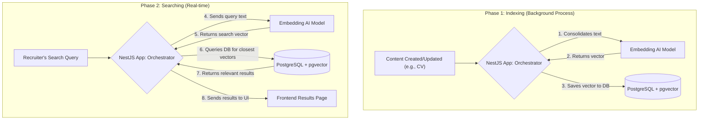

# AI-Powered Semantic Matching: A Technical Overview

## 1. The Problem with Traditional Search

Traditional search is based on keywords. If a job description asks for a "Senior Software Developer" and a candidate's profile says "Lead Software Engineer," a simple keyword search will likely fail to see that these are a strong match. It lacks an understanding of context, synonyms, and intent.

**Semantic Search** solves this problem. It doesn't match keywords; it matches *meaning*.

## 2. Core Concept: Vector Embeddings

The technology that powers semantic search is called **Vector Embeddings**.

Think of it like creating a giant "map of meaning." Every piece of text (a CV, a job description, a search query) can be converted by an AI model into a list of numbers called a **vector**. This vector acts as a precise coordinate on the map.

-   Texts with similar meanings will have coordinates that are very close to each other.
-   Texts with different meanings will be far apart.

Our goal is to create these coordinates for all our jobs and candidates and then use them to find the closest matches.

## 3. The Architecture: Three Key Components

Our system consists of three main parts working together:

1.  **Application Logic (Your NestJS App):** The orchestrator. It handles user data, communicates with the AI model, and queries the database.
2.  **Embedding Model (e.g., Amazon Titan, OpenAI):** The "translator." Its only job is to read a piece of text and convert it into a vector (the coordinate).
3.  **Vector Database (PostgreSQL + `pgvector`):** The "search engine." It stores all the vectors and has special, highly optimized functions to find the "closest" vectors to a given search query in milliseconds.

## 4. The Two-Phase Workflow

The process is broken down into two distinct phases:

### Phase 1: Indexing (An Offline Process)

This is the process of building our "map." It happens in the background whenever a candidate's profile or a job posting is created or updated.

1.  **Content is Created/Updated:** A candidate fills out their profile summary and lists their skills.
2.  **Consolidate Text:** Your NestJS app gathers all the relevant text into a single block (e.g., "Senior developer with 10 years of experience in Python, Django, and cloud services...").
3.  **Generate Embedding:** The app sends this text to the embedding model.
4.  **Store Vector:** The model returns a vector (e.g., `[0.02, 0.91, -0.43, ...]`). Your app saves this vector into a special `vector` column in your PostgreSQL database for that specific candidate.

At the end of this phase, every candidate and every job in your database has a coordinate representing its meaning.

### Phase 2: Searching (A Real-time Process)

This is what happens when a recruiter searches for talent.

1.  **User Enters a Search Query:** The recruiter types what they're looking for, e.g., "An experienced project manager for a fast-paced tech startup."
2.  **Generate Query Embedding:** Your NestJS app sends this search text to the **same** embedding model.
3.  **Query the Database:** The model returns a vector for the search query. Your app then runs a query against the database that says:
    > "Here is the search query's vector. Please find the **Top 20 candidates** whose stored vectors are mathematically closest to this one."
4.  **Display Results:** The `pgvector` extension uses its special index to find the closest matches almost instantly. The database returns a list of the most relevant candidates, sorted by how well they match, which you then display to the recruiter.

A simplified version of the SQL query looks like this:

```sql
-- The <=> operator is from pgvector and calculates cosine distance
SELECT id, name, summary
FROM candidates
ORDER BY embedding_vector <=> '[...vector for the search query...]'
LIMIT 20;
```

## 5. Visual Workflow



## 6. Benefits of This Approach

-   **Goes Beyond Keywords:** Understands user intent, synonyms, and context, leading to far more relevant matches.
-   **High Performance:** The AI model does the "thinking" upfront during indexing. The real-time search is a highly optimized database query that is extremely fast.
-   **Scalable:** This method scales to millions of vectors with minimal performance degradation, making it suitable for a large user base.
-   **Flexible:** The same system can be used to power multiple features: suggesting jobs to candidates, suggesting candidates to companies, finding similar jobs, etc.
-   **Simple Architecture:** By using PostgreSQL with `pgvector`, you avoid the need for a separate, dedicated vector database, simplifying your overall architecture for the MVP.
