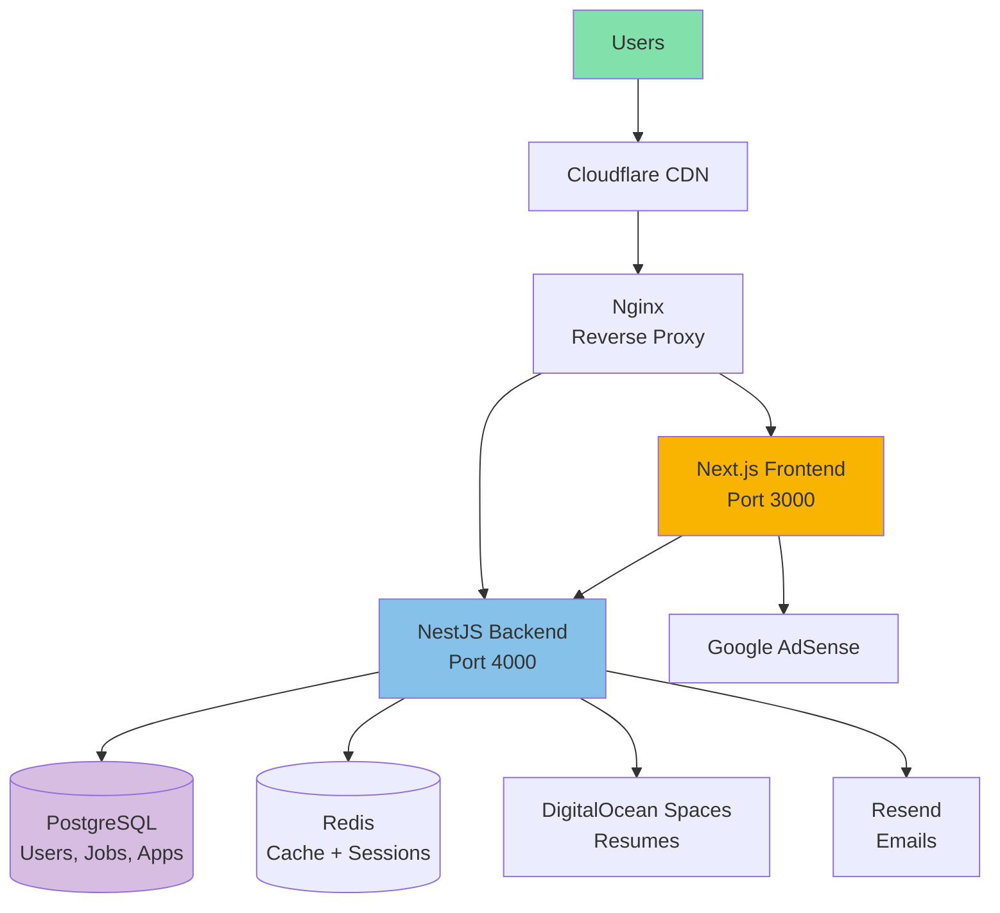

# AI Job Portal: Fast-Track MVP Execution Plan

## Executive Summary

**Mission:** Launch a functional AI job portal MVP in 6 weeks with Google Ads monetization to validate market demand, generate early revenue to offset costs, and build traction for seed funding.

**Key Strategy Shift:**

- ✅ Google Ads integration from Week 1 (not Month 4)
- ✅ Focus on fastest path to market with scalable architecture
- ✅ Build "funding-ready" metrics from day one
- ✅ Lean MVP: Only features that directly drive user engagement and ad revenue

---

## Quick Reference

| Metric                          | Target                                  |
| ------------------------------- | --------------------------------------- |
| **Timeline to Launch**          | 6 weeks                                 |
| **Initial Development Budget**  | $8,000-12,000                           |
| **Runway with Ads Revenue**     | 3-4 months self-sustaining              |
| **MVP Launch Target**           | 25 NGOs, 250 job seekers, 100 job posts |
| **Ad Revenue Target (Month 2)** | $200-300/month (covers 50% of hosting)  |
| **Funding Readiness**           | Month 3 (with traction metrics)         |

---

## Table of Contents

1. [Phase 0: Pre-Development Setup](#phase-0-pre-development-setup-week-0)
2. [Week 1-2: Foundation + Ads Integration](#week-1-2-foundation--ads-integration)
3. [Week 3-4: Core Features](#week-3-4-core-features)
4. [Week 5-6: Testing + Launch](#week-5-6-testing--launch)
5. [Post-Launch: Growth + Funding](#post-launch-growth--funding-month-1-3)
6. [Revised Architecture for Speed + Scale](#revised-architecture-for-speed--scale)
7. [Cost Management & Revenue Tracking](#cost-management--revenue-tracking)
8. [Funding Preparation](#funding-preparation)

---

## Strategic Approach

### Why Google Ads from Day 1?

**Traditional Approach (Our Original Plan):**

- Month 1-3: Free MVP, no revenue
- Month 4+: Add Google Ads
- Problem: Burn rate with no income for 3 months

**Fast-Track Approach (This Plan):**

- Week 1: Integrate Google Ads in codebase
- Week 6: Launch with ads active
- Benefit: Revenue starts immediately, proves monetization model to investors

### Revenue Math (Conservative)

| Month | Users  | Pageviews | eCPM  | Ad Revenue | Hosting Cost | Net     |
| ----- | ------ | --------- | ----- | ---------- | ------------ | ------- |
| 1     | 250    | 2,500     | $1.50 | $3.75      | -$50         | -$46    |
| 2     | 1,000  | 10,000    | $2.00 | $20        | -$50         | -$30    |
| 3     | 2,500  | 25,000    | $2.50 | $63        | -$75         | -$12    |
| 4     | 5,000  | 50,000    | $3.00 | $150       | -$100        | +$50 ✅ |
| 5     | 8,000  | 80,000    | $3.50 | $280       | -$120        | +$160   |
| 6     | 12,000 | 120,000   | $4.00 | $480       | -$150        | +$330   |

**Key Insight:** By Month 4-5, ad revenue covers operational costs, extending runway significantly.

---

## Phase 0: Pre-Development Setup (Week 0)

### Day 1-2: Infrastructure Setup

**Immediate Actions:**

```bash
# Domain & Hosting
✅ Register domain: jobhub.ai or talentmatch.io ($12/year)
✅ Provision VPS: Hetzner CX21 (2 vCPU, 4GB RAM, €5.83/month = $6.50)
   - Location: Choose based on target market (US East, EU)
   - OS: Ubuntu 22.04 LTS
✅ Configure DNS: Point domain to VPS IP
✅ Setup Cloudflare (Free tier)
   - DNS management
   - DDoS protection
   - CDN for static assets
   - SSL/TLS

# Development Tools
✅ Create GitHub organization account (Free)
✅ Set up project management: Linear or GitHub Projects (Free)
✅ Create Slack workspace for team communication (Free)
```

**VPS Initial Configuration:**

```bash
# SSH into VPS
ssh root@your-server-ip

# Update system
apt update && apt upgrade -y

# Install essentials
apt install -y git curl wget ufw nginx certbot python3-certbot-nginx

# Configure firewall
ufw allow OpenSSH
ufw allow 'Nginx Full'
ufw enable

# Install Docker & Docker Compose
curl -fsSL https://get.docker.com -o get-docker.sh
sh get-docker.sh
apt install -y docker-compose

# Install Node.js 20
curl -fsSL https://deb.nodesource.com/setup_20.x | bash -
apt install -y nodejs

# Setup SSL
certbot --nginx -d yourdomain.com -d www.yourdomain.com --non-interactive --agree-tos -m your@email.com
```

**Cost:** $20 (domain + first month hosting)

---

### Day 3-4: External Services Setup

**Google AdSense (Priority #1):**

```
1. Create Google AdSense account (https://adsense.google.com)
2. Submit application with:
   - Domain: yourdomain.com
   - Content: Landing page about job portal (create simple HTML)
3. Approval time: 2-7 days
   - While waiting, integrate ad code in app
   - Ads will activate automatically when approved

Note: Apply IMMEDIATELY. Start approval process in parallel with development.
```

**Other Services:**

```bash
# OpenRouter (AI features)
✅ Sign up: https://openrouter.ai
✅ Add $10 credit
✅ Get API key
✅ Cost: ~$0.02/resume parse, $0.01/job match

# Email Service (Resend - generous free tier)
✅ Sign up: https://resend.com
✅ Free: 3,000 emails/month
✅ Verify domain for sending
✅ Get API key

# Object Storage (DigitalOcean Spaces or Wasabi)
✅ Create bucket for resume storage
✅ Cost: $5/month (250GB)
✅ Get access keys

# Stripe (for future premium features)
✅ Create account
✅ Get test API keys
✅ Don't activate yet (not needed for MVP)

# Monitoring (Free tiers)
✅ Sentry for error tracking (5k events/month free)
✅ Google Analytics 4 (free)
✅ Uptime monitoring: UptimeRobot (free, 50 monitors)
```

**Cost:** $15 (OpenRouter credit + storage)

---

### Day 5-7: Repository & Architecture Setup

**Create Repository Structure:**

```bash
job-portal/
├── frontend/          # Next.js 14
├── backend/           # NestJS
├── docker-compose.yml # Local development
├── docker-compose.prod.yml # Production
├── .github/
│   └── workflows/
│       └── deploy.yml # CI/CD
└── docs/
    ├── api.md
    └── setup.md
```

**Initialize Projects:**

```bash
# Frontend (Next.js)
npx create-next-app@latest frontend --typescript --tailwind --app --no-src-dir
cd frontend
npm install @radix-ui/react-icons class-variance-authority clsx tailwind-merge
npm install react-hook-form zod @hookform/resolvers
npm install axios swr

# Backend (NestJS)
npm i -g @nestjs/cli
nest new backend
cd backend
npm install @nestjs/typeorm typeorm pg
npm install @nestjs/mongoose mongoose
npm install @nestjs/jwt @nestjs/passport passport passport-jwt
npm install @nestjs/config class-validator class-transformer
npm install bcrypt
npm install @nestjs/throttler
```

**Environment Variables Template:**

```bash
# .env.example (commit this)
# .env (DO NOT commit)

NODE_ENV=production
APP_URL=https://yourdomain.com

# Database
POSTGRES_HOST=postgres
POSTGRES_PORT=5432
POSTGRES_USER=jobportal
POSTGRES_PASSWORD=CHANGE_ME
POSTGRES_DB=jobportal
DATABASE_URL=postgresql://${POSTGRES_USER}:${POSTGRES_PASSWORD}@${POSTGRES_HOST}:${POSTGRES_PORT}/${POSTGRES_DB}

# Redis
REDIS_HOST=redis
REDIS_PORT=6379
REDIS_URL=redis://${REDIS_HOST}:${REDIS_PORT}

# JWT
JWT_SECRET=GENERATE_STRONG_SECRET_HERE
JWT_EXPIRATION=1h
JWT_REFRESH_SECRET=GENERATE_ANOTHER_SECRET
JWT_REFRESH_EXPIRATION=7d

# OpenRouter AI
OPENROUTER_API_KEY=your_key_here

# Email
RESEND_API_KEY=your_key_here
EMAIL_FROM=noreply@yourdomain.com

# Storage
S3_ENDPOINT=https://nyc3.digitaloceanspaces.com
S3_BUCKET=jobportal-resumes
S3_ACCESS_KEY=your_access_key
S3_SECRET_KEY=your_secret_key
S3_REGION=nyc3

# Google AdSense
NEXT_PUBLIC_ADSENSE_ID=ca-pub-XXXXXXXXXXXXXXXX

# Analytics
NEXT_PUBLIC_GA_ID=G-XXXXXXXXXX
SENTRY_DSN=https://xxx@sentry.io/xxx
```

**Generate Secrets:**

```bash
# Generate strong secrets
node -e "console.log(require('crypto').randomBytes(32).toString('hex'))"
```

---

## Week 1-2: Foundation + Ads Integration

### Architecture Decision: Monolith First, Microservices Ready

**Why Monolith for MVP:**

- ✅ Faster development (no inter-service communication)
- ✅ Easier debugging
- ✅ Lower infrastructure costs
- ✅ Can refactor to microservices later

**Scalability Built-In:**

- ✅ Modular NestJS architecture (easy to extract services)
- ✅ Database per domain pattern
- ✅ Stateless application design
- ✅ Docker containers ready to scale horizontally

### Week 1: Days 1-3 - Database & Auth

**PostgreSQL Schema (Minimal):**

```sql
-- users table
CREATE TABLE users (
  id UUID PRIMARY KEY DEFAULT gen_random_uuid(),
  email VARCHAR(255) UNIQUE NOT NULL,
  password_hash VARCHAR(255) NOT NULL,
  role VARCHAR(20) NOT NULL CHECK (role IN ('job_seeker', 'employer', 'ngo', 'admin')),
  email_verified BOOLEAN DEFAULT FALSE,
  is_active BOOLEAN DEFAULT TRUE,
  created_at TIMESTAMP DEFAULT NOW(),
  updated_at TIMESTAMP DEFAULT NOW()
);

-- profiles table (polymorphic)
CREATE TABLE profiles (
  id UUID PRIMARY KEY DEFAULT gen_random_uuid(),
  user_id UUID REFERENCES users(id) ON DELETE CASCADE,
  first_name VARCHAR(100),
  last_name VARCHAR(100),
  phone VARCHAR(20),
  location VARCHAR(255),
  bio TEXT,
  avatar_url TEXT,
  -- Job seeker specific
  resume_url TEXT,
  skills TEXT[], -- Array of skills
  experience_years INTEGER,
  -- Employer specific
  company_name VARCHAR(255),
  company_logo_url TEXT,
  company_description TEXT,
  company_website VARCHAR(255),
  is_ngo BOOLEAN DEFAULT FALSE,
  ngo_verified BOOLEAN DEFAULT FALSE,
  created_at TIMESTAMP DEFAULT NOW(),
  updated_at TIMESTAMP DEFAULT NOW()
);

-- jobs table
CREATE TABLE jobs (
  id UUID PRIMARY KEY DEFAULT gen_random_uuid(),
  employer_id UUID REFERENCES users(id) ON DELETE CASCADE,
  title VARCHAR(255) NOT NULL,
  description TEXT NOT NULL,
  location VARCHAR(255),
  job_type VARCHAR(50), -- full-time, part-time, contract, remote
  salary_min INTEGER,
  salary_max INTEGER,
  required_skills TEXT[],
  status VARCHAR(20) DEFAULT 'draft' CHECK (status IN ('draft', 'published', 'expired', 'closed')),
  views INTEGER DEFAULT 0,
  expires_at TIMESTAMP,
  created_at TIMESTAMP DEFAULT NOW(),
  updated_at TIMESTAMP DEFAULT NOW()
);

-- applications table
CREATE TABLE applications (
  id UUID PRIMARY KEY DEFAULT gen_random_uuid(),
  job_id UUID REFERENCES jobs(id) ON DELETE CASCADE,
  applicant_id UUID REFERENCES users(id) ON DELETE CASCADE,
  cover_letter TEXT,
  resume_url TEXT,
  status VARCHAR(20) DEFAULT 'applied' CHECK (status IN ('applied', 'reviewing', 'shortlisted', 'rejected', 'hired')),
  created_at TIMESTAMP DEFAULT NOW(),
  updated_at TIMESTAMP DEFAULT NOW(),
  UNIQUE(job_id, applicant_id) -- One application per job per user
);

-- Create indexes
CREATE INDEX idx_users_email ON users(email);
CREATE INDEX idx_users_role ON users(role);
CREATE INDEX idx_jobs_employer ON jobs(employer_id);
CREATE INDEX idx_jobs_status ON jobs(status);
CREATE INDEX idx_jobs_created ON jobs(created_at DESC);
CREATE INDEX idx_applications_job ON applications(job_id);
CREATE INDEX idx_applications_applicant ON applications(applicant_id);
CREATE INDEX idx_applications_status ON applications(status);
```

**NestJS Auth Module (Days 1-3):**

```typescript
// src/auth/auth.service.ts (simplified)
@Injectable()
export class AuthService {
  constructor(
    @InjectRepository(User) private usersRepo: Repository<User>,
    private jwtService: JwtService
  ) {}

  async register(dto: RegisterDto) {
    const hashedPassword = await bcrypt.hash(dto.password, 12);
    const user = this.usersRepo.create({
      email: dto.email,
      password_hash: hashedPassword,
      role: dto.role,
    });
    await this.usersRepo.save(user);

    // Send verification email (async, don't wait)
    this.emailService.sendVerification(user.email).catch(console.error);

    return this.generateTokens(user);
  }

  async login(dto: LoginDto) {
    const user = await this.usersRepo.findOne({ where: { email: dto.email } });
    if (!user || !(await bcrypt.compare(dto.password, user.password_hash))) {
      throw new UnauthorizedException("Invalid credentials");
    }
    return this.generateTokens(user);
  }

  private generateTokens(user: User) {
    const payload = { sub: user.id, email: user.email, role: user.role };
    return {
      access_token: this.jwtService.sign(payload, { expiresIn: "1h" }),
      refresh_token: this.jwtService.sign(payload, {
        secret: process.env.JWT_REFRESH_SECRET,
        expiresIn: "7d",
      }),
    };
  }
}
```

**Deliverable (Day 3):** ✅ User can register and login

---

### Week 1: Days 4-7 - Frontend Setup + Google Ads Integration

**Next.js Layout with Ads:**

```typescript
// app/layout.tsx
import Script from "next/script";

export default function RootLayout({ children }) {
  return (
    <html lang="en">
      <head>
        {/* Google AdSense */}
        <Script
          async
          src={`https://pagead2.googlesyndication.com/pagead/js/adsbygoogle.js?client=${process.env.NEXT_PUBLIC_ADSENSE_ID}`}
          crossOrigin="anonymous"
          strategy="afterInteractive"
        />
      </head>
      <body>
        <Header />
        <main className="min-h-screen">{children}</main>
        <Footer />
      </body>
    </html>
  );
}
```

**Ad Component (Reusable):**

```typescript
// components/AdBanner.tsx
"use client";

import { useEffect } from "react";

export function AdBanner({
  slot,
  format = "auto",
  responsive = true,
  style = { display: "block" },
}) {
  useEffect(() => {
    try {
      ((window as any).adsbygoogle = (window as any).adsbygoogle || []).push(
        {}
      );
    } catch (err) {
      console.error("AdSense error:", err);
    }
  }, []);

  return (
    <ins
      className="adsbygoogle"
      style={style}
      data-ad-client={process.env.NEXT_PUBLIC_ADSENSE_ID}
      data-ad-slot={slot}
      data-ad-format={format}
      data-full-width-responsive={responsive}
    />
  );
}
```

**Ad Placement Strategy:**

```typescript
// app/jobs/page.tsx - Job Listing Page
export default function JobsPage() {
  return (
    <div className="container mx-auto py-8">
      <h1>Browse Jobs</h1>

      {/* Ad #1: Top Banner (728x90 or responsive) */}
      <div className="my-4">
        <AdBanner slot="1234567890" format="horizontal" />
      </div>

      <div className="grid grid-cols-1 lg:grid-cols-3 gap-6">
        {/* Main content */}
        <div className="lg:col-span-2">
          <JobFilters />
          <JobList />
        </div>

        {/* Sidebar with Ad #2 */}
        <aside>
          <AdBanner slot="0987654321" format="rectangle" />
          <SavedJobs />
        </aside>
      </div>

      {/* Ad #3: Bottom Banner */}
      <div className="my-8">
        <AdBanner slot="1122334455" />
      </div>
    </div>
  );
}
```

**Optimal Ad Placements for Job Portal:**

1. **Job Listing Pages** (highest traffic)

   - Top banner (728x90 or responsive)
   - Sidebar (300x250 or 300x600)
   - Between job cards (in-feed ads)
   - Bottom banner

2. **Job Detail Pages**

   - Top of page
   - Right sidebar
   - Below job description
   - Related jobs section

3. **Dashboard Pages**

   - Top banner only (don't overwhelm logged-in users)

4. **Blog/Resources** (future)
   - In-content ads
   - Sidebar ads

**Deliverable (Day 7):**

- ✅ Next.js app with routing
- ✅ Google Ads integrated and ready
- ✅ Basic UI components (using shadcn/ui)
- ✅ Authentication pages (login, register)

---

### Week 2: Days 8-10 - Job Posting & Listing

**Backend Jobs Module:**

```typescript
// src/jobs/jobs.service.ts
@Injectable()
export class JobsService {
  constructor(
    @InjectRepository(Job) private jobsRepo: Repository<Job>,
    @Inject(CACHE_MANAGER) private cacheManager: Cache
  ) {}

  async create(userId: string, dto: CreateJobDto) {
    const job = this.jobsRepo.create({
      ...dto,
      employer_id: userId,
      status: "published",
      expires_at: new Date(Date.now() + 30 * 24 * 60 * 60 * 1000), // 30 days
    });
    await this.jobsRepo.save(job);

    // Invalidate cache
    await this.cacheManager.del("jobs:latest");

    return job;
  }

  async findAll(filters: JobFiltersDto) {
    const cacheKey = `jobs:${JSON.stringify(filters)}`;

    // Try cache first (5 min TTL)
    const cached = await this.cacheManager.get(cacheKey);
    if (cached) return cached;

    const query = this.jobsRepo
      .createQueryBuilder("job")
      .where("job.status = :status", { status: "published" })
      .andWhere("job.expires_at > :now", { now: new Date() })
      .orderBy("job.created_at", "DESC")
      .limit(20);

    if (filters.location) {
      query.andWhere("job.location ILIKE :location", {
        location: `%${filters.location}%`,
      });
    }

    if (filters.skills?.length) {
      query.andWhere("job.required_skills && :skills", {
        skills: filters.skills,
      });
    }

    const jobs = await query.getMany();

    // Cache for 5 minutes
    await this.cacheManager.set(cacheKey, jobs, 300);

    return jobs;
  }

  async incrementViews(jobId: string) {
    await this.jobsRepo.increment({ id: jobId }, "views", 1);
  }
}
```

**Frontend Job Listing:**

```typescript
// app/jobs/page.tsx
import { JobCard } from "@/components/JobCard";
import { AdBanner } from "@/components/AdBanner";

async function getJobs(searchParams) {
  const res = await fetch(
    `${process.env.NEXT_PUBLIC_API_URL}/jobs?${new URLSearchParams(
      searchParams
    )}`,
    {
      cache: "no-store",
    }
  );
  return res.json();
}

export default async function JobsPage({ searchParams }) {
  const jobs = await getJobs(searchParams);

  return (
    <div className="container py-8">
      <h1 className="text-4xl font-bold mb-8">Find Your Next Job</h1>

      {/* Top Ad */}
      <AdBanner slot="1234567890" />

      <div className="grid lg:grid-cols-3 gap-8 mt-8">
        <aside className="lg:col-span-1">
          <JobFilters />
          {/* Sidebar Ad */}
          <div className="mt-8">
            <AdBanner slot="9876543210" format="rectangle" />
          </div>
        </aside>

        <div className="lg:col-span-2">
          {jobs.map((job, idx) => (
            <>
              <JobCard key={job.id} job={job} />
              {/* In-feed ad every 5 jobs */}
              {(idx + 1) % 5 === 0 && (
                <div className="my-4">
                  <AdBanner slot="5544332211" format="fluid" />
                </div>
              )}
            </>
          ))}
        </div>
      </div>
    </div>
  );
}
```

**Deliverable (Day 10):**

- ✅ Employers can create job posts
- ✅ Job listing page with filters
- ✅ Ads integrated on job pages
- ✅ Basic caching implemented

---

### Week 2: Days 11-14 - Applications & Resume Upload

**File Upload Service:**

```typescript
// src/upload/upload.service.ts
import { S3Client, PutObjectCommand } from "@aws-sdk/client-s3";

@Injectable()
export class UploadService {
  private s3Client: S3Client;

  constructor() {
    this.s3Client = new S3Client({
      endpoint: process.env.S3_ENDPOINT,
      region: process.env.S3_REGION,
      credentials: {
        accessKeyId: process.env.S3_ACCESS_KEY,
        secretAccessKey: process.env.S3_SECRET_KEY,
      },
    });
  }

  async uploadResume(file: Express.Multer.File, userId: string) {
    const key = `resumes/${userId}/${Date.now()}-${file.originalname}`;

    await this.s3Client.send(
      new PutObjectCommand({
        Bucket: process.env.S3_BUCKET,
        Key: key,
        Body: file.buffer,
        ContentType: file.mimetype,
        ACL: "private",
      })
    );

    return `${process.env.S3_ENDPOINT}/${process.env.S3_BUCKET}/${key}`;
  }
}
```

**Application Flow:**

```typescript
// src/applications/applications.service.ts
@Injectable()
export class ApplicationsService {
  async apply(userId: string, jobId: string, dto: ApplyDto) {
    // Check if already applied
    const existing = await this.appsRepo.findOne({
      where: { applicant_id: userId, job_id: jobId },
    });
    if (existing) {
      throw new ConflictException("Already applied to this job");
    }

    const application = this.appsRepo.create({
      applicant_id: userId,
      job_id: jobId,
      cover_letter: dto.coverLetter,
      resume_url: dto.resumeUrl,
      status: "applied",
    });

    await this.appsRepo.save(application);

    // Send notification email to employer (async)
    this.notifyEmployer(jobId, userId).catch(console.error);

    return application;
  }
}
```

**Deliverable (Day 14):**

- ✅ Job seekers can apply to jobs
- ✅ Resume upload works (S3)
- ✅ Application tracking
- ✅ Email notifications

---

## Week 3-4: Core Features

### Week 3: Days 15-18 - Basic AI Matching

**Simple Keyword Matching (No OpenRouter Yet):**

```typescript
// src/ai/matching.service.ts
@Injectable()
export class MatchingService {
  calculateMatchScore(job: Job, candidate: Profile): number {
    const jobSkills = new Set(job.required_skills.map((s) => s.toLowerCase()));
    const candidateSkills = new Set(
      candidate.skills.map((s) => s.toLowerCase())
    );

    // Calculate overlap
    const intersection = new Set(
      [...jobSkills].filter((x) => candidateSkills.has(x))
    );
    const overlap = intersection.size / jobSkills.size;

    // Experience match
    let experienceScore = 1.0;
    if (job.experience_required && candidate.experience_years) {
      const diff = Math.abs(
        job.experience_required - candidate.experience_years
      );
      experienceScore = Math.max(0, 1 - diff / 10);
    }

    // Location match (bonus)
    let locationBonus = 0;
    if (job.location && candidate.location) {
      if (
        job.location.toLowerCase().includes(candidate.location.toLowerCase()) ||
        candidate.location.toLowerCase().includes(job.location.toLowerCase())
      ) {
        locationBonus = 0.1;
      }
    }

    // Weighted score
    const finalScore = overlap * 0.6 + experienceScore * 0.3 + locationBonus;
    return Math.round(finalScore * 100); // 0-100 scale
  }

  async getRecommendations(userId: string) {
    const profile = await this.profilesRepo.findOne({
      where: { user_id: userId },
    });
    if (!profile.skills?.length) return [];

    const jobs = await this.jobsRepo.find({
      where: { status: "published" },
      order: { created_at: "DESC" },
      take: 50,
    });

    const scored = jobs
      .map((job) => ({
        job,
        score: this.calculateMatchScore(job, profile),
      }))
      .filter((item) => item.score > 30) // Only show 30%+ match
      .sort((a, b) => b.score - a.score)
      .slice(0, 10);

    return scored;
  }
}
```

**Deliverable (Day 18):**

- ✅ Basic match scoring working
- ✅ Job recommendations on dashboard
- ✅ Match percentage shown on job cards

---

### Week 3: Days 19-21 - Dashboards & Analytics

**Job Seeker Dashboard:**

```typescript
// app/dashboard/page.tsx
export default async function Dashboard() {
  const recommendations = await fetch("/api/users/me/recommendations");
  const applications = await fetch("/api/users/me/applications");

  return (
    <div className="container py-8">
      <h1>Your Dashboard</h1>

      {/* Ad - Top Banner */}
      <AdBanner slot="1111111111" />

      <div className="grid lg:grid-cols-3 gap-8 mt-8">
        <div className="lg:col-span-2">
          <section>
            <h2>Recommended Jobs</h2>
            {recommendations.map((item) => (
              <JobCard
                key={item.job.id}
                job={item.job}
                matchScore={item.score}
              />
            ))}
          </section>

          <section className="mt-8">
            <h2>Your Applications</h2>
            <ApplicationsList applications={applications} />
          </section>
        </div>

        <aside>
          {/* Sidebar Ad */}
          <AdBanner slot="2222222222" format="rectangle" />

          <ProfileCompletionWidget />
          <SavedJobsWidget />
        </aside>
      </div>
    </div>
  );
}
```

**Employer Dashboard:**

```typescript
// app/employer/dashboard/page.tsx
export default async function EmployerDashboard() {
  const jobs = await fetch("/api/users/me/jobs");
  const analytics = await fetch("/api/users/me/analytics");

  return (
    <div className="container py-8">
      <div className="flex justify-between items-center mb-8">
        <h1>Your Job Posts</h1>
        <button>Create New Job</button>
      </div>

      {/* Stats Cards */}
      <div className="grid grid-cols-4 gap-4 mb-8">
        <StatsCard title="Active Jobs" value={analytics.activeJobs} />
        <StatsCard title="Total Views" value={analytics.totalViews} />
        <StatsCard title="Applications" value={analytics.totalApplications} />
        <StatsCard title="Shortlisted" value={analytics.shortlisted} />
      </div>

      {/* Ad Banner */}
      <AdBanner slot="3333333333" />

      <JobsList jobs={jobs} />
    </div>
  );
}
```

**Deliverable (Day 21):**

- ✅ Job seeker dashboard with recommendations
- ✅ Employer dashboard with analytics
- ✅ Ads integrated on dashboards

---

### Week 4: Days 22-25 - NGO Program & Admin

**NGO Verification:**

```typescript
// src/ngo/ngo.service.ts
@Injectable()
export class NgoService {
  async applyForNgoStatus(userId: string, dto: NgoApplicationDto) {
    // Store NGO application
    const application = await this.ngoAppsRepo.create({
      user_id: userId,
      organization_name: dto.organizationName,
      tax_id: dto.taxId,
      proof_document_url: dto.proofUrl,
      status: "pending",
    });
    await this.ngoAppsRepo.save(application);

    // Notify admin
    await this.emailService.notifyAdminNewNgoApplication(application);

    return application;
  }

  async approveNgo(applicationId: string, adminId: string) {
    const app = await this.ngoAppsRepo.findOne({
      where: { id: applicationId },
    });

    // Update application
    app.status = "approved";
    app.reviewed_by = adminId;
    app.reviewed_at = new Date();
    await this.ngoAppsRepo.save(app);

    // Update user profile
    await this.profilesRepo.update(
      { user_id: app.user_id },
      { is_ngo: true, ngo_verified: true }
    );

    // Send approval email
    await this.emailService.sendNgoApprovalEmail(app.user_id);

    return app;
  }
}
```

**Basic Admin Panel:**

```typescript
// app/admin/page.tsx
export default async function AdminDashboard() {
  const stats = await fetch("/api/admin/stats");
  const pendingNgos = await fetch("/api/admin/ngos?status=pending");

  return (
    <div className="container py-8">
      <h1>Admin Dashboard</h1>

      <div className="grid grid-cols-4 gap-4 mb-8">
        <StatsCard title="Total Users" value={stats.totalUsers} />
        <StatsCard title="Active Jobs" value={stats.activeJobs} />
        <StatsCard title="Applications" value={stats.totalApplications} />
        <StatsCard title="Pending NGOs" value={pendingNgos.length} />
      </div>

      <section>
        <h2>NGO Applications</h2>
        {pendingNgos.map((app) => (
          <NgoApplicationCard
            key={app.id}
            application={app}
            onApprove={() => approveNgo(app.id)}
            onReject={() => rejectNgo(app.id)}
          />
        ))}
      </section>
    </div>
  );
}
```

**Deliverable (Day 25):**

- ✅ NGO application workflow
- ✅ Admin can approve/reject NGOs
- ✅ NGO badge on profiles

---

### Week 4: Days 26-28 - Polish & Optimization

**Performance Optimization:**

```typescript
// Implement caching strategy
// 1. Redis for API responses
// 2. Next.js ISR for static pages
// 3. CDN for assets

// app/jobs/[id]/page.tsx - ISR
export const revalidate = 300; // 5 minutes

export default async function JobPage({ params }) {
  // This page is statically generated and revalidated every 5 min
  const job = await fetch(`/api/jobs/${params.id}`);
  return <JobDetails job={job} />;
}
```

**SEO Optimization:**

```typescript
// app/jobs/[id]/page.tsx
export async function generateMetadata({ params }) {
  const job = await fetch(`/api/jobs/${params.id}`);

  return {
    title: `${job.title} at ${job.company_name} | JobHub`,
    description: job.description.slice(0, 160),
    openGraph: {
      title: job.title,
      description: job.description.slice(0, 160),
      type: "website",
    },
  };
}
```

**Analytics Integration:**

```typescript
// app/layout.tsx - Add GA4
import { GoogleAnalytics } from "@next/third-parties/google";

export default function RootLayout({ children }) {
  return (
    <html>
      <body>
        {children}
        <GoogleAnalytics gaId={process.env.NEXT_PUBLIC_GA_ID} />
      </body>
    </html>
  );
}
```

**Deliverable (Day 28):**

- ✅ Page load time < 2 seconds
- ✅ Mobile responsive
- ✅ SEO meta tags
- ✅ Analytics tracking

---

## Week 5-6: Testing + Launch

### Week 5: Days 29-33 - Testing

**Testing Checklist:**

```bash
# Unit Tests (Backend)
npm run test -- --coverage
# Target: >70% coverage on services

# Integration Tests (API)
npm run test:e2e

# Frontend Tests
npm run test -- --run

# Manual Testing Scenarios
✅ User Registration & Login
✅ Email Verification
✅ Profile Creation (Job Seeker)
✅ Profile Creation (Employer)
✅ Job Creation
✅ Job Search & Filters
✅ Job Application
✅ Resume Upload
✅ Match Recommendations
✅ NGO Application
✅ Admin Approval
✅ Ads Display & Click
✅ Mobile Responsiveness

# Performance Testing
✅ Load test: 100 concurrent users (k6 or Artillery)
✅ Database query optimization (< 100ms)
✅ API response time (< 500ms)

# Security Testing
✅ SQL injection attempts
✅ XSS attempts
✅ CSRF protection
✅ Rate limiting (100 req/min per IP)
✅ Password strength requirements
✅ JWT token expiration
```

**Bug Fixes (Days 31-33):**

- Fix any critical bugs
- Improve error messages
- Add loading states
- Polish UI

---

### Week 5: Days 34-35 - Deployment Preparation

**Docker Compose for Production:**

```yaml
# docker-compose.prod.yml
version: "3.8"

services:
  nginx:
    image: nginx:alpine
    ports:
      - "80:80"
      - "443:443"
    volumes:
      - ./nginx.conf:/etc/nginx/nginx.conf
      - ./ssl:/etc/nginx/ssl
    depends_on:
      - frontend
      - backend
    restart: unless-stopped

  frontend:
    build:
      context: ./frontend
      dockerfile: Dockerfile.prod
    environment:
      - NODE_ENV=production
      - NEXT_PUBLIC_API_URL=https://api.yourdomain.com
      - NEXT_PUBLIC_ADSENSE_ID=${ADSENSE_ID}
    restart: unless-stopped

  backend:
    build:
      context: ./backend
      dockerfile: Dockerfile.prod
    environment:
      - NODE_ENV=production
      - DATABASE_URL=${DATABASE_URL}
      - REDIS_URL=${REDIS_URL}
      - JWT_SECRET=${JWT_SECRET}
      - OPENROUTER_API_KEY=${OPENROUTER_API_KEY}
    depends_on:
      - postgres
      - redis
    restart: unless-stopped

  postgres:
    image: postgres:15-alpine
    environment:
      - POSTGRES_DB=${POSTGRES_DB}
      - POSTGRES_USER=${POSTGRES_USER}
      - POSTGRES_PASSWORD=${POSTGRES_PASSWORD}
    volumes:
      - postgres-data:/var/lib/postgresql/data
    restart: unless-stopped

  redis:
    image: redis:7-alpine
    volumes:
      - redis-data:/data
    restart: unless-stopped

volumes:
  postgres-data:
  redis-data:
```

**Deployment Script:**

```bash
#!/bin/bash
# deploy.sh

set -e

echo "🚀 Deploying to production..."

# Pull latest code
git pull origin main

# Build and start containers
docker-compose -f docker-compose.prod.yml down
docker-compose -f docker-compose.prod.yml build --no-cache
docker-compose -f docker-compose.prod.yml up -d

# Run migrations
docker-compose -f docker-compose.prod.yml exec -T backend npm run migration:run

# Health check
sleep 10
curl -f http://localhost:4000/health || exit 1

echo "✅ Deployment successful!"
```

---

### Week 6: Days 36-38 - Beta Testing

**Beta Tester Recruitment:**

```
Target: 10-15 NGOs, 30-50 job seekers

Channels:
1. LinkedIn outreach to NGO directors
2. Post in nonprofit groups
3. Reach out to local community centers
4. University career centers
5. Personal network

Message template:
"Hi [Name], I'm launching a free job portal specifically for non-profits.
Would you be interested in testing it? You'll get unlimited job posts
and early access to AI-powered candidate matching. Looking for 5-10
organizations to try it this week."
```

**Feedback Collection:**

```typescript
// Implement in-app feedback widget
// Use Typeform or Google Forms
// Track with event analytics

// Key questions:
1. How easy was it to create an account? (1-5)
2. How would you rate the job posting process? (1-5)
3. How relevant were the job matches? (1-5)
4. What feature would you want most?
5. Would you recommend this to a colleague? (NPS)
6. Any bugs or issues?
```

---

### Week 6: Days 39-42 - Launch

**Pre-Launch Checklist:**

```bash
✅ Domain SSL working
✅ Google AdSense approved and ads showing
✅ Email sending works (test verification, notifications)
✅ File uploads work (test resume upload)
✅ All critical paths tested
✅ Error monitoring active (Sentry)
✅ Analytics tracking (GA4)
✅ Uptime monitoring (UptimeRobot)
✅ Backup strategy (daily DB backups)
✅ Privacy policy published
✅ Terms of service published
✅ Contact/support page
✅ Landing page optimized
✅ Meta tags for social sharing
```

**Launch Day (Day 42):**

```
Hour 0-2: Soft Launch
- Deploy to production
- Run smoke tests
- Monitor error logs
- Test all user flows manually

Hour 2-6: Announce to Beta Testers
- Send email to beta list
- Thank them for early feedback
- Announce official launch

Hour 6-24: Public Announcement
- Post on LinkedIn
- Share on Twitter/X
- Post in relevant subreddits (r/nonprofit, r/jobs)
- Send email to warm leads
- Update status to "Live" on all channels

Day 2-7: Monitor & Support
- Respond to all feedback within 2 hours
- Fix any critical bugs immediately
- Monitor ad performance
- Track user signups
```

**Launch Announcement Template:**

```
📣 Launching JobHub: Free AI-Powered Job Board for Nonprofits

After 6 weeks of development, we're excited to launch JobHub -
a completely free job portal for nonprofit organizations.

Features:
✅ Unlimited job posts (always free for verified NPOs)
✅ AI-powered candidate matching
✅ Resume screening
✅ Applicant tracking
✅ Email notifications

For Job Seekers:
✅ Free to use
✅ AI job recommendations
✅ One-click applications
✅ Track all your applications

🔗 Try it now: https://yourdomain.com
```

---

## Post-Launch: Growth + Funding (Month 1-3)

### Month 1: Stabilization

**Goals:**

- ✅ Fix all reported bugs
- ✅ Achieve 500 total users
- ✅ Get 50 job posts
- ✅ Generate $20-50 in ad revenue

**Daily Tasks:**

- Monitor error logs (Sentry)
- Respond to support tickets within 4 hours
- Track metrics dashboard
- Post 1 piece of content (LinkedIn, blog)

**Metrics to Watch:**

- Daily active users (DAU)
- Job posts per day
- Applications per day
- Ad CTR and RPM
- Page load times
- Error rate

**Optimization:**

- A/B test ad placements
- Improve onboarding flow
- Optimize slow queries
- Enhance mobile UX

---

### Month 2: Growth

**Goals:**

- ✅ 2,000 total users
- ✅ 200 active job posts
- ✅ $100-200 ad revenue
- ✅ Media coverage (1-2 articles)

**Growth Tactics:**

1. **Content Marketing:**

   - Write 4 blog posts (SEO-focused)
   - "How to Write Job Descriptions That Attract Top Talent"
   - "10 Interview Questions for Nonprofit Hiring"
   - Share on LinkedIn, Reddit

2. **Partnership Outreach:**

   - Contact 20 nonprofit associations
   - Offer free tier in exchange for promotion
   - Get listed in resource directories

3. **SEO Optimization:**

   - Target long-tail keywords
   - "[City] nonprofit jobs"
   - "remote nonprofit careers"
   - Build backlinks

4. **Product Improvements:**
   - Add OpenRouter AI resume parsing (if budget allows)
   - Improve match algorithm
   - Add email job alerts
   - Mobile app (PWA)

---

### Month 3: Funding Preparation

**Goals:**

- ✅ 5,000 total users
- ✅ 500 active jobs
- ✅ $300-500 ad revenue
- ✅ Prepare pitch deck
- ✅ Apply to accelerators

**Funding-Ready Metrics:**

```
Required Traction:
✅ 5,000+ registered users
✅ 20-30% monthly growth rate
✅ 500+ active job postings
✅ 1,000+ applications processed
✅ $500/month revenue (or strong growth trajectory)
✅ 40+ NPS score
✅ <5% churn rate
✅ Testimonials from 10+ users

Product Readiness:
✅ Core features working smoothly
✅ Mobile responsive
✅ < 1% error rate
✅ 99%+ uptime
✅ Clear roadmap for next 6 months

Business Model Validation:
✅ Ad revenue growing monthly
✅ Clear path to profitability
✅ Unit economics make sense (CAC < CLTV)
✅ Multiple monetization channels identified
```

**Pitch Deck Outline:**

```
1. Problem (1 slide)
   - Traditional job boards don't serve nonprofits well
   - High costs, poor matches, outdated tech

2. Solution (1 slide)
   - Free AI-powered job board for nonprofits
   - Revenue from ads + future premium features

3. Market (1 slide)
   - $X billion recruitment market
   - X million nonprofits in US
   - Growing remote work trend

4. Product (2 slides)
   - Screenshots
   - Key features
   - AI differentiation

5. Traction (2 slides)
   - User growth chart
   - Revenue chart
   - Key metrics
   - Testimonials

6. Business Model (1 slide)
   - Free for NGOs (ad-supported)
   - Premium for companies ($49-499/mo)
   - Projected revenue

7. Go-to-Market (1 slide)
   - SEO + content marketing
   - Nonprofit partnerships
   - Community building

8. Competition (1 slide)
   - Indeed, LinkedIn, ZipRecruiter
   - Why we're different (AI + niche focus)

9. Team (1 slide)
   - Founders + key hires
   - Advisors

10. Ask (1 slide)
    - Raising $500K seed
    - Use of funds (50% product, 30% marketing, 20% operations)
    - 18-month runway

11. Vision (1 slide)
    - Become #1 job platform for social impact sector
    - Expand to other verticals
```

**Target Investors:**

- Y Combinator
- Techstars Social Impact
- Village Capital
- Impact VCs (Omidyar, Acumen)
- Angel investors in HR tech

**Apply to Accelerators:**

- Y Combinator (deadlines: Apr, Aug)
- Techstars (rolling applications)
- Google for Startups
- Microsoft for Startups

---

## Revised Architecture for Speed + Scale

### Tech Stack (Confirmed)

```
Frontend:
✅ Next.js 14 (App Router)
✅ TypeScript
✅ Tailwind CSS
✅ shadcn/ui components
✅ React Hook Form + Zod

Backend:
✅ NestJS (Monolith initially)
✅ TypeScript
✅ TypeORM (PostgreSQL)
✅ Redis (caching)
✅ JWT authentication

Databases:
✅ PostgreSQL 15 (primary)
✅ Redis 7 (cache)
✅ MongoDB (defer to Phase 2 - not needed for MVP)

Infrastructure:
✅ Docker + Docker Compose
✅ Nginx (reverse proxy)
✅ Hetzner VPS (4GB RAM, 2 vCPU)
✅ Cloudflare (CDN + DDoS)

External Services:
✅ DigitalOcean Spaces (file storage)
✅ Resend (email)
✅ OpenRouter (AI - Phase 2)
✅ Google AdSense (monetization)
✅ Stripe (future premium)
```

### Simplified Architecture for MVP



**Why This Architecture:**

- ✅ Simple to deploy
- ✅ Easy to debug
- ✅ Low operational overhead
- ✅ Scales to 10,000 users easily
- ✅ Can refactor to microservices later

---

## Cost Management & Revenue Tracking

### Monthly Cost Breakdown (MVP)

| Item               | Provider         | Cost       | Notes                     |
| ------------------ | ---------------- | ---------- | ------------------------- |
| **VPS Hosting**    | Hetzner CX21     | $7         | 2 vCPU, 4GB RAM, 40GB SSD |
| **Domain**         | Namecheap        | $1         | $12/year                  |
| **File Storage**   | DigitalOcean     | $5         | 250GB                     |
| **Email**          | Resend           | $0         | 3,000/month free          |
| **CDN**            | Cloudflare       | $0         | Free tier                 |
| **Monitoring**     | Sentry           | $0         | 5k events/month free      |
| **Analytics**      | Google Analytics | $0         | Free                      |
| **Uptime Monitor** | UptimeRobot      | $0         | 50 monitors free          |
| **AI (Future)**    | OpenRouter       | $20        | ~1,000 operations         |
| **Backup**         | Hetzner          | $3         | 100GB backup space        |
| **Total**          |                  | **$36/mo** | Without AI                |
| **With AI**        |                  | **$56/mo** | Phase 2                   |

### Revenue Projections (Conservative)

```
Month 1:
- Users: 500
- Pageviews: 5,000
- RPM: $1.50
- Revenue: $7.50
- Net: -$28.50 ❌

Month 2:
- Users: 1,500
- Pageviews: 15,000
- RPM: $2.00
- Revenue: $30
- Net: -$6 ❌

Month 3:
- Users: 3,000
- Pageviews: 30,000
- RPM: $2.50
- Revenue: $75
- Net: +$39 ✅ (Break-even!)

Month 4:
- Users: 5,000
- Pageviews: 50,000
- RPM: $3.00
- Revenue: $150
- Net: +$114 ✅

Month 5:
- Users: 8,000
- Pageviews: 80,000
- RPM: $3.50
- Revenue: $280
- Net: +$224 ✅

Month 6:
- Users: 12,000
- Pageviews: 120,000
- RPM: $4.00
- Revenue: $480
- Net: +$424 ✅
```

**Key Insight:** Break-even by Month 3, profitable by Month 4.

### Cash Flow Management

**Initial Capital Needed:**

```
Development (if solo): $0 (your time)
Development (contractor): $8,000-12,000
Infrastructure (6 months): $216
Marketing: $500
Buffer: $300
Total: $1,000-13,000
```

**Extending Runway:**

- Month 1-2: Losses covered by initial capital
- Month 3: Break-even
- Month 4+: Ad revenue covers costs + reinvestment

**Milestone-Based Spending:**

```
IF revenue > costs:
  - Allocate 50% to marketing
  - Allocate 30% to product (AI features)
  - Save 20% as buffer

ELSE:
  - Minimize all spending
  - Focus on organic growth
```

---

## Funding Preparation

### Pre-Seed / Seed Checklist

**Product:**

- ✅ Live product with real users
- ✅ Core features working smoothly
- ✅ Mobile responsive
- ✅ >99% uptime last 30 days
- ✅ <1% error rate

**Traction:**

- ✅ 5,000+ registered users
- ✅ 30% MoM growth (3 months)
- ✅ 500+ active job posts
- ✅ 1,000+ applications
- ✅ $500/month revenue (or clear path)

**Market Validation:**

- ✅ 10+ user testimonials
- ✅ NPS >40
- ✅ Press coverage (1-2 articles)
- ✅ Active social media presence

**Business Model:**

- ✅ Multiple revenue streams identified
- ✅ Unit economics make sense
- ✅ CAC < CLTV (3:1 ratio)
- ✅ Clear monetization roadmap

**Team:**

- ✅ Technical founder(s) who built MVP
- ✅ Industry knowledge (HR/recruiting)
- ✅ Execution track record
- ✅ Advisors (optional but helpful)

### Funding Round Structure

**Pre-Seed ($150K-300K):**

- Valuation: $1M-2M
- Equity: 10-20%
- Use: Hire 1-2 engineers, marketing budget
- Timeline: Months 3-6

**Seed ($500K-1M):**

- Valuation: $3M-5M
- Equity: 15-25%
- Use: Team of 5-7, scale marketing
- Timeline: Months 9-12

### Investor Targeting

**Angel Investors:**

- HR tech angels
- Ex-founders who sold to LinkedIn/Indeed
- Angel groups (TechStars alumni, YC alumni)

**Micro VCs:**

- Pre-seed focused ($50K-250K checks)
- Hustle Fund, Village Global, Pioneer Fund

**Accelerators:**

- Y Combinator ($500K for 7%)
- Techstars ($120K for 6-10%)
- Google for Startups (non-dilutive)

**Impact Investors:**

- Focus on social impact angle (nonprofits)
- Omidyar Network, Acumen, New Profit

---

## Metrics Dashboard

### Week 1 KPIs

```
User Metrics:
- Total Users: 0 → 50
- Daily Signups: 0 → 7
- Activation Rate: N/A (need 100 users)

Engagement:
- DAU: 0
- WAU: 0
- Session Duration: N/A

Content:
- Jobs Posted: 0 → 10
- Applications: 0 → 5

Revenue:
- Ad Impressions: 0
- Ad Clicks: 0
- Ad Revenue: $0
```

### Month 1 KPIs

```
User Metrics:
- Total Users: 500
- Daily Signups: 15-20
- Activation Rate: 20%
- Retention (Day 7): 30%

Engagement:
- DAU: 100
- WAU: 250
- MAU: 500
- Session Duration: 3-5 min

Content:
- Jobs Posted: 100
- Active Jobs: 75
- Applications: 150
- Application/Job Ratio: 2:1

Revenue:
- Ad Impressions: 5,000
- Ad Clicks: 50 (1% CTR)
- Ad Revenue: $7.50
- RPM: $1.50
```

### Month 3 Target (Funding-Ready)

```
User Metrics:
- Total Users: 5,000
- Daily Signups: 50-75
- Activation Rate: 25%
- Retention (Day 7): 35%
- Retention (Day 30): 20%

Engagement:
- DAU: 1,000
- WAU: 2,500
- MAU: 5,000
- Session Duration: 5-7 min
- Avg Sessions/User: 3-4

Content:
- Jobs Posted: 500
- Active Jobs: 350
- Applications: 2,000
- Application/Job Ratio: 4:1
- Avg Time to Apply: <2 min

Revenue:
- Ad Impressions: 50,000
- Ad Clicks: 500 (1% CTR)
- Ad Revenue: $150
- RPM: $3.00

Quality Metrics:
- NPS: 40+
- CSAT: 4.2/5
- Support Tickets: <50/month
- Resolution Time: <24hr
- Error Rate: <0.5%
- Uptime: >99.5%
```

---

## Action Plan Summary

### Immediate Next Steps (This Week)

**Day 1:**

- [ ] Register domain
- [ ] Provision VPS (Hetzner)
- [ ] Apply for Google AdSense
- [ ] Create GitHub repos

**Day 2:**

- [ ] Setup VPS (Docker, Nginx, SSL)
- [ ] Create project structure
- [ ] Initialize Next.js + NestJS
- [ ] Setup external services (Resend, Spaces, OpenRouter)

**Day 3:**

- [ ] Design database schema
- [ ] Implement authentication
- [ ] Create basic UI components
- [ ] Integrate Google AdSense code

**Day 4-7:**

- [ ] Build job posting features
- [ ] Build job listing page
- [ ] Implement applications
- [ ] Add ad placements

**Day 8-14:**

- [ ] Basic AI matching
- [ ] Dashboards
- [ ] NGO program
- [ ] Testing

**Day 15-21:**

- [ ] Polish & optimization
- [ ] Beta testing
- [ ] Bug fixes

**Day 22-42:**

- [ ] Final testing
- [ ] Deployment
- [ ] Launch! 🚀

### Success Criteria

**Week 6 (Launch):**

- ✅ Product is live
- ✅ Google Ads showing
- ✅ 10 NGOs signed up
- ✅ 50 job seekers registered
- ✅ 20 job posts
- ✅ 0 critical bugs

**Month 3 (Funding-Ready):**

- ✅ 5,000+ users
- ✅ $150/month ad revenue
- ✅ 30% MoM growth
- ✅ Pitch deck ready
- ✅ Applied to 5 accelerators

---

## Risk Mitigation

### Technical Risks

**Risk: Google AdSense rejection**

- Mitigation: Apply early, have quality content
- Backup: Try other ad networks (Media.net, Ezoic)
- Timeline: 7-14 days approval

**Risk: Slow user growth**

- Mitigation: Focus on one channel (NGO partnerships)
- Pivot: Offer to larger market if NGO-only doesn't work
- Metric: If <100 users by Month 2, pivot

**Risk: High hosting costs**

- Mitigation: Start small (4GB RAM), scale as needed
- Optimize: Aggressive caching, image optimization
- Fallback: Vercel (frontend) + Railway (backend) if needed

**Risk: AI costs too high**

- Mitigation: Use simple keyword matching for MVP
- Defer: OpenRouter integration to Phase 2
- Budget: Cap AI spending at $50/month initially

### Business Risks

**Risk: Can't get funding**

- Mitigation: Stay lean, extend runway with ad revenue
- Alternative: Bootstrap longer, prove model works
- Fallback: Apply to accelerators for non-dilutive grants

**Risk: Competitive pressure**

- Mitigation: Focus on niche (nonprofits), move fast
- Moat: Community, data, AI features
- Timing: Launch before competitors notice

---

## Conclusion

This execution plan prioritizes **speed to market** while maintaining **scalability** and positioning for **funding**. By integrating Google Ads from Day 1, you'll have early revenue to extend runway and prove monetization to investors.

**Key Differences from Original Plan:**

- ✅ 6 weeks to launch (vs. 8 weeks)
- ✅ Google Ads from launch (vs. Month 4)
- ✅ Simplified MVP (defer advanced AI)
- ✅ Focus on funding-ready metrics
- ✅ Break-even by Month 3

**Next Actions:**

1. Secure initial capital ($1K-12K depending on approach)
2. Apply for Google AdSense TODAY
3. Provision infrastructure
4. Start coding!

**Remember:** Done is better than perfect. Launch fast, iterate based on real user feedback, and let the market guide your product development.

**Good luck! 🚀**

---

**Document Version:** 1.0  
**Last Updated:** November 3, 2025  
**Related Documents:**

- [Technical Implementation Plan](initial-tech-plan.md)
- [Business Strategy Plan](SaaS Job Portal MVP Plan.md)
