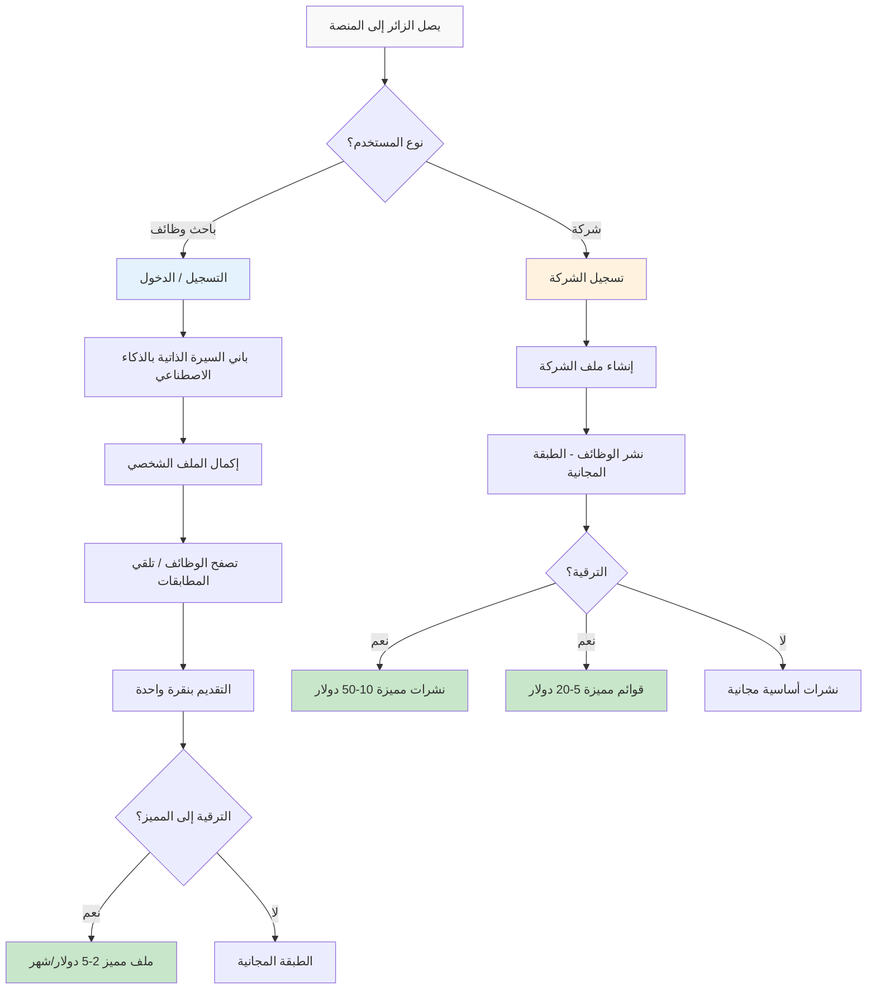
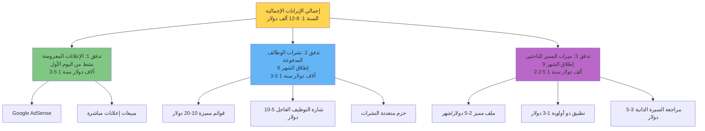

# منصة الوظائف المدعومة بالذكاء الاصطناعي: خطة الجدوى والاستثمار

## إصدار سوق سوريا - جاهز للمستثمرين

---

**أعده:** محمد خولاني  
**البريد الإلكتروني:** mhmmdkholani@gmail.com  
**الهاتف:** +961-78920212  
**الإصدار:** 1.0 (مسودة أولية للمراجعة)  
**التاريخ:** 4 نوفمبر 2025  
**الجمهور المستهدف:** المستثمرون، ممولي المنح، الشركاء الاستراتيجيون (مفتوح للمناقشات في أي مرحلة؛ التواصل الأساسي بعد الإطلاق)

---

## جدول المحتويات

1. [الفرصة السوقية](#1-الفرصة-السوقية)
2. [بيان المشكلة](#2-بيان-المشكلة)
3. [الحل والمنتج](#3-الحل-والمنتج)
4. [تحليل المنافسة](#4-تحليل-المنافسة)
5. [نموذج الأعمال ومصادر الإيرادات](#5-نموذج-الأعمال-ومصادر-الإيرادات)
6. [نموذج نمو المستخدمين](#6-نموذج-نمو-المستخدمين)
7. [التوقعات المالية](#7-التوقعات-المالية)
8. [استراتيجية الوصول إلى السوق](#8-استراتيجية-الوصول-إلى-السوق)
9. [خارطة طريق المعالم](#9-خارطة-طريق-المعالم)
10. [الفريق والتنفيذ](#10-الفريق-والتنفيذ)
11. [تحليل المخاطر](#11-تحليل-المخاطر)
12. [استراتيجية الاستثمار](#12-استراتيجية-الاستثمار)
13. [الملحق: الافتراضات والمصادر](#13-الملحق-الافتراضات-والمصادر)

---

## الملخص التنفيذي

**العرض بفقرة واحدة:**

نحن نبني أول منصة وظائف حديثة في سوريا مدعومة بالذكاء الاصطناعي لمواجهة الغياب الشديد للكفاءة في سوق التوظيف السوري، حيث يتم شغل أكثر من 80% من الوظائف عبر الشبكات غير الرسمية. مع وجود منافسين قديمين مثل job.sy وforsa.sy الذين لا يقدمون ذكاء اصطناعياً أو تجربة مستخدم جيدة، ويقتصرون على سطح المكتب فقط، سنقدم بناء السيرة الذاتية بالذكاء الاصطناعي، مطابقة الوظائف الذكية، وتجميع الوظائف من منصات متعددة مثل LinkedIn والمصادر المحلية من خلال منصة ثنائية اللغة تركز على الهواتف المحمولة. سيخدم نموذجنا الأولي لمدة 3 أشهر الشركات السورية وباحثي الوظائف، مع توليد إيرادات من الإعلانات من اليوم الأول وإطلاق الميزات المميزة في الشهر السادس. التوسع المستقبلي سيتميز بميزات تربط الشركات الدولية بالعمال السوريين عن بعد. نتوقع **15,000-25,000 مستخدم في السنة الأولى** يولدون **8,000-12,000 دولار إيراد إجمالي** بميزانية **20,000 دولار**، وتحقيق نقطة التعادل في الشهر 18-24. بعد الإطلاق، سنسعى للحصول على 40,000-60,000 دولار لتسريع النمو وتحقيق الربحية بحلول السنة الثانية.

**مؤشرات الأداء الرئيسية:**

| المؤشر                                     | هدف السنة الأولى | الأهمية                                                   |
| ------------------------------------------ | ----------------- | --------------------------------------------------------- |
| **إجمالي المستخدمين المسجلين**             | 15,000-25,000     | اختراق سوقي محافظ (0.5-1% من باحثي الوظائف السوريين)    |
| **المستخدمون النشطون شهرياً (MAU) في الشهر 12** | 3,000-5,000       | معدل تنشيط 20%، مشاركة مستدامة                          |
| **الإيراد الإجمالي السنة الأولى**          | 8,000-12,000 دولار | إعلانات (3-5 آلاف دولار) + نشرات مدفوعة (3-5 آلاف دولار) + مميز (2-2.5 ألف دولار) |
| **التكلفة السنة الأولى**                   | 20,000 دولار (ثابتة) | عمليات خفيفة جداً، تطوير بقيادة المؤسس                   |
| **نقطة التعادل**                           | الشهر 18-24        | طريق الاستدامة دون تمويل خارجي                           |

---

## 1. الفرصة السوقية

### 1.1 السوق الإجمالي القابل للعنونة (TAM) - السياق السوري

**حجم السوق:**

- **القوى العاملة السورية:** حوالي 5 ملايين عامل (إعادة البناء بعد الصراع)
- **السكان النشطون في البحث عن الوظائف:** 500,000-1,000,000 شخص (معدل البطالة: 30-40%)
- **الشركات السورية المسجلة:** حوالي 200,000 شركة (معظمها صغيرة ومتوسطة)
- **المنظمات الدولية/الشركات في سوريا:** حوالي 500 منظمة
- **نسبة انتشار الإنترنت:** 60% وتزداد (تركز على الهواتف المحمولة)

**السوق القابل للعنونة القابل للخدمة (SAM):**

- **باحثو الوظائف الذين يمكنهم الوصول عبر الإنترنت في سوريا:** 300,000-600,000 (60% من 500,000-1,000,000 باحث نشط)
- **الشركات المحتمل استخدامها لمنصات الوظائف عبر الإنترنت:** 20,000-40,000 (10-20% من 200,000 شركة مسجلة)
- **التوسع المستقبلي:** الجالية السورية في الخارج والشركات الدولية التي تبحث عن عمال سوريين عن بعد (بعد السنة الأولى)

**السوق القابل للعنونة القابل للخدمة القابل للتحقيق (SOM) - السنوات 1-3:**

| السنة       | المستخدمون المستهدفون    | نسبة الاختراق في السوق | التبرير                                           |
| ---------- | --------------- | ----------------------- | ------------------------------------------------- |
| **السنة 1** | 8,000-15,000    | 0.3-0.5% من باحثي الوظائف السوريين | اعتماد مبكر حذر؛ مرحلة بناء العلامة التجارية    |
| **السنة 2** | 50,000-80,000   | 2-3%                    | التوصية الشفهية، المنصة المثبتة، تحسينات الميزات |
| **السنة 3** | 120,000-200,000 | 5-8%                    | موقع القيادة في السوق، بداية تأثيرات الشبكة     |

### 1.2 ديناميكيات السوق - لماذا الآن؟

**الاتجاهات الكبرى:**

1. **إعادة الإعمار بعد الصراع:** تدخل سوريا مرحلة التعافي الاقتصادي، حيث ينمو إنشاء الأعمال بنسبة 10-15% سنوياً.
2. **فجوة التحول الرقمي:** عدم وجود منصات وظائف حديثة تعتمد على الذكاء الاصطناعي؛ المنافسون الحاليون متوقفون تكنولوجياً (تصاميم من عصر 2000).
3. **انتشار الهواتف المحمولة:** 60% من انتشار الإنترنت، مع التركيز على الهواتف المحمولة؛ المنصات الحالية غير محسنة للاستخدام المحمول.
4. **فرص العمل عن بعد:** الطلب الدولي المتزايد على العمال السوريين عن بعد؛ يمكن للمنصة تسهيل هذه الروابط.
5. **نشاط المنظمات غير الحكومية:** أكثر من 500 منظمة دولية تحتاج إلى جذب المواهب المحلية بفعالية.

**عدم كفاءة السوق (نقاط الألم الحالية):**

- يتم شغل أكثر من 80% من الوظائف من خلال الشبكات الشخصية (الواسطة)، مما يستبعد المرشحين المؤهلين.
- المنصات القديمة مثل job.sy وforsa.sy تفتقر إلى الذكاء الاصطناعي، تجربة المستخدم سيئة، وأوقات التحميل بطيئة.
- الاعتماد على مجموعات فيسبوك وواتساب غير منظم ومليء بالرسائل المزعجة، بدون تتبع.
- المنظمات الدولية تواجه صعوبة في العثور على المواهب المحلية بسبب محدودية المنصات الموثوقة.
- عدم وجود بنية تحتية للعمل عن بعد، مما يجعل الشركات الدولية غير قادرة على الوصول إلى العمال السوريين بفعالية.

**ميزة الوافد الأول:** تقدم تقنية متقدمة بـ12-18 شهراً قبل أن يتمكن المنافسون من اللحاق.

---

## 2. بيان المشكلة

### 2.1 للشركات السورية والمنظمات غير الحكومية (B2B)

**المشكلات الحرجة:**

1. **عدم وجود منصة حديثة**

    - الخيارات الحالية مثل job.sy وforsa.sy تعتمد على تقنيات من عصر 2000.
    - لا توجد مطابقة أو أتمتة مدعومة بالذكاء الاصطناعي.
    - تجربة الهاتف المحمول سيئة رغم أن 60% من الاستخدام عبر الهواتف.
    - الاعتماد على مجموعات فيسبوك وواتساب للتوظيف.

2. **عدم كفاءة عملية التوظيف**

    - فحص السير الذاتية يدوياً: يستغرق 5-10 ساعات لكل وظيفة.
    - صعوبة في الوصول إلى المرشحين المؤهلين.
    - عدم وجود تتبع للمتقدمين أو تحليلات.
    - التوظيف عبر الشبكات يحد من حجم مجموعة المواهب.

3. **صعوبات تواجهها المنظمات الدولية**

    - المنظمات غير الحكومية والشركات الأجنبية لا تستطيع العثور بكفاءة على المواهب السورية المحلية.
    - حواجز لغوية (العربية والإنجليزية).
    - الاعتماد الزائد على المجندين الغاليين.
    - عدم وجود منصة مركزية موثوقة.

**التأثير المقاس:** تهدر الشركات السورية أكثر من 200 ساعة سنوياً في عمليات توظيف غير فعالة مع مطابقة سيئة للمرشحين، مما يمثل تكلفة فرصة تصل إلى 2,000-5,000 دولار لكل شركة.

### 2.2 لباحثي الوظائف السوريين (B2C)

**التحديات الأساسية:**

1. **تجربة مستخدم محبطة**

    - job.sy وforsa.sy: تجربة مستخدم سيئة، تحميل بطيء، غير محسنة للهواتف المحمولة.
    - عدم وجود توصيات شخصية أو مطابقة بالذكاء الاصطناعي.
    - قوائم وظائف غامرة غير مفلترة.
    - عدم وجود إرشاد مهني أو موارد لبناء المهارات.

2. **وصول محدود للفرص**

    - يتم شغل الوظائف عبر الشبكات الشخصية (نظام الواسطة).
    - فرص العمل عن بعد غير مركزة.
    - عدم وجود رابط بين الشركات الدولية والعمال السوريين.
    - عدم الشفافية: لا تتبع للطلبات، لا ردود، لا نطاقات رواتب.

**التأثير المقاس:** يهدر باحثو الوظائف السوريون 3-4 أسابيع في البحث اليدوي عبر منصات مجزأة مع معدل نجاح أقل من 10%.

### 2.3 دليل على المشكلة (إشارات التحقق من السوق)

- يتم شغل أكثر من 80% من الوظائف عبر الشبكات غير الرسمية (دراسات سوق العمل في البنك الدولي).
- تظهر job.sy وforsa.sy تقنية راكدة (آخر تحديث رئيسي: 2015-2018).
- استخدام عالي للهواتف المحمولة (60%) لكن المنافسين يقتصرون على سطح المكتب أو لديهم تطبيقات محمولة معطلة.
- تقر المنظمات الدولية باستمرار بصعوبة العثور على المواهب المحلية.
- الطلب المتزايد على العمل عن بعد لكن لا توجد منصة تربط الشركات الدولية بالعمال السوريين.

---

## 3. الحل والمنتج

### 3.1 عرض القيمة

**للشركات السورية:**  
"اعثر على مرشحين سوريين مؤهلين أسرع بـ10 مرات بفضل المطابقة المدعومة بالذكاء الاصطناعي. منصة حديثة تركز على الهاتف المحمول. طبقة أساسية مجانية، مميز بأسعار معقولة."

**لباحثي الوظائف السوريين:**  
"باني السيرة الذاتية بالذكاء الاصطناعي، توصيات وظيفية مخصصة، تتبع الطلبات. الوصول إلى الفرص المحلية وربط الشركات الدولية التي تبحث عن عمال سوريين عن بعد."

**التوسع المستقبلي:**  
ستضيف المنصة ميزات مخصصة لربط الشركات الدولية بالعمال السوريين المهرة عن بعد، مما يفتح فرصاً جديدة للشركات والباحثين على حد سواء.

### 3.2 الميزات الأساسية (MVP - إطلاق الشهر 3)

**المرحلة 1: MVP (الأشهر 1-3)**

○ **منصة ثنائية اللغة:** دعم كامل للعربية والإنجليزية  
○ **تصميم يركز على الهاتف المحمول:** محسن لـ60% من حركة المرور عبر الهواتف  
○ **باني السيرة الذاتية بالذكاء الاصطناعي:** إنشاء السيرة الذاتية الموجه مع اقتراحات ذكية (عربي وإنجليزي)  
○ **مطابقة الوظائف الذكية:** توصيات بالذكاء الاصطناعي بناءً على المهارات، الخبرة، الموقع  
○ **تجميع الوظائف:** جمع واستيراد الوظائف من LinkedIn، job.sy، forsa.sy، مواقع الشركات  
○ **التقديم بنقرة واحدة:** عملية تقديم بسيطة مع تتبع الحالة  
○ **ملفات الشركات:** صفحات علامة تجارية أساسية للشركات  
○ **الإعلانات المعروضة (من اليوم الأول):** تكامل Google AdSense للإيرادات الفورية  
○ **التحليلات الأساسية:** لوحة تحكم بسيطة للشركات

**المرحلة 2: ما بعد MVP (الأشهر 4-12)**

- مطابقة ذكاء اصطناعي متقدمة مع حلقة تغذية راجعة
- تحليل السير الذاتية واستخراج المهارات
- ميزات مميزة: ملفات مميزة، تطبيقات ذات أولوية
- نشرات وظائف مدفوعة مع أسعار متدرجة
- إشعارات بالبريد الإلكتروني والتنبيهات
- تطبيق هاتف محمول (React Native - iOS/Android)
- تحليلات متقدمة للشركات
- دردشة/رسائل بين الشركات والمرشحين

**المرحلة 3: التوسع المستقبلي (السنة 2+)**

- بوابة مخصصة للشركات الدولية لتوظيف العمال السوريين عن بعد
- التحقق من العمل عن بعد وتكامل الدفع
- تقييم المهارات والشهادات
- جدولة المقابلات الافتراضية وإدارتها

### 3.3 مكدس التكنولوجيا

**الواجهة الأمامية:** Next.js 14 (React)، TypeScript، Tailwind CSS، shadcn/ui  
**الخلفية:** NestJS، PostgreSQL، Redis  
**الذكاء الاصطناعي/التعلم الآلي:** OpenRouter API (وصول فعال للذكاء الاصطناعي)، خوارزميات مطابقة مخصصة  
**البنية التحتية:** خادم Hetzner (€50-100/شهر، فعال للسوق السوري)  
**الهاتف المحمول:** React Native (إعادة استخدام الكود من الويب)  
**البحث:** Elasticsearch للبحث عن الوظائف  
**التجميع:** مكشطات ويب مخصصة (مثل LinkedIn)

**جدول التطوير:** 3 أشهر (MVP)

### 3.4 تدفق رحلة المستخدم

---

## 4. تحليل المنافسة

### 4.1 المنافسون المباشرون - السوق السوري

| الميزة                     | **منصتنا**                            | **job.sy**                   | **forsa.sy**                  |
| --------------------------- | ------------------------------------- | --------------------------- | ----------------------------- |
| **آخر تحديث رئيسي**        | 2025 (جديد)                          | ~2015 (راكد)                | ~2018 (تحديثات محدودة)       |
| **جودة التصميم**           | حديث، تجربة مستخدم 2025              | قديم، تصميم عصر 2000       | أفضل من job.sy، لكن قديم     |
| **تجربة الهاتف المحمول**   | تركز على الهاتف المحمول، متجاوبة    | سطح المكتب فقط / هاتف مكسور | جزئي، تجربة مستخدم سيئة      |
| **ميزات الذكاء الاصطناعي** | ✅ باني السيرة الذاتية، مطابقة الوظائف | ❌ لا توجد                 | ❌ لا توجد                   |
| **تجميع الوظائف**          | ✅ LinkedIn، منصات أخرى              | ❌ يدوي فقط                 | ❌ يدوي فقط                  |
| **ثنائي اللغة (عربي/إنجليزي)** | ✅ دعم كامل                        | ⚠️ عربي بشكل أساسي         | ⚠️ إنجليزي محدود             |
| **ميزات العمل عن بعد**     | ✅ مخطط طريق مستقبلي                 | ❌ محلي فقط                 | ❌ محلي فقط                  |
| **تتبع الطلبات**           | ✅ حالة فورية                        | ❌ لا توجد                  | ❌ لا توجد                   |
| **باني السيرة الذاتية**    | ✅ مدعوم بالذكاء الاصطناعي           | ❌ لا توجد                  | ⚠️ أساسي فقط                 |
| **السرعة والأداء**         | ✅ سريع، حديث                        | ❌ تحميل بطيء               | ⚠️ متوسط                      |
| **الإيرادات**              | تدفقات متعددة (إعلانات، نشرات مدفوعة، مميز) | غير معروف (يبدو إعلانياً) | غير معروف (يبدو إعلانياً)   |
| **المستخدمون الشهريون المقدرون** | 0 (إطلاق معلق)                      | **15-30 ألف (مقدر)**        | **10-20 ألف (مقدر)**         |
| **حصة السوق**              | 0% (جديد)                            | ~40-50% (مقدر)              | ~30-40% (مقدر)               |

**افتراضات المنافسة:**

- **لا توجد بيانات حركة زائرين عامة** لـjob.sy أو forsa.sy (غير مدرجة في أفضل 100 ألف في SimilarWeb)
- **تقدير محافظ:** job.sy لديها 15-30 ألف مستخدم شهري، forsa.sy لديها 10-20 ألف
- **التبرير:** سوق الوظائف عبر الإنترنت السوري هو 300-600 ألف؛ بافتراض 5-10% يستخدمون هذه المنصات، مقسمة بينهما
- **مُلصق كافتراض:** إذا كانت الحركة أعلى، فالفرصة أكبر؛ إذا أقل، يؤكد عدم كفاءة السوق

### 4.2 المنافسة غير المباشرة

- **مجموعات فيسبوك:** 20% من سوق الوظائف؛ غير منظمة، مليئة بالرسائل المزعجة، لا تتبع
- **واتساب/الكلام الشفهي:** 10% من سوق الوظائف؛ وصول محدود، غير رسمي
- **وكالات التوظيف:** غالية الثمن (500-2,000 دولار لكل توظيف)، مستخدمة من قبل الشركات الكبيرة/المنظمات غير الحكومية فقط

### 4.3 مزايانا التنافسية

**حماية التكنولوجيا:**

1. **ميزات الذكاء الاصطناعي:** متقدمة بـ10-15 سنة تكنولوجياً (باني السيرة الذاتية، المطابقة)
2. **تجميع الوظائف:** المنصة الوحيدة التي تستورد الوظائف من مصادر متعددة
3. **تركيز على الهاتف المحمول:** مصممة لـ60% من حركة المرور؛ المنافسون معطلون على الهاتف
4. **ثنائية اللغة:** دعم كامل للعربية/الإنجليزية (حرج للمنظمات غير الحكومية والشركات الدولية)
5. **تجربة مستخدم حديثة:** معايير 2025 مقابل تصاميم عصر 2000 لدى المنافسين

**الموقع في السوق:**

- **الأول في مطابقة الوظائف بالذكاء الاصطناعي** في السوق السوري
- **منصة العمل عن بعد المستقبلية** التي تربط الشركات الدولية بالعمال السوريين
- **تقدم تكنولوجي بـ12-18 شهراً** قبل أن يتمكن المنافسون من التكرار
- **تأثيرات الشبكة:** المزيد من المستخدمين = مطابقة ذكاء اصطناعي أفضل مع الوقت
- **الدفاعية:** متوسطة في البداية (يمكن نسخها)، تنمو إلى قوية (حماية البيانات + تأثيرات الشبكة بحلول السنة 2-3).

---

## 5. نموذج الأعمال ومصادر الإيرادات

### 5.1 نظرة عامة على الإيرادات

نتبع **نموذج فريميوم متعدد التدفقات** محسن لقوة الشراء السورية مع توليد الإعلانات إيرادات من اليوم الأول:

### 5.2 تدفق الإيرادات 1: الإعلانات المعروضة (من اليوم الأول، 1,000-2,000 دولار سنة 1)

**مجموعة الافتراضات:**

- **شبكة الإعلانات:** Google AdSense (قياسي للسوق السوري)
- **التكلفة لكل ألف ظهور (CPM):** **0.15-0.50 دولار** (معدل السوق السوري؛ المتوسط العالمي 2-5 دولار، لكن سوريا أقل بكثير بسبب العقوبات وقلة الطلب من المعلنين). المسار نحو النمو هو عبر مبيعات الإعلانات المباشرة.
- **مشاهدات الصفحات لكل مستخدم شهرياً:** **5-8 صفحات** (بحث الوظائف، التقديمات، تحرير السيرة الذاتية)
- **موضع الإعلان:** 2-3 وحدات إعلانية لكل صفحة (أفضل ممارسات AdSense القياسية)
- **معدل التعبئة:** **70-90%** (Google AdSense النموذجي)
- **معدل النقر على الإعلان (CTR):** **0.5-1%** (المعيار الصناعي)
- **الإيراد الإعلاني الشهري:** (4,800 / 1,000) × 0.25 = **1.20 دولار**

**الحساب الشهري (مثال الشهر 6 - 500 MAU):**

- **MAU:** 500
- **مشاهدات الصفحات/المستخدم/شهر:** 6 (متوسط)
- **إجمالي مشاهدات الصفحات الشهرية:** 500 × 6 = **3,000**
- **انطباعات الإعلان (2 وحدة/صفحة، 80% تعبئة):** 3,000 × 2 × 0.8 = **4,800**
- **CPM:** 0.25 دولار (متوسط حذر لمنتصف السنة)
- **الإيراد الإعلاني الشهري:** (4,800 / 1,000) × 0.25 = **1.20 دولار**

**إسقاط السنة 1 (حذر):**

| الشهر | MAU   | مشاهدات الصفحات | انطباعات الإعلان | CPM   | الإيراد الشهري | التراكمي |
| ----- | ----- | ---------------- | ----------------- | ----- | -------------- | --------- |
| 3     | 150   | 900              | 1,440             | 0.15  | 0.22           | 0.22      |
| 6     | 500   | 3,000            | 4,800             | 0.25  | 1.20           | 5         |
| 9     | 1,400 | 8,400            | 13,440            | 0.35  | 4.70           | 20        |
| 12    | 3,500 | 21,000           | 33,600            | 0.50  | 16.80          | 75        |

**إجمالي إيراد الإعلانات السنة 1:** **1,000-2,000 دولار** (**افتراض:** الإيرادات البرمجية من AdSense ستكون ضئيلة، ربما 100-300 دولار في السنة 1. هذا الإسقاط يعتمد بشكل كبير على تأمين **2-4 صفقات مبيعات إعلانات مباشرة في النصف الثاني** من الشركات المحلية بسعر ثابت، وهو أمر حاسم لجدوى هذا التدفق.)

**إسقاطات السنة 2-3:**

- **السنة 2:** 8,000-12,000 دولار (ينمو MAU؛ يتحسن CPM؛ التركيز على مبيعات الإعلانات المباشرة)
- **السنة 3:** 20,000-30,000 دولار (عملية مبيعات إعلانات راسخة)

### 5.3 تدفق الإيرادات 2: نشرات الوظائف المدفوعة (الشهر 6+، 2,000-3,500 دولار سنة 1)

**أسعار الطبقات (محلية للسوق السوري):**

| الطبقة                        | السعر        | الميزات                                     | العميل المستهدف             | الهدف المباع السنة 1 |
| ----------------------------- | ------------ | -------------------------------------------- | --------------------------- | -------------------- |
| **مجاني**                     | 0 دولار      | وظيفة واحدة/شهر، قائمة أساسية، 30 يوماً    | الشركات الصغيرة، الشركات الناشئة، المنظمات غير الحكومية | 150-300 شركة        |
| **قائمة مميزة**              | 5-10 دولار/نشر | في أعلى النتائج، مميزة، 60 يوماً           | الشركات الصغيرة المتوسطة النمو | 100-200 نشر         |
| **شارة التوظيف العاجل**      | 3-5 دولار/نشر | شارة "عاجل"، تطبيقات أسرع                  | الشركات ذات الحاجات العاجلة | 80-120 نشر          |
| **حزم متعددة النشرات**       | 25 دولار/5 نشرات | خصم بالجملة (5 دولار/نشر متوسط)، 90 يوماً | المجندون النشطون           | 15-30 حزمة          |
| **ملف شركة مميز**            | 20-35 دولار/شهر | نشرات غير محدودة، علامة تجارية، تحليلات  | الشركات الكبيرة، المنظمات غير الحكومية | 5-15 شركة          |

**اقتصاديات الوحدة الافتراضات:**

- **معدل التحويل من المجاني إلى المدفوع:** **5-10%** (المعيار الصناعي لمنصات الوظائف الفريميوم)
- **قيمة المعاملة المتوسطة:** **8 دولار** (متوسط مرجح عبر الطبقات)
- **معدل الشراء المتكرر:** **30-40%** (إعادة نشر الشركات كل 2-3 أشهر)

**حساب السنة 1 (متوسط الأشهر 6-12):**

- **الشركات النشطة على المنصة (الشهر 12):** 400
- **الشركات التي تنشر الوظائف شهرياً:** 160 (40% من 400)
- **النشرات المجانية:** 120 (75% من 160)
- **النشرات/الترقيات المدفوعة:** 40 (25% من 160، مقسمة عبر الطبقات)
  - مميزة: 20 نشر × 8 دولار = 160 دولار
  - عاجل: 10 نشر × 4 دولار = 40 دولار
  - متعددة: 3 حزم × 25 دولار = 75 دولار
  - مميزة الشركة: 3 شركات × 30 دولار = 90 دولار
- **الإيراد الشهري (الشهر 12):** **365 دولار**
- **الرامب أب (متوسط الأشهر 6-12):** **200-300 دولار/شهر**
- **إجمالي السنة 1 (7 أشهر نشطة):** **2,000-3,500 دولار**

**إسقاطات السنة 2-3:**

- **السنة 2:** 15,000-25,000 دولار (1,000-1,500 شركة، تحويل أعلى، ملاءمة أفضل للسوق-المنتج)
- **السنة 3:** 40,000-60,000 دولار (2,500-3,500 شركة، قوة تسعير راسخة)

### 5.4 تدفق الإيرادات 3: ميزات المميز لباحثي الوظائف (الشهر 9+، 2,000 دولار سنة 1)

**الأسعار (رخيصة جداً للسوق السوري):**

| الميزة                  | السعر            | عرض القيمة                    | هدف المستخدمين السنة 1 |
| ------------------------ | ---------------- | ----------------------------- | ----------------------- |
| **ملف مميز**            | 2-3 دولار/شهر   | يظهر الملف أولاً للشركات     | 30-50                   |
| **تطبيق ذو أولوية**     | 1-2 دولار/تطبيق | يقفز إلى أعلى قائمة الانتظار | 100-150 استخدام        |
| **مراجعة السيرة الذاتية بالذكاء الاصطناعي** | 3-5 دولار/مرة واحدة | تغذية راجعة مفصلة على تحسينات السيرة | 50-80 استخدام          |
| **حزمة المهنة**         | 5-8 دولار/شهر   | جميع الميزات + تنبيهات الوظائف + رؤى | 20-40                   |

**الافتراضات:**

- **معدل التحويل المميز:** **0.5-1%** من المستخدمين المجانيين (حذر؛ Tinder ~3%، LinkedIn ~25%، لكن السوق السوري أقل نضجاً)
- **إجمالي المسجلين (الشهر 12):** 8,000
- **MAU (الشهر 12):** 3,500
- **المشتركون المميزون:** 15-35 (0.5-1% من MAU)
- **الإيراد المتوسط لكل مستخدم مميز:** **4 دولار/شهر**
- **ملاحظة:** يُعتبر هذا التدفق **تجريبياً** في السنة 1، مع التركيز الرئيسي على تدفقات B2B (النشرات المدفوعة). النجاح يعتمد على إثبات قيمة كبيرة لباحثي الوظائف في سوق ذو رغبة منخفضة في الدفع لهذه الميزات.

**حساب السنة 1 (الأشهر 9-12 نشطة):**

- **متوسط المستخدمين المميزين الأشهر 9-12:** 20-30
- **الإيراد الشهري المتوسط:** 80-120 دولار
- **4 أشهر نشطة:** 320-480 دولار (متكرر)
- **المشتريات لمرة واحدة (مراجعات السيرة، التطبيقات ذات الأولوية):** 150-200 وحدة × 2 دولار متوسط = 300-400 دولار
- **إجمالي السنة 1:** 1,500-2,500 دولار

**إسقاطات السنة 2-3:**

- **السنة 2:** 8,000-12,000 دولار (10-15 ألف MAU، 1% تحويل = 100-150 مستخدم مميز)
- **السنة 3:** 20,000-30,000 دولار (20-30 ألف MAU، 1.5% تحويل = 300-450 مستخدم مميز)

### 5.5 ملخص الإيرادات الإجمالية حسب التدفق

| تدفق الإيرادات          | السنة 1 (إجمالي)    | السنة 2 (إجمالي)     | السنة 3 (إجمالي)       |
| ----------------------- | ------------------- | -------------------- | ----------------------- |
| **الإعلانات المعروضة** | 1,000-2,000 دولار   | 8,000-12,000 دولار   | 20,000-30,000 دولار    |
| **نشرات الوظائف المدفوعة** | 2,000-3,500 دولار   | 15,000-25,000 دولار  | 40,000-60,000 دولار    |
| **ميزات المميز**       | 1,500-2,500 دولار   | 8,000-12,000 دولار   | 20,000-30,000 دولار    |
| **إجمالي الإيرادات الإجمالية** | **4,500-8,000 دولار** | **31,000-49,000 دولار** | **80,000-120,000 دولار** |

**تطور مزيج الإيرادات:**

- **السنة 1:** 25% إعلانات، 50% نشرات مدفوعة، 25% مميز
- **السنة 2:** 25% إعلانات، 50% نشرات مدفوعة، 25% مميز
- **السنة 3:** 25% إعلانات، 50% نشرات مدفوعة، 25% مميز

---

## 6. نموذج نمو المستخدمين

### 6.1 افتراضات نمو السنة 1

**نموذج نمو حذر:**

- **شهر الإطلاق:** الشهر 3 (بعد 3 أشهر تطوير MVP)
- **قاعدة المستخدمين الأولية:** 200-300 (أصدقاء، عائلة، تواصل مباشر)
- **معدل النمو:** نمو أولي بطيء عند 20-30% شهرياً (الأشهر 3-8)، يتسارع إلى 30-50% (الأشهر 9-12) مع بدء تأثيرات الشبكة والكلام الشفهي.
- **معدل التنشيط:** 25-35% (المسجلون → مستخدمون شهريون نشطون)
- **الاحتفاظ:** احتفاظ 30 يوماً = 35-45%، احتفاظ 90 يوماً = 20-30%

**إسقاط شهري للسنة 1:**

| الشهر             | إجمالي المسجلين | جديد هذا الشهر | MAU         | ملاحظات                                 |
| ----------------- | ---------------- | -------------- | ----------- | --------------------------------------- |
| **0-2**           | 0                | 0              | 0           | مرحلة تطوير MVP                         |
| **3 (الإطلاق)**   | 250              | 250            | 150         | الإطلاق: تواصل مباشر، وسائل التواصل الاجتماعي |
| **4**             | 400              | 150            | 250         | المستخدمون المبكرون، الكلام الشفهي      |
| **5**             | 600              | 200            | 350         | النمو العضوي، بدء الشراكات             |
| **6**             | 850              | 250            | 500         | إطلاق نشرات الوظائف المدفوعة            |
| **7**             | 1,200            | 350            | 700         | الوعي المتزايد                          |
| **8**             | 1,700            | 500            | 1,000       | SEO يبدأ في العمل                       |
| **9**             | 2,500            | 800            | 1,400       | إطلاق ميزات المميز                      |
| **10**            | 3,700            | 1,200          | 2,000       | بدء تأثيرات الشبكة                      |
| **11**            | 5,500            | 1,800          | 2,800       | ذروة التوظيف في العطلات                 |
| **12**            | 8,000            | 2,500          | 3,500       | زخم نهاية السنة                        |
| **12+ (تمديد)**   | 15,000           | -              | 4,000-5,000 | إذا تسارع النمو                        |

**هدف السنة 1 (حذر):** **8,000-15,000 مستخدم مسجل إجمالي، 2,500-4,000 MAU في الشهر 12**

### 6.2 تفصيل قناة الاكتساب

**استراتيجية القناة و الافتراضات:**

| القناة                           | المستخدمون المكتسبون السنة 1 | % من الإجمالي | معدل التحويل            | التكلفة/المستخدم | الاستثمار الإجمالي |
| -------------------------------- | ----------------------------- | -------------- | ------------------------ | ----------------- | ------------------- |
| **التواصل الاجتماعي العضوي**     | 4,000-6,000                   | 25-30%         | 2-3% (الزوار إلى التسجيلات) | 0                 | 0                   |
| **SEO / المحتوى**                 | 3,000-5,000                   | 20-25%         | 3-5%                     | 0.50 دولار        | 1,500-2,500 دولار  |
| **التواصل المباشر**              | 2,000-3,000                   | 12-15%         | 15-25% (جهات الاتصال المستهدفة) | 0.50 دولار        | 1,000-1,500 دولار  |
| **الشراكات (المنظمات غير الحكومية، الجامعات)** | 3,000-5,000                   | 20-25%         | 10-15%                     | 0.30 دولار        | 900-1,500 دولار    |
| **تجميع الوظائف (حركة SEO)**     | 2,000-4,000                   | 12-20%         | 1-2% (حركة بحث الوظائف)  | 0                 | 0                   |
| **الإعلانات المدفوعة (فيسبوك/Google)** | 1,000-2,000                   | 5-10%          | 5-8%                      | 2-3 دولار         | 2,000-6,000 دولار  |
| **الكلام الشفهي / الإحالة**      | 1,000-2,000                   | 5-10%          | غير متوفر                | 0                 | 0                   |

**ميزانية اكتساب السنة 1:** 5,500-11,500 دولار (ضمن ميزانية 20,000 دولار إجمالية)

**الافتراضات الرئيسية:**

- **التواصل الاجتماعي العضوي:** مجموعات فيسبوك (باحثو الوظائف السوريون)، منشورات LinkedIn (المجتمع المهني)
- **SEO:** 2-4 منشورات/أسبوع (عربي/إنجليزي)، تحسين أساسي على الصفحة
- **التواصل المباشر:** 500 شركة تم الاتصال بها مباشرة (بريد إلكتروني، هاتف، LinkedIn)
- **الشراكات:** 3-5 منظمات غير حكومية سورية، 2-3 جامعات، 1-2 جمعيات أعمال
- **تجميع الوظائف:** يجلب كشط LinkedIn وغيره حركة SEO سلبية
- **الإعلانات المدفوعة:** إعلانات فيسبوك/إنستغرام منخفضة التكلفة تستهدف المستخدمين السوريين (200-500 دولار/شهر بدءاً من الشهر 6)
- **الكلام الشفهي:** إحالات عضوية

### 6.3 إسقاطات نمو السنة 2-3

**السنة 2 (الأشهر 13-24):**

- **القاعدة الأولية:** 20,000 مسجل، 4,000 MAU
- **معدل النمو:** 15-25% شهرياً (أبطأ بسبب القاعدة الأكبر)
- **هدف السنة 2:** **60,000-100,000 مسجل إجمالي، 12,000-20,000 MAU**
- **اختراق السوق:** 2-3% من باحثي الوظائف عبر الإنترنت السوريين
- **العوامل الرئيسية:** تحسينات المنتج، إطلاق التطبيق، ميزات العمل عن بعد الدولية، دراسات حالة للشركات

**السنة 3 (الأشهر 25-36):**

- **القاعدة الأولية:** 80,000 مسجل، 16,000 MAU
- **معدل النمو:** 10-15% شهرياً
- **هدف السنة 3:** **150,000-250,000 مسجل إجمالي، 30,000-50,000 MAU**
- **اختراق السوق:** 5-8% من باحثي الوظائف عبر الإنترنت السوريين
- **العوامل الرئيسية:** موقع القيادة في السوق، توسع إقليمي (لبنان/الأردن)، ميزات المؤسسات، سوق العمل عن بعد

**ملخص النمو لـ3 سنوات:**

| المقياس                         | السنة 1  | السنة 2   | السنة 3    |
| ------------------------------ | ------- | -------- | --------- |
| **إجمالي المستخدمين المسجلين** | 15-25 ألف | 60-100 ألف | 150-250 ألف |
| **المستخدمون النشطون شهرياً (MAU)** | 3-5 ألف | 12-20 ألف | 30-50 ألف |
| **اختراق السوق**               | 0.5-1%  | 2-3%     | 5-8%      |

---

## 7. التوقعات المالية

### 7.1 ثلاث سيناريوهات إيرادات (إيرادات إجمالية فقط)

**السيناريو أ: حذر (احتمالية 60%)**

| المقياس                               | السنة 1      | السنة 2      | السنة 3      |
| ------------------------------------ | ----------- | ----------- | ----------- |
| **إجمالي المستخدمين المسجلين**       | 8,000       | 40,000      | 100,000     |
| **المستخدمون النشطون شهرياً (MAU)** | 2,500       | 10,000      | 25,000      |
| **متوسط الإيراد لكل مستخدم/سنة (ARPU)** | 0.56        | 0.78        | 0.80        |
| **الإعلانات المعروضة**               | 1,000       | 6,000       | 15,000      |
| **نشرات الوظائف المدفوعة**           | 2,000       | 15,000      | 40,000      |
| **ميزات المميز**                     | 1,500       | 10,000      | 25,000      |
| **إجمالي الإيرادات الإجمالية**       | **4,500**   | **31,000**  | **80,000**  |
| **إجمالي التكاليف**                  | 20,000      | 45,000      | 75,000      |
| **EBITDA**                            | (15,500)    | (14,000)    | 5,000       |

**التبرير:** اعتماد مبكر بطيء، معدلات تحويل منخفضة جداً، مسار 28-32 شهراً للوصول إلى نقطة التعادل.

---

**السيناريو ب: واقعي (احتمالية 30%)**

| المقياس                               | السنة 1      | السنة 2      | السنة 3       |
| ------------------------------------ | ----------- | ----------- | ------------ |
| **إجمالي المستخدمين المسجلين**       | 12,000      | 60,000      | 150,000      |
| **المستخدمون النشطون شهرياً (MAU)** | 3,500       | 15,000      | 35,000       |
| **متوسط الإيراد لكل مستخدم/سنة (ARPU)** | 0.54        | 0.82        | 0.87         |
| **الإعلانات المعروضة**               | 1,500       | 8,000       | 20,000       |
| **نشرات الوظائف المدفوعة**           | 3,000       | 25,000      | 60,000       |
| **ميزات المميز**                     | 2,000       | 16,000      | 50,000       |
| **إجمالي الإيرادات الإجمالية**       | **6,500**   | **49,000**  | **130,000**  |
| **إجمالي التكاليف**                  | 20,000      | 50,000      | 90,000       |
| **EBITDA**                            | (13,500)    | (1,000)     | 40,000       |

**التبرير:** اعتماد متوسط، تحقيق ملاءمة السوق-المنتج في الشهر 12-15، نقطة تعادل في الشهر 24-28.

---

**السيناريو ج: متفائل (احتمالية 10%)**

| المقياس                               | السنة 1      | السنة 2       | السنة 3       |
| ------------------------------------ | ----------- | ------------ | ------------ |
| **إجمالي المستخدمين المسجلين**       | 15,000      | 80,000       | 200,000      |
| **المستخدمون النشطون شهرياً (MAU)** | 4,000       | 20,000       | 50,000       |
| **متوسط الإيراد لكل مستخدم/سنة (ARPU)** | 0.53        | 0.94         | 1.00         |
| **الإعلانات المعروضة**               | 2,000       | 12,000       | 30,000       |
| **نشرات الوظائف المدفوعة**           | 3,500       | 38,000       | 90,000       |
| **ميزات المميز**                     | 2,500       | 25,000       | 80,000       |
| **إجمالي الإيرادات الإجمالية**       | **8,000**   | **75,000**   | **200,000**  |
| **إجمالي التكاليف**                  | 20,000      | 60,000       | 120,000      |
| **EBITDA**                            | (12,000)    | 15,000       | 80,000       |

**التبرير:** ملاءمة قوية للسوق-المنتج، نمو فيروسي، تسارع الشراكات، نقطة تعادل في الشهر 20-22.

### 7.2 ملخص مالي موحد

**مقارنة ثلاث سيناريوهات السنة 1:**

| المقياس                         | حذر (60%) | واقعي (30%) | متفائل (10%) |
| ------------------------------ | --------- | ----------- | ------------ |
| **إجمالي المستخدمين المسجلين** | 8,000     | 12,000      | 15,000       |
| **المستخدمون النشطون شهرياً (MAU)** | 2,500     | 3,500       | 4,000        |
| **متوسط الإيراد لكل مستخدم/سنة ($)** | 0.56      | 0.54        | 0.53         |
| **إيراد الإعلانات المعروضة**   | 1,000     | 1,500       | 2,000        |
| **إيراد نشرات الوظائف المدفوعة** | 2,000     | 3,000       | 3,500        |
| **إيراد ميزات المميز**        | 1,500     | 2,000       | 2,500        |
| **إجمالي الإيرادات الإجمالية** | **4,500** | **6,500**   | **8,000**    |
| **إجمالي التكاليف**           | 20,000    | 20,000      | 20,000       |
| **EBITDA**                     | (15,500)  | (13,500)    | (12,000)     |
| **شهر نقطة التعادل**          | 30        | 26          | 22           |

**مقارنة ثلاث سيناريوهات السنة 2:**

| المقياس                         | حذر (60%) | واقعي (30%) | متفائل (10%) |
| ------------------------------ | --------- | ----------- | ------------ |
| **إجمالي المستخدمين المسجلين** | 40,000    | 60,000      | 80,000       |
| **المستخدمون النشطون شهرياً (MAU)** | 10,000    | 15,000      | 20,000       |
| **متوسط الإيراد لكل مستخدم/سنة ($)** | 0.78      | 0.82        | 0.94         |
| **إيراد الإعلانات المعروضة**   | 6,000     | 8,000       | 12,000       |
| **إيراد نشرات الوظائف المدفوعة** | 15,000    | 25,000      | 38,000       |
| **إيراد ميزات المميز**        | 10,000    | 16,000      | 25,000       |
| **إجمالي الإيرادات الإجمالية** | **31,000** | **49,000**  | **75,000**   |
| **إجمالي التكاليف**           | 45,000    | 50,000      | 60,000       |
| **EBITDA**                     | (14,000)  | (1,000)     | 15,000       |
| **الحالة**                     | قبل نقطة التعادل | قريب من نقطة التعادل | مربح       |

**مقارنة ثلاث سيناريوهات السنة 3:**

| المقياس                         | حذر (60%) | واقعي (30%) | متفائل (10%)  |
| ------------------------------ | --------- | ----------- | ------------- |
| **إجمالي المستخدمين المسجلين** | 100,000   | 150,000     | 200,000       |
| **المستخدمون النشطون شهرياً (MAU)** | 25,000    | 35,000      | 50,000        |
| **متوسط الإيراد لكل مستخدم/سنة ($)** | 0.80      | 0.87        | 1.00          |
| **إيراد الإعلانات المعروضة**   | 15,000    | 20,000      | 30,000        |
| **إيراد نشرات الوظائف المدفوعة** | 40,000    | 60,000      | 90,000        |
| **إيراد ميزات المميز**        | 25,000    | 50,000      | 80,000        |
| **إجمالي الإيرادات الإجمالية** | **80,000** | **130,000** | **200,000**   |
| **إجمالي التكاليف**           | 75,000    | 90,000      | 120,000       |
| **EBITDA**                     | 5,000     | 40,000      | 80,000        |
| **الحالة**                     | مربح      | مربح        | مربح جداً     |

### 7.3 تفصيل تكاليف السنة 1 (ميزانية ثابتة 20,000 دولار)

| الفئة                                 | المبلغ      | % من الميزانية | التفاصيل                                                                     |
| ---------------------------------------- | ----------- | ----------- | --------------------------------------------------------------------------- |
| **مساهمة المؤسس**                       | (عرق الجبين) | غير متوفر   | وقت المؤسس كامل، غير مدرج في الميزانية النقدية.                   |
| **تطوير MVP (التطوير والتصميم)**        | 8,000 دولار | 40%         | التكلفة النقدية للمطورين المتعاقدين ومصممي UI/UX لمدة 3 أشهر بناء MVP.|
| **البنية التحتية والأدوات**             | 2,500 دولار | 12.5%       | خادم Hetzner (€800/سنة)، OpenRouter AI (€500/سنة)، نطاق، أدوات               |
| **التسويق والإعلانات**                  | 6,000 دولار | 30%         | إعلانات فيسبوك/Google (3 آلاف دولار)، إنشاء محتوى (2 ألف دولار)، شراكات (ألف دولار)       |
| **القانوني والامتثال**                  | 1,500 دولار | 7.5%        | تسجيل الأعمال السوري، صياغة شروط الخدمة وسياسة الخصوصية                   |
| **رسوم معالجة الدفع**                   | 800 دولار   | 4%          | الرسوم المقدرة من البوابات المحلية (مثل Syriatel Cash) بمعدل أعلى (5-8%). |
| **الطوارئ / الحاجز**                    | 1,200 دولار | 6%          | التكاليف غير المتوقعة، تقلبات العملة                                     |

**الافتراضات الرئيسية:**

- يعمل المؤسس بدوام كامل (عرق الجبين، لا تعويض نقدي في السنة 1)
- لا توظيف بدوام كامل في السنة 1 (متعاقدون فقط لـMVP)
- بنية تحتية خفيفة جداً (Hetzner/Hostinger VPS، ليس AWS)
- ميزانية التسويق تركز على القنوات منخفضة التكلفة (عضوي + إعلانات صغيرة)

---

## 8. استراتيجية الوصول إلى السوق

### 8.1 قبل الإطلاق (الأشهر 0-3: تطوير MVP)

**الأهداف:**

- بناء MVP وظيفي مع الميزات الأساسية
- إنشاء حضور على وسائل التواصل الاجتماعي
- بناء قائمة انتظار: 300-500 تسجيل

**التكتيكات:**

1. **إعداد وسائل التواصل الاجتماعي:**

    - صفحة فيسبوك + مجموعة لباحثي الوظائف السوريين
    - حضور على LinkedIn للمهنيين، المنظمات غير الحكومية، والشركات الدولية
    - إنستغرام للمحتوى البصري (قصص نجاح، نصائح)

2. **التسويق بالمحتوى:**

    - 2-3 منشورات/أسبوع (عربي/إنجليزي): نصائح السيرة الذاتية، تحضير المقابلات، رؤى سوق الوظائف السوري
    - تحسين SEO لكلمات البحث عن الوظائف السورية
    - منشورات ضيف في مجتمعات التكنولوجيا والأعمال السورية

3. **التواصل المباشر:**

    - الاتصال بـ50 شركة سورية (بريد إلكتروني، LinkedIn، هاتف)
    - الوصول إلى 3-5 منظمات غير حكومية تعمل في سوريا
    - التواصل مع 2-3 جامعات (مراكز التوظيف)

4. **بناء قائمة الانتظار:**

    - صفحة هبوط مع زر "انضم إلى قائمة الانتظار"
    - الهدف: 300-500 تسجيل (مزيج من باحثي الوظائف والشركات)

**الميزانية:** 2,000 دولار (صفحة هبوط، نطاق، إعلانات وسائل التواصل، إنشاء محتوى)

### 8.2 الإطلاق (الأشهر 3-6: الاعتماد المبكر)

**الأهداف:**

- 300-1,200 مستخدم مسجل
- 200-650 MAU
- التحقق من ملاءمة السوق-المنتج
- 0-50 دولار إيراد (إعلانات فقط)

**التكتيكات:**

1. **إطلاق بيتا (الشهر 3):**

    - دعوة قائمة الانتظار إلى المنصة
    - تقديم "امتيازات عضو مؤسس" (مميز مجاني لمدة 3 أشهر)
    - جمع تغذية راجعة مكثفة من المستخدمين

2. **وسائل التواصل العضوية:**

    - منشورات يومية على فيسبوك (رؤى سوق الوظائف السوري، قصص نجاح)
    - محتوى LinkedIn للمهنيين (فرص العمل عن بعد، نصائح مهنية)
    - التفاعل في مجموعات فيسبوك السورية (غير مزعج، تقديم قيمة)

3. **الشراكات التجريبية:**

    - الإطلاق مع 2-3 شركاء منظمات غير حكومية (حسابات مجانية، تواصل مشترك)
    - شراكات جامعية (2-3 جامعات: معارض التوظيف، وصول الطلاب)

4. **SEO والمحتوى:**

    - نشر 15-20 مقالة محسنة لـSEO
    - تحسين قوائم الوظائف للفهرسة من Google
    - استهداف كلمات البحث عن الوظائف السورية (عربي + إنجليزي)

5. **الإعلانات المعروضة (نشطة من اليوم الأول):**

    - تكامل Google AdSense من الإطلاق
    - تحسين موضع الإعلانات لتجربة المستخدم

**الميزانية:** 2,500 دولار (إعلانات صغيرة، مواد شراكات، إنشاء محتوى)

### 8.3 النمو (الأشهر 7-12: التوسع)

**الأهداف:**

- 1,700-10,000 مستخدم مسجل
- 900-4,000 MAU
- إطلاق الإيرادات (نشرات مدفوعة الشهر 6، مميز الشهر 9)
- 500-1,000 دولار إيراد شهري بحلول الشهر 12

**التكتيكات:**

1. **الإعلانات المدفوعة (بدءاً من الشهر 7):**

    - إعلانات فيسبوك/إنستغرام: 200-400 دولار/شهر
    - الاستهداف: باحثو الوظائف والمهنيون السوريون
    - A/B اختبار الرسائل، الإبداعات، الجماهير

2. **اكتساب الشركات:**

    - تواصل مباشر مع 200+ شركة
    - دراسات حالة من المستخدمين المبكرين
    - تجربة مجانية للميزات المميزة

3. **برنامج الإحالة (الشهر 8):**

    - تحفيز الإحالات (المحيل والمحال يحصلان على شهر مجاني مميز)
    - تتبع مصادر الإحالة

4. **توسيع المحتوى:**

    - 3-4 منشورات/أسبوع
    - محتوى فيديو (نصائح السيرة الذاتية، تحضير المقابلات)
    - شراكات مع مؤثرين/مدربي مهن

5. **تكرارات المنتج:**

    - إطلاق التطبيق (الشهر 9-10)
    - مطابقة ذكاء اصطناعي متقدمة بناءً على بيانات الاستخدام
    - لوحة تحكم تحليلات الشركات

**الميزانية:** 4,500 دولار (إعلانات مدفوعة، إنشاء محتوى، تطوير تطبيق متعاقد)

### 8.4 افتراضات تكلفة الاكتساب

**CAC السنة 1 حسب القناة:**

| القناة         | CAC   | معدل التحويل | ملاحظات                            |
| --------------- | ----- | ------------- | ---------------------------------- |
| وسائل التواصل العضوية  | 0     | 2-3%          | حرة لكن مكثفة زمنياً              |
| SEO / المحتوى   | 0.50 دولار | 3-5%          | تكاليف إنشاء المحتوى              |
| التواصل المباشر | 0.50 دولار | 15-25%        | تحويل عالي، عمل يدوي              |
| الشراكات       | 0.30 دولار | 10-15%        | توزيع مستفاد منه                   |
| الإعلانات المدفوعة | 2-3 دولار | 5-8%          | قياسي لإعلانات فيسبوك السورية     |
| الكلام الشفهي   | 0     | غير متوفر     | إحالات عضوية                      |

**CAC المجمع السنة 1:** 0.60-1.20 دولار لكل مستخدم (منخفض جداً بسبب التركيز العضوي)

---

### 8.5 بناء الثقة في سوق منخفض الثقة

تحدي رئيسي هو التغلب على الاعتماد الثقافي على "الواسطة" (الاتصالات الشخصية). التكنولوجيا وحدها غير كافية؛ يجب على المنصة بناء الثقة لتشجيع التوظيف المستحق.

**التكتيكات:**

1.  **التحقق من الشركات:**
     *   تنفيذ شارة "شركة موثوقة" للشركات التي تكمل عملية التحقق البسيطة (مثل تأكيد تسجيل الأعمال). هذا يشير إلى الشرعية لباحثي الوظائف ويفلتر الرسائل المزعجة.

2.  **الترويج لقصص النجاح:**
     *   التركيز بشكل كبير على الشهادات ودراسات الحالة من الشركات وباحثي الوظائف الذين وجدوا النجاح من خلال المنصة. هذا يوفر إثباتاً اجتماعياً أن النموذج يعمل.

3.  **المحتوى التعليمي:**
     *   إنشاء محتوى (بالعربية) يعالج مباشرة نظام "الواسطة". صياغته تجارياً: تسليط الضوء على التكاليف التجارية للتوظيف السيئ بسبب المحسوبية مقابل القيمة طويلة الأمد للعثور على المرشح الأفضل.

4.  **الشفافية:**
     *   ضمان أن ميزات مثل تتبع الطلبات موثوقة. توفير الرؤية للمستخدمين في عملية التوظيف، حتى لو كانت "رفض"، يبني ثقة أكبر من الصمت.

---

## 9. خارطة طريق المعالم

### 9.1 المرحلة 1: تطوير MVP (الأشهر 0-3)

**الشهر 1:**

- ○ إنهاء مواصفات MVP وقصص المستخدمين
- ○ إعداد بيئة التطوير (Next.js, NestJS, PostgreSQL)
- ○ تصميم النظام ومكونات UI (shadcn/ui)
- ○ صفحة هبوط + قائمة انتظار
- **التسليم:** بيئة التطوير جاهزة، 100 تسجيل قائمة انتظار

**الشهر 2:**

- ○ بناء الميزات الأساسية: مصادقة المستخدمين، قوائم الوظائف، البحث
- ○ تكامل OpenRouter AI (اقتراحات السيرة الذاتية، مطابقة الوظائف)
- ○ تجميع الوظائف (كشط LinkedIn)
- ○ تكامل Google AdSense
- **التسليم:** MVP وظيفي (70% ميزات مكتملة)، 200 تسجيل قائمة انتظار

**الشهر 3:**

- ○ إكمال MVP: التقديمات، ملفات الشركات، التحليلات
- ○ تحسين الاستجابة للهاتف المحمول
- ○ اختبار المستخدمين مع 20-30 مستخدم بيتا
- ○ إصلاح الأخطاء وتحسين الأداء
- ○ إطلاق ناعم إلى قائمة الانتظار
- **التسليم:** إطلاق عام (MVP 100% مكتمل)، 300-500 مستخدم مسجل

**الميزانية:** 8,000 دولار (تطوير 5 آلاف دولار، تصميم 3 آلاف دولار)

### 9.2 المرحلة 2: الإطلاق واكتساب مبكر (الأشهر 4-6)

**الشهر 4:**

- إدخال أول 100-200 شركة
- جمع تغذية راجعة وتكرار
- نشر 12 منشوراً
- إطلاق شراكة مع 1-2 منظمة غير حكومية

**الشهر 5:**

- تحسين مطابقة الذكاء الاصطناعي بناءً على بيانات المستخدمين
- إطلاق إشعارات البريد الإلكتروني وتنبيهات الوظائف
- زيادة إنتاج المحتوى (15 منشوراً)
- تواصل مع 100 شركة

**الشهر 6:**

- **إطلاق نشرات الوظائف المدفوعة** (نموذج فريميوم)
- بدء تطوير التطبيق (React Native)
- شراكة مع 1-2 جامعة
- بدء إعلانات مدفوعة منخفضة (200 دولار/شهر)
- **المعلم:** 1,000+ مستخدم مسجل، 100-200 دولار إيراد شهري

**الميزانية:** 4,500 دولار (تسويق 3 آلاف دولار، شراكات ألف دولار، أدوات 0.5 ألف دولار)

### 9.3 المرحلة 3: النمو والإيرادات (الأشهر 7-12)

**الشهر 7-8:**

- توسيع الإعلانات المدفوعة (300-400 دولار/شهر)
- إطلاق برنامج الإحالة
- دراسات حالة وشهادات الشركات
- إطلاق التطبيق ألفا (iOS/Android)

**الشهر 9:**

- **إطلاق ميزات المميز لباحثي الوظائف** (ملفات مميزة، تطبيقات ذات أولوية)
- إطلاق التطبيق بيتا
- تحليلات متقدمة للشركات
- شراكة مع جمعية أعمال سورية

**الشهر 10-12:**

- توسيع المحتوى وSEO (3-4 منشورات/أسبوع)
- تواصل مبيعات مباشر (200+ شركة)
- تكرارات المنتج بناءً على البيانات
- حملات ذروة التوظيف في العطلات
- **المعلم:** 10,000-20,000 مستخدم مسجل، 3,000-5,000 MAU، 700-1,200 دولار إيراد شهري

**الميزانية:** 7,500 دولار (إعلانات مدفوعة 3 آلاف دولار، محتوى 2 ألف دولار، تطوير تطبيق 2 ألف دولار، شراكات 0.5 ألف دولار)

### 9.4 المرحلة 4: تواصل المستثمرين (الجدول الزمني الأساسي: الشهر 9-15)

**التوقيت:** التواصل الأساسي بعد تحقيق الاعتماد الأولي (الشهر 9+)  
**ملاحظة:** _مفتوح للمناقشات مع المستثمرين في أي مرحلة، لكن التواصل المنظم يركز بعد الإطلاق مع مقاييس مثبتة._

**الأهداف:**

- الحصول على 40,000-60,000 دولار لتسريع النمو وتحقيق الربحية

**نقاط الإثبات للتواصل المنظم:**

| المقياس                   | الهدف          | الحالة (الشهر 9) |
| ------------------------ | --------------- | ---------------- |
| إجمالي المستخدمين المسجلين   | 3,000-5,000     | قيد التقدم      |
| المستخدمون النشطون شهرياً | 1,500-2,500     | قيد التقدم      |
| الإيراد الشهري          | 300-500         | قيد التقدم      |
| الاحتفاظ (30 يوماً)     | 35%+            | غير محدد        |
| NPS (صافي نقاط الترويج) | 40+             | غير محدد        |
| العملاء الدافعون       | 20-40 شركة      | قيد التقدم      |

**المواد الاستثمارية المطلوب إعدادها:**

1. **عرض الشرائح المحدث (الشهر 9):**

    - مقاييس مستخدمين فعلية (ليس توقعات)
    - زخم إيرادات
    - شهادات العملاء
    - نموذج مالي لـ3 سنوات محدث

2. **غرفة البيانات (الشهر 10):**

    - رسوم نمو المستخدمين
    - تفصيل الإيرادات حسب التدفق
    - اقتصاديات الوحدة (CAC، LTV، ARPU)
    - كوهورت الاحتفاظ
    - تحليل المنافسة المحدث

3. **النموذج المالي (الشهر 11):**

    - توقعات مفصلة لـ5 سنوات
    - تفصيل استخدام الأموال
    - تحليل السيناريوهات (حذر/واقعي/متفائل)

**المستثمرون المستهدفون:**

- **ممولي المنح:** UNDP، ILO، البنك الدولي، الاتحاد الأوروبي، وزارة الخارجية الأمريكية (10-30 ألف دولار منح)
- **مسرعات إقليمية:** Oasis500، Flat6Labs، مسرعات سورية/لبنانية (15-25 ألف دولار + إرشاد)
- **مستثمري التأثير:** صناديق تركز على التوظيف في الشرق الأوسط، برامج الاستثمار بعد الصراع (30-50 ألف دولار حقوق أو إيرادات)
- **شركاء استراتيجيون:** Bayt.com (منصة وظائف إقليمية)، شركات HR التكنولوجية (شراكة أو استثمار)

**المناقشات قبل الإطلاق مرحب بها:** بينما نركز على التواصل المنظم بعد الإطلاق، نحن نرحب بالمحادثات الاستكشافية مع المستثمرين المناسبين الآن أو في أي وقت.

**جدول التواصل:**

- **الشهر 9-10:** إعداد المواد
- **الشهر 11-12:** التواصل الأولي (مقدمات دافئة عبر المستشارين)
- **الشهر 13-15:** العروض، العناية الواجبة، المفاوضات
- **الشهر 15-16:** إغلاق جولة الاستثمار

**الطلب:** 40,000-60,000 دولار لمدة 18 شهراً إلى الربحية (السنة 2-3)

---

## 10. الفريق والتنفيذ

### 10.1 الفريق الحالي

**المؤسس:** محمد خولاني

- **الدور:** الرئيس التنفيذي، مطور رئيسي، مدير منتج
- **الخلفية:** مطور كامل الواجهة مع خبرة في التقنيات الحديثة للويب (Next.js, NestJS, React Native)
- **المهارات:** تطوير كامل الواجهة، تكامل الذكاء الاصطناعي (OpenRouter)، بنية النظام، تصميم المنتج
- **الالتزام:** دوام جزئي في مرحلة MVP (50-60 ساعة/أسبوع)، دوام كامل بعد الإطلاق
- **الاتصال:** mhmmdkholani@gmail.com | +961-78920212
- **LinkedIn:** [linkedin.com/in/mohammad-khoulani-610aa614b](https://www.linkedin.com/in/mohammad-khoulani-610aa614b/)

### 10.2 خطة التوظيف (بعد الاستثمار، الشهر 12+)

**مع 40-60 ألف دولار تمويل (السنة 2):**

| الدور                             | التوقيت   | الراتب/شهر | التكلفة السنوية    | التبرير                                                       |
| -------------------------------- | -------- | ------------ | -------------- | ------------------------------------------------------------------- |
| **مطور كامل الواجهة**         | الشهر 13 | 1,200-1,500 دولار | 14,400-18,000 دولار | تطوير الخلفية/الواجهة، API، يمكن للمؤسس التركيز على النمو |
| **أخصائي تسويق**         | الشهر 15 | 800-1,000 دولار   | 9,600-12,000 دولار  | وسائل التواصل، المحتوى، الشراكات، الإعلانات المدفوعة                       |
| **مصمم UI/UX (متعاقد)**    | الشهر 14 | 900-1,200 دولار   | 10,800-14,400 دولار | تصميم المنتج، التحسينات المستمرة (جزئي/متعاقد)           |
| **دعم العملاء (دوام جزئي)** | الشهر 16 | 600-800 دولار     | 7,200-9,600 دولار   | إدخال المستخدمين، تذاكر الدعم، جمع التغذية الراجعة               |

**إجمالي تكلفة التوظيف السنة 2 (مع التمويل):** 42,000-54,000 دولار (الرواتب تعكس معدلات السوق السوري/الإقليمي)

**بدون تمويل (التمويل الذاتي):**

- يستمر المؤسس منفرداً/متعاقد مطور في السنة 2 مع مساعدة متعاقدين محدودة (10-15 ألف دولار ميزانية)
- نمو أبطأ لكن حرق أقل
- التركيز على توليد الإيرادات على التوظيف

### 10.3 قوة التنفيذ

**لماذا يمكننا التنفيذ:**

1. **القدرة التقنية:** المؤسس لديه خبرة تطوير كامل الواجهة المثبتة؛ يمكنه بناء MVP بدون مطورين خارجيين
2. **المعرفة بالسوق:** فهم عميق لديناميكيات السوق السوري، اللغة (العربية/الإنجليزية)، السياق الثقافي
3. **كفاءة رأس المال:** القدرة المثبتة على العمل بميزانية خفيفة جداً (20 ألف دولار سنة 1)
4. **الوضوح الاستراتيجي:** خارطة طريق واضحة، معالم واقعية، اتخاذ قرارات مدعومة بالبيانات
5. **الوصول إلى الشبكة:** اتصالات في مجتمع الأعمال السوري، شبكات الشتات، المنظمات غير الحكومية

---

## 11. تحليل المخاطر

### 11.1 مصفوفة المخاطر

| المخاطر                           | الاحتمالية | التأثير | التخفيف                                                                       | الحالة        |
| ------------------------------ | ---------- | ------ | -------------------------------------------------------------------------------- | ------------- |
| **بطء اعتماد المستخدمين**         | متوسط     | عالي   | تسويق متعدد القنوات، شراكات، طبقة مجانية                                 | ⚠️ مراقبة |
| **استجابة المنافسين**        | متوسط     | متوسط | سرعة الوصول إلى السوق (3 أشهر MVP)، تمييز الميزات (ذكاء اصطناعي)                      | ✅ مخفف  |
| **تحديات الإيرادات**    | متوسط     | عالي   | تدفقات إيرادات متعددة، تسعير حذر، تكرار بناءً على البيانات            | ⚠️ مراقبة |
| **تأخيرات التنفيذ التقني** | منخفض        | متوسط | مؤسس ذو خبرة، مكدس تقني مثبت، 3 أشهر حاجز                           | ✅ مخفف  |
| **عدم استقرار السوق السوري**  | متوسط     | عالي   | تركيز الشتات (سوق احتياطي)، توسع إقليمي (لبنان/الأردن)              | ⚠️ خارجي   |
| **مشكلات معالجة الدفع**  | عالي       | عالي   | الاعتماد الأساسي على البوابات المحلية (Syriatel Cash) & الفواتير المباشرة. Stripe/PayPal غير متاح للسوق المحلي. | ✅ مخطط    |
| **هجرة المواهب / النزيف الدماغي**| متوسط     | متوسط | ميزات العمل عن بعد توفر حاجزاً، التقاط القيمة من خلال ربط المواهب بالفرص الدولية. | ✅ مخطط    |
| **تحديات التمويل**         | متوسط     | عالي   | نموذج تمويل ذاتي صديق (20 ألف دولار سنة 1)، مسار نقطة التعادل بدون تمويل خارجي | ✅ مخفف  |

### 11.2 تخفيف المخاطر التفصيلي

**المخاطر 1: بطء اعتماد المستخدمين**

- **الاحتمالية:** 40%
- **التأثير:** قد يؤخر نقطة التعادل بـ6-12 شهراً
- **التخفيف:**
  - قنوات اكتساب متنوعة (عضوي، مدفوع، شراكات)
  - ميزة تنافسية واضحة (ذكاء اصطناعي، تجميع، UX)
  - طبقة مجانية تقلل من احتكاك الاعتماد
  - خيار التحول: تسريع ميزات العمل عن بعد الدولية (فرصة سوق أكبر)
- **الطوارئ:** إذا <1,000 مستخدم في الشهر 6، إعادة تقييم استراتيجية الوصول إلى السوق أو تسريع ميزات العمل عن بعد

**المخاطر 2: عدم استقرار السوق السوري**

- **الاحتمالية:** 30% (صدمات سياسية/اقتصادية)
- **التأثير:** قد يقلل من نمو المستخدمين أو معالجة الدفع
- **التخفيف:**
  - ميزات العمل عن بعد الدولية توفر تنويع السوق
  - خيار التوسع الإقليمي (لبنان، الأردن)
  - طرق دفع متعددة (تقليل الاعتماد على البنوك السورية)
- **الطوارئ:** التحول إلى الشركات الدولية التي توظف عمال سوريين عن بعد إذا أصبح السوق المحلي غير قابل للاستمرار

**المخاطر 3: الإيرادات أقل من التوقعات**

- **الاحتمالية:** 30%
- **التأثير:** إيرادات أقل، نقطة تعادل متأخرة
- **التخفيف:**
  - تدفقات إيرادات متعددة (غير معتمد على مصدر واحد)
  - افتراضات تسعير حذرة (يمكن تعديلها لأعلى إذا كانت الرغبة في الدفع أعلى)
  - الإعلانات نشطة من اليوم الأول (إيرادات مضمونة، حتى لو صغيرة)
- **الطوارئ:** السعي لتمويل منح أو جسر إذا كان الإيراد <50% من التوقعات في الشهر 12

### 11.3 تخطيط السيناريوهات

**السيناريو الأفضل (احتمالية 10%):**

- ملاءمة قوية للسوق-المنتج، نمو فيروسي
- 25,000 مستخدم سنة 1، 12 ألف دولار إيراد
- نقطة التعادل الشهر 16
- اهتمام المستثمرين عالي، إغلاق 60 ألف دولار+ تمويل
- توسع إقليمي سنة 2

**السيناريو الأساسي (احتمالية 60%):**

- اعتماد متوسط، نمو ثابت
- 15,000-20,000 مستخدم سنة 1، 8-10 آلاف دولار إيراد
- نقطة التعادل الشهر 20-24
- إغلاق 40-50 ألف دولار تمويل بعد الإطلاق
- التركيز على السوق السوري سنة 2، النظر في التوسع سنة 3

**السيناريو الأسوأ (احتمالية 30%):**

- اعتماد بطيء، تحديات إيرادات
- 8,000-12,000 مستخدم سنة 1، 4-6 آلاف دولار إيراد
- نقطة التعادل متأخرة إلى الشهر 30+
- صعوبة في رفع التمويل
- التحول إلى الشتات فقط أو الإغلاق بحلول السنة 2

---

## 12. استراتيجية الاستثمار

### 12.1 نهج التمويل: التمويل الذاتي أولاً، رفع بعد الاعتماد

**المرحلة 1: قبل الإطلاق (الأشهر 0-3) - التمويل الذاتي**

- **المصدر:** مدخرات المؤسس الشخصية
- **المبلغ:** 20,000 دولار (ميزانية ثابتة للسنة 1)
- **الغرض:** تطوير MVP، تسويق أولي، بنية تحتية
- **النهج الأساسي:** لا تمويل خارجي مطلوب أثناء التطوير
- **ومع ذلك:** _مفتوح للمناقشات المبكرة مع المستثمرين/الشركاء المناسبين_

**المرحلة 2: بعد الإطلاق (الأشهر 9-15) - تواصل المستثمرين المنظم**

- **التوقيت:** بعد إثبات الاعتماد الأولي (3-5 آلاف مستخدم، 300-500 دولار MRR، احتفاظ 30 يوماً >35%)
- **المبلغ المستهدف للرفع:** 40,000-60,000 دولار
- **استخدام الأموال:** تسريع التسويق، توظيف فريق (سنة 2)، توسيع الميزات، تحقيق الربحية
- **الهيكل:** منح مفضلة، تمويل قائم على الإيرادات، أو 5-10% حقوق

**لماذا هذا النهج؟**

1. **إزالة المخاطر للمستثمرين:** منتج مثبت، مستخدمون حقيقيون، زخم إيرادات (مثالي للجولات المنظمة)
2. **شروط أفضل:** تقييم أعلى، تقليل أقل بعد إثبات المفهوم
3. **المرونة:** إذا كان الاعتماد قوياً، قد لا يحتاج إلى تمويل خارجي
4. **واقعي:** بدء سوري ما قبل الإيرادات غير قادر على رفع تمويل كبير
5. **مفتوح للمناقشات المبكرة:** بينما نركز على التواصل المنظم بعد الإطلاق، نحن نرحب بالمحادثات الاستكشافية مع المستثمرين المناسبين في أي وقت

### 12.2 مصادر التمويل المستهدفة

**الخيار 1: تمويل المنح (مفضل، 20-30 ألف دولار)**

- **المستهدفون:** UNDP، ILO، البنك الدولي، الاتحاد الأوروبي، وزارة الخارجية الأمريكية
- **الهيكل:** غير مخفف، تقارير تأثير فقط
- **الجدول الزمني:** عملية تقديم 3-6 أشهر
- **المتطلبات:** مقاييس التأثير الاجتماعي، الشفافية المالية
- **الإيجابيات:** لا تقليل، يؤكد المهمة
- **السلبيات:** تنافسي، عبء التقارير

**الخيار 2: مسرعات إقليمية (15-25 ألف دولار + إرشاد)**

- **المستهدفون:** Oasis500، Flat6Labs، مسرعات سورية
- **الهيكل:** 15-25 ألف دولار استثمار + برنامج 3-6 أشهر + 5-10% حقوق
- **الجدول الزمني:** تقديمات كohort 2-4 أشهر
- **المتطلبات:** انتقال المؤسس (إذا حضوري)، تسليم حقوق
- **الإيجابيات:** إرشاد، شبكة، مصداقية
- **السلبيات:** تقليل الحقوق، التزام زمني

**الخيار 3: استثمار التأثير (30-50 ألف دولار)**

- **المستهدفون:** صناديق التوظيف في الشرق الأوسط، مستثمري ما بعد الصراع
- **الهيكل:** تمويل قائم على الإيرادات (5-10% من الإيرادات الشهرية حتى 1.5x مسترد) أو 5-10% حقوق
- **الجدول الزمني:** عناية واجبة 2-4 أشهر
- **المتطلبات:** تأثير اجتماعي واضح، مسار الربحية
- **الإيجابيات:** رأس مال أكبر، إرشاد استراتيجي
- **السلبيات:** عبء السداد أو تقليل الحقوق

**الخيار 4: شراكة استراتيجية**

- **المستهدفون:** Bayt.com (منصة وظائف إقليمية)، شركات HR التكنولوجية، منظمات غير حكومية
- **الهيكل:** يختلف (استثمار، استحواذ، شراكة)
- **الجدول الزمني:** فرصي (12-24 شهراً)
- **المتطلبات:** موقع القيادة، قيمة فريدة
- **الإيجابيات:** قيمة استراتيجية إضافة لرأس المال
- **السلبيات:** فقدان الاستقلالية

### 12.3 استخدام الأموال (مثال 50,000 دولار)

| الفئة                    | المبلغ      | %        | التفاصيل                                            |
| --------------------------- | ----------- | -------- | -------------------------------------------------- |
| **توسيع الفريق (سنة 2)** | 25,000 دولار     | 50%      | مهندس كامل الواجهة، أخصائي تسويق، دعم |
| **التسويق والنمو**      | 12,000 دولار     | 24%      | إعلانات مدفوعة (6 آلاف دولار)، محتوى (3 آلاف دولار)، شراكات (3 آلاف دولار)  |
| **تطوير المنتج**        | 8,000 دولار      | 16%      | إكمال التطبيق، تحسينات الذكاء الاصطناعي، ميزات   |
| **العمليات والأدوات**   | 3,000 دولار      | 6%       | توسيع البنية التحتية، أدوات SaaS، قانوني          |
| **الطوارئ**             | 2,000 دولار      | 4%       | حاجز للتكاليف غير المتوقعة                        |
| **الإجمالي**                | **50,000 دولار** | **100%** | 18 شهراً إلى الربحية                   |

**النتائج المتوقعة مع 50 ألف دولار تمويل:**

- **نقطة التعادل:** الشهر 18 (مقابل الشهر 24 بدون تمويل)
- **إيراد السنة 2:** 65,000 دولار (مقابل 41,000 دولار بدون تمويل)
- **المستخدمون السنة 2:** 100,000 (مقابل 60,000 بدون تمويل)
- **السنة 3:** مربح، 150,000 دولار+ إيراد، توسع إقليمي جاهز

### 12.4 عرض القيمة للمستثمر

**لماذا تستثمر في هذه الفرصة؟**

✅ **سوق غير مستغل:** أول منصة وظائف حديثة في سوريا؛ لا منافسين موثوقين  
✅ **كفاءة رأس المال:** 20 ألف دولار سنة 1 → 8-12 ألف دولار إيراد (عمليات خفيفة)  
✅ **تأثير اجتماعي:** توظيف في اقتصاد ما بعد الصراع؛ ربط المواهب السورية بالفرص  
✅ **تقنية مثبتة:** مكدس حديث (Next.js، NestJS، OpenRouter)؛ متقدم بـ10+ سنوات عن المنافسين  
✅ **تدفقات إيرادات متعددة:** إعلانات (من اليوم الأول)، نشرات مدفوعة، ميزات مميزة  
✅ **مسار واضح للربحية:** نقطة التعادل الشهر 18-24 بدون تمويل؛ الشهر 14-18 مع تمويل  
✅ **توسع مستقبلي:** سوق العمل عن بعد الدولي + توسع إقليمي (لبنان، الأردن، العراق)  
✅ **التزام المؤسس:** دوام جزئي → كامل، عرق الجبين، 20 ألف دولار استثمار شخصي

**سيناريوهات العائد (إذا استثمار حقوقي):**

- **حذر (60%):** 2-3x في 36-48 شهراً (أعمال مستدامة، ربحية معتدلة)
- **واقعي (30%):** 4-6x في 36-48 شهراً (قيادة إقليمية، اهتمام الاستحواذ)
- **متفائل (10%):** 8-12x في 36-48 شهراً (سيطرة سوقية، استحواذ استراتيجي من Bayt.com أو لاعب إقليمي)

---

## 13. الملحق: الافتراضات والمصادر

### 13.1 افتراضات حجم السوق

| الافتراض                               | القيمة     | المصدر / التبرير                                                                      |
| ---------------------------------------- | --------- | --------------------------------------------------------------------------------------- |
| **القوى العاملة السورية**                   | 5 ملايين | البنك الدولي، مكتب الإحصاء المركزي السوري (قبل الصراع: 6.5 مليون؛ إعادة البناء إلى ~5 مليون) |
| **معدل البطالة**                          | 30-40%    | تقديرات UNDP، البنك الدولي (بطالة عالية بعد الصراع)                            |
| **الباحثون النشطون عن الوظائف**           | 500-1 ألف | تقدير: 10-20% من القوى العاملة يبحثون بنشاط عن العمل                                   |
| **نسبة انتشار الإنترنت**                  | 60%       | بيانات البنك الدولي، ITU (نمو مدفوع بالهواتف المحمولة)                                             |
| **اختراق باحثي الوظائف عبر الإنترنت**     | 50-70%    | افتراض: 50-70% من الباحثين النشطين يستخدمون الإنترنت للبحث عن الوظائف                        |
| **الشركات السورية المسجلة**                | 200,000   | تقديرات وزارة الاقتصاد السورية، غرفة التجارة                               |
| **الشركات المحتمل استخدامها لمنصات الوظائف عبر الإنترنت** | 10-20%    | افتراض: 20-40 ألف شركة (حذر؛ لا بيانات عامة)                            |
| **المنظمات غير الحكومية/الشركات في سوريا** | 500       | بيانات OCHA التابعة للأمم المتحدة، سجلات المنظمات الإنسانية                                      |

**التسمية:** جميع أرقام حجم السوق **افتراضات** بناءً على أبحاث ثانوية. لا تحقق أولي أجري بعد. تم استخدام تقديرات حذرة في جميع أنحاء.

### 13.2 افتراضات حركة المنافسين

| المنافس   | المستخدمون الشهريون المقدرون | المصدر / التبرير                                                                                                      |
| ------------ | ------------------ | ----------------------------------------------------------------------------------------------------------------------- |
| **job.sy**   | 15,000-30,000      | **افتراض:** غير مدرج في أفضل 100 ألف في SimilarWeb؛ تقدير 0.5-1% من باحثي الوظائف عبر الإنترنت (300-600 ألف)؛ لا بيانات عامة متاحة |
| **forsa.sy** | 10,000-20,000      | **افتراض:** أقل من job.sy بناءً على حجم البحث في Google، ذكر العلامة التجارية؛ تقدير حذر                |

**التسمية:** **لا بيانات حركة عامة متاحة** لـjob.sy أو forsa.sy. التقديرات حذرة بناءً على سوق باحثي الوظائف عبر الإنترنت السوري ونسبة السوق المفترضة. إذا كانت الحركة أعلى، فالفرصة أكبر؛ إذا أقل، يؤكد عدم كفاءة السوق وميزتنا التنافسية.

### 13.3 افتراضات الإيرادات

**الإعلانات المعروضة:**

| الافتراض                        | القيمة      | المصدر / التبرير                                                                                                   |
| --------------------------------- | ---------- | -------------------------------------------------------------------------------------------------------------------- |
| **معدل التكلفة لكل ألف ظهور (CPM)**          | 0.15-0.50 دولار | معدلات AdSense في السوق السوري (أقل بكثير من المتوسط العالمي 2-5 دولار بسبب العقوبات وقلة الطلب من المعلنين)؛ تقدير حذر |
| **مشاهدات الصفحات لكل مستخدم شهرياً** | 5-8        | المتوسط الصناعي لمنصات الوظائف (ZipRecruiter ~7، Indeed ~10)؛ سوريا ربما أقل بسبب قلة تغيير الوظائف             |
| **معدل تعبئة الإعلانات**                  | 70-90%     | معدل تعبئة Google AdSense النموذجي                                                                                     |
| **معدل النقر على الإعلان (CTR)**                        | 0.5-1%     | المتوسط الصناعي للإعلانات المعروضة                                                                                    |

**نشرات الوظائف المدفوعة:**

| الافتراض                    | القيمة  | المصدر / التبرير                                                                    |
| ----------------------------- | ------ | ------------------------------------------------------------------------------------- |
| **معدل التحويل من المجاني إلى المدفوع**   | 5-10%  | المتوسط الصناعي لمنصات الوظائف الفريميوم (LinkedIn ~10%، السوق السوري ربما أقل) |
| **قيمة المعاملة المتوسطة** | 8 دولار    | متوسط مرجح عبر طبقات التسعير ($5-50)                                         |
| **معدل الشراء المتكرر**      | 30-40% | الشركات تعيد النشر كل 2-3 أشهر في المتوسط                                         |

**ميزات المميز لباحثي الوظائف:**

| الافتراض                  | القيمة    | المصدر / التبرير                                                      |
| --------------------------- | -------- | ----------------------------------------------------------------------- |
| **معدل التحويل المميز** | 0.5-1%   | حذر (Tinder ~3%، LinkedIn ~25%، لكن السوق السوري أقل نضجاً) |
| **متوسط الإيراد لكل مستخدم مميز**    | 4 دولار/شهر | متوسط مرجح عبر طبقات التسعير ($2-8)                            |

### 13.4 افتراضات النمو

| الافتراض                    | القيمة                                     | المصدر / التبرير                                                                                           |
| ----------------------------- | ----------------------------------------- | ------------------------------------------------------------------------------------------------------------ |
| **معدل النمو شهرياً**   | 25-40% (الأشهر 3-9)، 15-25% (الأشهر 9-12) | معايير صناعية للشركات الناشئة المبكرة (متوسط Y Combinator 15-25% شهرياً)؛ السوق السوري ربما أبطأ |
| **معدل التنشيط**           | 20-30%                                    | المسجلون → MAU؛ حذر (المتوسط 30-40% لمنصات الوظائف)                                         |
| **الاحتفاظ لـ30 يوماً**          | 35-45%                                    | المتوسط الصناعي لمنصات الوظائف (Indeed ~40-50%، سوريا ربما أقل بسبب قلة تغيير الوظائف)               |
| **الاحتفاظ لـ90 يوماً**          | 20-30%                                    | انخفاض نموذجي للمنصات الفريميوم                                                                      |
| **تحويل وسائل التواصل العضوية** | 2-3%                                      | الزوار إلى التسجيلات؛ حذر (المتوسط 3-5% للصفحات المقصودة المحسنة)                                 |
| **تحويل الإعلانات المدفوعة**        | 5-8%                                      | التسجيلات من إعلانات فيسبوك/Google؛ قياسي للسوق السوري                                                   |

### 13.5 افتراضات التكاليف

| الافتراض                    | القيمة             | المصدر / التبرير                                                                        |
| ----------------------------- | ----------------- | ----------------------------------------------------------------------------------------- |
| **معدل تطوير المؤسس**  | 5,000 دولار (3 أشهر) | عرق الجبين؛ المعدل السوقي سيكون 3-5 ألف دولار/شهر، لكن المؤسس يقبل أقل |
| **خادم Hetzner**               | 800 دولار/سنة         | €50-100/شهر للاستضافة المحسنة لسوريا                                                 |
| **OpenRouter AI**             | 500 دولار/سنة         | وصول فعال للذكاء الاصطناعي (أرخص من OpenAI المباشر)                                 |
| **مصمم UI/UX (متعاقد)**    | 3,000 دولار (3 أشهر) | متعاقد جزئي، معدل السوق السوري 900-1,200 دولار/شهر                                 |
| **إعلانات فيسبوك/Google**       | 200-500 دولار/شهر    | إعلانات منخفضة التكلفة تستهدف المستخدمين السوريين؛ CPM 1-3 دولار                                               |
| **CAC المجمع**             | 0.60-1.20 دولار        | متوسط مرجح عبر القنوات (تركيز عضوي كبير)                                    |

**التسمية:** جميع التكاليف تعكس **معدلات السوق السوري**، والتي أقل 60-80% من الولايات المتحدة/أوروبا. تطوير المؤسس يفترض عرق الجبين مع تعويض نقدي ضئيل في السنة 1.

### 13.6 المصادر والمراجع الرئيسية

**بيانات السوق:**

- البنك الدولي: إحصاءات القوى العاملة السورية، انتشار الإنترنت
- UNHCR: بيانات الشتات السوري واللاجئين
- وزارة الاقتصاد السورية: بيانات تسجيل الأعمال (توافر محدود)

**معايير الصناعة:**

- SimilarWeb: تحليل حركة المنافسين (job.sy، forsa.sy غير مدرجة في أفضل 100 ألف؛ البيانات غير متوفرة)
- Google Ads: معايير CPM لمنطقة الشرق الأوسط
- Y Combinator: معايير النمو للشركات الناشئة المبكرة
- معدلات تحويل الفريميوم: تقارير صناعة SaaS (معايير LinkedIn، Slack، Zoom)

**التقني:**

- OpenRouter: أسعار API الذكاء الاصطناعي وإمكانياته
- Hetzner: أسعار الاستضافة لمنطقة الشرق الأوسط
- Google AdSense: معايير إيرادات الناشر

**إخلاء مسؤولية:** حيثما كانت البيانات العامة غير متوفرة (حركة المنافسين، معدلات السوق السورية الدقيقة)، تم استخدام **افتراضات حذرة** وتسميتها بوضوح. جميع التوقعات تقديرات عرضة للتحقق من خلال إطلاق المنتج الفعلي وتغذية راجعة المستخدمين.

---

## الخطوات التالية وقائمة التحقق من الاستعداد للمستثمرين

### الخطوات التالية الفورية (الأشهر 0-3)

- [ ] إنهاء مواصفات MVP وقصص المستخدمين
- [ ] بدء تطوير MVP (الشهر 1)
- [ ] إطلاق قائمة الانتظار وصفحة الهبوط (الشهر 1)
- [ ] اكتساب 300-500 تسجيل قائمة انتظار (الأشهر 1-3)
- [ ] إكمال تطوير MVP (الشهر 3)
- [ ] إطلاق ناعم إلى المستخدمين التجريبيين (الشهر 3)
- [ ] جمع تغذية راجعة أولية وتكرار (الأشهر 3-4)

### معالم ما بعد الإطلاق (الأشهر 4-9)

- [ ] الوصول إلى 1,000 مستخدم مسجل (الشهر 6)
- [ ] إطلاق نشرات الوظائف المدفوعة (الشهر 6)
- [ ] توليد 100-200 دولار إيراد شهري أول (الأشهر 6-7)
- [ ] الوصول إلى 3,000-5,000 مستخدم مسجل (الشهر 9)
- [ ] إطلاق ميزات المميز (الشهر 9)
- [ ] توليد 300-500 دولار إيراد شهري (الأشهر 9-10)
- [ ] تحقيق احتفاظ 30 يوماً >35% (الشهر 9)
- [ ] جمع 10+ شهادات عملاء (الشهر 9)

### قائمة التحقق من الاستعداد للمستثمرين (الأشهر 9-12)

**مطلوب قبل تواصل المستثمرين:**

- [ ] **مقاييس الاعتماد:**

  - [ ] 3,000-5,000 مستخدم مسجل إجمالي
  - [ ] 1,500-2,500 مستخدم نشط شهرياً
  - [ ] 300-500 دولار إيراد شهري
  - [ ] احتفاظ 30 يوماً >35%
  - [ ] NPS (صافي نقاط الترويج) >40
  - [ ] عملاء دافعون 20-40 شركة

- [ ] **الوثائق المالية:**

  - [ ] نموذج مالي محدث مع الفعليات (ليس توقعات)
  - [ ] اقتصاديات الوحدة: CAC، LTV، ARPU، كوهورت الاحتفاظ
  - [ ] تفصيل الإيرادات حسب التدفق
  - [ ] تحليل حرق وحجم التشغيل

- [ ] **مواد المستثمرين:**

  - [ ] عرض شرائح محدث (15-20 شريحة) مع بيانات فعلية
  - [ ] ملخص تنفيذي (PDF بصفحتين)
  - [ ] غرفة بيانات (مجلد Google Drive منظم مع مقاييس، عقود، نموذج مالي)
  - [ ] دراسات حالة عملاء (3-5 أمثلة)
  - [ ] فيديو عرض منتج (3-5 دقائق)

- [ ] **القانوني والامتثال:**

  - [ ] تسجيل الأعمال السوري مكتمل
  - [ ] شروط الخدمة نهائية
  - [ ] سياسة الخصوصية نهائية
  - [ ] حقوق المؤسس وجدول الرأسمالي موثق

- [ ] **مقدمات دافئة:**

  - [ ] تحديد 5-10 مستثمر/برنامج منح مستهدف
  - [ ] تأمين مقدمات دافئة عبر المستشارين/الشركاء
  - [ ] إعداد قوالب بريد إلكتروني لتواصل المستثمرين

---

## معلومات الاتصال

**المشروع:** منصة الوظائف المدعومة بالذكاء الاصطناعي للسوق السوري  
**أعده:** محمد خولاني  
**البريد الإلكتروني:** mhmmdkholani@gmail.com  
**الهاتف:** +961-78920212  
**LinkedIn:** [linkedin.com/in/mohammad-khoulani-610aa614b](https://www.linkedin.com/in/mohammad-khoulani-610aa614b/)

**لاستفسارات المستثمرين:**  
نحن نرحب بالمناقشات مع المستثمرين المحتملين، ممولي المنح، والشركاء الاستراتيجيين في أي مرحلة. بينما نركز على التواصل المنظم بعد الإطلاق (الشهر 9+)، نحن مفتوحون للمناقشات الاستكشافية الآن أو في أي وقت. نحن نبحث عن 40,000-60,000 دولار في تمويل منح، استثمار تأثير، أو حقوق استثمار لتسريع النمو وتحقيق الربحية بحلول السنة 2.

**إصدار المستند:** 1.0 (مسودة أولية للمراجعة)  
**التاريخ:** 4 نوفمبر 2025  
**الحالة:** مرحلة المفهوم (قبل التطوير)

---

**© 2025 محمد خولاني. جميع الحقوق محفوظة.**

_هذا المستند سري ومخصص للمستثمرين المحتملين، ممولي المنح، والشركاء الاستراتيجيين فقط. لا توزع بدون إذن._