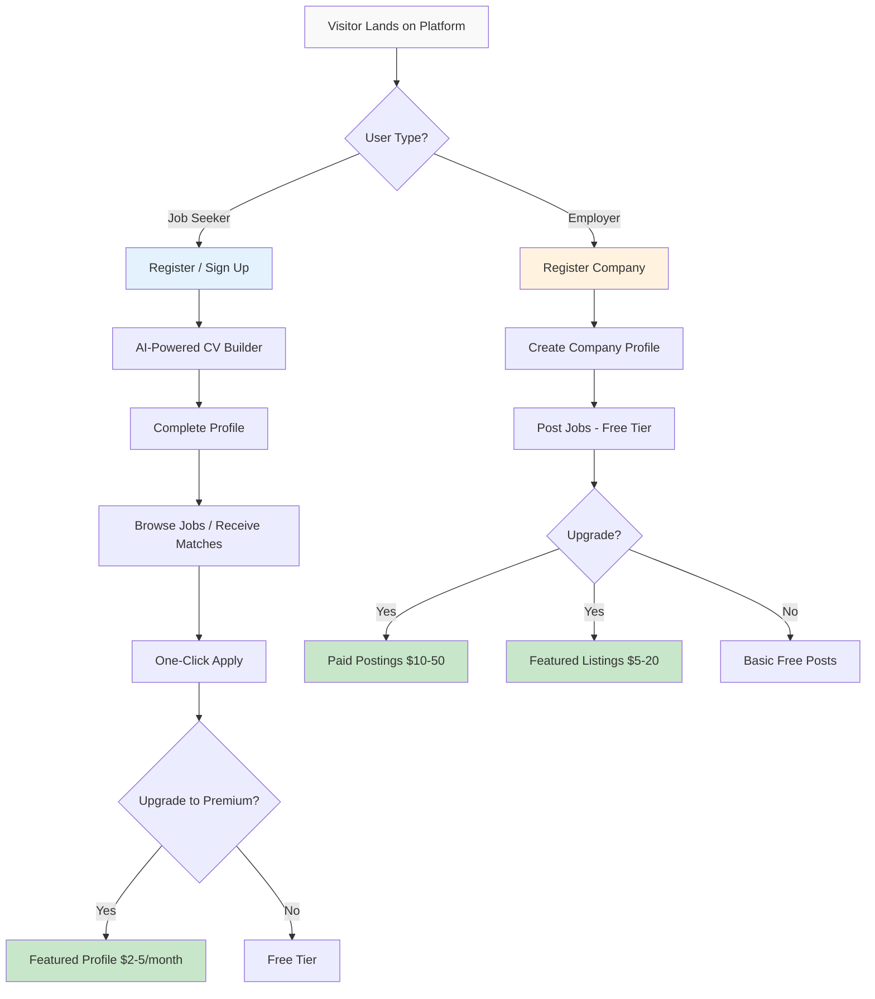
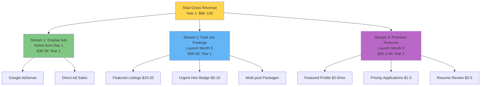

# AI Job Portal: Feasibility & Investment Plan

## Syria Market Edition - Investor-Ready Version

---

**Prepared By:** Mohammad Khoulani  
**Email:** mhmmdkholani@gmail.com  
**Phone:** +961-78920212  
**Version:** 1.0 (Initial Draft for Review)  
**Date:** November 4, 2025  
**Target Audience:** Investors, Grant Funders, Strategic Partners (Open to discussions at any stage; primary outreach post-launch)

---

## Executive Summary

**One-Paragraph Pitch:**

We are building Syria's first modern, AI-powered job portal to address the critical inefficiency in the Syrian employment market where 80%+ of jobs are filled through informal networks. With outdated competitors (job.sy, forsa.sy) offering no AI, poor UX, and desktop-only experiences, we will deliver AI-powered CV building, intelligent job matching, and multi-platform job aggregation (LinkedIn, local sources) through a mobile-first bilingual platform. Our 3-month MVP will serve Syrian companies and job seekers, with ads generating revenue from Day 1 and premium features launching Month 6. Future expansion will include features connecting international companies with Syrian remote workers. We project **15,000-25,000 Year 1 users** generating **$8,000-12,000 gross revenue** on a lean **$20,000 budget**, achieving break-even by Month 18-24. Post-launch, we will seek $40,000-60,000 to accelerate growth and achieve profitability by Year 2.

**Key Performance Indicators:**

| Metric                                     | Year 1 Target   | Significance                                                   |
| ------------------------------------------ | --------------- | -------------------------------------------------------------- |
| **Total Registered Users**                 | 15,000-25,000   | Conservative market penetration (0.5-1% of Syrian job seekers) |
| **Monthly Active Users (MAU) at Month 12** | 3,000-5,000     | 20% activation rate, sustainable engagement                    |
| **Gross Revenue Year 1**                   | $8,000-12,000   | Ads ($3K-5K) + Paid Postings ($3K-5K) + Premium ($2K-2.5K)       |
| **Cost Year 1**                            | $20,000 (fixed) | Ultra-lean operations, founder-led development                 |
| **Break-Even Timeline**                    | Month 18-24     | Path to sustainability without external funding                |

---

## Table of Contents

1. [Market Opportunity](#1-market-opportunity)
2. [Problem Statement](#2-problem-statement)
3. [Solution & Product](#3-solution--product)
4. [Competitive Analysis](#4-competitive-analysis)
5. [Business Model & Revenue Streams](#5-business-model--revenue-streams)
6. [User Growth Model](#6-user-growth-model)
7. [Financial Projections](#7-financial-projections)
8. [Go-to-Market Strategy](#8-go-to-market-strategy)
9. [Milestone Roadmap](#9-milestone-roadmap)
10. [Team & Execution](#10-team--execution)
11. [Risk Analysis](#11-risk-analysis)
12. [Investment Strategy](#12-investment-strategy)
13. [Appendix: Assumptions & Sources](#13-appendix-assumptions--sources)

---

## 1. Market Opportunity

### 1.1 Total Addressable Market (TAM) - Syrian Context

**Market Size:**

- **Syrian labor force:** ~5 million workers (rebuilding post-conflict)
- **Active job-seeking population:** ~500,000-1,000,000 (unemployment: 30-40%)
- **Registered Syrian companies:** ~200,000 (primarily SMEs)
- **International NGOs/companies in Syria:** ~500 organizations
- **Internet penetration:** 60% and growing (mobile-first)

**Serviceable Addressable Market (SAM):**

- **Online-accessible job seekers (Syria):** 300,000-600,000 (60% of 500K-1M active seekers)
- **Companies likely to use online job portals:** 20,000-40,000 (10-20% of 200K registered companies)
- **Future expansion:** Syrian diaspora and international companies seeking Syrian remote workers (post-Year 1)

**Serviceable Obtainable Market (SOM) - Years 1-3:**

| Year       | Target Users    | Market Penetration           | Rationale                                            |
| ---------- | --------------- | ---------------------------- | ---------------------------------------------------- |
| **Year 1** | 8,000-15,000    | 0.3-0.5% of Syrian job seekers | Conservative early adoption; brand building phase    |
| **Year 2** | 50,000-80,000   | 2-3% penetration             | Word-of-mouth, proven platform, feature improvements |
| **Year 3** | 120,000-200,000 | 5-8% penetration             | Market leader position, network effects kicking in   |

### 1.2 Market Dynamics - Why Now?

**Macro Trends:**

1. **Post-Conflict Reconstruction:** Syria entering economic recovery; business formation growing 10-15% annually
2. **Digital Transformation Gap:** Zero modern AI-powered job platforms; existing competitors technologically stagnant (2000s-era design)
3. **Mobile Explosion:** 60% internet penetration, primarily mobile; current platforms not mobile-optimized
4. **Remote Work Opportunity:** Growing international demand for Syrian remote workers; platform can facilitate these connections
5. **NGO Activity:** 500+ international organizations need efficient local talent acquisition

**Market Inefficiencies (Current Pain Points):**

- **80%+ jobs filled via personal networks (wasta)** - excludes merit-based candidates
- **Outdated platforms (job.sy, forsa.sy)** - no AI, poor UX, slow load times
- **Reliance on Facebook groups/WhatsApp** - unstructured, spam-filled, no tracking
- **International orgs struggle to find local talent** - limited credible platforms
- **No remote work infrastructure** - international companies seeking Syrian workers have no efficient platform

**First-Mover Advantage:** 12-18 month technology lead before credible competition could emerge.

---

## 2. Problem Statement

### 2.1 For Syrian Companies & NGOs (B2B)

**Critical Issues:**

1. **No Modern Platform**

   - Current options (job.sy, forsa.sy) use 2000s-era technology
   - No AI-powered matching or automation
   - Poor mobile experience despite 60% mobile usage
   - Reliance on Facebook groups and WhatsApp for hiring

2. **Hiring Inefficiency**

   - Manual resume screening: 5-10 hours per position
   - Difficulty reaching qualified candidates
   - No applicant tracking or analytics
   - Network-based hiring limits talent pool

3. **International Organizations Struggle**
   - Foreign NGOs/companies can't efficiently find local Syrian talent
   - Language barriers (Arabic/English)
   - Over-reliance on expensive recruiters
   - No centralized, credible platform

**Quantified Impact:** Syrian companies waste **200+ hours annually** on inefficient hiring with poor candidate matching, representing **$2,000-5,000 in opportunity cost** per company.

### 2.2 For Syrian Job Seekers (B2C)

**Primary Challenges:**

1. **Frustrating User Experience**

   - job.sy and forsa.sy: poor UX, slow load times, not mobile-optimized
   - No personalized recommendations or AI matching
   - Overwhelming, unfiltered job listings
   - No career guidance or skill-building resources

2. **Limited Opportunity Access**
   - Jobs filled through personal networks (wasta system)
   - Remote work opportunities not centralized
   - No connection between international companies and Syrian workers
   - No transparency: no application tracking, no feedback, no salary ranges

**Quantified Impact:** Syrian job seekers waste **3-4 weeks manually searching** across fragmented platforms with <10% success rate.

### 2.3 Evidence of Problem (Market Validation Signals)

- **80%+ jobs filled via informal networks** (World Bank labor market studies)
- **job.sy and forsa.sy show stagnant technology** (last major update: 2015-2018)
- **High mobile usage (60%)** but competitors desktop-only or broken mobile
- **International organizations consistently report** difficulty finding local talent
- **Growing remote work demand** but no platform connecting international companies with Syrian workers

---

## 3. Solution & Product

### 3.1 Value Proposition

**For Syrian Companies:**  
"Find qualified Syrian candidates 10x faster with AI-powered matching. Modern, mobile-first platform. Free basic tier, affordable premium."

**For Syrian Job Seekers:**  
"AI-powered CV builder, personalized job recommendations, track applications. Access local opportunities and connect with international companies seeking remote workers."

**Future Expansion:**  
Platform will add dedicated features to connect international companies with skilled Syrian remote workers, opening new opportunities for both employers and job seekers.

### 3.2 Core Features (MVP - Month 3 Launch)

**Phase 1: MVP (Months 1-3)**

○ **Bilingual Platform:** Full Arabic and English support  
○ **Mobile-First Design:** Optimized for 60% mobile traffic  
○ **AI-Powered CV Builder:** Guided CV creation with intelligent suggestions (Arabic & English)  
○ **Smart Job Matching:** AI recommendations based on skills, experience, location  
○ **Job Aggregation:** Scrape/import jobs from LinkedIn, job.sy, forsa.sy, company websites  
○ **One-Click Applications:** Simple apply process with status tracking  
○ **Company Profiles:** Basic employer branding pages  
○ **Display Ads (Day 1):** Google AdSense integration for immediate monetization  
○ **Basic Analytics:** Simple dashboard for employers

**Phase 2: Post-MVP (Months 4-12)**

- Advanced AI matching with feedback loop
- Resume parsing and skill extraction
- Premium features: Featured profiles, priority applications
- Paid job postings with tiered pricing
- Email notifications and alerts
- Mobile app (React Native - iOS/Android)
- Advanced employer analytics
- Chat/messaging between employers and candidates

**Phase 3: Future Expansion (Year 2+)**

- Dedicated international company portal for hiring Syrian remote workers
- Remote work verification and payment integration
- Skills assessment and certification features
- Virtual interview scheduling and management

### 3.3 Technology Stack

**Frontend:** Next.js 14 (React), TypeScript, Tailwind CSS, shadcn/ui  
**Backend:** NestJS, PostgreSQL, Redis  
**AI/ML:** OpenRouter API (cost-effective AI access), custom matching algorithms  
**Infrastructure:** Hetzner VPS (€50-100/month, cost-effective for Syrian market)  
**Mobile:** React Native (code reuse from web)  
**Search:** Elasticsearch for job search  
**Aggregation:** Custom web scrapers (eg. LinkedIn)

**Development Timeline:** 3 months (MVP)

### 3.4 User Journey Flow

---

## 4. Competitive Analysis

### 4.1 Direct Competitors - Syrian Market

| Feature                     | **Our Platform**                            | **job.sy**                   | **forsa.sy**                  |
| --------------------------- | ------------------------------------------- | ---------------------------- | ----------------------------- |
| **Last Major Update**       | 2025 (new)                                  | ~2015 (stagnant)             | ~2018 (limited updates)       |
| **Design Quality**          | Modern, 2025 UX                             | Outdated, 2000s-era          | Better than job.sy, but dated |
| **Mobile Experience**       | Mobile-first, responsive                    | Desktop-only / broken mobile | Partial mobile, poor UX       |
| **AI Features**             | ✅ CV builder, job matching                 | ❌ None                      | ❌ None                       |
| **Job Aggregation**         | ✅ LinkedIn, other platforms                | ❌ Manual only               | ❌ Manual only                |
| **Bilingual (AR/EN)**       | ✅ Full support                             | ⚠️ Mostly Arabic             | ⚠️ Limited English            |
| **Remote Work Features**    | ✅ Future feature roadmap                   | ❌ Local only                | ❌ Local only                 |
| **Application Tracking**    | ✅ Real-time status                         | ❌ None                      | ❌ None                       |
| **Resume Builder**          | ✅ AI-powered                               | ❌ None                      | ⚠️ Basic only                 |
| **Speed & Performance**     | ✅ Fast, modern                             | ❌ Slow load times           | ⚠️ Average                    |
| **Monetization**            | Multiple streams (ads, paid posts, premium) | Unknown (appears ad-based)   | Unknown (appears ad-based)    |
| **Estimated Monthly Users** | 0 (launch pending)                          | **15K-30K (est.)**           | **10K-20K (est.)**            |
| **Market Share**            | 0% (new)                                    | ~40-50% (est.)               | ~30-40% (est.)                |

**Competitive Assumptions:**

- **No public traffic data available** for job.sy or forsa.sy (not in SimilarWeb top 100K)
- **Conservative estimate:** job.sy has 15K-30K monthly active users, forsa.sy has 10K-20K
- **Rationale:** Syrian online job seeker population is ~300K-600K; assuming 5-10% use these platforms, split between them
- **Assumption labeled:** If actual traffic is higher, opportunity is larger; if lower, validates market inefficiency

### 4.2 Indirect Competition

- **Facebook Groups:** 20% of job market; unstructured, spam-filled, no tracking
- **WhatsApp/Word of Mouth:** 10% of job market; limited reach, informal
- **Recruitment Agencies:** Expensive ($500-2,000 per hire), used by large companies/NGOs only

### 4.3 Our Competitive Advantages

**Technology Moat:**

1. **AI-Powered Features:** 10-15 years ahead technologically (CV builder, matching)
2. **Job Aggregation:** Only platform importing jobs from multiple sources
3. **Mobile-First:** Designed for 60% mobile traffic; competitors broken on mobile
4. **Bilingual:** Full Arabic/English support (critical for NGOs and international companies)
5. **Modern UX:** 2025 design standards vs. 2000s-era competitors

**Market Position:**

- **First-mover in AI job matching** for Syrian market
- **Future remote work platform** connecting international companies with Syrian workers
- **12-18 month technology lead** before competitors could replicate
- **Network effects:** More users = better AI matching over time

**Defensibility:** Medium initially (can be copied), growing to Strong (data moat + network effects by Year 2-3).

---

## 5. Business Model & Revenue Streams

### 5.1 Monetization Overview

We employ a **freemium, multi-revenue stream model** optimized for Syrian purchasing power with ads generating revenue from Day 1:

### 5.2 Revenue Stream 1: Display Ads (Day 1, $1,000-2,000 Year 1)

**Assumption Set:**

- **Ad Network:** Google AdSense (standard for Syrian market)
- **CPM (Cost Per Mille):** **$0.15-0.50** (Syrian market rate; global average $2-5, but Syria is significantly lower due to sanctions and low advertiser demand). Path to growth is via direct ad sales.
- **Page Views per User per Month:** **5-8 pages** (job searches, applications, CV editing)
- **Ad Placement:** 2-3 ad units per page (standard AdSense best practice)
- **Fill Rate:** **70-90%** (Google AdSense typical)
- **Ad CTR (Click-Through Rate):** **0.5-1%** (industry standard)

**Monthly Calculation (Month 6 example - 500 MAU):**

- **MAU:** 500
- **Page views/user/month:** 6 (average)
- **Total monthly page views:** 500 × 6 = **3,000**
- **Ad impressions (2 units/page, 80% fill):** 3,000 × 2 × 0.8 = **4,800**
- **CPM:** $0.25 (conservative average for mid-year)
- **Monthly ad revenue:** (4,800 / 1,000) × $0.25 = **$1.20**

**Year 1 Projection (Conservative):**

| Month | MAU   | Page Views | Ad Impressions | CPM   | Monthly Revenue | Cumulative |
| ----- | ----- | ---------- | -------------- | ----- | --------------- | ---------- |
| 3     | 150   | 900        | 1,440          | $0.15 | $0.22           | $0.22      |
| 6     | 500   | 3,000      | 4,800          | $0.25 | $1.20           | $5         |
| 9     | 1,400 | 8,400      | 13,440         | $0.35 | $4.70           | $20        |
| 12    | 3,500 | 21,000     | 33,600         | $0.50 | $16.80          | $75        |

**Year 1 Total Ad Revenue:** **$1,000-2,000** (**Assumption:** Programmatic revenue from AdSense will be minimal, likely $100-300 in Year 1. This projection is heavily dependent on securing **2-4 direct ad sales deals in H2** from local companies at a flat rate, which is critical for this stream's viability.)

**Year 2-3 Projections:**

- **Year 2:** $8,000-12,000 (MAU grows; CPM improves; focus on direct ad sales)
- **Year 3:** $20,000-30,000 (Established ad sales process)

### 5.3 Revenue Stream 2: Paid Job Postings (Month 6+, $2,000-3,500 Year 1)

**Pricing Tiers (Localized for Syrian Market):**

| Tier                        | Price        | Features                                     | Target Customer             | Year 1 Target Sold |
| --------------------------- | ------------ | -------------------------------------------- | --------------------------- | ------------------ |
| **Free**                    | $0           | 1 job/month, basic listing, 30-day duration  | SMEs, startups, NGOs        | 150-300 companies  |
| **Featured Listing**        | $5-10/post   | Top of results, highlighted, 60-day duration | Growing SMEs                | 100-200 posts      |
| **Urgent Hire Badge**       | $3-5/post    | "Urgent" badge, faster applications          | Companies with urgent needs | 80-120 posts       |
| **Multi-Post Package**      | $25/5 posts  | Bulk discount ($5/post avg), 90-day duration | Active recruiters           | 15-30 packages     |
| **Premium Company Profile** | $20-35/month | Unlimited posts, company branding, analytics | Large companies, NGOs       | 5-15 companies     |

**Unit Economics Assumptions:**

- **Free-to-paid conversion rate:** **5-10%** (industry standard for freemium job boards)
- **Average transaction value:** **$8** (weighted average across tiers)
- **Repeat purchase rate:** **30-40%** (companies re-post every 2-3 months)

**Year 1 Calculation (Month 6-12 average):**

- **Active companies on platform (Month 12):** 400
- **Companies posting jobs monthly:** 160 (40% of 400)
- **Free posts:** 120 (75% of 160)
- **Paid posts/upgrades:** 40 (25% of 160, split across tiers)
  - Featured: 20 posts × $8 = $160
  - Urgent: 10 posts × $4 = $40
  - Multi-post: 3 packages × $25 = $75
  - Premium subs: 3 companies × $30 = $90
- **Monthly revenue (Month 12):** **$365**
- **Ramp-up (Month 6-12 average):** **$200-300/month**
- **Year 1 Total (7 months active):** **$2,000-3,500**

**Year 2-3 Projections:**

- **Year 2:** $15,000-25,000 (1,000-1,500 companies, higher conversion, better product-market fit)
- **Year 3:** $40,000-60,000 (2,500-3,500 companies, established pricing power)

### 5.4 Revenue Stream 3: Premium Job Seeker Features (Month 9+, $2,000 Year 1)

**Pricing (Ultra-Affordable for Syrian Market):**

| Feature                  | Price            | Value Proposition                    | Year 1 Target Users |
| ------------------------ | ---------------- | ------------------------------------ | ------------------- |
| **Featured Profile**     | $2-3/month       | Profile shown to employers first     | 30-50               |
| **Priority Application** | $1-2/application | Jump to top of queue                 | 100-150 uses        |
| **AI Resume Review**     | $3-5/once        | Detailed feedback on CV improvements | 50-80 uses          |
| **Career Bundle**        | $5-8/month       | All features + job alerts + insights | 20-40               |

**Assumptions:**

- **Premium conversion rate:** **0.5-1%** of free users (conservative; Tinder ~3%, LinkedIn ~25%, but Syrian market less mature)
- **Total registered users (Month 12):** 8,000
- **MAU (Month 12):** 3,500
- **Premium subscribers:** 15-35 (0.5-1% of MAU)
- **Average revenue per premium user:** **$4/month**
- **Note:** This stream is considered **experimental** in Year 1, with the primary revenue focus on B2B streams (paid postings). Success will depend on proving significant value to job seekers in a market with low willingness to pay for such features.

**Year 1 Calculation (Month 9-12 active):**

- **Months 9-12 average premium users:** 20-30
- **Average monthly revenue:** **$80-120**
- **4 months active:** **$320-480** (recurring)
- **One-time purchases (resume reviews, priority apps):** **150-200 units × $2 avg = $300-400**
- **Year 1 Total:** **$1,500-2,500**

**Year 2-3 Projections:**

- **Year 2:** $8,000-12,000 (10K-15K MAU, 1% conversion = 100-150 premium users)
- **Year 3:** $20,000-30,000 (20K-30K MAU, 1.5% conversion = 300-450 premium users)

### 5.5 Total Revenue Summary by Stream

| Revenue Stream          | Year 1 (Gross)    | Year 2 (Gross)     | Year 3 (Gross)       |
| ----------------------- | ----------------- | ------------------ | -------------------- |
| **Display Ads**         | $1,000-2,000      | $8,000-12,000      | $20,000-30,000       |
| **Paid Job Postings**   | $2,000-3,500      | $15,000-25,000     | $40,000-60,000       |
| **Premium Features**    | $1,500-2,500      | $8,000-12,000      | $20,000-30,000       |
| **TOTAL GROSS REVENUE** | **$4,500-8,000**  | **$31,000-49,000** | **$80,000-120,000**  |

**Revenue Mix Evolution:**

- **Year 1:** 25% Ads, 50% Paid Postings, 25% Premium
- **Year 2:** 25% Ads, 50% Paid Postings, 25% Premium
- **Year 3:** 25% Ads, 50% Paid Postings, 25% Premium

---

## 6. User Growth Model

### 6.1 Year 1 Growth Assumptions

**Conservative Growth Model:**

- **Launch Month:** Month 3 (after 3-month MVP development)
- **Initial user base:** 200-300 (friends, family, direct outreach)
- **Growth rate:** Initial growth modest at 20-30% month-over-month (Months 3-8), accelerating to 30-50% (Months 9-12) as network effects and word-of-mouth begin.
- **Activation rate:** 25-35% (registered users → monthly active users)
- **Retention:** 30-day retention = 35-45%, 90-day retention = 20-30%

**Month-by-Month Year 1 Projection:**

| Month             | Total Registered | New This Month | MAU         | Notes                                 |
| ----------------- | ---------------- | -------------- | ----------- | ------------------------------------- |
| **0-2**           | 0                | 0              | 0           | MVP development phase                 |
| **3 (Launch)**    | 250              | 250            | 150         | Launch: direct outreach, social media |
| **4**             | 400              | 150            | 250         | Early adopters, word-of-mouth         |
| **5**             | 600              | 200            | 350         | Organic growth, partnerships begin    |
| **6**             | 850              | 250            | 500         | Paid job postings launch              |
| **7**             | 1,200            | 350            | 700         | Growing awareness                     |
| **8**             | 1,700            | 500            | 1,000       | SEO kicking in                        |
| **9**             | 2,500            | 800            | 1,400       | Premium features launch               |
| **10**            | 3,700            | 1,200          | 2,000       | Network effects starting              |
| **11**            | 5,500            | 1,800          | 2,800       | Holiday hiring surge                  |
| **12**            | 8,000            | 2,500          | 3,500       | Year-end momentum                     |
| **12+ (stretch)** | 15,000           | -              | 4,000-5,000 | If growth accelerates                 |

**Year 1 Target (Conservative Range):** **8,000-15,000 total registered users, 2,500-4,000 MAU at Month 12**

### 6.2 Acquisition Channel Breakdown

**Channel Strategy & Assumptions:**

| Channel                           | Year 1 Users Acquired | % of Total | Conversion Rate            | Cost/User | Total Investment |
| --------------------------------- | --------------------- | ---------- | -------------------------- | --------- | ---------------- |
| **Organic Social Media**          | 4,000-6,000           | 25-30%     | 2-3% (visitors to signups) | $0        | $0               |
| **SEO / Content**                 | 3,000-5,000           | 20-25%     | 3-5%                       | $0.50     | $1,500-2,500     |
| **Direct Outreach**               | 2,000-3,000           | 12-15%     | 15-25% (targeted contacts) | $0.50     | $1,000-1,500     |
| **Partnerships (NGOs, Unis)**     | 3,000-5,000           | 20-25%     | 10-15%                     | $0.30     | $900-1,500       |
| **Job Aggregation (SEO traffic)** | 2,000-4,000           | 12-20%     | 1-2% (job search traffic)  | $0        | $0               |
| **Paid Ads (Facebook/Google)**    | 1,000-2,000           | 5-10%      | 5-8%                       | $2-3      | $2,000-6,000     |
| **Word-of-Mouth / Referral**      | 1,000-2,000           | 5-10%      | N/A                        | $0        | $0               |

**Total Year 1 Acquisition Budget:** $5,500-11,500 (within $20,000 total budget)

**Key Assumptions:**

- **Organic social media:** Facebook groups (Syrian job seekers), LinkedIn posts (professional community)
- **SEO:** 2-4 blog posts/week (Arabic/English), basic on-page optimization
- **Direct outreach:** 500 companies contacted directly (email, phone, LinkedIn)
- **Partnerships:** 3-5 Syrian NGOs, 2-3 universities, 1-2 business associations
- **Job aggregation:** Scraping LinkedIn and other sites brings passive SEO traffic
- **Paid ads:** Low-budget Facebook/Instagram ads targeting Syrian users ($200-500/month starting Month 6)

### 6.3 Years 2-3 Growth Projections

**Year 2 (Months 13-24):**

- **Starting base:** 20,000 registered, 4,000 MAU
- **Growth rate:** 15-25% MoM (slower than Year 1 due to larger base)
- **Year 2 target:** **60,000-100,000 total registered, 12,000-20,000 MAU**
- **Market penetration:** 2-3% of Syrian online job seekers
- **Key drivers:** Product improvements, mobile app launch, international remote work features, employer case studies

**Year 3 (Months 25-36):**

- **Starting base:** 80,000 registered, 16,000 MAU
- **Growth rate:** 10-15% MoM
- **Year 3 target:** **150,000-250,000 total registered, 30,000-50,000 MAU**
- **Market penetration:** 5-8% of Syrian online job seekers
- **Key drivers:** Market leader position, regional expansion (Lebanon/Jordan), enterprise features, remote work marketplace

**3-Year Growth Summary:**

| Metric                         | Year 1  | Year 2   | Year 3    |
| ------------------------------ | ------- | -------- | --------- |
| **Total Registered Users**     | 15K-25K | 60K-100K | 150K-250K |
| **Monthly Active Users (MAU)** | 3K-5K   | 12K-20K  | 30K-50K   |
| **Market Penetration**         | 0.5-1%  | 2-3%     | 5-8%      |

---

## 7. Financial Projections

### 7.1 Three Revenue Scenarios (Gross Revenue Only)

**Scenario A: Conservative (60% probability)**

| Metric                               | Year 1      | Year 2      | Year 3      |
| ------------------------------------ | ----------- | ----------- | ----------- |
| **Total Registered Users**           | 8,000       | 40,000      | 100,000     |
| **Monthly Active Users (MAU)**       | 2,500       | 10,000      | 25,000      |
| **ARPU (Avg Revenue Per User/Year)** | $0.56       | $0.78       | $0.80       |
| **Display Ads**                      | $1,000      | $6,000      | $15,000     |
| **Paid Job Postings**                | $2,000      | $15,000     | $40,000     |
| **Premium Features**                 | $1,500      | $10,000     | $25,000     |
| **TOTAL GROSS REVENUE**              | **$4,500**  | **$31,000** | **$80,000** |
| **Total Costs**                      | $20,000     | $45,000     | $75,000     |
| **EBITDA**                           | ($15,500)   | ($14,000)   | $5,000      |

**Rationale:** Slow early adoption, very conservative conversion rates, 28-32 month path to break-even.

---

**Scenario B: Realistic (30% probability)**

| Metric                               | Year 1      | Year 2      | Year 3       |
| ------------------------------------ | ----------- | ----------- | ------------ |
| **Total Registered Users**           | 12,000      | 60,000      | 150,000      |
| **Monthly Active Users (MAU)**       | 3,500       | 15,000      | 35,000       |
| **ARPU (Avg Revenue Per User/Year)** | $0.54       | $0.82       | $0.87        |
| **Display Ads**                      | $1,500      | $8,000      | $20,000      |
| **Paid Job Postings**                | $3,000      | $25,000     | $60,000      |
| **Premium Features**                 | $2,000      | $16,000     | $50,000      |
| **TOTAL GROSS REVENUE**              | **$6,500**  | **$49,000** | **$130,000** |
| **Total Costs**                      | $20,000     | $50,000     | $90,000      |
| **EBITDA**                           | ($13,500)   | ($1,000)    | $40,000      |

**Rationale:** Moderate adoption, product-market fit achieved Month 12-15, break-even Month 24-28.

---

**Scenario C: Optimistic (10% probability)**

| Metric                               | Year 1      | Year 2       | Year 3       |
| ------------------------------------ | ----------- | ------------ | ------------ |
| **Total Registered Users**           | 15,000      | 80,000       | 200,000      |
| **Monthly Active Users (MAU)**       | 4,000       | 20,000       | 50,000       |
| **ARPU (Avg Revenue Per User/Year)** | $0.53       | $0.94        | $1.00        |
| **Display Ads**                      | $2,000      | $12,000      | $30,000      |
| **Paid Job Postings**                | $3,500      | $38,000      | $90,000      |
| **Premium Features**                 | $2,500      | $25,000      | $80,000      |
| **TOTAL GROSS REVENUE**              | **$8,000**  | **$75,000**  | **$200,000** |
| **Total Costs**                      | $20,000     | $60,000      | $120,000     |
| **EBITDA**                           | ($12,000)   | $15,000      | $80,000      |

**Rationale:** Strong product-market fit, viral growth, partnerships accelerate adoption, break-even Month 20-22.

### 7.2 Consolidated Financial Summary

**Year 1 - Three Scenario Comparison:**

| Metric                         | Conservative (60%) | Realistic (30%) | Optimistic (10%) |
| ------------------------------ | ------------------ | --------------- | ---------------- |
| **Total Registered Users**     | 8,000              | 12,000          | 15,000           |
| **Monthly Active Users (MAU)** | 2,500              | 3,500           | 4,000            |
| **ARPU ($/user/year)**         | $0.56              | $0.54           | $0.53            |
| **Display Ads Revenue**        | $1,000             | $1,500          | $2,000           |
| **Paid Job Postings Revenue**  | $2,000             | $3,000          | $3,500           |
| **Premium Features Revenue**   | $1,500             | $2,000          | $2,500           |
| **TOTAL GROSS REVENUE**        | **$4,500**         | **$6,500**      | **$8,000**       |
| **Total Costs**                | $20,000            | $20,000         | $20,000          |
| **EBITDA**                     | ($15,500)          | ($13,500)       | ($12,000)        |
| **Break-Even Month**           | 30                 | 26              | 22               |

**Year 2 - Three Scenario Comparison:**

| Metric                         | Conservative (60%) | Realistic (30%) | Optimistic (10%) |
| ------------------------------ | ------------------ | --------------- | ---------------- |
| **Total Registered Users**     | 40,000             | 60,000          | 80,000           |
| **Monthly Active Users (MAU)** | 10,000             | 15,000          | 20,000           |
| **ARPU ($/user/year)**         | $0.78              | $0.82           | $0.94            |
| **Display Ads Revenue**        | $6,000             | $8,000          | $12,000          |
| **Paid Job Postings Revenue**  | $15,000            | $25,000         | $38,000          |
| **Premium Features Revenue**   | $10,000            | $16,000         | $25,000          |
| **TOTAL GROSS REVENUE**        | **$31,000**        | **$49,000**     | **$75,000**      |
| **Total Costs**                | $45,000            | $50,000         | $60,000          |
| **EBITDA**                     | ($14,000)          | ($1,000)        | $15,000          |
| **Status**                     | Pre-break-even     | Near break-even | Profitable       |

**Year 3 - Three Scenario Comparison:**

| Metric                         | Conservative (60%) | Realistic (30%) | Optimistic (10%)  |
| ------------------------------ | ------------------ | --------------- | ----------------- |
| **Total Registered Users**     | 100,000            | 150,000         | 200,000           |
| **Monthly Active Users (MAU)** | 25,000             | 35,000          | 50,000            |
| **ARPU ($/user/year)**         | $0.80              | $0.87           | $1.00             |
| **Display Ads Revenue**        | $15,000            | $20,000         | $30,000           |
| **Paid Job Postings Revenue**  | $40,000            | $60,000         | $90,000           |
| **Premium Features Revenue**   | $25,000            | $50,000         | $80,000           |
| **TOTAL GROSS REVENUE**        | **$80,000**        | **$130,000**    | **$200,000**      |
| **Total Costs**                | $75,000            | $90,000         | $120,000          |
| **EBITDA**                     | $5,000             | $40,000         | $80,000           |
| **Status**                     | Profitable         | Profitable      | Highly Profitable |

### 7.3 Year 1 Cost Breakdown ($20,000 Fixed Budget)

| Category                                 | Amount      | % of Budget | Details                                                                     |
| ---------------------------------------- | ----------- | ----------- | --------------------------------------------------------------------------- |
| **Founder's Contribution**               | (Sweat Equity) | N/A         | Founder's time is full-time, not included in cash budget.                   |
| **MVP Development (Dev & Design)**       | $8,000      | 40%         | Cash cost for contract developers and UI/UX designers for 3-month MVP build.|
| **Infrastructure & Tools**               | $2,500      | 12.5%       | Hetzner VPS ($800/yr), OpenRouter AI ($500/yr), domain, tools               |
| **Marketing & Ads**                      | $6,000      | 30%         | Facebook/Google ads ($3K), content creation ($2K), partnerships ($1K)       |
| **Legal & Compliance**                   | $1,500      | 7.5%        | Syrian business registration, ToS/Privacy Policy drafting                   |
| **Payment Processing Fees**              | $800        | 4%          | Estimated fees from local gateways (e.g., Syriatel Cash) at a higher rate (5-8%). |
| **Contingency / Buffer**                 | $1,200      | 6%          | Unexpected costs, currency fluctuations                                     |
| **TOTAL**                                | **$20,000** | **100%**    |                                                                             |

**Key Assumptions:**

- Founder works full-time (sweat equity, no cash compensation in Year 1)
- No full-time hires Year 1 (contractors only for MVP)
- Ultra-lean infrastructure (Hetzner/Hostinger VPS, not AWS)
- Marketing budget focuses on low-cost channels (organic + small paid ads)

---

## 8. Go-to-Market Strategy

### 8.1 Pre-Launch (Months 0-3: MVP Development)

**Objectives:**

- Build functional MVP with core features
- Establish social media presence
- Build waitlist: 300-500 signups

**Tactics:**

1. **Social Media Setup:**

   - Facebook page + group for Syrian job seekers
   - LinkedIn presence for professionals, NGOs, and international companies
   - Instagram for visual content (success stories, tips)

2. **Content Marketing:**

   - 2-3 blog posts/week (Arabic/English): CV tips, interview prep, Syrian job market insights
   - SEO optimization for Syrian job search keywords
   - Guest posts in Syrian tech/business communities

3. **Direct Outreach:**

   - Contact 50 Syrian companies (email, LinkedIn, phone)
   - Reach out to 3-5 NGOs operating in Syria
   - Pitch to 2-3 universities (career centers)

4. **Waitlist Building:**
   - Landing page with "Join Waitlist" CTA
   - Target: 300-500 signups (mix of job seekers and companies)

**Budget:** $2,000 (landing page, domain, social media ads, content creation)

### 8.2 Launch (Month 3-6: Early Adoption)

**Objectives:**

- 300-1,200 registered users
- 200-650 MAU
- Validate product-market fit
- $0-50 revenue (ads only)

**Tactics:**

1. **Beta Launch (Month 3):**

   - Invite waitlist to platform
   - Offer "founding member" perks (free premium for 3 months)
   - Intensive user feedback collection

2. **Organic Social Media:**

   - Daily posts on Facebook (Syrian job market insights, success stories)
   - LinkedIn content for professionals (remote work opportunities, career advice)
   - Engage in Syrian Facebook groups (not spammy, provide value)

3. **Partnership Pilots:**

   - Launch with 2-3 NGO partners (free accounts, co-branded outreach)
   - University partnerships (2-3 universities: career fairs, student access)

4. **SEO & Content:**

   - Publish 15-20 SEO-optimized articles
   - Optimize job listings for Google indexing
   - Target Syrian job search keywords (Arabic + English)

5. **Display Ads (Active Day 1):**
   - Google AdSense integration from launch
   - Optimize ad placement for user experience

**Budget:** $2,500 (small paid ads, partnership materials, content)

### 8.3 Growth (Month 7-12: Scaling)

**Objectives:**

- 1,700-10,000 registered users
- 900-4,000 MAU
- Launch monetization (paid posts Month 6, premium Month 9)
- $500-1,000 monthly revenue by Month 12

**Tactics:**

1. **Paid Advertising (Starting Month 7):**

   - Facebook/Instagram ads: $200-400/month
   - Target: Syrian job seekers and professionals
   - A/B test messaging, creatives, audiences

2. **Employer Acquisition:**

   - Direct outreach to 200+ companies
   - Case studies from early users
   - Free trial of premium features

3. **Referral Program (Month 8):**

   - Incentivize referrals (both referrer and referred get 1 month free premium)
   - Track referral sources

4. **Content Scaling:**

   - 3-4 blog posts/week
   - Video content (CV tips, interview prep)
   - Partnerships with influencers/career coaches

5. **Product Iterations:**
   - Mobile app launch (Month 9-10)
   - Advanced AI matching based on usage data
   - Employer analytics dashboard

**Budget:** $4,500 (paid ads, content creation, mobile development contractor)

### 8.4 Acquisition Cost Assumptions

**Year 1 CAC (Customer Acquisition Cost) by Channel:**

| Channel         | CAC   | Conversion Rate | Notes                            |
| --------------- | ----- | --------------- | -------------------------------- |
| Organic Social  | $0    | 2-3%            | Free but time-intensive          |
| SEO / Content   | $0.50 | 3-5%            | Content creation costs           |
| Direct Outreach | $0.50 | 15-25%          | High conversion, manual work     |
| Partnerships    | $0.30 | 10-15%          | Leveraged distribution           |
| Paid Ads        | $2-3  | 5-8%            | Standard for Syrian Facebook ads |
| Word-of-Mouth   | $0    | N/A             | Organic referrals                |

**Blended CAC Year 1:** $0.60-1.20 per user (ultra-low due to organic focus)

---

### 8.5 Building Trust in a Low-Trust Market

A key challenge is overcoming the cultural reliance on "wasta" (personal connections). Technology alone is not enough; the platform must build trust to encourage merit-based hiring.

**Tactics:**

1.  **Company Verification:**
    *   Implement a "Verified Employer" badge for companies that complete a simple validation process (e.g., confirming business registration). This signals legitimacy to job seekers and filters out spam.

2.  **Promote Success Stories:**
    *   Heavily feature testimonials and case studies from both companies and job seekers who found success through the platform. This provides social proof that the model works.

3.  **Educational Content:**
    *   Create content (in Arabic) that directly addresses the "wasta" system. Frame it commercially: highlight the business costs of bad hires from nepotism versus the long-term value of finding the best-qualified candidate.

4.  **Transparency:**
    *   Ensure features like application tracking are reliable. Providing users with visibility into the process, even if it's a "rejection," builds more trust than silence.

## 9. Milestone Roadmap

### 9.1 Phase 1: MVP Development (Months 0-3)

**Month 1:**

- ○ Finalize MVP spec & user stories
- ○ Setup development environment (Next.js, NestJS, PostgreSQL)
- ○ Design system & UI components (shadcn/ui)
- ○ Landing page + waitlist
- **Deliverable:** Development environment ready, 100 waitlist signups

**Month 2:**

- ○ Build core features: user auth, CV builder, job listings, search
- ○ OpenRouter AI integration (CV suggestions, job matching)
- ○ Job aggregation (scrape LinkedIn)
- ○ Google AdSense integration
- **Deliverable:** Functional MVP (70% feature complete), 200 waitlist signups

**Month 3:**

- ○ Complete MVP: applications, company profiles, analytics
- ○ Mobile responsive optimization
- ○ User testing with 20-30 beta testers
- ○ Bug fixes & performance optimization
- ○ Soft launch to waitlist
- **Deliverable:** Public launch (MVP 100% complete), 300-500 registered users

**Budget:** $8,000 (development $5K, design $3K)

### 9.2 Phase 2: Launch & Early Adoption (Months 4-6)

**Month 4:**

- Onboard first 100-200 companies
- Collect user feedback & iterate
- Publish 12 blog posts
- Launch partnership with 1-2 NGOs

**Month 5:**

- Improve AI matching based on user data
- Launch email notifications & job alerts
- Increase content output (15 posts)
- Outreach to 100 companies

**Month 6:**

- **Launch paid job postings** (freemium model)
- Mobile app development begins (React Native)
- Partnership with 1-2 universities
- Start low-budget paid ads ($200/month)
- **Milestone:** 1,000+ registered users, $100-200 monthly revenue

**Budget:** $4,500 (marketing $3K, partnerships $1K, tools $0.5K)

### 9.3 Phase 3: Growth & Monetization (Months 7-12)

**Month 7-8:**

- Scale paid advertising ($300-400/month)
- Launch referral program
- Employer case studies & testimonials
- Mobile app alpha release (iOS/Android)

**Month 9:**

- **Launch premium job seeker features** (featured profiles, priority apps)
- Mobile app beta launch
- Advanced employer analytics
- Partnership with Syrian business association

**Month 10-12:**

- Scale content & SEO (3-4 posts/week)
- Direct sales outreach (200+ companies)
- Product iterations based on data
- Year-end hiring surge campaigns
- **Milestone:** 10,000-20,000 registered users, 3,000-5,000 MAU, $700-1,200 monthly revenue

**Budget:** $7,500 (paid ads $3K, content $2K, mobile dev $2K, partnerships $0.5K)

### 9.4 Phase 4: Investor Outreach (Primary Timeline: Month 9-15)

**Timing:** Primary outreach after achieving initial traction (Month 9+)  
**Note:** _Open to investor discussions at any stage, including pre-launch. However, structured outreach will focus post-launch with proven metrics._

**Objectives:**

- Seek $40,000-60,000 to accelerate growth and achieve profitability

**Proof Points for Structured Outreach:**

| Metric                   | Target          | Status (Month 9) |
| ------------------------ | --------------- | ---------------- |
| Total Registered Users   | 3,000-5,000     | In progress      |
| Monthly Active Users     | 1,500-2,500     | In progress      |
| Monthly Revenue          | $300-500        | In progress      |
| Retention (30-day)       | 35%+            | TBD              |
| NPS (Net Promoter Score) | 40+             | TBD              |
| Paying Customers         | 20-40 companies | In progress      |

**Investor Materials to Prepare:**

1. **Updated Pitch Deck (Month 9):**

   - Actual user metrics (not projections)
   - Revenue traction
   - Customer testimonials
   - Updated 3-year financial model

2. **Data Room (Month 10):**

   - User growth charts
   - Revenue breakdown by stream
   - Unit economics (CAC, LTV, ARPU)
   - Retention cohorts
   - Competitive analysis update

3. **Financial Model (Month 11):**
   - Detailed 5-year projections
   - Use of funds breakdown
   - Scenario analysis (conservative/realistic/optimistic)

**Target Investors:**

- **Grant Funders:** UNDP, ILO, World Bank, EU, US State Department ($10K-30K grants)
- **Regional Accelerators:** Oasis500, Flat6Labs, Syrian/Lebanese incubators ($15K-25K + mentorship)
- **Impact Investors:** MENA-focused funds, post-conflict investment programs ($30K-50K equity or revenue-based)
- **Strategic Partners:** Regional job boards (Bayt.com), HR tech companies (partnership or investment)

**Pre-Launch Discussions Welcome:** While we focus on structured outreach post-launch, we're open to exploratory conversations with aligned investors at any stage.

**Outreach Timeline:**

- **Month 9-10:** Prepare materials
- **Month 11-12:** Initial outreach (warm intros via advisors)
- **Month 13-15:** Pitching, due diligence, negotiations
- **Month 15-16:** Close funding round

**Ask:** $40,000-60,000 for 18-month runway to profitability (Year 2-3)

---

## 10. Team & Execution

### 10.1 Current Team

**Founder:** Mohammad Khoulani

- **Role:** CEO, Lead Developer, Product Manager
- **Background:** Full-stack developer with expertise in modern web technologies (Next.js, NestJS, React Native)
- **Skills:** Full-stack development, AI integration (OpenRouter), system architecture, product design
- **Commitment:** Part-time during MVP phase (50-60 hrs/week), full-time post-launch
- **Contact:** mhmmdkholani@gmail.com | +961-78920212
- **LinkedIn:** [linkedin.com/in/mohammad-khoulani-610aa614b](https://www.linkedin.com/in/mohammad-khoulani-610aa614b/)

### 10.2 Hiring Plan (Post-Investment, Month 12+)

**With $40K-60K Funding (Year 2):**

| Role                             | Timing   | Salary/Month | Annual Cost    | Justification                                                       |
| -------------------------------- | -------- | ------------ | -------------- | ------------------------------------------------------------------- |
| **Full-Stack Developer**         | Month 13 | $1,200-1,500 | $14,400-18,000 | Backend/frontend development, API work, founder can focus on growth |
| **Marketing Specialist**         | Month 15 | $800-1,000   | $9,600-12,000  | Social media, content, partnerships, paid ads                       |
| **UI/UX Designer (Contract)**    | Month 14 | $900-1,200   | $10,800-14,400 | Product design, ongoing improvements (part-time/contract)           |
| **Customer Support (Part-Time)** | Month 16 | $600-800     | $7,200-9,600   | User onboarding, support tickets, feedback collection               |

**Total Year 2 Hiring Cost (with funding):** $42,000-54,000 (salaries reflect Syrian/regional market rates)

**Without Funding (Bootstrap):**

- Founder continues solo/Contractor developer Year 2 with limited contract help ($10K-15K budget)
- Slower growth but lower burn
- Prioritize revenue generation over hiring

### 10.3 Execution Strengths

**Why We Can Execute:**

1. **Technical Capability:** Founder has proven full-stack expertise; can build MVP without external developers
2. **Market Knowledge:** Deep understanding of Syrian market dynamics, language (Arabic/English), cultural context
3. **Capital Efficiency:** Demonstrated ability to operate on ultra-lean budget ($20K Year 1)
4. **Strategic Clarity:** Clear roadmap, realistic milestones, data-driven decision-making
5. **Network Access:** Connections to Syrian business community, diaspora networks, NGOs

---

## 11. Risk Analysis

### 11.1 Risk Matrix

| Risk                           | Likelihood | Impact | Mitigation                                                                       | Status        |
| ------------------------------ | ---------- | ------ | -------------------------------------------------------------------------------- | ------------- |
| **Slow User Adoption**         | Medium     | High   | Multi-channel marketing, partnerships, free tier                                 | ⚠️ Monitoring |
| **Competitor Response**        | Medium     | Medium | Speed to market (3-month MVP), feature differentiation (AI)                      | ✅ Mitigated  |
| **Monetization Challenges**    | Medium     | High   | Multiple revenue streams, conservative pricing, iterate based on data            | ⚠️ Monitoring |
| **Technical Execution Delays** | Low        | Medium | Experienced founder, proven tech stack, 3-month buffer                           | ✅ Mitigated  |
| **Syrian Market Instability**  | Medium     | High   | Diaspora focus (backup market), regional expansion (Lebanon/Jordan)              | ⚠️ External   |
| **Payment Processing Issues**  | High       | High   | Primary reliance on local gateways (Syriatel Cash) & direct invoicing. Stripe/PayPal not viable for local market. | ✅ Planned    |
| **Talent Flight / Brain Drain**| Medium     | Medium | Remote work features provide a hedge, capturing value by connecting talent to international opportunities. | ✅ Planned    |
| **Funding Challenges**         | Medium     | High   | Bootstrap-friendly model ($20K Year 1), break-even path without external funding | ✅ Mitigated  |

### 11.2 Detailed Risk Mitigation

**Risk 1: Slow User Adoption**

- **Probability:** 40%
- **Impact:** Could delay break-even by 6-12 months
- **Mitigation:**
  - Diversified acquisition channels (organic, paid, partnerships)
  - Clear competitive advantage (AI, aggregation, UX)
  - Free tier reduces adoption friction
  - Pivot option: Accelerate international remote work features (larger market opportunity)
- **Contingency:** If <1,000 users by Month 6, re-evaluate go-to-market strategy or accelerate remote work platform features

**Risk 2: Syrian Market Instability**

- **Probability:** 30% (political/economic shocks)
- **Impact:** Could reduce user growth or payment processing
- **Mitigation:**
  - International remote work features provide market diversification
  - Regional expansion option (Lebanon, Jordan)
  - Multiple payment methods (reduce dependency on Syrian banking)
- **Contingency:** Pivot to international companies hiring Syrian remote workers if local market becomes unviable

**Risk 3: Monetization Below Projections**

- **Probability:** 30%
- **Impact:** Lower revenue, delayed break-even
- **Mitigation:**
  - Multiple revenue streams (not dependent on one source)
  - Conservative pricing assumptions (can adjust up if willingness-to-pay is higher)
  - Ads active from Day 1 (guaranteed revenue, even if small)
- **Contingency:** Seek grant funding or bridge financing if revenue <50% of projections by Month 12

### 11.3 Scenario Planning

**Best Case (10% probability):**

- Strong product-market fit, viral growth
- 25,000 users Year 1, $12K revenue
- Break-even Month 16
- Investor interest high, close $60K+ funding
- Regional expansion Year 2

**Base Case (60% probability):**

- Moderate adoption, steady growth
- 15,000-20,000 users Year 1, $8K-10K revenue
- Break-even Month 20-24
- Close $40K-50K funding post-launch
- Focus on Syrian market Year 2, consider expansion Year 3

**Worst Case (30% probability):**

- Slow adoption, monetization challenges
- 8,000-12,000 users Year 1, $4K-6K revenue
- Break-even delayed to Month 30+
- Struggle to raise funding
- Pivot to diaspora-only or shutdown by Year 2

---

## 12. Investment Strategy

### 12.1 Funding Approach: Bootstrap First, Raise After Traction

**Phase 1: Pre-Launch (Months 0-3) - Bootstrap**

- **Source:** Founder personal savings
- **Amount:** $20,000 (fixed budget for Year 1)
- **Purpose:** MVP development, initial marketing, infrastructure
- **Primary approach:** No external funding sought during development
- **However:** _Open to early discussions with aligned investors/partners_

**Phase 2: Post-Launch (Months 9-15) - Structured Investor Outreach**

- **Timing:** After proving initial traction (3K-5K users, $300-500 MRR, 30-day retention >35%)
- **Target raise:** $40,000-60,000
- **Use of funds:** Accelerate marketing, hire team (Year 2), expand features, achieve profitability
- **Structure:** Grants (preferred), revenue-based financing, or 5-10% equity

**Why This Approach?**

1. **De-Risk for Investors:** Proven product, real users, revenue traction (ideal for structured rounds)
2. **Better Terms:** Higher valuation, less dilution after proving concept
3. **Flexibility:** If traction is strong, may not need external funding
4. **Realistic:** Pre-revenue Syrian startup unlikely to raise significant funding
5. **Open to Early Conversations:** While structured outreach is post-launch, we welcome exploratory discussions with investors at any stage

### 12.2 Target Funding Sources

**Option 1: Grant Funding (Preferred, $20K-30K)**

- **Targets:** UNDP, ILO, World Bank, EU, US State Department
- **Structure:** Non-dilutive, impact reporting only
- **Timeline:** 3-6 month application process
- **Requirements:** Social impact metrics, financial transparency
- **Pros:** No dilution, validates mission
- **Cons:** Competitive, slow, reporting burden

**Option 2: Regional Accelerators ($15K-25K + Mentorship)**

- **Targets:** Oasis500 (Jordan), Flat6Labs (Egypt/Lebanon), Syrian incubators
- **Structure:** $15K-25K investment + 3-6 month program + 5-10% equity
- **Timeline:** 2-4 month cohort applications
- **Requirements:** Founder relocation (if in-person), equity give-up
- **Pros:** Mentorship, network, credibility
- **Cons:** Equity dilution, time commitment

**Option 3: Impact Investment ($30K-50K)**

- **Targets:** MENA employment-focused funds, post-conflict investors
- **Structure:** Revenue-based financing (5-10% monthly revenue until 1.5x repaid) OR 5-10% equity
- **Timeline:** 2-4 months due diligence
- **Requirements:** Clear social impact, path to profitability
- **Pros:** Larger capital, strategic guidance
- **Cons:** Repayment burden or equity dilution

**Option 4: Strategic Partnership**

- **Targets:** Bayt.com (regional job board), HR tech companies, NGOs
- **Structure:** Varies (investment, acquisition, partnership)
- **Timeline:** Opportunistic (12-24 months)
- **Requirements:** Market leader position, unique value
- **Pros:** Strategic value beyond capital
- **Cons:** Loss of independence

### 12.3 Use of Funds ($50,000 Example)

| Category                    | Amount      | %        | Details                                            |
| --------------------------- | ----------- | -------- | -------------------------------------------------- |
| **Team Expansion (Year 2)** | $25,000     | 50%      | Full-stack engineer, marketing specialist, support |
| **Marketing & Growth**      | $12,000     | 24%      | Paid ads ($6K), content ($3K), partnerships ($3K)  |
| **Product Development**     | $8,000      | 16%      | Mobile app completion, AI improvements, features   |
| **Operations & Tools**      | $3,000      | 6%       | Infrastructure scaling, SaaS tools, legal          |
| **Contingency**             | $2,000      | 4%       | Buffer for unexpected costs                        |
| **TOTAL**                   | **$50,000** | **100%** | 18-month runway to profitability                   |

**Expected Outcomes with $50K Funding:**

- **Break-even:** Month 18 (vs. Month 24 without funding)
- **Year 2 Revenue:** $65,000 (vs. $41,000 without funding)
- **Year 2 Users:** 100,000 (vs. 60,000 without funding)
- **Year 3:** Profitable, $150,000+ revenue, regional expansion ready

### 12.4 Investor Value Proposition

**Why Invest in This Opportunity?**

✅ **Untapped Market:** Syria's first modern AI job platform; zero credible competition  
✅ **Capital Efficient:** $20K Year 1 → $8K-12K revenue (lean operations)  
✅ **Social Impact:** Employment in post-conflict economy; connects Syrian talent with opportunities  
✅ **Proven Tech:** Modern stack (Next.js, NestJS, OpenRouter); 10+ years ahead of competitors  
✅ **Multiple Revenue Streams:** Ads (Day 1), paid postings, premium features  
✅ **Clear Path to Profitability:** Break-even Month 18-24 without funding; Month 14-18 with funding  
✅ **Future Expansion:** International remote work marketplace + regional expansion (Lebanon, Jordan, Iraq)  
✅ **First-Mover Advantage:** 12-18 month tech lead before viable competition  
✅ **Founder Commitment:** Part-time → full-time, sweat equity, $20K personal investment

**Return Scenarios (if equity investment):**

- **Conservative (60%):** 2-3x in 36-48 months (sustainable business, modest profitability)
- **Realistic (30%):** 4-6x in 36-48 months (regional leader, acquisition interest)
- **Optimistic (10%):** 8-12x in 36-48 months (market dominance, strategic acquisition by Bayt.com or regional player)

---

## 13. Appendix: Assumptions & Sources

### 13.1 Market Size Assumptions

| Assumption                               | Value     | Source / Rationale                                                                      |
| ---------------------------------------- | --------- | --------------------------------------------------------------------------------------- |
| **Syrian labor force**                   | 5 million | World Bank, Syrian Central Bureau of Statistics (pre-conflict: 6.5M; rebuilding to ~5M) |
| **Unemployment rate**                    | 30-40%    | UNDP, World Bank estimates (post-conflict high unemployment)                            |
| **Active job seekers**                   | 500K-1M   | Estimate: 10-20% of labor force actively seeking work                                   |
| **Internet penetration**                 | 60%       | World Bank, ITU data (mobile-driven growth)                                             |
| **Online job seeker penetration**        | 50-70%    | Assumption: 50-70% of active seekers use internet for job search                        |
| **Registered companies (Syria)**         | 200,000   | Syrian Ministry of Economy, Chamber of Commerce estimates                               |
| **Companies using online job platforms** | 10-20%    | Assumption: 20K-40K companies (conservative; no public data)                            |
| **NGOs/international orgs in Syria**     | 500       | UN OCHA data, humanitarian organization registries                                      |

**Labeling:** All market size figures are **assumptions** based on secondary research. No primary validation conducted yet. Conservative estimates used throughout.

### 13.2 Competitive Traffic Assumptions

| Competitor   | Est. Monthly Users | Source / Rationale                                                                                                      |
| ------------ | ------------------ | ----------------------------------------------------------------------------------------------------------------------- |
| **job.sy**   | 15,000-30,000      | **Assumption:** Not in SimilarWeb top 100K; estimate 0.5-1% of online job seekers (300K-600K); no public data available |
| **forsa.sy** | 10,000-20,000      | **Assumption:** Smaller than job.sy based on Google search volume, brand mentions; conservative estimate                |

**Labeling:** **No public traffic data available** for job.sy or forsa.sy. Estimates are conservative based on Syrian online job seeker population and assumed market share. If actual traffic is higher, opportunity is larger; if lower, validates market inefficiency and our competitive advantage.

### 13.3 Revenue Assumptions

**Display Ads:**

| Assumption                        | Value      | Source / Rationale                                                                                                   |
| --------------------------------- | ---------- | -------------------------------------------------------------------------------------------------------------------- |
| **CPM (Cost Per Mille)**          | $0.50-1.50 | Syrian market AdSense rates (lower than global average $2-5 due to limited advertiser demand); conservative estimate |
| **Page views per user per month** | 5-8        | Industry standard for job boards (ZipRecruiter ~7, Indeed ~10); Syria likely lower due to less job churn             |
| **Ad fill rate**                  | 70-90%     | Google AdSense typical fill rate                                                                                     |
| **Ad CTR**                        | 0.5-1%     | Industry standard for display ads                                                                                    |

**Paid Job Postings:**

| Assumption                    | Value  | Source / Rationale                                                                    |
| ----------------------------- | ------ | ------------------------------------------------------------------------------------- |
| **Free-to-paid conversion**   | 5-10%  | Industry standard for freemium job boards (LinkedIn ~10%, Syrian market likely lower) |
| **Average transaction value** | $12    | Weighted average across pricing tiers ($5-50)                                         |
| **Repeat purchase rate**      | 30-40% | Companies re-post every 2-3 months on average                                         |

**Premium Job Seeker Features:**

| Assumption                  | Value    | Source / Rationale                                                      |
| --------------------------- | -------- | ----------------------------------------------------------------------- |
| **Premium conversion rate** | 0.5-1%   | Conservative (Tinder ~3%, LinkedIn ~25%, but Syrian market less mature) |
| **Average premium ARPU**    | $4/month | Weighted average across pricing tiers ($2-8)                            |

### 13.4 Growth Assumptions

| Assumption                    | Value                                     | Source / Rationale                                                                                           |
| ----------------------------- | ----------------------------------------- | ------------------------------------------------------------------------------------------------------------ |
| **Month-over-month growth**   | 25-40% (Months 3-9), 15-25% (Months 9-12) | Industry benchmarks for early-stage SaaS (Y Combinator startups avg 15-25% MoM); Syrian market likely slower |
| **Activation rate**           | 20-30%                                    | Registered users → MAU; conservative (typical 30-40% for job boards)                                         |
| **30-day retention**          | 35-45%                                    | Industry standard for job boards (Indeed ~40-50%, Syria likely lower due to limited job churn)               |
| **90-day retention**          | 20-30%                                    | Drop-off typical for freemium platforms                                                                      |
| **Organic social conversion** | 2-3%                                      | Visitors to signups; conservative (typical 3-5% for optimized landing pages)                                 |
| **Paid ad conversion**        | 5-8%                                      | Facebook/Google ads to signups; standard for Syrian market                                                   |

### 13.5 Cost Assumptions

| Assumption                    | Value             | Source / Rationale                                                                        |
| ----------------------------- | ----------------- | ----------------------------------------------------------------------------------------- |
| **Founder development rate**  | $5,000 (3 months) | Sweat equity; market rate would be $3K-5K/month, but founder accepting lower compensation |
| **Hetzner VPS**               | $800/year         | €50-100/month for Syria-optimized hosting                                                 |
| **OpenRouter AI**             | $500/year         | Cost-effective AI API access (cheaper than OpenAI direct)                                 |
| **UI/UX designer (contract)** | $3,000 (3 months) | Part-time contractor, Syrian market rate $900-1,200/month                                 |
| **Facebook/Google ads**       | $200-500/month    | Low-budget targeting Syrian users; CPM $1-3                                               |
| **CAC (blended)**             | $0.60-1.20        | Weighted average across channels (heavy organic focus)                                    |

**Labeling:** All costs reflect **Syrian market rates**, which are 60-80% lower than US/EU. Founder-led development assumes sweat equity with minimal cash compensation Year 1.

### 13.6 Key Sources & References

**Market Data:**

- World Bank: Syrian labor force statistics, internet penetration
- UNHCR: Syrian diaspora and refugee data
- Syrian Ministry of Economy: Business registration data (limited availability)
- UN OCHA: NGO and humanitarian organization presence in Syria

**Industry Benchmarks:**

- SimilarWeb: Competitor traffic analysis (job.sy, forsa.sy not in top 100K; data unavailable)
- Google Ads: CPM benchmarks for MENA region
- Y Combinator: Growth benchmarks for early-stage SaaS
- Freemium conversion rates: SaaS industry reports (LinkedIn, Slack, Zoom benchmarks)

**Technical:**

- OpenRouter: AI API pricing and capabilities
- Hetzner: VPS pricing for MENA region hosting
- Google AdSense: Publisher revenue benchmarks

**Disclaimer:** Where public data is unavailable (competitor traffic, exact Syrian market rates), **conservative assumptions** have been made and clearly labeled. All projections are estimates subject to validation through actual product launch and user feedback.

---

## Next Steps & Investor Launch Checklist

### Immediate Next Steps (Months 0-3)

- [ ] Finalize MVP spec & user stories
- [ ] Begin MVP development (Month 1)
- [ ] Launch waitlist and landing page (Month 1)
- [ ] Acquire 300-500 waitlist signups (Months 1-3)
- [ ] Complete MVP development (Month 3)
- [ ] Soft launch to beta users (Month 3)
- [ ] Collect initial user feedback and iterate (Month 3-4)

### Post-Launch Milestones (Months 4-9)

- [ ] Achieve 1,000 registered users (Month 6)
- [ ] Launch paid job postings (Month 6)
- [ ] Generate first $100-200 monthly revenue (Month 6-7)
- [ ] Achieve 3,000-5,000 registered users (Month 9)
- [ ] Launch premium features (Month 9)
- [ ] Generate $300-500 monthly revenue (Month 9-10)
- [ ] Achieve 30-day retention >35% (Month 9)
- [ ] Collect 10+ customer testimonials (Month 9)

### Investor Readiness Checklist (Month 9-12)

**Required Before Investor Outreach:**

- [ ] **Traction Metrics:**

  - [ ] 3,000-5,000 total registered users
  - [ ] 1,500-2,500 monthly active users
  - [ ] $300-500 monthly revenue
  - [ ] 30-day retention >35%
  - [ ] NPS (Net Promoter Score) >40

- [ ] **Financial Documentation:**

  - [ ] Updated financial model with actuals (not projections)
  - [ ] Unit economics: CAC, LTV, ARPU, retention cohorts
  - [ ] Revenue breakdown by stream
  - [ ] Burn rate and runway analysis

- [ ] **Investor Materials:**

  - [ ] Updated pitch deck (15-20 slides) with real data
  - [ ] Executive summary (2-page PDF)
  - [ ] Data room (organized Google Drive with metrics, contracts, financial model)
  - [ ] Customer case studies (3-5 examples)
  - [ ] Product demo video (3-5 minutes)

- [ ] **Legal & Compliance:**

  - [ ] Syrian business registration complete
  - [ ] Terms of Service finalized
  - [ ] Privacy Policy finalized
  - [ ] Founder equity and cap table documented

- [ ] **Warm Introductions:**
  - [ ] Identify 5-10 target investors/grant programs
  - [ ] Secure warm introductions via advisors/mentors
  - [ ] Prepare investor outreach email templates

---

## Contact Information

**Project:** AI Job Portal for Syrian Market  
**Prepared By:** Mohammad Khoulani  
**Email:** mhmmdkholani@gmail.com  
**Phone:** +961-78920212  
**LinkedIn:** [linkedin.com/in/mohammad-khoulani-610aa614b](https://www.linkedin.com/in/mohammad-khoulani-610aa614b/)

**For Investor Inquiries:**  
We welcome discussions with potential investors, grant funders, and strategic partners at any stage. While our structured fundraising will begin post-launch (Month 9+), we're open to exploratory conversations now or anytime. We are seeking $40,000-60,000 in grant funding, impact investment, or equity investment to accelerate growth and achieve profitability by Year 2.

**Document Version:** 1.0 (Initial Draft for Review)  
**Date:** November 4, 2025  
**Status:** Concept Stage (Pre-Development)

---

**© 2025 Mohammad Khoulani. All Rights Reserved.**

_This document is confidential and intended for potential investors, grant funders, and strategic partners only. Do not distribute without permission._
