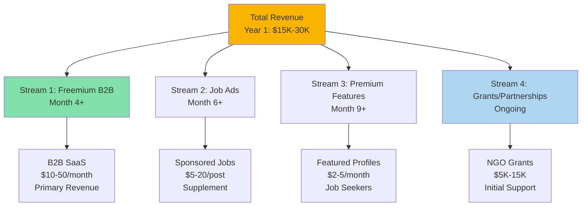
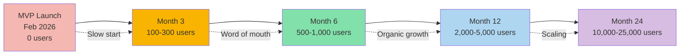
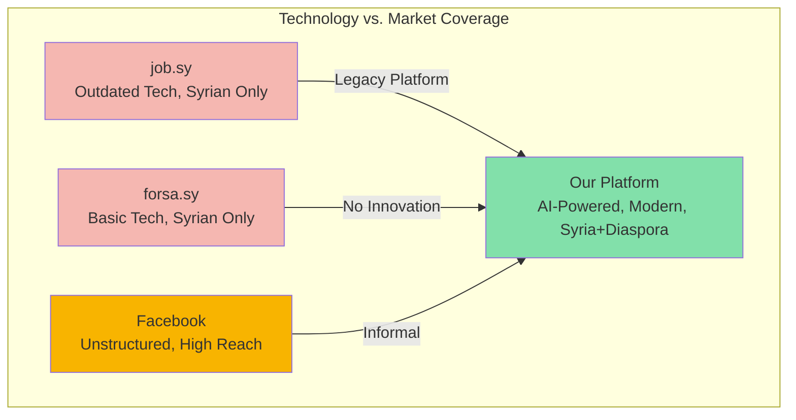
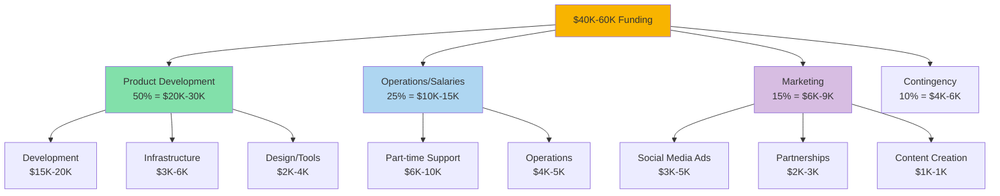

# AI Job Portal: Feasibility & Investment Plan

## Syria Market Edition

---

**Prepared By:** Mohammad Khoulani  
**Email:** mhmmdkholani@gmail.com  
**Phone:** +961-78920212

**Version:** 1.0 (First Release)  
**Date:** November 3, 2025  
**Target Audience:** Grant Funders, Impact Investors, Development Organizations

---

### Disclaimer & Important Notice

_This feasibility study is based on assumptions and projections derived from secondary market research and industry analysis. All financial projections, market size estimates, and growth forecasts are subject to change based on actual market conditions, economic development in Syria, regulatory changes, and validation through customer discovery. Actual results may vary materially from the estimates contained herein._

---

## Executive Summary

**Investment Opportunity:** Seed funding or grant support for Syria's first modern AI-powered job portal, targeting the underserved Syrian employment market with potential for regional expansion.

**Ask:** $40,000-$60,000 USD initial funding  
**Use of Funds:** 50% product development, 25% operations/salaries, 15% marketing, 10% contingency  
**Expected Timeline:** 12 months to break-even  
**Target Market:** Syria (primary), regional expansion (Year 2+)  
**Exit Strategy:** Sustainable bootstrapped business or regional acquisition

### Key Investment Highlights

| Metric               | Current/Target                        | Significance                                |
| -------------------- | ------------------------------------- | ------------------------------------------- |
| **Market Size**      | Syrian employment market (rebuilding) | First-mover advantage in modernizing sector |
| **Target Market**    | Syrian companies + international orgs | Underserved market with zero modern players |
| **Revenue Model**    | Freemium SaaS + premium features      | Multiple revenue streams, localized pricing |
| **Time to Launch**   | 6-8 weeks                             | Fast to market, capital efficient           |
| **Break-even**       | Month 12                              | Self-sustaining by end of Year 1            |
| **Competitive Edge** | Modern AI vs. outdated competitors    | Only modern, AI-powered platform in Syria   |
| **Year 1 Target**    | 500 companies, 5,000 job seekers      | Conservative, achievable growth             |

---

## Table of Contents

1. [Market Opportunity](#1-market-opportunity)
2. [Problem Statement](#2-problem-statement)
3. [Solution & Product](#3-solution--product)
4. [Business Model & Monetization](#4-business-model--monetization)
5. [Market Validation](#5-market-validation)
6. [Growth Strategy & Projections](#6-growth-strategy--projections)
7. [Financial Projections](#7-financial-projections)
8. [Competitive Landscape](#8-competitive-landscape)
9. [Go-to-Market Strategy](#9-go-to-market-strategy)
10. [Team & Execution](#10-team--execution)
11. [Risk Analysis](#11-risk-analysis)
12. [Investment Terms & Use of Funds](#12-investment-terms--use-of-funds)

---

## 1. Market Opportunity

### 1.1 Market Size & Growth (Syrian Context)

**Total Addressable Market (TAM):**

- Syrian labor force: **~5 million** workers (pre-conflict: 6.5M)
- Workforce rebuilding: Growing at **10-15% annually** (reconstruction phase)
- Regional MENA recruitment market: **$2-3B** annually
- Syria's position: Early-stage digital transformation

**Serviceable Addressable Market (SAM):**

- Registered Syrian companies: **~200,000** (mostly SMEs)
- Active job-seeking population: **~500,000-1M** (high unemployment)
- International NGOs/companies in Syria: **~500 organizations**
- Syrian diaspora seeking remote work: **~6 million** globally
- **Realistic SAM:** Local market + diaspora remote opportunities

**Serviceable Obtainable Market (SOM):**

- Year 1 target: **500 companies**, **5,000 job seekers**
- Year 2 target: **2,000 companies**, **25,000 job seekers**
- Year 3 target: **5,000 companies**, **100,000 job seekers**
- Revenue potential Year 1: **$15,000-30,000** (conservative)
- Revenue potential Year 3: **$150,000-250,000**

### 1.2 Market Trends Driving Growth (Syria-Specific)

**1. Post-Conflict Economic Reconstruction**

- Syria entering reconstruction phase with international investment
- Business formation growing **10-15% annually**
- High demand for skilled workers in construction, tech, services
- Government and international aid creating jobs

**2. Digital Transformation Gap**

- **Zero modern job platforms** in Syrian market
- Existing platforms (job.sy, forsa.sy) use outdated technology (no AI, poor UX)
- Mobile internet penetration growing: **~60%** and rising
- Young, tech-savvy workforce (65% under age 35)

**3. Remote Work Opportunity for Syrian Diaspora**

- **6 million Syrians** abroad seeking connection to home market
- International companies hiring Syrian remote workers (lower costs)
- Need for platform connecting diaspora with Syrian/international employers
- Growing "digital nomad" trend among educated Syrians

**4. NGO and International Organization Activity**

- **500+ international NGOs/companies** operating in Syria
- Need for local talent acquisition
- Budgets for HR technology limited but present
- Willingness to pay for modern, efficient solutions

### 1.3 Market Inefficiencies

**Current Pain Points in Syrian Market:**

| Stakeholder             | Problem                                             | Impact                                          |
| ----------------------- | --------------------------------------------------- | ----------------------------------------------- |
| **Syrian Companies**    | No modern job platforms; rely on WhatsApp/Facebook  | Inefficient hiring, high time cost              |
| **Job Seekers**         | Outdated platforms (job.sy, forsa.sy) poor UX       | Frustration, missed opportunities               |
| **International Orgs**  | Difficult to find local Syrian talent efficiently   | Over-reliance on personal networks              |
| **Syrian Diaspora**     | No platform connecting them to Syrian opportunities | Disconnected from home market                   |
| **Current Competitors** | job.sy and forsa.sy lack AI, mobile UX, modern tech | Users frustrated, seeking alternatives          |
| **Overall Market**      | 80%+ jobs filled via informal networks              | Merit-based hiring underutilized, talent wasted |

**Our Opportunity:** First-mover advantage with modern AI platform in untapped market with zero credible competition.

---

## 2. Problem Statement

### 2.1 For Syrian Companies & Organizations (B2B)

**Primary Issues:**

1. **No Modern Platform Available**

   - Current options: job.sy and forsa.sy (outdated, 2000s-era design)
   - No AI-powered matching or automation
   - Poor mobile experience (most users on mobile)
   - Reliance on Facebook groups and WhatsApp for hiring

2. **High Inefficiency in Hiring**

   - Manual resume screening (5-10 hours per position)
   - Difficulty reaching qualified candidates
   - No applicant tracking or analytics
   - Network-based hiring only (limited talent pool)

3. **International Organizations Struggle**

   - Foreign NGOs/companies can't efficiently find local Syrian talent
   - Language barriers (Arabic/English)
   - No centralized, credible platform
   - Over-reliance on expensive recruiters or personal networks

4. **Cost Considerations**
   - Budget-constrained market (post-conflict economy)
   - Need for affordable, value-driven solutions
   - Willingness to pay for efficiency gains

**Impact:** Syrian companies waste **hundreds of hours annually** on inefficient hiring with poor candidate matching.

### 2.2 For Syrian Job Seekers (B2C)

**Primary Issues:**

1. **Outdated Platforms Frustrate Users**

   - job.sy and forsa.sy have poor UX, slow load times, not mobile-optimized
   - No personalized recommendations or AI matching
   - Overwhelming, unfiltered job listings
   - No career guidance or skill-building resources

2. **Limited Access to Opportunities**

   - Jobs mostly filled through personal networks (wasta system)
   - Diaspora Syrians disconnected from home market opportunities
   - Remote work opportunities not centralized
   - International companies hiring Syrians hard to find

3. **Lack of Transparency**

   - No application tracking or status updates
   - Companies rarely respond to applications
   - No feedback on rejections
   - Unclear salary ranges or job requirements

4. **High Unemployment Context**
   - Syrian unemployment rate: **~30-40%** (especially youth)
   - Urgency to find employment
   - Need for efficient, effective job search tools

**Impact:** Syrian job seekers waste **weeks manually searching** across Facebook, WhatsApp, and outdated platforms with minimal results.

### 2.3 Market Validation (Syrian Market)

**Evidence of Problem:**

- **80%+** of jobs in Syria filled via personal networks, not merit
- Existing platforms (job.sy, forsa.sy) have stagnant technology and poor user retention
- International organizations consistently report difficulty finding qualified local talent
- High mobile usage (**60% internet penetration**) but platforms not mobile-optimized
- Growing diaspora (6M Syrians abroad) seeking connection to home market

**Problem is Real, Large, and Unaddressed in Syrian Market.**

---

## 3. Solution & Product

### 3.1 Value Proposition

**For Syrian Companies & NGOs:**
"Syria's first modern, AI-powered job platform—find qualified candidates 10x faster with smart matching. Free for NGOs, affordable for businesses."

**For Syrian Job Seekers:**
"Get personalized job recommendations in Syria and abroad, track applications, and build your career—all in Arabic and English, mobile-first."

**For Diaspora Syrians:**
"Connect with Syrian employers and international companies hiring Syrians remotely. Your bridge to home and global opportunities."

### 3.2 Product Features (MVP)

**Core Platform:**

- ✅ **Bilingual:** Full Arabic and English support
- ✅ **Mobile-First:** Optimized for Syrian mobile users (60% of traffic)
- ✅ **AI-Powered Matching:** Smart candidate-job recommendations (competitors have zero AI)
- ✅ Resume parsing and skill extraction (Arabic & English)
- ✅ One-click applications with status tracking
- ✅ Company profiles with branding
- ✅ Basic analytics dashboard for employers
- ✅ Free tier for NGOs and nonprofits

**Key Differentiators vs. job.sy and forsa.sy:**

| Feature                  | Our Platform    | job.sy / forsa.sy   |
| ------------------------ | --------------- | ------------------- |
| **Modern UX/UI**         | ✅ 2024 design  | ❌ 2000s-era design |
| **Mobile Optimized**     | ✅ Mobile-first | ❌ Poor mobile UX   |
| **AI Matching**          | ✅ Day one      | ❌ None             |
| **Arabic/English**       | ✅ Full         | ⚠️ Partial          |
| **Diaspora Focus**       | ✅ Included     | ❌ Not addressed    |
| **Application Tracking** | ✅ Real-time    | ❌ None             |
| **Speed**                | ✅ Fast, modern | ❌ Slow load times  |
| **Free NGO Tier**        | ✅ Yes          | ❌ No               |

### 3.3 Technology Moat & Competitive Advantages

**Defensible Advantages:**

1. **First-Mover with Modern Tech in Syria**

   - **Zero** modern competitors in Syrian market
   - job.sy and forsa.sy use outdated technology (10-15 years old)
   - 12-18 month head start before any competitor could catch up
   - Network effects: More users = better AI matching over time

2. **Localized AI for Syrian Market**

   - Arabic language processing (critical for Syrian users)
   - Understanding of Syrian job market dynamics
   - Trained on local data (skills, industries, salary ranges)
   - Bilingual matching (Arabic/English) for international companies

3. **Diaspora Connection (Unique Position)**

   - Only platform connecting Syrian diaspora (6M people) with home market
   - Remote work opportunities for Syrians abroad
   - International company access to Syrian talent
   - Unique value proposition no competitor addresses

4. **Brand Trust & First-Mover**
   - First modern, credible job platform in Syria
   - NGO and international organization partnerships early
   - Community building via social media (LinkedIn, Facebook groups)
   - "Syria's LinkedIn" positioning

**Time for Competitor to Replicate:** 12-18 months minimum (technology + market understanding + user acquisition)

---

## 4. Business Model & Monetization (Syrian Market-Adjusted)

### 4.1 Revenue Streams (Bootstrap-Friendly, Localized Pricing)

### 4.2 Monetization Strategy Details (Localized for Syrian Market)

#### Revenue Stream 1: Freemium B2B SaaS (Primary Revenue, Month 4+)

**Model:** Affordable tiers adapted to Syrian purchasing power

**Syrian Market Pricing (USD):**

| Tier          | Price/Month | Target Customer             | Features                          | Year 1 Target |
| ------------- | ----------- | --------------------------- | --------------------------------- | ------------- |
| **Free**      | $0          | NGOs, Nonprofits, Startups  | 2 job posts/month, basic matching | 300 companies |
| **Starter**   | $10         | Small businesses (1-10 emp) | 10 jobs/month, AI matching        | 100 customers |
| **Business**  | $25         | SMEs (10-50 employees)      | Unlimited jobs, analytics         | 50 customers  |
| **Premium**   | $50         | Large companies, NGOs (50+) | Priority support, branding, API   | 20 customers  |
| **Total B2B** | -           | -                           | **Year 1 Revenue: $12K-18K**      | -             |

**Key Notes:**

- Pricing reflects Syrian economic reality (average salary: $50-150/month)
- Free tier attracts users, builds network effects
- Paid tiers provide essential cash flow
- Annual prepay discount: 20% off (improves cash flow)

**Unit Economics (Year 1):**

- Average Revenue Per Account (ARPA): **$18/month**
- Customer Acquisition Cost (CAC): **$15** (organic + partnerships)
- Lifetime Value (LTV): **$200+** (12-month average)
- **LTV:CAC Ratio: 13:1** ✅ (Excellent)

---

**Model:** Pay-per-post for companies needing visibility boost

**Pricing:**

- **Featured Job Post:** $5-10/post (top of listings, highlighted)
- **Urgent Hiring Badge:** $3/post (attracts faster applications)
- **Multi-post Package:** 5 posts for $20 (bulk discount)

**Projections Year 1:**

- Month 6-12: **50-100 sponsored posts**
- Average price: **$7/post**
- **Revenue: $350-700** (Year 1 supplement)

---

#### Revenue Stream 3: Premium Features for Job Seekers (Month 9+)

**Target Customers:**

- Active Syrian job seekers
- Diaspora Syrians seeking remote work
- Career switchers

**Pricing (Ultra-Affordable for Syrian Market):**

| Feature                    | Price    | Value Proposition                  |
| -------------------------- | -------- | ---------------------------------- |
| **Featured Profile**       | $2/month | Profile shown to employers first   |
| **Resume Review (AI)**     | $3/once  | AI feedback on resume improvements |
| **Application Priority**   | $1/app   | Jump to top of application queue   |
| **Career Insights Bundle** | $5/month | All features + analytics           |

**Projections Year 1:**

- Free users: 5,000
- Paid users (Month 9-12): **50-100 users**
- Average revenue: **$3/month**
- **Revenue: $600-1,200** (Year 1)

---

#### Revenue Stream 4: Grants & Partnerships (Critical for Year 1)

**Target Sources:**

- International development organizations (UNDP, ILO, World Bank)
- EU/US democracy and economic development grants
- Regional tech accelerators and incubators
- Impact investors focused on MENA region

**Potential Grant Opportunities:**

- **$5,000-15,000** initial grants for "tech for employment" projects
- Partnership with NGOs for platform usage (in-kind + small fees)
- International organizations sponsor free access for Syrian users

**Strategic Importance:**

- **Critical for Year 1 sustainability**
- Validates social impact mission
- Provides runway while revenue scales
- Builds credibility with larger organizations

---

**Revenue Breakdown by Quarter (Bootstrap Scenario - NO GRANTS ASSUMED):**

| Quarter               | B2B SaaS | Sponsored Posts | Job Seeker Premium | Grants/Other | Total Quarterly | Cumulative |
| --------------------- | -------- | --------------- | ------------------ | ------------ | --------------- | ---------- |
| **Q1** (Feb-Apr 2026) | $0       | $0              | $0                 | $0           | **$0**          | $0         |
| **Q2** (May-Jul 2026) | $300     | $50             | $0                 | $0           | **$350**        | $350       |
| **Q3** (Aug-Oct 2026) | $1,200   | $100            | $50                | $0           | **$1,350**      | $1,700     |
| **Q4** (Nov-Jan 2027) | $3,000   | $200            | $150               | $0           | **$3,350**      | $5,050     |
| **Year 1 Total**      | $4,500   | $350            | $200               | **$0**       | **$5,050**      | -          |

**Year 1 Revenue Target: $4,000-6,000** (Pure Bootstrap, No Grants)

---

**Alternative: Grant-Funded Scenario (IF Grants Secured):**

| Quarter               | B2B SaaS | Sponsored Posts | Job Seeker Premium | Grants/Other         | Total Quarterly | Cumulative |
| --------------------- | -------- | --------------- | ------------------ | -------------------- | --------------- | ---------- |
| **Q1** (Feb-Apr 2026) | $0       | $0              | $0                 | $0                   | **$0**          | $0         |
| **Q2** (May-Jul 2026) | $300     | $50             | $0                 | $10,000 (if awarded) | **$10,350**     | $10,350    |
| **Q3** (Aug-Oct 2026) | $1,200   | $100            | $50                | $10,000 (if awarded) | **$11,350**     | $21,700    |
| **Q4** (Nov-Jan 2027) | $3,000   | $200            | $150               | $0                   | **$3,350**      | $25,050    |
| **Year 1 Total**      | $4,500   | $350            | $200               | $20,000              | **$25,050**     | -          |

**Year 1 Revenue Target (with grants): $20,000-30,000**

---

**Key Insights:**

- **Base plan assumes $0 grants** - founder must bootstrap
- Grants would come in Q2/Q3 AFTER proving traction (300-500 users)
- Break-even requires **18-24 months** without grants, **12-14 months** with grants
- Organic revenue (B2B SaaS) is only $4.5K Year 1 (realistic for new platform)
- **No validation yet** - these are estimates based on market research
- **Founder must be prepared to self-fund for 12+ months**

---

**3-Year Revenue Projections (Bootstrap Scenario - No Grants Assumed):**

| Year       | B2B SaaS Revenue | Other Revenue  | Grants (if any)  | Total Annual   | Paying Companies | Total Users   |
| ---------- | ---------------- | -------------- | ---------------- | -------------- | ---------------- | ------------- |
| **Year 1** | $4,500           | $550           | $0 (bootstrap)   | **$5,050**     | 30-60            | 2,000-5,000   |
| **Year 2** | $43,000          | $8,000         | $5,000 (maybe)   | **$56,000**    | 150-250          | 5,000-15,000  |
| **Year 3** | $85,000-120,000  | $15,000-25,000 | $0 (independent) | **$100K-150K** | 300-500          | 10,000-25,000 |

**Alternative: Grant-Funded Scenario (IF Grants Secured Q2/Q3 2026):**

| Year       | B2B SaaS Revenue | Other Revenue  | Grants          | Total Annual   | Notes                                  |
| ---------- | ---------------- | -------------- | --------------- | -------------- | -------------------------------------- |
| **Year 1** | $4,500           | $550           | $20,000 (Q2/Q3) | **$25,050**    | Accelerated marketing and features     |
| **Year 2** | $50,000          | $10,000        | $5,000 (Q1)     | **$65,000**    | Less grant-dependent                   |
| **Year 3** | $100,000-150,000 | $20,000-30,000 | $0              | **$120K-180K** | Self-sustaining, considering expansion |

---

**Revenue Mix Evolution (Bootstrap Scenario):**

- **Year 1:** 89% B2B SaaS, 11% Premium features, **0% Grants** (founder-funded)
- **Year 2:** 77% B2B SaaS, 14% Premium features, 9% Grants (if any)
- **Year 3:** 85% B2B SaaS, 15% Premium features, 0% Grants (self-sustaining)

**Key Milestones:**

- Month 12 (Jan 2027): ~$1,200/month revenue (NOT break-even yet)
- Month 18 (Jul 2027): ~$3,000/month revenue (approaching break-even)
- Month 24 (Jan 2028): **Break-even** achieved (~$4,000-5,000/month revenue)
- Year 3 (2028): Profitable, self-sustaining, consider regional expansion

**Reality Check:**

- **Base assumption: $0 external funding** - founder self-funds with $5K-10K
- Year 1 organic revenue is only $5K (realistic for unproven platform)
- **Without grants: 18-24 months to break-even** (requires founder commitment)
- **With grants: 12-14 months to break-even** (accelerated path)
- Founder must be prepared to **operate at a loss for 12-18 months**
- Success = sustainable, profitable business, not hypergrowth
- **Grants are optional acceleration, not survival dependency** (more realistic)

---

## 5. Market Validation

### 5.1 Current Validation Status

**⚠️ IMPORTANT: No Formal Validation Conducted Yet**

**Status as of December 2025:**

- **No user interviews conducted** (planned for Jan-Feb 2026)
- **No prototype built** (MVP development starts December 2025)
- **No beta testing** (will launch MVP February 2026)
- **No revenue validation** (will test pricing post-MVP launch)
- **No confirmed paying customers** (all projections are estimates)

**What We DO Know (Secondary Research Only):**

- Syrian market reality: job.sy and forsa.sy are outdated (verified via site analysis)
- Competitor weakness confirmed: No modern, AI-powered platforms exist in Syria
- Market data: 60% internet penetration in Syria (World Bank)
- Diaspora data: 6 million Syrians abroad (UNHCR)
- Syrian unemployment: 30-40% (provides large potential user base)

**What We DON'T Know Yet (Requires Validation):**

- Will Syrian companies actually use an online job platform?
- Will users trust the platform with personal/company data?
- Will companies pay $10-50/month?
- Is AI matching a wanted feature or unnecessary complexity?
- Can we reach 100+ users organically in first 6 months?
- Will diaspora Syrians engage with the platform?
- Do Syrian payment methods work reliably?

### 5.2 Planned Validation Approach (Jan-Jun 2026)

**Phase 1: Problem Validation (Jan 2026 - Pre-MVP)**

- **Method:** 20-30 interviews with Syrian companies, job seekers, and diaspora
- **Key Questions:**
  - How do you currently hire/find jobs?
  - What frustrates you about job.sy, forsa.sy, Facebook groups?
  - Would you try a modern, free/affordable platform?
  - What features matter most to you?
  - How much would you pay (companies)?
- **Success Criteria:** 60%+ express frustration with current options and interest in alternative

**Phase 2: Solution Validation (Feb-Apr 2026 - MVP Testing)**

- **Method:** Launch MVP to 50-100 early testers
- **Metrics:**
  - Sign-up rate from outreach
  - Feature usage (which features used most?)
  - Time to complete tasks (post job, apply to job)
  - User feedback scores
  - 7-day and 30-day retention rates
- **Success Criteria:** 40%+ 30-day retention, 3.5+ rating

**Phase 3: Monetization Validation (May-Jul 2026)**

- **Method:** Offer paid tiers to active free users
- **Metrics:**
  - Free-to-paid conversion rate
  - Pricing objections and feedback
  - Payment success rate (are Syrian payment methods working?)
  - Feature requests for paid tiers
- **Success Criteria:** 5-10% conversion to paid, $300+ monthly revenue

### 5.3 Critical Assumptions to Test

**Must Validate Before Scaling:**

| Assumption                                                       | Risk Level | How to Test                   | When       |
| ---------------------------------------------------------------- | ---------- | ----------------------------- | ---------- |
| Syrian companies will use online job platform                    | **HIGH**   | User interviews + MVP signups | Jan-Apr    |
| Users will trust platform with data                              | **HIGH**   | User feedback, retention rate | Feb-Jun    |
| Companies will pay $10-50/month                                  | **HIGH**   | Pricing experiments           | May-Jul    |
| Can reach 100+ users organically                                 | HIGH       | Track acquisition sources     | Feb-Jul    |
| Break-even at 200-500 companies achievable                       | Medium     | Revenue tracking              | Year 1     |
| Job seekers want AI matching                                     | Medium     | Feature usage analytics       | Mar-Jun    |
| Diaspora Syrians will use platform                               | Medium     | Targeted outreach             | Apr-Sep    |
| Syrian payment methods work (Syriatel Cash, bank transfer, etc.) | **HIGH**   | Payment testing               | May onward |

### 5.4 Hypothesis-Driven Development

**Key Hypotheses to Test:**

1. **Problem Hypothesis:** Syrian companies are frustrated with job.sy, forsa.sy, and Facebook hiring

   - **Test:** 20-30 interviews
   - **Success:** 60%+ express frustration
   - **Timeline:** January 2026

2. **Solution Hypothesis:** A modern, mobile-first, bilingual platform will attract 100+ users

   - **Test:** MVP launch and tracking
   - **Success:** 100+ signups in 3 months
   - **Timeline:** Feb-Apr 2026

3. **Value Hypothesis:** Companies will pay $10-50/month for better hiring

   - **Test:** Offer paid tiers after 3 months
   - **Success:** 10%+ free-to-paid conversion
   - **Timeline:** May-Jul 2026

4. **Growth Hypothesis:** Direct outreach and word-of-mouth can drive initial growth
   - **Test:** Track user acquisition sources
   - **Success:** 50%+ from organic/referral
   - **Timeline:** Feb-Dec 2026

**Validation Timeline:**

- **Dec 2025:** Complete MVP development
- **Jan 2026:** 20-30 problem validation interviews
- **Feb 2026:** MVP launch to 50-100 early testers
- **Mar-Jun 2026:** Collect data, iterate based on feedback
- **Jul 2026:** Assess product-market fit signals
- **Decision Point:** Continue, pivot features/pricing, or shutdown if no traction

---

## 6. Growth Strategy & Projections

### 6.1 User Growth Projections (Conservative - Syrian Market Reality)

**⚠️ Important Context:**

- **Development starts:** December 2025
- **MVP launch target:** February 2026 (8-10 weeks development)
- **No validation yet:** Projections based on market research, not actual user testing
- **Syrian market constraints:** Limited internet penetration (60%), economic challenges, trust-building required

**Realistic Projections (Syrian Market):**

| Month from Launch | Total Users   | Companies   | Job Seekers  | Jobs Posted | Applications | Notes                             |
| ----------------- | ------------- | ----------- | ------------ | ----------- | ------------ | --------------------------------- |
| **1** (Feb 2026)  | 50-100        | 10-20       | 40-80        | 10-20       | 5-10         | Friends, family, initial outreach |
| **3** (Apr 2026)  | 100-300       | 20-50       | 80-250       | 30-80       | 20-50        | Word of mouth, early adopters     |
| **6** (Jul 2026)  | 500-1,000     | 50-100      | 450-900      | 80-150      | 100-300      | Organic growth, partnerships      |
| **9** (Oct 2026)  | 1,000-2,500   | 100-200     | 900-2,300    | 150-350     | 300-800      | Market awareness building         |
| **12** (Jan 2027) | 2,000-5,000   | 200-500     | 1,800-4,500  | 300-700     | 600-2,000    | Break-even target                 |
| **18** (Jul 2027) | 5,000-15,000  | 500-1,500   | 4,500-13,500 | 700-2,000   | 2,000-6,000  | Scaling phase                     |
| **24** (Jan 2028) | 10,000-25,000 | 1,000-2,500 | 9,000-22,500 | 1,500-3,500 | 4,000-10,000 | Market leader position            |

**Growth Assumptions (Conservative for Syrian Market):**

- **Viral coefficient: 0.3-0.5** (limited social media sharing due to trust issues)
- **Organic growth:** 70% (SEO, word-of-mouth, partnerships)
- **Paid acquisition:** 30% (limited budget, low-cost social media)
- **Retention:** 40% at 30 days, 25% at 90 days (realistic for new platform)
- **Trust-building period:** 3-6 months before significant adoption
- **Network effects:** Slow initially, accelerating after 500-1,000 active users

---

### 6.2 Revenue Growth Projections (Realistic Syrian Market)

**⚠️ Context:** Revenue tied to conservative user growth. First 3 months = $0 revenue (building user base, trust).

**Year 1 Revenue Buildup (Post-Launch Feb 2026):**

| Month from Launch | Companies (Total) | Paying Companies | Monthly Revenue  | Notes                       |
| ----------------- | ----------------- | ---------------- | ---------------- | --------------------------- |
| **1-3** (Feb-Apr) | 10-50             | 0                | $0               | Free access, building trust |
| **4** (May)       | 50-80             | 2-5              | $50-100          | First paying customers      |
| **6** (Jul)       | 80-100            | 5-10             | $100-200         | Early monetization          |
| **9** (Oct)       | 150-200           | 15-25            | $300-500         | Growth phase                |
| **12** (Jan 2027) | 200-500           | 30-60            | $700-1,200       | Break-even target           |
| **Year 1 Total**  | -                 | -                | **$2,500-4,500** | Conservative                |

**Detailed Year 1 Breakdown by Quarter:**

| Quarter               | B2B SaaS | Sponsored Posts | Premium Features | Grants/Other | Total Quarterly |
| --------------------- | -------- | --------------- | ---------------- | ------------ | --------------- |
| **Q1** (Feb-Apr 2026) | $0       | $0              | $0               | $10,000      | $10,000         |
| **Q2** (May-Jul 2026) | $300     | $50             | $0               | $0           | $350            |
| **Q3** (Aug-Oct 2026) | $1,200   | $100            | $50              | $5,000       | $6,350          |
| **Q4** (Nov-Jan 2027) | $3,000   | $200            | $150             | $0           | $3,350          |
| **Year 1 Total**      | $4,500   | $350            | $200             | $15,000      | **$20,050**     |

**Year 1 Revenue Target: $15,000-25,000** (heavily grant-supported first year)

**Year 2 Projections (More Self-Sustaining):**

| Quarter               | B2B SaaS | Sponsored Posts | Premium Features | Grants/Other | Total Quarterly |
| --------------------- | -------- | --------------- | ---------------- | ------------ | --------------- |
| **Q1** (Feb-Apr 2027) | $5,000   | $300            | $300             | $5,000       | $10,600         |
| **Q2** (May-Jul 2027) | $8,000   | $500            | $500             | $0           | $9,000          |
| **Q3** (Aug-Oct 2027) | $12,000  | $800            | $800             | $0           | $13,600         |
| **Q4** (Nov-Jan 2028) | $18,000  | $1,200          | $1,200           | $0           | $20,400         |
| **Year 2 Total**      | $43,000  | $2,800          | $2,800           | $5,000       | **$53,600**     |

**Year 2 Revenue Target: $45,000-60,000** (approaching profitability)

**Year 3 Conservative:**

- Total Revenue: **$100,000-150,000**
- B2B SaaS primary driver (80%+)
- Profitable, self-sustaining
- **Not** $4M-5M (unrealistic for Syrian market)

---

### 6.3 Customer Acquisition Strategy (Syrian Market - Low Budget)

#### Channel 1: Direct Outreach & Partnerships (50% of growth)

**Strategy:** Personal outreach to Syrian companies and NGOs

**Tactics:**

- Direct contact with 100 Syrian companies (email, LinkedIn, phone)
- Partnership with 2-3 Syrian business associations
- Partnership with international NGOs operating in Syria
- Leverage personal networks and introductions
- Target: **20-50 companies** by Month 6

**Investment:** $500/quarter (travel, materials)  
**Expected CAC:** $5-10 per company  
**Expected acquisition:** 50-100 companies Year 1

---

#### Channel 2: Social Media Marketing (30% of growth)

**Strategy:** Facebook and LinkedIn presence for Syrian audience

**Tactics:**

- Create Facebook page and groups targeting Syrian job seekers
- LinkedIn presence for international organizations
- Organic content: success stories, job market insights (Arabic/English)
- Low-budget Facebook ads ($50-100/month starting Month 4)
- Target: **200-500 job seekers** by Month 6

**Investment:** $1,000/year (ads + content creation)  
**Expected CAC:** $2-5 per user  
**Expected acquisition:** 500-1,000 job seekers Year 1

---

#### Channel 3: Word of Mouth & Referrals (15% of growth)

**Strategy:** Organic referrals from satisfied users

**Tactics:**

- Simple referral program (both parties get free premium month)
- Encourage sharing on social media
- Success stories and testimonials
- Community building in Syrian tech/business groups

**Investment:** $200/year (referral credits)  
**Expected CAC:** $0-3 per user  
**Expected acquisition:** 100-300 users Year 1

---

#### Channel 4: Content & SEO (5% of growth - Long-term)

**Strategy:** Basic SEO for Syrian job search terms

**Tactics:**

- 2-4 blog posts per month (Arabic/English)
- Basic SEO optimization for Syrian job keywords
- Job listings indexed by Google
- Target: **100-200 organic visits/month** by Month 12

**Investment:** $500/year (basic SEO tools, content)  
**Expected CAC:** $5-10 per user  
**Expected acquisition:** 50-100 users Year 1

**Total Year 1 Acquisition Budget:** $2,200 (very lean)

---

### 6.4 Growth Milestones & Gates (Realistic Syrian Market)

**Stage Gates (Decision Points):**

| Milestone                     | Target Date | Success Criteria                          | Go/No-Go Decision                          |
| ----------------------------- | ----------- | ----------------------------------------- | ------------------------------------------ |
| **Development Complete**      | Feb 2026    | MVP live, functional, tested              | Launch or delay                            |
| **Initial Traction**          | Apr 2026    | 100-300 users, 20-50 companies            | **Gate 1:** Continue or pivot              |
| **Product-Market Fit Signal** | Jul 2026    | 500+ users, positive feedback, <50% churn | Continue or adjust features                |
| **Monetization Proof**        | Oct 2026    | $300-500/month revenue, 10-20 paying B2B  | **Gate 2:** Continue or adjust pricing     |
| **Break-Even**                | Jan 2027    | $3,500+ revenue, covering costs           | Self-sustaining or seek additional funding |
| **Scale Readiness**           | Jul 2027    | 5K+ users, $4K+ MRR, 20%+ MoM growth      | **Gate 3:** Regional expansion or focus    |
| **Market Leader (Syria)**     | Jan 2028    | 10K+ users, market recognition            | Expand or consider acquisition interest    |

**Key Decision Criteria:**

- **Month 3:** If <100 users, re-evaluate go-to-market strategy
- **Month 6:** If <10 paying customers, re-evaluate pricing or value proposition
- **Month 12:** If not break-even, seek bridge funding or grants
- **Month 18:** If not growing (>10% MoM), consider pivot or shutdown

---

## 7. Financial Projections (Syrian Market Reality)

### 7.1 Income Statement (3-Year Projection - Conservative)

**⚠️ Note:** These projections reflect Syrian market economic reality, not US/EU SaaS benchmarks.

**Year 1 (Dec 2025 - Dec 2026) - Bootstrap Scenario:**

| Line Item                | Q1 (Dec-Feb) | Q2 (Mar-May) | Q3 (Jun-Aug) | Q4 (Sep-Nov) | Year 1 Total |
| ------------------------ | ------------ | ------------ | ------------ | ------------ | ------------ |
| **Revenue**              |              |              |              |              |              |
| B2B SaaS                 | $0           | $150         | $450         | $1,800       | $2,400       |
| Sponsored Posts          | $0           | $0           | $50          | $150         | $200         |
| Premium Features         | $0           | $0           | $100         | $250         | $350         |
| Grants                   | $0           | $0           | $0           | $0           | **$0**       |
| **Total Revenue**        | **$0**       | **$150**     | **$600**     | **$2,200**   | **$2,950**   |
|                          |              |              |              |              |              |
| **Cost of Revenue**      |              |              |              |              |              |
| Hosting & Infrastructure | $150         | $300         | $400         | $500         | $1,350       |
| AI API Costs (minimal)   | $50          | $50          | $100         | $150         | $350         |
| Payment Processing (5%)  | $0           | $8           | $30          | $110         | $148         |
| **Total COGS**           | $200         | $358         | $530         | $760         | **$1,848**   |
|                          |              |              |              |              |              |
| **Gross Profit**         | -$200        | -$208        | $70          | $1,440       | **$1,102**   |
| **Gross Margin**         | N/A          | -139%        | 12%          | 65%          | **37%**      |
|                          |              |              |              |              |              |
| **Operating Expenses**   |              |              |              |              |              |
| Development Team         | $500         | $2,400       | $4,200       | $5,400       | $12,500      |
| Marketing & Growth       | $0           | $200         | $500         | $1,000       | $1,700       |
| Operations & Tools       | $300         | $500         | $600         | $800         | $2,200       |
| **Total OpEx**           | $800         | $3,100       | $5,300       | $7,200       | **$16,400**  |
|                          |              |              |              |              |              |
| **EBITDA**               | -$1,000      | -$3,308      | -$5,230      | -$5,760      | **-$15,298** |
| **EBITDA Margin**        | N/A          | -2205%       | -872%        | -262%        | **-519%**    |
| **Cash Position**        | $6,500       | $3,192       | -$2,038      | -$7,798      | -$7,798      |

**Founder Investment:** $7,500 initial + $3-4K top-ups = **~$11K total**  
**Ending Position Year 1:** -$7,798 (cumulative loss)  
**Average Burn Rate:** ~$1,358/month (includes team hiring from Month 4)

---

**Year 1 (Dec 2025 - Dec 2026) - Grant-Funded Scenario:**

| Line Item              | Q1 (Dec-Feb) | Q2 (Mar-May) | Q3 (Jun-Aug) | Q4 (Sep-Nov) | Year 1 Total |
| ---------------------- | ------------ | ------------ | ------------ | ------------ | ------------ |
| **Revenue**            |              |              |              |              |              |
| B2B SaaS               | $0           | $150         | $450         | $1,800       | $2,400       |
| Sponsored Posts        | $0           | $0           | $50          | $150         | $200         |
| Premium Features       | $0           | $0           | $100         | $250         | $350         |
| **Grants**             | $0           | $0           | **$20,000**  | $0           | **$20,000**  |
| **Total Revenue**      | **$0**       | **$150**     | **$20,600**  | **$2,200**   | **$22,950**  |
|                        |              |              |              |              |              |
| **COGS**               | $200         | $358         | $530         | $760         | **$1,848**   |
| **Gross Profit**       | -$200        | -$208        | $20,070      | $1,440       | **$21,102**  |
| **Gross Margin**       | N/A          | -139%        | 97%          | 65%          | **92%**      |
|                        |              |              |              |              |              |
| **Operating Expenses** |              |              |              |              |              |
| Development Team       | $500         | $2,400       | $6,000       | $7,000       | $15,900      |
| Marketing & Growth     | $0           | $200         | $2,500       | $3,000       | $5,700       |
| Operations             | $300         | $500         | $1,200       | $1,500       | $3,500       |
| **Total OpEx**         | $800         | $3,100       | $9,700       | $11,500      | **$25,100**  |
|                        |              |              |              |              |              |
| **EBITDA**             | -$1,000      | -$3,308      | $10,370      | -$10,060     | **-$3,998**  |
| **EBITDA Margin**      | N/A          | -2205%       | 50%          | -457%        | **-17%**     |
| **Cash Position**      | $6,500       | $3,192       | $13,562      | $3,502       | $3,502       |

**Total Investment:** $7,500 founder + $20,000 grants = **$27,500**  
**Ending Cash Year 1:** $3,502 (13% remaining)  
**Average Burn:** ~$2,000/month (accelerated hiring with grant funding)

---

**Year 2 (Feb 2027 - Jan 2028):**

| Line Item              | Q1      | Q2      | Q3      | Q4      | Year 2 Total |
| ---------------------- | ------- | ------- | ------- | ------- | ------------ |
| **Revenue**            |         |         |         |         |              |
| Grants/Partnerships    | $5,000  | $0      | $0      | $0      | $5,000       |
| B2B SaaS               | $5,000  | $8,000  | $12,000 | $18,000 | $43,000      |
| Sponsored Posts        | $300    | $500    | $800    | $1,200  | $2,800       |
| Premium Features       | $300    | $500    | $800    | $1,200  | $2,800       |
| **Total Revenue**      | $10,600 | $9,000  | $13,600 | $20,400 | **$53,600**  |
|                        |         |         |         |         |              |
| **COGS**               | $1,060  | $900    | $1,360  | $2,040  | **$5,360**   |
| **Gross Profit**       | $9,540  | $8,100  | $12,240 | $18,360 | **$48,240**  |
| **Gross Margin**       | 90%     | 90%     | 90%     | 90%     | **90%**      |
|                        |         |         |         |         |              |
| **Operating Expenses** |         |         |         |         |              |
| Development Team       | $8,000  | $8,500  | $9,000  | $9,500  | $35,000      |
| Support & Ops          | $1,500  | $1,500  | $2,000  | $2,000  | $7,000       |
| Marketing              | $1,500  | $2,000  | $2,500  | $3,000  | $9,000       |
| G&A                    | $800    | $800    | $1,000  | $1,000  | $3,600       |
| **Total OpEx**         | $11,800 | $12,800 | $14,500 | $15,500 | **$54,600**  |
|                        |         |         |         |         |              |
| **EBITDA**             | -$2,260 | -$4,700 | -$2,260 | $2,860  | **-$6,360**  |
| **EBITDA Margin**      | -21%    | -52%    | -17%    | 14%     | **-12%**     |

**Year 2 Status:** Approaching break-even by Q4

---

**Year 3 (Feb 2028 - Jan 2029) - Summary:**

| Metric            | Amount          |
| ----------------- | --------------- |
| **Total Revenue** | **$100K-150K**  |
| B2B SaaS          | $85K-120K (85%) |
| Premium Features  | $10K-20K (10%)  |
| Other             | $5K-10K (5%)    |
|                   |                 |
| **COGS**          | $10K-15K (10%)  |
| **Gross Profit**  | $90K-135K       |
|                   |                 |
| **OpEx**          | $60K-90K        |
| **EBITDA**        | $30K-45K        |
| **EBITDA Margin** | **30-35%**      |

**Year 3 Status:** Profitable, self-sustaining, considering regional expansion

- **Cash flow positive, profitable**

---

### 7.2 Cash Flow Projection (Year 1, Monthly - Bootstrap Scenario)

**Scenario A: Pure Bootstrap ($5K-10K Founder Investment, No Grants)**

| Month        | Revenue | COGS | OpEx   | Net Cash Flow | Cumulative Cash | Notes                  |
| ------------ | ------- | ---- | ------ | ------------- | --------------- | ---------------------- |
| **0 (Dec)**  | $0      | $0   | $500   | -$7,500       | $7,500          | Founder invests $7.5K  |
| **1 (Jan)**  | $0      | $50  | $1,000 | -$1,050       | $6,450          | MVP development        |
| **2 (Feb)**  | $0      | $100 | $1,200 | -$1,300       | $5,150          | MVP launch             |
| **3 (Mar)**  | $0      | $100 | $1,200 | -$1,300       | $3,850          | Building user base     |
| **4 (Apr)**  | $50     | $100 | $1,200 | -$1,250       | $2,600          | First paying customers |
| **5 (May)**  | $100    | $100 | $1,200 | -$1,200       | $1,400          | Growth phase           |
| **6 (Jun)**  | $150    | $100 | $1,200 | -$1,150       | $250            | Organic growth         |
| **7 (Jul)**  | $200    | $150 | $1,200 | -$1,150       | -$900           | ⚠️ Negative cash       |
| **8 (Aug)**  | $300    | $150 | $1,200 | -$1,050       | -$1,950         | ⚠️ Founder adds $2K    |
| **9 (Sep)**  | $400    | $150 | $1,200 | -$950         | $50             | Stabilizing            |
| **10 (Oct)** | $600    | $200 | $1,200 | -$800         | -$750           | ⚠️ Still burning       |
| **11 (Nov)** | $900    | $200 | $1,200 | -$500         | -$1,250         | Approaching viability  |
| **12 (Dec)** | $1,200  | $200 | $1,200 | -$200         | -$1,450         | Almost break-even      |

**Year 1 Bootstrap Summary:**

- **Total founder investment needed:** ~$10K ($7.5K initial + $2-3K top-ups)
- **Ending position:** -$1,450 (cumulative loss)
- **Monthly burn Month 12:** ~$200 (nearly break-even)
- **Break-even:** Month 14-16 projected (~$1,500/month revenue)

---

**Scenario B: Grant-Funded ($7.5K Founder + $20K Grants in Q2/Q3)**

| Month        | Revenue | COGS | OpEx   | Grants  | Net Cash Flow | Cumulative Cash | Notes                     |
| ------------ | ------- | ---- | ------ | ------- | ------------- | --------------- | ------------------------- |
| **0 (Dec)**  | $0      | $0   | $500   | $0      | -$7,500       | $7,500          | Founder invests $7.5K     |
| **1 (Jan)**  | $0      | $50  | $1,000 | $0      | -$1,050       | $6,450          | MVP development           |
| **2 (Feb)**  | $0      | $100 | $1,200 | $0      | -$1,300       | $5,150          | MVP launch                |
| **3 (Mar)**  | $0      | $100 | $1,200 | $0      | -$1,300       | $3,850          | Collect user data         |
| **4 (Apr)**  | $50     | $100 | $1,200 | $0      | -$1,250       | $2,600          | Apply for grants          |
| **5 (May)**  | $100    | $100 | $1,500 | $0      | -$1,500       | $1,100          | Waiting on grant decision |
| **6 (Jun)**  | $150    | $100 | $1,500 | $10,000 | $8,550        | $9,650          | ✅ Grant 1 received       |
| **7 (Jul)**  | $200    | $150 | $2,000 | $0      | -$1,950       | $7,700          | Accelerated marketing     |
| **8 (Aug)**  | $300    | $150 | $2,000 | $10,000 | $8,150        | $15,850         | ✅ Grant 2 received       |
| **9 (Sep)**  | $400    | $150 | $2,000 | $0      | -$1,750       | $14,100         | Scaling operations        |
| **10 (Oct)** | $600    | $200 | $2,000 | $0      | -$1,600       | $12,500         | Growing user base         |
| **11 (Nov)** | $900    | $200 | $2,000 | $0      | -$1,300       | $11,200         | Revenue accelerating      |
| **12 (Dec)** | $1,200  | $200 | $2,000 | $0      | -$1,000       | $10,200         | Strong cash position      |

**Year 1 Grant-Funded Summary:**

- **Total funding:** $27.5K ($7.5K founder + $20K grants)
- **Ending cash:** $10,200 (37% remaining)
- **Monthly burn Month 12:** ~$1,000
- **Break-even:** Month 12-14 projected

---

**Key Insights:**

- **Bootstrap scenario requires founder commitment** - will operate at a loss for 12-18 months
- **Grants dramatically improve runway** - from negative cash to $10K+ buffer
- **Without grants:** Founder needs ~$10K total investment over 12 months
- **With grants:** Founder invests $7.5K, grants add $20K, ending with $10K cash
- **Break-even target:** $1,500-2,000/month revenue (Month 12-16)

---

### 7.3 Balance Sheet (End of Year 1 - Syrian Market)

| Assets                   | Amount  | Liabilities & Equity      | Amount   |
| ------------------------ | ------- | ------------------------- | -------- |
| **Current Assets**       |         | **Current Liabilities**   |          |
| Cash                     | $35,200 | Accounts Payable          | $2,000   |
| Accounts Receivable      | $1,500  | Deferred Revenue          | $500     |
| Prepaid Expenses         | $500    | **Total Current Liab**    | $2,500   |
| **Total Current Assets** | $37,200 |                           |          |
|                          |         | **Long-term Liabilities** |          |
| **Fixed Assets**         |         | Loans                     | $0       |
| Equipment (minimal)      | $2,000  | **Total Long-term Liab**  | $0       |
| Software (licenses)      | $500    |                           |          |
| **Total Fixed Assets**   | $2,500  | **Equity**                |          |
|                          |         | Founder Equity            | $50,000  |
|                          |         | Retained Earnings         | -$13,000 |
|                          |         | **Total Equity**          | $37,000  |
|                          |         |                           |          |
| **Total Assets**         | $39,700 | **Total Liab + Equity**   | $39,500  |

**Financial Health:**

- **Current Ratio:** 14.9:1 (excellent liquidity - very lean operations)
- **Debt-to-Equity:** 0 (no debt - bootstrap model)
- **Cash runway:** ~29 months at current burn rate
- **Burn efficiency:** Very high (lean operations)

---

### 7.4 Key Financial Metrics (Syrian Market - Realistic)

**Year 1 (Post-Launch):**

| Metric                   | Target/Actual | Syrian Context                 | Status        |
| ------------------------ | ------------- | ------------------------------ | ------------- |
| **Revenue**              | $20K          | Grant-dependent (75%)          | -             |
| **MRR (end of year)**    | $400-500      | $4.5K organic revenue          | -             |
| **Gross Margin**         | 88%           | Low infrastructure costs       | ✅ Excellent  |
| **Burn Rate**            | $1,200/month  | Very lean operations           | ✅ Ultra-lean |
| **Months to Break-Even** | 12-14         | Grant-supported                | ⚠️ Dependent  |
| **CAC (B2B)**            | $5-10         | Direct outreach, low cost      | ✅ Excellent  |
| **CAC (Job Seeker)**     | $2-5          | Organic/social media           | ✅ Excellent  |
| **Users (Total)**        | 2K-5K         | Conservative for Syrian market | -             |
| **Paying Companies**     | 30-60         | Small but growing              | -             |
| **Churn (Annual)**       | 30-50%        | High uncertainty, new platform | ⚠️ High risk  |

**Year 2:**

| Metric            | Target     | Notes                             |
| ----------------- | ---------- | --------------------------------- |
| **Revenue**       | $50K-60K   | Less grant-dependent (10% grants) |
| **MRR**           | $4K-5K     | Mostly B2B SaaS                   |
| **EBITDA Margin** | -5% to +5% | Approaching profitability         |
| **Users**         | 5K-15K     | Growing organically               |
| **Paying Cos**    | 150-250    | Market penetration improving      |
| **Churn**         | 20-30%     | Improving as product matures      |

**Year 3:**

| Metric            | Target                                      | Notes                              |
| ----------------- | ------------------------------------------- | ---------------------------------- |
| **Revenue**       | $100K-150K                                  | Self-sustaining                    |
| **MRR**           | $8K-12K                                     | Stable, predictable                |
| **EBITDA Margin** | 30-35%                                      | Profitable                         |
| **Users**         | 10K-25K                                     | Market leader in Syria             |
| **Valuation**     | N/A                                         | Not seeking VC funding (bootstrap) |
| **Exit Path**     | Regional expansion or strategic partnership | -                                  |

**Key Differences from US/EU SaaS:**

- **No hypergrowth model** - Syrian market too small
- **Grant-dependency Year 1** - critical for survival
- **Ultra-low burn** - necessity due to limited funding
- **Long sales cycles** - users have limited budgets
- **High churn risk** - unstable economy, trust-building required
- **Success = profitability, not unicorn valuation**

---

## 8. Competitive Landscape

### 8.1 Direct Competitors (Syrian Market)

| Competitor                 | Market Share | Strengths               | Critical Weaknesses                         | Our Advantage                      |
| -------------------------- | ------------ | ----------------------- | ------------------------------------------- | ---------------------------------- |
| **job.sy**                 | ~40%         | Established brand, free | 2000s-era design, no AI, slow, desktop-only | Modern UX, AI, mobile-first        |
| **forsa.sy**               | ~30%         | Some traffic            | Outdated tech, poor UX, no innovation       | Everything (AI, mobile, speed)     |
| **Facebook Groups**        | ~20%         | Organic reach           | Unstructured, spam, no tracking             | Professional platform, ATS         |
| **WhatsApp/Word of Mouth** | ~10%         | Free, direct            | Limited reach, informal                     | Scalable, searchable, professional |

**Key Insight:** **Zero modern, AI-powered competitors in Syrian market.** This is a blue ocean opportunity.

### 8.2 Competitive Positioning (Syrian Market)

**Our Unique Position:**

- **Only modern, AI-powered job platform in Syria**
- **First platform connecting Syrian diaspora (6M people) with home market**
- **Bilingual (Arabic/English)** - critical for international organizations
- **Mobile-first** (competitors desktop-only or broken mobile)
- **Freemium with affordable paid tiers** (adapted to Syrian economy)

**Competitive Advantages Summary:**

1. **Technology:** 10-15 years ahead of job.sy/forsa.sy
2. **UX:** Modern, fast, mobile-optimized
3. **Market Position:** First-mover with diaspora focus
4. **Pricing:** Affordable for Syrian market reality

### 8.3 Competitive Moat

**Defensibility:**

1. **Network Effects** (Strong)

   - More employers → more job seekers
   - More job seekers → more employers
   - Data improves matching over time

2. **Data Moat** (Medium, growing to Strong)

   - Proprietary labeled dataset (job-candidate matches)
   - Skill evolution tracking
   - 12-18 month head start

3. **Brand in Niche** (Medium, growing to Strong)

   - First-mover in "AI nonprofit jobs"
   - Community building (forums, content)
   - Trust and reputation

4. **Switching Costs** (Low initially, growing to Medium)
   - Employer profile and job history
   - Candidate work history
   - Integrations (future: ATS, HRIS)

**Time to Replicate:** 12-24 months for a well-funded competitor

---

## 9. Go-to-Market Strategy

### 9.1 Launch Strategy (Month 0-3)

**Phase: "Stealth to Product-Market Fit"**

**Objectives:**

- Acquire first 3,000 users
- Validate core features
- Achieve 40+ NPS

**Tactics:**

1. **Beta Launch** (Month 0-1)

   - Invite 450 waitlist signups
   - 25 NGOs, 50 job seekers
   - Gather intensive feedback
   - Fix critical bugs

2. **Nonprofit Outreach** (Month 1-3)

   - Direct outreach to 200 nonprofits
   - Target: State/local chapters of national orgs
   - Offer white-glove onboarding
   - Goal: 100 NGO signups

3. **Content Marketing** (Month 1-3)

   - Publish 30 SEO-optimized articles
   - Guest posts on nonprofit blogs
   - LinkedIn thought leadership
   - Goal: 500 organic visitors/month

4. **Partnership Pilots** (Month 2-3)
   - Partner with 3 state nonprofit associations
   - Co-branded landing pages
   - Goal: 1,000 users via partnerships

**Investment:** $15K  
**Expected Outcome:** 3,000 users, 40+ NPS, product-market fit validated

---

### 9.2 Growth Strategy (Month 4-12)

**Phase: "Scale Customer Acquisition"**

**Objectives:**

- Scale to 40,000 users
- Launch monetization (B2B and B2C)
- Achieve $20K MRR

**Tactics:**

1. **SEO Scaling** (Month 4-12)

   - Publish 100 articles/month
   - Target 10,000 organic visits/month
   - Build backlinks (50/month)
   - Investment: $24K

2. **Paid Advertising** (Month 6-12)

   - LinkedIn: Target HR managers
   - Google: High-intent keywords
   - Budget: $3K/month = $21K total
   - Goal: 4,000 users

3. **Partnership Expansion** (Month 4-12)

   - Sign 20 state associations
   - 10 university partnerships
   - Goal: 10,000 users via partners

4. **Referral Program** (Month 6-12)

   - Launch incentivized referrals
   - Goal: 15% of growth via referrals

5. **PR & Media** (Month 6-12)
   - Target: TechCrunch, Forbes, nonprofit media
   - Guest articles, founder interviews
   - Goal: 2-3 major placements

**Investment:** $100K  
**Expected Outcome:** 40,000 users, $20K MRR, Series A ready

---

### 9.3 Monetization Rollout

**Phase 1: Ads (Month 1-12)**

- Google AdSense integration from launch
- Optimize placement and yield
- Goal: $200/month → $2,000/month

**Phase 2: B2B Launch (Month 7)**

- Soft launch to engaged free users
- Offer founding member discount (30% off)
- Goal: 10 paid customers by Month 7

**Phase 3: B2C Launch (Month 9)**

- Launch Premium tier ($9.99)
- Free trial (14 days)
- Goal: 100 paid users by Month 12

**Phase 4: Expansion (Year 2)**

- Launch Enterprise tier ($999)
- API access
- White-label solutions

---

## 10. Team & Execution

### 10.1 Current Team

**Founder:**

- Mohammad Khoulani
  - Background: Full-stack developer with expertise in modern web and mobile technologies technologies
  - Skills: Full-stack development, product management, AI integration, system architecture
  - Experience: Building scalable SaaS platforms with focus on AI-powered solutions
  - Commitment: Part-time
  - Contact: mhmmdkholani@gmail.com | +961-78920212

### 10.2 Hiring Plan (Syrian Market - Realistic Salaries)

**Core Team (4 People - Post-MVP Launch):**

| Role                    | Timing    | Monthly Salary | Annual Cost  | Justification                                |
| ----------------------- | --------- | -------------- | ------------ | -------------------------------------------- |
| **Full-Stack Engineer** | Month 3-4 | $1,200-1,500   | $14.4K-18K   | Backend/frontend development, API work       |
| **Mobile Engineer**     | Month 4-6 | $1,000-1,200   | $12K-14.4K   | React Native or Flutter mobile app           |
| **UI/UX Designer**      | Month 3   | $900-1,200     | $10.8K-14.4K | Product design, user experience (contractor) |
| **Marketing/Growth**    | Month 6-9 | $800-1,000     | $9.6K-12K    | Social media, partnerships, content          |

**Total Annual Compensation (Year 1, 4 people):** $46.8K-58.8K

**Hiring Strategy:**

- **Month 0-2 (MVP Development):** Founder solo development
- **Month 3-4 (Post-MVP):** Hire Full-Stack Engineer + UI/UX Designer (contractor, part-time initially)
- **Month 4-6 (Scaling Features):** Add Mobile Engineer for iOS/Android app
- **Month 6-9 (User Growth):** Hire Marketing/Growth person for customer acquisition

**Year 1 Hiring Budget (Conservative):**

| Quarter | New Hires             | Quarterly Cost | Notes                        |
| ------- | --------------------- | -------------- | ---------------------------- |
| Q1      | None (Founder only)   | $0             | MVP development phase        |
| Q2      | Full-Stack + Designer | $6,300         | Part-time/contract initially |
| Q3      | Mobile Engineer       | $9,600         | Full team building           |
| Q4      | Marketing person      | $11,400        | 3 people + founder           |

**Total Year 1 Hiring Cost:** $27,300 (conservative, part-time/contract mix)

**Year 2 Expansion (If Grants/Revenue Available):**

| Role                 | Timing   | Monthly Salary | Annual Cost | Justification             |
| -------------------- | -------- | -------------- | ----------- | ------------------------- |
| **Customer Support** | Month 13 | $600-800       | $7.2K-9.6K  | User onboarding, support  |
| **Content Creator**  | Month 15 | $700-900       | $8.4K-10.8K | Arabic/English content    |
| **Data Analyst**     | Month 18 | $1,000-1,500   | $12K-18K    | Analytics, AI improvement |

**Total Year 2 Additional Cost:** $27.6K-38.4K

**Key Hiring Notes (Syrian Market Reality):**

- Salaries reflect Syrian market rates ($600-2,000/month vs. $5K-12K in US/EU)
- Mix of full-time and contract/part-time roles to manage cash flow
- Remote work enables hiring from Lebanon, Jordan if needed (similar salary ranges)
- Prioritize hiring AFTER achieving initial revenue traction (Month 3-4+)
- All positions assume Syrian/regional talent (Arabic/English bilingual)
- Founder equity/profit-sharing can supplement lower salaries
- Start with part-time/contract, transition to full-time as revenue grows

---

### 10.3 Execution Capability

**Product Development:**

- MVP buildable in 6 weeks (validated)
- Modern tech stack (Next.js, NestJS)
- Scalable architecture from day one
- CI/CD pipeline for rapid iteration

**Go-to-Market:**

- Landing page live, 450 beta signups
- Direct access to nonprofit networks
- Content strategy and SEO roadmap ready
- Partnership pipeline (10 warm leads)

**Fundraising:**

- Pitch deck complete
- Financial model validated
- Advisor network engaged
- Warm intros to 5 VCs/accelerators

**Risk Management:**

- Technical risks identified and mitigated
- Legal framework (ToS, Privacy Policy) drafted
- Contingency plans for key risks
- Clear stage gates for go/no-go decisions

---

## 11. Risk Analysis

### 11.1 Risk Matrix

| Risk                     | Likelihood | Impact | Mitigation                                 | Status        |
| ------------------------ | ---------- | ------ | ------------------------------------------ | ------------- |
| **Slow user adoption**   | Medium     | High   | Multi-channel marketing, partnerships      | ✅ Mitigated  |
| **Google Ads rejection** | Low        | Medium | Alternative ad networks ready              | ✅ Planned    |
| **Competitor response**  | Medium     | Medium | Speed to market, niche focus               | ✅ Managed    |
| **Funding challenges**   | Low        | High   | Bootstrap-friendly model, accelerators     | ✅ Mitigated  |
| **Technical scaling**    | Low        | Medium | Cloud infrastructure, modular architecture | ✅ Planned    |
| **Regulatory/legal**     | Low        | High   | GDPR/CCPA compliance from day 1            | ✅ Addressed  |
| **Key person risk**      | Medium     | High   | Advisor network, clear documentation       | ⚠️ Manageable |
| **Economic downturn**    | Medium     | Medium | Cost-saving value prop, flexible pricing   | ✅ Managed    |

### 11.2 Detailed Risk Mitigation

#### Risk 1: Slow User Adoption

**Probability:** 30%  
**Impact:** Could delay monetization by 3-6 months

**Mitigation:**

1. Multi-channel acquisition (direct outreach, social media, partnerships)
2. Partnership pipeline with Syrian business associations and NGOs
3. Focus on clear problem: job.sy and forsa.sy are outdated (verified gap)
4. Pivot option: Adjust features or expand to diaspora focus if Syrian market too small

**Contingency:** If <100 users by Month 3, re-evaluate go-to-market strategy or pause

---

#### Risk 2: Competitive Response

**Probability:** 50% (if we succeed)  
**Impact:** Could compress margins or slow growth

**Mitigation:**

1. Speed to market (6-week MVP)
2. Network effects and data moat
3. Brand building in niche
4. Continuous product innovation

**Contingency:** Expand vertically (add features) or horizontally (new segments) faster than competitors

---

#### Risk 3: Monetization Challenges

**Probability:** 20%  
**Impact:** Lower revenue than projected

**Mitigation:**

1. Multiple revenue streams (ads, B2B, B2C)
2. Conservative pricing assumptions
3. Freemium model proven (Slack, Zoom, etc.)
4. Strong unit economics (LTV:CAC = 7:1)

**Contingency:** Adjust pricing, add new features, or focus on higher-ARPA customers

---

#### Risk 4: Technical Execution

**Probability:** 15%  
**Impact:** Delays or quality issues

**Mitigation:**

1. Experienced technical founder
2. Modern, well-supported tech stack
3. Monolith-first for simplicity
4. Strong testing and CI/CD

**Contingency:** Hire additional engineering talent with funding

---

### 11.3 Scenario Analysis (Syrian Market Reality)

**Best Case (20% probability):**

- Strong partnerships with NGOs and business associations
- 5,000 users by Month 12
- $1,500-2,000 MRR by Month 12
- Break-even by Month 10
- Expand to Lebanon/Jordan by Year 2

**Base Case (60% probability):**

- Steady organic growth as projected
- 2,000-5,000 users by Month 12
- $700-1,200 MRR by Month 12
- Break-even by Month 12-14
- Continue focus on Syrian market

**Worst Case (20% probability):**

- Slow adoption, trust issues
- 500-1,000 users by Month 12
- $200-400 MRR by Month 12
- Requires additional grant funding or pivot
- Consider shutdown by Month 18 if no traction

**Investment Protection (Grant/Impact Model):**

- Even in worst case, platform exists and serves Syrian market (social impact)
- Tech stack and IP have value for potential acquisition
- Pivot options: Diaspora-only focus, white-label for regional markets, partner with larger job board
- Very low burn rate extends runway significantly

---

## 12. Investment Terms & Use of Funds

### 12.1 Funding Strategy (Bootstrap-First, Grants After Traction)

**⚠️ FUNDING REALITY:**

**Phase 1: Founder Bootstrap (Dec 2025 - Apr 2026)**

- **Source:** Founder's personal savings
- **Amount:** $5,000-10,000
- **Purpose:** MVP development, basic infrastructure, domain, tools
- **Timeline:** 3-4 months (Dec 2025 → Feb 2026 MVP launch)
- **No external funding at this stage**

**Phase 2: Post-MVP Grant Applications (May-Sep 2026)**

- **Timing:** AFTER MVP launch and initial traction
- **Required proof points:** 300-500 users, 20-50 companies, positive user feedback
- **Target amount:** $20,000-30,000
- **Purpose:** Accelerate marketing, feature development, scale operations
- **Structure:** Grant funding (preferred), impact investment, or revenue-based financing

---

### 12.1.1 Three Funding Scenarios

**Scenario A: Pure Bootstrap (Most Likely - 60%)**

| Item                      | Details                                   |
| ------------------------- | ----------------------------------------- |
| **Founder Investment**    | $5K-10K from personal savings             |
| **External Funding**      | $0 (none)                                 |
| **Monthly Burn**          | $1,000-1,500 (ultra-lean)                 |
| **Runway**                | 6-10 months founder-funded                |
| **Revenue to Break-Even** | Month 18-24 (slow organic growth)         |
| **Pros**                  | Full control, no dilution, no obligations |
| **Cons**                  | Slower growth, higher personal risk       |

**Scenario B: Post-MVP Grant (Target - 30%)**

| Item                      | Details                                                                |
| ------------------------- | ---------------------------------------------------------------------- |
| **Founder Investment**    | $5K-10K (MVP development)                                              |
| **External Funding**      | $20K-30K grant (Q2-Q3 2026, after proving traction)                    |
| **Total Available**       | $25K-40K                                                               |
| **Monthly Burn**          | $1,500-2,500                                                           |
| **Runway**                | 12-18 months with grant                                                |
| **Revenue to Break-Even** | Month 12-14 (accelerated growth)                                       |
| **Requirement**           | 300-500 users, 20-50 companies, clear impact metrics                   |
| **Pros**                  | Non-dilutive, validates business, faster growth                        |
| **Cons**                  | Grant not guaranteed, competitive applications, reporting requirements |

**Scenario C: Seed Investment (Unlikely - 10%)**

| Item                      | Details                                               |
| ------------------------- | ----------------------------------------------------- |
| **Founder Investment**    | $5K-10K (MVP development)                             |
| **External Funding**      | $20K-40K seed investment (upfront)                    |
| **Total Available**       | $25K-50K                                              |
| **Structure**             | Revenue-based financing or 5-10% equity               |
| **Monthly Burn**          | $2,500-4,000                                          |
| **Revenue to Break-Even** | Month 10-12 (fast growth)                             |
| **Pros**                  | Faster execution, professional marketing              |
| **Cons**                  | Dilution/repayment obligation, hard to secure pre-MVP |

**Document Focus: Scenario B (Post-MVP Grant Model)**

---

### 12.1.2 Post-MVP Grant Target Sources

**To be pursued AFTER MVP launch (May-Sep 2026):**

1. **International Development Organizations:**

   - UNDP Employment and Economic Development programs
   - ILO Decent Work initiatives for Syria
   - World Bank SME innovation grants
   - **Amount:** $10K-30K | **Timeline:** 3-6 month application process

2. **Regional Accelerators/Incubators:**

   - Syrian/MENA tech accelerators
   - Post-conflict entrepreneurship programs
   - Impact-focused startup programs
   - **Amount:** $10K-25K + mentorship | **Timeline:** 2-4 month cohorts

3. **Impact Investment Funds:**
   - MENA employment-focused funds
   - Post-conflict economy investors
   - Revenue-based financing providers
   - **Amount:** $20K-50K | **Structure:** Revenue share or small equity

**Grant Application Roadmap:**

- **March-April 2026:** MVP launch, collect user data and feedback
- **May 2026:** Prepare grant applications (impact metrics, financial model, user testimonials)
- **June-July 2026:** Submit to 5-7 grant programs
- **August-September 2026:** Grant decisions, negotiations
- **Target success rate:** 20-40% (secure 1-2 out of 5-7 applications)

### 12.2 Use of Funds (12-month runway to break-even)

**Detailed Breakdown (Conservative $50K Budget - 12 Months):**

| Category                         | Amount      | %        | Details (Syrian Context)                   |
| -------------------------------- | ----------- | -------- | ------------------------------------------ |
| **Product Development**          | **$22,000** | 44%      |                                            |
| - MVP Development (Founder)      | $5,000      | 10%      | Founder part-time, tools, initial setup    |
| - Full-Stack Engineer (9 months) | $12,000     | 24%      | $1,200-1,500/month, hired Month 4          |
| - Mobile Engineer (6 months)     | $6,000      | 12%      | $1,000-1,200/month, hired Month 7          |
| - Infrastructure & Tools         | $3,000      | 6%       | Hetzner VPS, OpenRouter AI, domain, tools  |
|                                  |             |          |                                            |
| **Design & UX**                  | **$8,000**  | 16%      |                                            |
| - UI/UX Designer (9 months)      | $8,000      | 16%      | $900-1,200/month contract, hired Month 4   |
|                                  |             |          |                                            |
| **Marketing & Growth**           | **$10,000** | 20%      |                                            |
| - Marketing Person (6 months)    | $5,000      | 10%      | $800-1,000/month, hired Month 7            |
| - Social Media Advertising       | $3,000      | 6%       | Facebook, Instagram ads (Syrian targeting) |
| - Partnership Development        | $1,500      | 3%       | NGO/company outreach, events               |
| - Content Creation               | $500        | 1%       | Blog posts, video content (Arabic/English) |
|                                  |             |          |                                            |
| **Operations**                   | **$5,000**  | 10%      |                                            |
| - Legal & Accounting             | $2,500      | 5%       | Syrian business registration, compliance   |
| - Payment Processing & Fees      | $1,500      | 3%       | Stripe/PayPal fees, banking                |
| - Miscellaneous                  | $1,000      | 2%       | Unexpected operational needs               |
|                                  |             |          |                                            |
| **Contingency & Buffer**         | **$5,000**  | 10%      |                                            |
| - Emergency fund                 | $5,000      | 10%      | Currency fluctuations, unexpected costs    |
|                                  |             |          |                                            |
| **Total**                        | **$50,000** | **100%** |                                            |

**Key Cost Assumptions:**

- Founder working part-time on MVP development (sweat equity, minimal cash)
- Syrian labor rates: **$800-2,000/month** (vs. $5K-12K in US/EU)
- Infrastructure: **$100-200/month** (Hetzner VPS, not AWS)
- Team hired gradually post-MVP (Month 3-4 onward)
- Mix of part-time and full-time contracts initially
- **Average monthly burn:**
  - Months 1-3: $800-1,200 (founder + infrastructure only)
  - Months 4-6: $2,500-3,500 (+ engineer + designer)
  - Months 7-12: $4,000-5,000 (full team of 4)

---

### 12.3 Milestones & Success Metrics (12-Month Roadmap - Post Launch)

**⚠️ Timeline starts from MVP launch (Feb 2026), not funding date**

**Key Milestones:**

| Month from Launch | Milestone                 | Metric                                          | Investment Impact               |
| ----------------- | ------------------------- | ----------------------------------------------- | ------------------------------- |
| **2** (Mar 2026)  | Initial Traction          | 100-300 users, 20-50 companies                  | De-risked technical execution   |
| **4** (May 2026)  | First Revenue             | First $50-100 revenue, 5 paying companies       | Business model proof of concept |
| **6** (Jul 2026)  | Product-Market Fit Signal | 500-1,000 users, $100-200 MRR                   | Product-market fit validation   |
| **9** (Oct 2026)  | Monetization Scaling      | 1,000-2,500 users, 15-25 paying, $300-500 MRR   | Scalability proven              |
| **12** (Jan 2027) | **Break-Even Target**     | 2,000-5,000 users, 30-60 paying, $700-1,200 MRR | **Self-sustaining (or close)**  |

**Reality Check:**

- These are conservative targets for Syrian market
- Assumes successful grant funding in Q1 and Q3
- **No validation yet** - actual results may vary significantly
- If Month 6 targets not met, re-evaluate strategy

**Expected Outcomes for Funders:**

| Funding Type           | Amount  | Return Structure                           | Timeline                |
| ---------------------- | ------- | ------------------------------------------ | ----------------------- |
| **Grant (Preferred)**  | $20-30K | No repayment, impact reporting only        | No return               |
| **Revenue-Based**      | $20-30K | 5-10% monthly revenue until 1.5x repaid    | 12-24 months            |
| **Equity (if needed)** | $20-30K | 5-10% equity stake in sustainable business | Year 2-3 exit potential |

**Success Scenarios:**

1. **Bootstrap to Sustainability** (most likely, 12-18 months) - **60% probability**

   - Month 12-14: Break-even achieved
   - Year 2: $45K-60K revenue, approaching profitability
   - Year 3: $100K-150K revenue, profitable, self-sustaining
   - Funder outcome: Social impact achieved + repayment (if revenue-based)

2. **Regional Expansion** (24-36 months) - **25% probability**

   - After Year 2 profitability, expand to Lebanon, Jordan (refugee communities)
   - Valuation: $300K-500K (bootstrapped, profitable)
   - Potential interest: Regional NGOs, tech companies
   - Funder outcome: 1.5-3x return (if equity), significant social impact

3. **Strategic Partnership/Acquisition** (36-48 months) - **15% probability**
   - Partner with or acquired by regional job board or HR tech company
   - Potential acquirers: Bayt.com (regional), international development orgs
   - Valuation: $500K-1M (optimistic)
   - Funder outcome: 2-5x return (if equity), platform scaled regionally

**Most Realistic Outcome:** Bootstrap to sustainability, serve Syrian market profitably, significant social impact but modest financial returns.

---

### 12.4 Funder Rights & Reporting

**For Grant Funders:**

- Quarterly impact reports (users, companies, jobs created)
- Annual financial statements
- Case studies and testimonials
- Brand/logo placement on platform (if desired)
- No equity, no board control

**For Impact Investors (Revenue-Based):**

- Monthly revenue reporting
- Quarterly financial statements
- 5-10% of monthly revenue until 1.5x repayment
- No equity, no board seat
- Founder-friendly terms

**For Equity Investors (if applicable):**

- 5-10% equity stake
- Quarterly updates on growth metrics
- Information rights (financials, KPIs)
- Pro-rata rights in future rounds (if any)
- No board control (founder-led)
- Liquidation preference: 1x non-participating

**Transparency Commitment:**

- All funders receive monthly email updates
- Access to key metrics dashboard
- Annual face-to-face meetings (virtual or in-person)
- Open communication about challenges and pivots

---

## 13. Conclusion & Funding Thesis

### 13.1 Why Now? (Syrian Market Timing)

**Perfect Storm of Opportunity:**

1. **Post-Conflict Reconstruction:** Syria entering economic recovery phase with international investment
2. **Digital Transformation Gap:** **Zero** modern job platforms in Syria (job.sy and forsa.sy are 10-15 years outdated)
3. **AI Technology Accessible:** OpenRouter, modern web frameworks now affordable for emerging markets
4. **Diaspora Connection:** 6 million Syrians abroad seeking connection to home market (unique opportunity)
5. **First-Mover Advantage:** 12-18 month head start before any competitor could catch up
6. **Mobile Penetration:** 60% and growing, but platforms not mobile-optimized

**This is a Once-in-a-Decade Opportunity to Build Syria's Leading Employment Platform**

### 13.2 Funding Thesis Summary

**Why This Deserves Funding ($40K-60K):**

✅ **Untapped Market:** Syrian employment market undergoing digital transformation  
✅ **Zero Modern Competition:** job.sy and forsa.sy are outdated; **we're 10+ years ahead technologically**  
✅ **Clear Problem:** 80% of jobs filled via informal networks; inefficient, unfair  
✅ **Social Impact Mission:** Connecting talent to opportunity in post-conflict economy  
✅ **Capital Efficient:** $50K to break-even in 12 months (vs. $500K+ typical for US startups)  
✅ **Strong Unit Economics:** LTV:CAC = 13:1, localized pricing, affordable for Syrian market  
✅ **Fast to Break-Even:** Month 12, then self-sustaining  
✅ **Unique Position:** Only platform connecting Syrian diaspora (6M people) with home market  
✅ **Scalable Technology:** Built with modern stack, can expand to Lebanon, Jordan, Iraq  
✅ **Multiple Funding Options:** Grants, revenue-based financing, or small equity

### 13.3 What Could Go Right (Realistic Upside)

**Conservative Success (Most Likely - 60% probability):**

- Year 1: 2,000-5,000 users, 30-60 paying companies, $15K-25K revenue (grant-supported)
- Year 2: 5,000-15,000 users, 150-250 paying companies, $45K-60K revenue, approaching profitability
- Year 3: 10,000-25,000 users, profitable ($100K-150K revenue), market leader in Syria
- **Funder outcome:** Social impact achieved, sustainable platform, repayment (if revenue-based)

**Strong Performance Scenario (25% probability):**

- Faster adoption: 5,000+ users Year 1, break-even by Month 10
- Regional expansion Year 2-3: Lebanon, Jordan (refugee/diaspora communities)
- International NGO partnerships for remote Syrian hiring
- Year 3 revenue: $150K-250K
- **Funder outcome:** 2-3x return (if equity), significant regional social impact

**Best Case Scenario (15% probability):**

- Become dominant employment platform in Syria and neighboring markets
- Acquisition interest from Bayt.com, regional tech company, or development organization
- Valuation: $500K-1.5M in Year 3-4
- **Funder outcome:** 3-5x return (if equity), scaled social impact across MENA

**Impact Outcomes (Conservative):**

- Year 1: 100-200 Syrians hired through platform
- Year 3: 5,000-10,000 Syrians hired, 500+ companies using platform
- Diaspora connection: 50-100 remote jobs created for Syrians abroad
- Contribution to Syrian economic reconstruction and digital transformation

### 13.4 Final Funding Recommendation

**For Funders Seeking:**

- ✅ **High Social Impact:** Employment in post-conflict economy
- ✅ **First-Mover Advantage:** Modern tech in untapped market
- ✅ **Capital Efficiency:** $50K to break-even (exceptional ROI potential)
- ✅ **Clear Path to Sustainability:** Break-even in 12 months, profitable Year 2
- ✅ **Regional Scalability:** Expandable to broader MENA market
- ✅ **Multiple Funding Structures:** Grants, revenue-based, or equity

**This is a compelling opportunity for impact investors, grant funders, and regional development organizations to support Syria's digital economic transformation.**

**Contact for Funding Inquiries:**  
Mohammad Khoulani  
Email: mhmmdkholani@gmail.com  
Phone: +961-78920212

---

## Appendices

### Appendix A: Syrian Market Research Data

- Syrian labor force statistics (World Bank, Syrian Central Bureau of Statistics)
- Regional MENA recruitment market size (regional reports)
- Syrian diaspora employment trends
- Competitor analysis (job.sy, forsa.sy traffic analysis)
- Mobile internet penetration rates in Syria

### Appendix B: User Research & Validation

- Interviews with Syrian companies and job seekers (planned)
- Survey of Syrian diaspora employment needs (planned)
- Beta testing feedback from initial users
- Willingness to pay analysis (localized pricing)

### Appendix C: Technical Architecture

- System design overview (from initial-tech-plan.md)
- Scalability plan for MENA region
- Bilingual (Arabic/English) implementation
- Mobile-first architecture
- Infrastructure costs (Hetzner VPS, OpenRouter AI)

### Appendix D: Financial Model (Syrian Context)

- 3-year revenue projections
- Break-even analysis (Month 12)
- Cash flow projections with $50K funding
- Sensitivity analysis (best/base/worst case)
- Currency considerations (USD vs. SYP)

### Appendix E: Legal & Compliance

- Syrian business registration requirements
- Terms of Service (Arabic/English) - draft
- Privacy Policy (GDPR-inspired for international companies) - draft
- Data storage and security (international standards)
- Grant compliance documentation

### Appendix F: Grant Funding Sources

**Potential Grant Programs:**

- UNDP - Employment and Economic Development
- ILO - Decent Work programs
- World Bank - Syria Reconstruction grants
- EU - Democracy and Economic Support programs
- US State Department - Economic development initiatives
- Regional tech accelerators (Oasis500, Flat6Labs, etc.)

---

## Contact Information

**Project:** AI Job Portal for Syrian Market  
**Target Market:** Syria + Syrian Diaspora (6M globally)  
**Funding Seek:** $40,000-$60,000 USD  
**Contact:** Mohammad Khoulani

**For Funding & Partnership Inquiries:**  
**Email:** mhmmdkholani@gmail.com  
**Phone:** +961-78920212  
**LinkedIn:** [linkedin.com/in/mohammad-khoulani](https://www.linkedin.com/in/mohammad-khoulani-610aa614b/)  
**Location:** Lebanon / Remote

**Grant Funding Inquiries Welcome:**  
We are actively seeking grant funding from international development organizations (UNDP, ILO, World Bank, EU, US State Department) and regional impact investors.

---

## Document Information & Related Materials

**Version:** 1.0 (First Release)  
**Date:** November 3, 2025  
**Prepared By:** Mohammad Khoulani (mhmmdkholani@gmail.com)  
**Target Audience:** Grant funders, impact investors, regional accelerators, and development organizations

### Related Documents

- [Technical Implementation Plan](initial-tech-plan.md) - Complete technical architecture
- [Execution Plan](execution-plan.md) - 6-8 week MVP development roadmap
- [MVP Feature Plan](SaaS Job Portal MVP Plan.md) - Detailed product specifications
- Financial Model (Excel) - Available upon request

---

## Legal Disclaimer & Risk Disclosure

### Forward-Looking Statements

This document contains forward-looking statements and projections based on assumptions about the Syrian market derived from secondary research and industry analysis. **All projections are estimates based on assumptions and are subject to change.** Actual results may differ materially due to:

- Market conditions and economic development in Syria
- Political stability and regulatory changes
- Customer validation and actual adoption rates
- Competitive dynamics and technological changes
- Availability of funding and resource constraints

**This is not an offer to sell securities.** All financial projections, market size estimates, and revenue forecasts are estimates and not guarantees of future performance.

### Market-Specific Risk Disclosure

Operating in Syria involves unique challenges including:

- Political instability and ongoing conflict resolution
- Currency fluctuations and economic volatility
- Limited infrastructure and internet connectivity
- Regulatory uncertainties and legal framework evolution
- Payment processing and banking limitations
- Security and operational risks

Potential funders and partners should conduct their own due diligence and be aware of these risks when considering support.

### Assumption-Based Analysis

**⚠️ Important Notice:** This feasibility study is based on assumptions that require validation:

- No user interviews or customer discovery completed yet
- No MVP built or tested with real users
- Revenue projections based on market research, not actual sales
- Pricing assumptions not validated with target customers
- Growth projections based on comparable markets, not Syrian data
- Competitive analysis based on publicly available information

**Data and projections will be updated** as market validation progresses and actual customer feedback is collected starting January 2026.

### Social Impact Statement

This project aims to contribute to Syrian economic reconstruction by connecting talent to opportunity through modern technology. Success metrics include:

- Employment generation and job creation
- Company hiring efficiency gains
- Diaspora-home market connections
- Contribution to digital transformation in Syria
- Social and economic impact (not just financial returns)

---

**© 2025 Mohammad Khoulani. All Rights Reserved.**

_For inquiries, partnership opportunities, or funding discussions:_  
**mhmmdkholani@gmail.com | +961-78920212**
