# Technical Implementation Plan: AI Job Portal SaaS

## Document Overview

This document provides a comprehensive technical blueprint for building an AI-powered job portal SaaS platform. It covers the complete technology stack, architecture, deployment strategy, security measures, and operational considerations necessary for a scalable, production-ready system.

**Key Technology Decisions:**

- **Frontend:** Next.js 14+ with TypeScript
- **Backend:** NestJS monolith (microservices-ready)
- **Databases:** PostgreSQL (with pgvector for AI embeddings), Redis (caching)
- **Deployment:** Docker containers on VPS
- **AI Integration:** OpenRouter API for AI capabilities

---

## Table of Contents

1. [Core Language and Framework Synergy](#1-core-language-and-framework-synergy)
2. [Frontend: Next.js (Presentation and Performance Layer)](#2-frontend-nextjs-presentation-and-performance-layer)
3. [Backend: NestJS (Microservices and Core Logic)](#3-backend-nestjs-microservices-and-core-logic)
4. [Data Strategy: PostgreSQL with Extensions](#4-data-strategy-postgresql-with-extensions)
5. [System Architecture](#5-system-architecture)
6. [NestJS Module Structure](#6-nestjs-module-structure)
7. [Data Flow Architecture](#7-data-flow-architecture)
8. [AI Integration Technical Details](#8-ai-integration-technical-details)
9. [Docker & VPS Deployment Strategy](#9-docker--vps-deployment-strategy)
10. [CI/CD Pipeline](#10-cicd-pipeline)
11. [Security Strategy](#11-security-strategy)
12. [Scalability Approach](#12-scalability-approach)
13. [Monitoring & Observability](#13-monitoring--observability)
14. [Development Workflow](#14-development-workflow)
15. [Next Steps](#15-next-steps)

---

## 1. Core Language and Framework Synergy

Both your chosen frontend (Next.js) and backend (NestJS) frameworks feature **excellent TypeScript support**. This ensures a type-safe development environment across the entire application, which is crucial for large-scale projects relying on complex data models, such as those powering AI features.

**Benefits of Full-Stack TypeScript:**

- **Shared Type Definitions:** Common interfaces and DTOs can be shared between frontend and backend
- **Reduced Runtime Errors:** Compile-time type checking catches errors early
- **Enhanced IDE Support:** Better autocomplete, refactoring, and documentation
- **Improved Team Collaboration:** Self-documenting code with clear contracts

---

## 2. Frontend: Next.js (Presentation and Performance Layer)

Next.js will function as the high-performance presentation layer, optimized for both user experience and search visibility:

### Core Capabilities

- **SEO and Performance:** Next.js supports **Server-Side Rendering (SSR)** and **Static Site Generation (SSG)**. For a job board, SSR and SSG are vital for ensuring fast loading times and optimal Search Engine Optimization (SEO), allowing search engines to easily index job postings and company profiles.

- **Developer Experience:** The framework offers features like hot module replacement (HMR), enhancing the developer experience with instant feedback during development.

- **Flexibility for Simple Logic:** For simpler operations or logic that needs to be tightly coupled with the frontend (such as tenant-specific logic or basic APIs), Next.js can utilize its **API routes**.

### Technical Features for Job Portal

- **App Router (Next.js 14+):** Modern routing with React Server Components for optimal performance
- **Image Optimization:** Automatic image optimization for company logos and profile pictures
- **Dynamic Routes:** For job listings (`/jobs/[id]`), company profiles (`/companies/[slug]`)
- **Middleware:** For authentication checks, geolocation-based redirects, and A/B testing
- **Incremental Static Regeneration (ISR):** Update job listings without full rebuilds

### Key Pages and Routes

- `/` - Homepage with featured jobs
- `/jobs` - Job search and listing page
- `/jobs/[id]` - Individual job detail page
- `/companies/[slug]` - Company profile pages
- `/dashboard` - User dashboard (role-specific)
- `/auth/*` - Authentication flows
- `/api/*` - API routes for simple operations

---

## 3. Backend: NestJS (Microservices and Core Logic)

NestJS is selected to provide a robust, scalable structure for the complex business logic, especially for handling AI algorithms:

### Core Architecture Principles

- **Modular Architecture:** NestJS is based on a **modular architecture** that promotes high **code reusability and maintainability**. This is essential for separating core services (e.g., user authentication, billing) from specialized, high-load services (e.g., AI matching, data ingestion).

- **Scalability:** The modularity and structure of NestJS make it an ideal foundation for building **scalable microservices**. Each module can be independently scaled based on load.

- **Database Integration:** NestJS provides robust support for integrating with various databases, including **PostgreSQL** (via TypeORM) and **MongoDB** (via Mongoose).

### NestJS Advantages for Job Portal

- **Dependency Injection:** Built-in DI container for clean, testable code
- **Guards and Interceptors:** For authentication, authorization, and request transformation
- **Pipes:** For validation and data transformation using class-validator
- **Exception Filters:** Centralized error handling
- **Swagger Integration:** Automatic API documentation generation
- **Task Scheduling:** For background jobs (email notifications, data sync)
- **WebSockets:** For real-time features (notifications, chat)

---

## 4. Data Strategy: PostgreSQL with Extensions

PostgreSQL serves as the primary database with extensions for specialized needs, providing ACID compliance, relational integrity, and advanced features for AI workloads.

| Database       | Primary Role                        | Justification and Key Use Cases                                                                                                                                                                                                                                                                                                                                                                              |
| -------------- | ----------------------------------- | ------------------------------------------------------------------------------------------------------------------------------------------------------------------------------------------------------------------------------------------------------------------------------------------------------------------------------------------------------------------------------------------------------------ |
| **PostgreSQL** | Transactional Data Integrity (ACID) | **Data Integrity:** Fully ACID-compliant for all data. **Transactional Workflows:** Stores user authentication, job postings, applications, billing. **AI Features:** Uses pgvector for vector embeddings, JSONB for flexible multilingual data. **Reporting:** Superior for complex relationships and joins. |
| **Redis**      | Caching and Session Management      | **High-Speed Access:** In-memory data store for session tokens, API response caching, rate limiting counters. **Real-Time Features:** Pub/Sub for real-time notifications and WebSocket message broadcasting.                                                                                                                                                                                                |

### Database Connection Strategy

**PostgreSQL (TypeORM):**

- Connection pooling with configurable pool size
- Migration management for schema changes
- Repository pattern for clean data access
- Transaction support for complex operations
- pgvector extension for AI embeddings
- JSONB for flexible data structures

**Redis:**

- Separate instances for caching vs. session management
- TTL (Time To Live) configuration for automatic expiration
- Pub/Sub channels for event-driven features

---

## 5. System Architecture

### High-Level Architecture Diagram


### Architecture Layers Explained

**1. Client Layer**

- Web and mobile browsers accessing the application
- Progressive Web App (PWA) capabilities for mobile experience

**2. CDN Layer**

- CloudFlare for static asset delivery (CSS, JS, images)
- DDoS protection and global edge caching
- SSL/TLS certificate management

**3. Application Layer (VPS)**

- **Nginx:** Reverse proxy, load balancing, SSL termination
- **Next.js:** Frontend application with SSR/SSG
- **NestJS Microservices:** Backend services handling business logic

**4. Data Layer (VPS)**

- **PostgreSQL:** All data including user accounts, job postings, applications, billing, AI vectors, parsed resumes
- **Redis:** Session storage, caching, real-time pub/sub

**5. External Services**

- **OpenRouter API:** AI model access for matching, parsing, analysis
- **S3 Storage:** Resume file storage (can use DigitalOcean Spaces, Wasabi, etc.)
- **Email Service:** Transactional emails and notifications

---

## 6. NestJS Module Structure

### Module Organization


### Detailed Module Breakdown

#### 1. Auth Module

**Responsibilities:**

- User registration and login
- JWT token generation and validation
- Password hashing (bcrypt)
- Refresh token management
- OAuth integration (Google, LinkedIn)
- Role-based access control (RBAC)

**Key Files:**

- `auth.controller.ts` - Authentication endpoints
- `auth.service.ts` - Authentication logic
- `jwt.strategy.ts` - JWT validation strategy
- `jwt-auth.guard.ts` - Route protection
- `roles.guard.ts` - Role-based authorization

**Database:** PostgreSQL (users, refresh_tokens tables)

---

#### 2. Users Module

**Responsibilities:**

- User profile management
- Profile completion tracking
- Resume/CV upload and storage
- Skills and experience management
- User preferences and settings

**Key Entities:**

- User (base user info)
- JobSeekerProfile (candidate-specific data)
- EmployerProfile (company-specific data)
- Skills, Experience, Education

**Database:** PostgreSQL (structured profile data, parsed resume data via JSONB)

---

#### 3. Jobs Module

**Responsibilities:**

- Job posting creation and management
- Job search with filters (location, salary, skills)
- Job categorization and tagging
- Featured/sponsored job listings
- Job expiration and renewal

**Key Features:**

- Full-text search (PostgreSQL tsvector or Elasticsearch)
- Geolocation-based search
- Salary range filtering
- Remote/hybrid/onsite filtering
- Multi-language support

**Database:** PostgreSQL (job posts, AI embeddings), Redis (search result caching)

---

#### 4. Applications Module

**Responsibilities:**

- Job application submission
- Application status tracking (applied, reviewing, shortlisted, rejected, hired)
- Application history
- Candidate-employer messaging
- Interview scheduling

**Key Features:**

- File upload handling (resume, cover letter)
- Email notifications on status change
- Application analytics for employers

**Database:** PostgreSQL (applications, messages), S3 (application documents)

---

#### 5. AI/ML Module

**Responsibilities:**

- Resume parsing and skill extraction
- Job-candidate matching algorithm
- Skill gap analysis
- Career path recommendations
- Salary prediction
- Job description generation

**Key Components:**

- `resume-parser.service.ts` - Extract structured data from resumes
- `matching.service.ts` - Calculate job-candidate match scores
- `skill-analysis.service.ts` - Identify skill gaps
- `openrouter.service.ts` - Interface with OpenRouter API

**Technologies:**

- OpenRouter API for LLM access (GPT, Claude, etc.)
- Vector embeddings for semantic search
- Keyword extraction using NLP libraries

**Database:** PostgreSQL (vectors, parsed data), Redis (computation caching)

---

#### 6. Billing Module

**Responsibilities:**

- Subscription management
- Payment processing (Stripe integration)
- Invoice generation
- Usage tracking and metering
- Subscription tier enforcement
- Free trial management

**Key Features:**

- Webhook handling for payment events
- Automatic subscription renewal
- Proration for upgrades/downgrades
- Usage-based billing for API calls

**Database:** PostgreSQL (subscriptions, payments, invoices)

---

#### 7. Notifications Module

**Responsibilities:**

- Email notifications (transactional)
- In-app notifications
- Push notifications (future)
- Notification preferences management
- Email templates

**Notification Types:**

- Job application received
- Application status changed
- New matching jobs available
- Subscription reminders
- System announcements

**Technologies:**

- SendGrid or Resend for email delivery
- Redis Pub/Sub for real-time notifications
- WebSockets for in-app notifications

**Database:** PostgreSQL (notification logs), Redis (real-time queue)

---

#### 8. Analytics Module

**Responsibilities:**

- User activity tracking
- Job posting performance metrics
- Application funnel analysis
- Dashboard data aggregation
- Export reports

**Key Metrics:**

- Job view counts
- Application conversion rates
- User engagement metrics
- Revenue metrics (MRR, ARPU, churn)

**Database:** PostgreSQL (event logs, aggregated metrics)

---

#### 9. Admin Module

**Responsibilities:**

- Platform administration
- User management
- Content moderation
- Feature flag management
- System health monitoring

**Admin Features:**

- Approve/reject job postings
- Suspend/ban users
- View system metrics
- Manage subscription tiers
- Generate reports

**Database:** PostgreSQL (admin actions, audit logs)

---

#### 10. Shared Modules

**Database Module**

- TypeORM configuration for PostgreSQL
- Mongoose configuration for MongoDB
- Connection pooling management

**Cache Module**

- Redis connection setup
- Cache decorator utilities
- TTL management

**External APIs Module**

- OpenRouter API client
- Email service integration
- S3 storage client
- Rate limiting and retry logic

---

## 7. Data Flow Architecture

### Request-Response Flow


### Database Interaction Patterns

**Read-Heavy Operations (Jobs Search)**

1. Check Redis cache first
2. If miss, query PostgreSQL
3. Cache results with 5-minute TTL
4. Return to client

**Write Operations (Job Application)**

1. Validate request data
2. Begin database transaction
3. Insert application record (PostgreSQL)
4. Store resume file (S3)
5. Trigger AI parsing job (async)
6. Store parsed data (PostgreSQL JSONB)
7. Commit transaction
8. Invalidate relevant caches
9. Trigger notification

**AI-Heavy Operations (Resume Parsing)**

1. Receive resume file
2. Extract text content
3. Send to OpenRouter API
4. Process response
5. Store structured data in PostgreSQL JSONB
6. Generate vector embeddings
7. Store vectors for similarity search
8. Return parsed data

---

## 8. AI Integration Technical Details

### OpenRouter API Integration

**Why OpenRouter:**

- Access to multiple AI models (GPT-4, Claude, Llama, etc.)
- Cost-effective routing to best model for each task
- Simple API interface
- Pay-per-use pricing model

**Integration Architecture:**

```typescript
// openrouter.service.ts
@Injectable()
export class OpenRouterService {
  private readonly apiKey: string;
  private readonly baseUrl = "https://openrouter.ai/api/v1";

  constructor(private readonly httpService: HttpService) {
    this.apiKey = process.env.OPENROUTER_API_KEY;
  }

  async chat(messages: Message[], model = "openai/gpt-4-turbo") {
    const response = await this.httpService.post(
      `${this.baseUrl}/chat/completions`,
      {
        model,
        messages,
      },
      {
        headers: {
          Authorization: `Bearer ${this.apiKey}`,
          "HTTP-Referer": process.env.APP_URL,
          "X-Title": "AI Job Portal",
        },
      }
    );
    return response.data;
  }
}
```

### AI Use Cases Implementation

#### 1. Resume Parsing Service

**Process:**

1. Extract text from PDF/DOCX using libraries (pdf-parse, mammoth)
2. Send text to OpenRouter with structured prompt
3. Parse JSON response into structured data
4. Store in MongoDB with original file reference

**Prompt Template:**

```
Parse the following resume and extract structured information.
Return a JSON object with: personal_info, experience, education, skills, certifications.

Resume text:
{resume_text}
```

**Data Structure:**

```typescript
interface ParsedResume {
  personalInfo: {
    name: string;
    email: string;
    phone: string;
    location: string;
  };
  experience: Array<{
    company: string;
    position: string;
    startDate: Date;
    endDate: Date | null;
    description: string;
  }>;
  education: Array<{
    institution: string;
    degree: string;
    field: string;
    graduationDate: Date;
  }>;
  skills: string[];
  certifications: string[];
}
```

---

#### 2. Job Matching Algorithm

**Multi-Stage Matching Process:**

**Stage 1: Keyword Matching (MVP)**

- Extract keywords from job description
- Extract skills from candidate profile
- Calculate overlap percentage
- Weight by skill importance

**Stage 2: Semantic Matching (Phase 2)**

- Generate embeddings for job descriptions
- Generate embeddings for candidate profiles
- Calculate cosine similarity
- Combine with keyword score

**Stage 3: Advanced Matching (Phase 3)**

- Experience level matching
- Location/remote preference
- Salary expectation alignment
- Cultural fit indicators
- Career trajectory analysis

**Algorithm:**

```typescript
async calculateMatchScore(
  jobId: string,
  candidateId: string,
): Promise<MatchScore> {
  const job = await this.getJob(jobId);
  const candidate = await this.getCandidate(candidateId);

  // Keyword matching (40% weight)
  const keywordScore = this.calculateKeywordMatch(
    job.requiredSkills,
    candidate.skills,
  );

  // Semantic matching (30% weight)
  const semanticScore = await this.calculateSemanticMatch(
    job.description,
    candidate.profile,
  );

  // Experience matching (20% weight)
  const experienceScore = this.calculateExperienceMatch(
    job.experienceRequired,
    candidate.yearsOfExperience,
  );

  // Other factors (10% weight)
  const otherScore = this.calculateOtherFactors(job, candidate);

  const totalScore =
    keywordScore * 0.4 +
    semanticScore * 0.3 +
    experienceScore * 0.2 +
    otherScore * 0.1;

  return {
    totalScore,
    breakdown: { keywordScore, semanticScore, experienceScore, otherScore },
  };
}
```

---

#### 3. Skill Gap Analysis

**Process:**

1. Analyze candidate's current skills
2. Identify target role requirements
3. Calculate skill gaps
4. Recommend learning paths
5. Estimate time to proficiency

**Implementation:**

```typescript
async analyzeSkillGap(
  candidateId: string,
  targetJobId: string,
): Promise<SkillGapAnalysis> {
  const candidate = await this.getCandidate(candidateId);
  const job = await this.getJob(targetJobId);

  const prompt = `
    Current skills: ${candidate.skills.join(', ')}
    Target role skills: ${job.requiredSkills.join(', ')}

    Analyze the skill gap and provide:
    1. Missing critical skills
    2. Skills that need improvement
    3. Recommended learning resources
    4. Estimated time to become job-ready
  `;

  const aiResponse = await this.openRouterService.chat([
    { role: 'system', content: 'You are a career development advisor.' },
    { role: 'user', content: prompt },
  ]);

  return this.parseSkillGapResponse(aiResponse);
}
```

---

#### 4. Job Description Generation

**For Employers:**

- Input: Job title, key requirements, company info
- Output: Professional, SEO-optimized job description

**Process:**

```typescript
async generateJobDescription(input: JobDescriptionInput): Promise<string> {
  const prompt = `
    Create a professional job description for:
    - Position: ${input.title}
    - Company: ${input.companyName}
    - Required skills: ${input.requiredSkills.join(', ')}
    - Experience level: ${input.experienceLevel}
    - Location: ${input.location}
    - Company culture: ${input.culture}

    Include: role overview, responsibilities, requirements, benefits.
    Make it engaging and SEO-friendly.
  `;

  const response = await this.openRouterService.chat([
    { role: 'system', content: 'You are an expert HR copywriter.' },
    { role: 'user', content: prompt },
  ], 'anthropic/claude-3-sonnet'); // Use Claude for better writing

  return response.choices[0].message.content;
}
```

---

### AI Cost Management

**Strategies:**

- Cache AI responses aggressively (Redis)
- Use cheaper models for simple tasks
- Batch processing for non-urgent operations
- Rate limiting on AI-powered features
- Usage quotas based on subscription tier

**Estimated Costs (Monthly):**

- Resume parsing: ~$0.02 per resume
- Job matching: ~$0.01 per calculation (cached for 24h)
- Skill gap analysis: ~$0.05 per analysis
- JD generation: ~$0.03 per description

**Budget Example (1000 users, Phase 0):**

- 500 resumes parsed: $10
- 10,000 job matches: $100
- 200 skill analyses: $10
- 100 JD generations: $3
- **Total: ~$125/month**

---

## 9. Docker & VPS Deployment Strategy

### Docker Compose Architecture

**Container Strategy:**

- One container per NestJS service (scalable independently)
- One container for Next.js frontend
- Separate containers for databases (or managed services)
- Nginx container for reverse proxy
- Redis container for caching

### Docker Compose Structure

```yaml
version: "3.8"

services:
  # Nginx Reverse Proxy
  nginx:
    image: nginx:alpine
    ports:
      - "80:80"
      - "443:443"
    volumes:
      - ./nginx/nginx.conf:/etc/nginx/nginx.conf
      - ./nginx/ssl:/etc/nginx/ssl
      - ./nginx/logs:/var/log/nginx
    depends_on:
      - frontend
      - api-gateway
    restart: unless-stopped
    networks:
      - app-network

  # Next.js Frontend
  frontend:
    build:
      context: ./frontend
      dockerfile: Dockerfile
    environment:
      - NODE_ENV=production
      - NEXT_PUBLIC_API_URL=https://api.yourjobportal.com
    expose:
      - "3000"
    restart: unless-stopped
    networks:
      - app-network

  # API Gateway
  api-gateway:
    build:
      context: ./backend
      dockerfile: Dockerfile.gateway
    environment:
      - NODE_ENV=production
      - JWT_SECRET=${JWT_SECRET}
      - REDIS_URL=redis://redis:6379
    expose:
      - "4000"
    depends_on:
      - redis
    restart: unless-stopped
    networks:
      - app-network

  # Auth Service
  auth-service:
    build:
      context: ./backend
      dockerfile: Dockerfile.auth
    environment:
      - NODE_ENV=production
      - DATABASE_URL=${POSTGRES_URL}
      - REDIS_URL=redis://redis:6379
      - JWT_SECRET=${JWT_SECRET}
    expose:
      - "4001"
    depends_on:
      - postgres
      - redis
    restart: unless-stopped
    networks:
      - app-network

  # Jobs Service
  jobs-service:
    build:
      context: ./backend
      dockerfile: Dockerfile.jobs
    environment:
      - NODE_ENV=production
      - DATABASE_URL=${POSTGRES_URL}
      - REDIS_URL=redis://redis:6379
    expose:
      - "4002"
    depends_on:
      - postgres
      - redis
    restart: unless-stopped
    networks:
      - app-network

  # AI/ML Service
  ai-service:
    build:
      context: ./backend
      dockerfile: Dockerfile.ai
    environment:
      - NODE_ENV=production
      - DATABASE_URL=${POSTGRES_URL}
      - OPENROUTER_API_KEY=${OPENROUTER_API_KEY}
      - REDIS_URL=redis://redis:6379
    expose:
      - "4004"
    depends_on:
      - postgres
      - redis
    restart: unless-stopped
    networks:
      - app-network

  # PostgreSQL Database
  postgres:
    image: postgres:15-alpine
    environment:
      - POSTGRES_DB=jobportal
      - POSTGRES_USER=${POSTGRES_USER}
      - POSTGRES_PASSWORD=${POSTGRES_PASSWORD}
    volumes:
      - postgres-data:/var/lib/postgresql/data
      - ./database/init.sql:/docker-entrypoint-initdb.d/init.sql
    ports:
      - "5432:5432"
    restart: unless-stopped
    networks:
      - app-network


  # Redis Cache
  redis:
    image: redis:7-alpine
    command: redis-server --appendonly yes
    volumes:
      - redis-data:/data
    ports:
      - "6379:6379"
    restart: unless-stopped
    networks:
      - app-network

volumes:
  postgres-data:
  redis-data:

networks:
  app-network:
    driver: bridge
```

---

### VPS Infrastructure Requirements

#### Minimum Specifications (MVP - Phase 0)

**Small VPS (50 NGOs, 500 users)**

- **CPU:** 4 vCPUs
- **RAM:** 8 GB
- **Storage:** 80 GB SSD
- **Bandwidth:** 4 TB/month
- **Estimated Cost:** $40-60/month (DigitalOcean, Hetzner, Vultr)

#### Recommended Specifications (Phase 1 - Growth)

**Medium VPS (5,000 MAU)**

- **CPU:** 8 vCPUs
- **RAM:** 16 GB
- **Storage:** 160 GB SSD
- **Bandwidth:** 8 TB/month
- **Estimated Cost:** $80-120/month

#### Scale-Up Path (Phase 2 - 50,000 MAU)

**Multiple VPS or Dedicated Server**

- **Option A:** Load-balanced VPS cluster
- **Option B:** Dedicated server (32 cores, 64GB RAM)
- **Option C:** Managed Kubernetes (DigitalOcean Kubernetes)
- **Estimated Cost:** $300-500/month

---

### Nginx Configuration

**nginx.conf (Reverse Proxy):**

```nginx
upstream frontend {
    server frontend:3000;
}

upstream api {
    server api-gateway:4000;
}

# HTTP to HTTPS redirect
server {
    listen 80;
    server_name yourjobportal.com www.yourjobportal.com;
    return 301 https://$host$request_uri;
}

# Main HTTPS server
server {
    listen 443 ssl http2;
    server_name yourjobportal.com www.yourjobportal.com;

    # SSL Configuration
    ssl_certificate /etc/nginx/ssl/fullchain.pem;
    ssl_certificate_key /etc/nginx/ssl/privkey.pem;
    ssl_protocols TLSv1.2 TLSv1.3;
    ssl_ciphers HIGH:!aNULL:!MD5;
    ssl_prefer_server_ciphers on;

    # Security Headers
    add_header Strict-Transport-Security "max-age=31536000; includeSubDomains" always;
    add_header X-Frame-Options "SAMEORIGIN" always;
    add_header X-Content-Type-Options "nosniff" always;
    add_header X-XSS-Protection "1; mode=block" always;

    # Gzip Compression
    gzip on;
    gzip_vary on;
    gzip_types text/plain text/css application/json application/javascript text/xml application/xml;

    # API Routes
    location /api/ {
        proxy_pass http://api;
        proxy_http_version 1.1;
        proxy_set_header Upgrade $http_upgrade;
        proxy_set_header Connection 'upgrade';
        proxy_set_header Host $host;
        proxy_set_header X-Real-IP $remote_addr;
        proxy_set_header X-Forwarded-For $proxy_add_x_forwarded_for;
        proxy_set_header X-Forwarded-Proto $scheme;
        proxy_cache_bypass $http_upgrade;

        # Rate limiting
        limit_req zone=api_limit burst=20 nodelay;
    }

    # Frontend Routes
    location / {
        proxy_pass http://frontend;
        proxy_http_version 1.1;
        proxy_set_header Upgrade $http_upgrade;
        proxy_set_header Connection 'upgrade';
        proxy_set_header Host $host;
        proxy_cache_bypass $http_upgrade;
    }

    # Static file caching
    location ~* \.(jpg|jpeg|png|gif|ico|css|js|svg|woff|woff2)$ {
        proxy_pass http://frontend;
        expires 1y;
        add_header Cache-Control "public, immutable";
    }
}

# Rate limiting zone
limit_req_zone $binary_remote_addr zone=api_limit:10m rate=100r/m;
```

---

### SSL/TLS Configuration with Let's Encrypt

**Automated Certificate Management:**

1. **Install Certbot on VPS:**

```bash
sudo apt-get update
sudo apt-get install certbot python3-certbot-nginx
```

2. **Obtain Certificate:**

```bash
sudo certbot --nginx -d yourjobportal.com -d www.yourjobportal.com
```

3. **Auto-Renewal Setup (Cron Job):**

```bash
sudo crontab -e
# Add: 0 0 * * * /usr/bin/certbot renew --quiet
```

---

### Environment Variable Management

**.env.production:**

```bash
# Application
NODE_ENV=production
APP_URL=https://yourjobportal.com
PORT=4000

# Database - PostgreSQL
POSTGRES_HOST=postgres
POSTGRES_PORT=5432
POSTGRES_USER=jobportal_user
POSTGRES_PASSWORD=<strong-password>
POSTGRES_DB=jobportal
DATABASE_URL=postgresql://${POSTGRES_USER}:${POSTGRES_PASSWORD}@${POSTGRES_HOST}:${POSTGRES_PORT}/${POSTGRES_DB}

# Enable pgvector extension in PostgreSQL for AI embeddings

# Redis
REDIS_HOST=redis
REDIS_PORT=6379
REDIS_URL=redis://${REDIS_HOST}:${REDIS_PORT}

# JWT
JWT_SECRET=<generate-strong-secret>
JWT_EXPIRATION=1h
JWT_REFRESH_SECRET=<generate-another-secret>
JWT_REFRESH_EXPIRATION=7d

# OpenRouter AI
OPENROUTER_API_KEY=<your-api-key>

# S3-Compatible Storage (e.g., DigitalOcean Spaces)
S3_ENDPOINT=https://nyc3.digitaloceanspaces.com
S3_BUCKET=jobportal-resumes
S3_ACCESS_KEY=<access-key>
S3_SECRET_KEY=<secret-key>
S3_REGION=nyc3

# Email Service (e.g., Resend)
EMAIL_SERVICE_API_KEY=<your-api-key>
EMAIL_FROM=noreply@yourjobportal.com

# Stripe (Billing)
STRIPE_SECRET_KEY=<stripe-secret-key>
STRIPE_WEBHOOK_SECRET=<webhook-secret>

# Monitoring
SENTRY_DSN=<sentry-dsn>

# Feature Flags
FEATURE_AI_MATCHING=true
FEATURE_PREMIUM_TIERS=false
```

**Security Best Practices:**

- Never commit `.env` files to Git
- Use `.env.example` as a template
- Rotate secrets regularly
- Use environment-specific variables
- Encrypt sensitive values in production

---

### Deployment Script

**deploy.sh:**

```bash
#!/bin/bash

set -e

echo "🚀 Starting deployment..."

# Pull latest code
echo "📥 Pulling latest changes..."
git pull origin main

# Build and deploy with Docker Compose
echo "🐳 Building and starting containers..."
docker-compose -f docker-compose.prod.yml down
docker-compose -f docker-compose.prod.yml build --no-cache
docker-compose -f docker-compose.prod.yml up -d

# Wait for services to be healthy
echo "⏳ Waiting for services to be ready..."
sleep 30

# Run database migrations
echo "🗄️ Running database migrations..."
docker-compose -f docker-compose.prod.yml exec -T api-gateway npm run migration:run

# Health check
echo "🏥 Running health checks..."
curl -f http://localhost:4000/health || exit 1

# Cleanup old images
echo "🧹 Cleaning up old Docker images..."
docker image prune -f

echo "✅ Deployment completed successfully!"
```

---

## 10. CI/CD Pipeline

### GitHub Actions Workflow

**Deployment Pipeline Diagram:**

```mermaid
graph LR
    A[Git Push] --> B{Branch?}
    B -->|feature/*| C[Run Tests]
    B -->|develop| D[Deploy to Dev]
    B -->|staging| E[Deploy to Staging]
    B -->|main| F[Deploy to Production]

    C --> G[Code Review]
    G --> H[Merge to develop]

    D --> I[Dev Environment<br/>Auto-deploy]
    E --> J[Staging Environment<br/>Auto-deploy]
    F --> K{Manual Approval}
    K -->|Approved| L[Production Environment<br/>Blue-Green Deploy]
    K -->|Rejected| M[Cancel]

    I --> N[Run E2E Tests]
    J --> O[Run Integration Tests]
    L --> P[Health Check]
    P --> Q{Healthy?}
    Q -->|Yes| R[✅ Success]
    Q -->|No| S[🔄 Rollback]

    style A fill:#82E0AA
    style R fill:#82E0AA
    style S fill:#F5B7B1
    style K fill:#F8B400
```



---

### GitHub Actions Configuration

**.github/workflows/ci-cd.yml:**

```yaml
name: CI/CD Pipeline

on:
  push:
    branches: [main, staging, develop]
  pull_request:
    branches: [main, staging, develop]

env:
  NODE_VERSION: "20.x"
  DOCKER_REGISTRY: ghcr.io
  IMAGE_NAME: ${{ github.repository }}

jobs:
  # Job 1: Lint and Test
  test:
    name: Test & Lint
    runs-on: ubuntu-latest

    steps:
      - name: Checkout code
        uses: actions/checkout@v4

      - name: Setup Node.js
        uses: actions/setup-node@v4
        with:
          node-version: ${{ env.NODE_VERSION }}
          cache: "npm"

      - name: Install dependencies
        run: |
          cd frontend && npm ci
          cd ../backend && npm ci

      - name: Run linting
        run: |
          cd frontend && npm run lint
          cd ../backend && npm run lint

      - name: Run unit tests
        run: |
          cd frontend && npm run test:ci
          cd ../backend && npm run test:ci

      - name: Upload coverage reports
        uses: codecov/codecov-action@v3
        with:
          files: ./frontend/coverage/lcov.info,./backend/coverage/lcov.info

  # Job 2: Build Docker Images
  build:
    name: Build Docker Images
    runs-on: ubuntu-latest
    needs: test
    if: github.event_name == 'push'

    steps:
      - name: Checkout code
        uses: actions/checkout@v4

      - name: Set up Docker Buildx
        uses: docker/setup-buildx-action@v3

      - name: Log in to GitHub Container Registry
        uses: docker/login-action@v3
        with:
          registry: ${{ env.DOCKER_REGISTRY }}
          username: ${{ github.actor }}
          password: ${{ secrets.GITHUB_TOKEN }}

      - name: Build and push frontend image
        uses: docker/build-push-action@v5
        with:
          context: ./frontend
          push: true
          tags: |
            ${{ env.DOCKER_REGISTRY }}/${{ env.IMAGE_NAME }}/frontend:${{ github.sha }}
            ${{ env.DOCKER_REGISTRY }}/${{ env.IMAGE_NAME }}/frontend:latest
          cache-from: type=gha
          cache-to: type=gha,mode=max

      - name: Build and push backend image
        uses: docker/build-push-action@v5
        with:
          context: ./backend
          push: true
          tags: |
            ${{ env.DOCKER_REGISTRY }}/${{ env.IMAGE_NAME }}/backend:${{ github.sha }}
            ${{ env.DOCKER_REGISTRY }}/${{ env.IMAGE_NAME }}/backend:latest
          cache-from: type=gha
          cache-to: type=gha,mode=max

  # Job 3: Deploy to Development
  deploy-dev:
    name: Deploy to Dev
    runs-on: ubuntu-latest
    needs: build
    if: github.ref == 'refs/heads/develop'
    environment:
      name: development
      url: https://dev.yourjobportal.com

    steps:
      - name: Deploy to Dev Server
        uses: appleboy/ssh-action@master
        with:
          host: ${{ secrets.DEV_HOST }}
          username: ${{ secrets.DEV_USER }}
          key: ${{ secrets.DEV_SSH_KEY }}
          script: |
            cd /var/www/jobportal
            git pull origin develop
            docker-compose -f docker-compose.dev.yml pull
            docker-compose -f docker-compose.dev.yml up -d
            docker-compose -f docker-compose.dev.yml exec -T api-gateway npm run migration:run

  # Job 4: Deploy to Staging
  deploy-staging:
    name: Deploy to Staging
    runs-on: ubuntu-latest
    needs: build
    if: github.ref == 'refs/heads/staging'
    environment:
      name: staging
      url: https://staging.yourjobportal.com

    steps:
      - name: Deploy to Staging Server
        uses: appleboy/ssh-action@master
        with:
          host: ${{ secrets.STAGING_HOST }}
          username: ${{ secrets.STAGING_USER }}
          key: ${{ secrets.STAGING_SSH_KEY }}
          script: |
            cd /var/www/jobportal
            git pull origin staging
            docker-compose -f docker-compose.staging.yml pull
            docker-compose -f docker-compose.staging.yml up -d
            docker-compose -f docker-compose.staging.yml exec -T api-gateway npm run migration:run

      - name: Run smoke tests
        run: |
          curl -f https://staging.yourjobportal.com/health || exit 1
          curl -f https://staging.yourjobportal.com/api/health || exit 1

  # Job 5: Deploy to Production
  deploy-production:
    name: Deploy to Production
    runs-on: ubuntu-latest
    needs: build
    if: github.ref == 'refs/heads/main'
    environment:
      name: production
      url: https://yourjobportal.com

    steps:
      - name: Create deployment
        id: deployment
        uses: actions/github-script@v7
        with:
          script: |
            const deployment = await github.rest.repos.createDeployment({
              owner: context.repo.owner,
              repo: context.repo.repo,
              ref: context.sha,
              environment: 'production',
              required_contexts: [],
            });
            return deployment.data.id;

      - name: Deploy to Production Server
        uses: appleboy/ssh-action@master
        with:
          host: ${{ secrets.PROD_HOST }}
          username: ${{ secrets.PROD_USER }}
          key: ${{ secrets.PROD_SSH_KEY }}
          script: |
            cd /var/www/jobportal
            git pull origin main
            docker-compose -f docker-compose.prod.yml pull
            docker-compose -f docker-compose.prod.yml up -d
            docker-compose -f docker-compose.prod.yml exec -T api-gateway npm run migration:run

      - name: Health check
        run: |
          sleep 30
          curl -f https://yourjobportal.com/health || exit 1
          curl -f https://yourjobportal.com/api/health || exit 1

      - name: Update deployment status
        if: always()
        uses: actions/github-script@v7
        with:
          script: |
            await github.rest.repos.createDeploymentStatus({
              owner: context.repo.owner,
              repo: context.repo.repo,
              deployment_id: ${{ steps.deployment.outputs.result }},
              state: '${{ job.status }}' === 'success' ? 'success' : 'failure',
              environment_url: 'https://yourjobportal.com',
            });

      - name: Notify team
        if: always()
        uses: 8398a7/action-slack@v3
        with:
          status: ${{ job.status }}
          webhook_url: ${{ secrets.SLACK_WEBHOOK }}
          text: |
            Production deployment ${{ job.status }}
            Commit: ${{ github.sha }}
            Author: ${{ github.actor }}
```

---

### Testing Strategy

**Test Pyramid:**


**Test Coverage Requirements:**

- Unit tests: >80% coverage
- Integration tests: All API endpoints
- E2E tests: Critical user flows
- Run on every pull request
- Block merges if tests fail

**Key Test Scenarios:**

1. User registration and login
2. Job posting creation
3. Job search and filtering
4. Application submission
5. Resume upload and parsing
6. Payment processing
7. Email notifications

---

## 11. Security Strategy

### Authentication & Authorization

**JWT Token Strategy:**

```typescript
// JWT Payload Structure
interface JwtPayload {
  sub: string; // user ID
  email: string;
  roles: string[]; // ['job_seeker', 'employer', 'admin']
  tenantId?: string; // for multi-tenancy
  iat: number; // issued at
  exp: number; // expiration
}

// Token Generation
async generateTokens(user: User) {
  const payload: JwtPayload = {
    sub: user.id,
    email: user.email,
    roles: user.roles,
  };

  const accessToken = this.jwtService.sign(payload, {
    expiresIn: '1h',
  });

  const refreshToken = this.jwtService.sign(payload, {
    secret: process.env.JWT_REFRESH_SECRET,
    expiresIn: '7d',
  });

  // Store refresh token in Redis
  await this.redis.setex(
    `refresh_token:${user.id}`,
    7 * 24 * 60 * 60,
    refreshToken,
  );

  return { accessToken, refreshToken };
}
```

**Role-Based Access Control (RBAC):**

| Role           | Permissions                                                                                  |
| -------------- | -------------------------------------------------------------------------------------------- |
| **Job Seeker** | View jobs, apply to jobs, manage own profile, view application status                        |
| **Employer**   | Post jobs, view applications, manage company profile, access analytics, shortlist candidates |
| **NGO**        | Same as Employer + unlimited free job posts                                                  |
| **Admin**      | Full system access, user management, content moderation, system configuration                |

**Implementation:**

```typescript
// roles.decorator.ts
export const Roles = (...roles: string[]) => SetMetadata('roles', roles);

// roles.guard.ts
@Injectable()
export class RolesGuard implements CanActivate {
  constructor(private reflector: Reflector) {}

  canActivate(context: ExecutionContext): boolean {
    const requiredRoles = this.reflector.getAllAndOverride<string[]>('roles', [
      context.getHandler(),
      context.getClass(),
    ]);

    if (!requiredRoles) {
      return true;
    }

    const { user } = context.switchToHttp().getRequest();
    return requiredRoles.some((role) => user.roles?.includes(role));
  }
}

// Usage in controller
@Post('jobs')
@Roles('employer', 'ngo')
@UseGuards(JwtAuthGuard, RolesGuard)
async createJob(@Body() dto: CreateJobDto) {
  return this.jobsService.create(dto);
}
```

---

### Data Encryption

**At Rest:**

- PostgreSQL: Enable encryption at the disk level (VPS provider feature)
- MongoDB: Enable encryption at rest
- Sensitive fields: Encrypt before storing (e.g., SSN, tax IDs)

**In Transit:**

- All API communication over HTTPS/TLS 1.3
- Database connections over SSL
- S3 file uploads over HTTPS

**Password Hashing:**

```typescript
import * as bcrypt from 'bcrypt';

async hashPassword(password: string): Promise<string> {
  const saltRounds = 12;
  return bcrypt.hash(password, saltRounds);
}

async comparePassword(password: string, hash: string): Promise<boolean> {
  return bcrypt.compare(password, hash);
}
```

---

### API Security

**Rate Limiting:**

```typescript
// rate-limiting.config.ts
import { ThrottlerModule } from '@nestjs/throttler';

ThrottlerModule.forRoot({
  ttl: 60, // time window in seconds
  limit: 100, // max requests per ttl
});

// Custom rate limits for specific routes
@Throttle(10, 60) // 10 requests per minute
@Post('auth/login')
async login(@Body() dto: LoginDto) {
  return this.authService.login(dto);
}
```

**CORS Configuration:**

```typescript
// main.ts
app.enableCors({
  origin: [
    "https://yourjobportal.com",
    "https://www.yourjobportal.com",
    process.env.NODE_ENV === "development" ? "http://localhost:3000" : "",
  ].filter(Boolean),
  credentials: true,
  methods: ["GET", "POST", "PUT", "PATCH", "DELETE", "OPTIONS"],
  allowedHeaders: ["Content-Type", "Authorization"],
});
```

**Input Validation:**

```typescript
// Use class-validator and class-transformer
import { IsEmail, IsString, MinLength, MaxLength } from "class-validator";

export class CreateUserDto {
  @IsEmail()
  email: string;

  @IsString()
  @MinLength(8)
  @MaxLength(100)
  password: string;

  @IsString()
  @MinLength(2)
  @MaxLength(100)
  firstName: string;
}

// Global validation pipe
app.useGlobalPipes(
  new ValidationPipe({
    whitelist: true, // Strip properties that don't have decorators
    forbidNonWhitelisted: true, // Throw error if extra properties
    transform: true, // Auto-transform to DTO instances
  })
);
```

**SQL Injection Prevention:**

- Use TypeORM parameterized queries (automatic)
- Never concatenate user input into queries
- Use query builders or repository methods

**XSS Prevention:**

- Sanitize user input before storing
- Set appropriate Content-Security-Policy headers
- Escape output in frontend templates

---

### GDPR/CCPA Compliance

**Data Protection Measures:**

1. **User Consent Management**

   - Cookie consent banner
   - Privacy policy acceptance
   - Terms of service acceptance
   - Data processing consent for AI features

2. **Right to Access**

   - API endpoint: `GET /api/users/me/data`
   - Export all user data in JSON format
   - Include: profile, applications, job posts, analytics

3. **Right to Deletion**

   - API endpoint: `DELETE /api/users/me`
   - Soft delete: Mark as deleted, retain for 30 days
   - Hard delete: Remove all personal data
   - Anonymize analytics data

4. **Data Minimization**
   - Only collect necessary data
   - Clear data retention policies
   - Automatic deletion of old data

**Implementation:**

```typescript
// User data export
async exportUserData(userId: string): Promise<UserDataExport> {
  const user = await this.usersRepo.findOne(userId);
  const applications = await this.applicationsRepo.find({ userId });
  const jobPosts = await this.jobsRepo.find({ createdBy: userId });

  return {
    personalInfo: user,
    applications,
    jobPosts,
    exportedAt: new Date(),
  };
}

// User deletion
async deleteUser(userId: string): Promise<void> {
  await this.db.transaction(async (manager) => {
    // Anonymize applications
    await manager.update(Application, { userId }, {
      userId: null,
      candidateName: 'Deleted User',
      candidateEmail: 'deleted@example.com',
    });

    // Delete or transfer job posts
    await manager.update(Job, { createdBy: userId }, {
      createdBy: null,
      status: 'archived',
    });

    // Delete user account
    await manager.delete(User, userId);
  });
}
```

---

### Security Headers

**Helmet.js Configuration:**

```typescript
import helmet from "helmet";

app.use(
  helmet({
    contentSecurityPolicy: {
      directives: {
        defaultSrc: ["'self'"],
        styleSrc: ["'self'", "'unsafe-inline'"],
        scriptSrc: ["'self'", "'unsafe-inline'", "'unsafe-eval'"],
        imgSrc: ["'self'", "data:", "https:"],
        connectSrc: ["'self'", "https://api.yourjobportal.com"],
      },
    },
    hsts: {
      maxAge: 31536000,
      includeSubDomains: true,
      preload: true,
    },
  })
);
```

---

## 12. Scalability Approach

### Horizontal Scaling Strategy

**Service Scaling:**

```yaml
# docker-compose.scale.yml
services:
  jobs-service:
    image: jobportal/jobs-service
    deploy:
      replicas: 3 # Run 3 instances
      resources:
        limits:
          cpus: "1"
          memory: 1G
    environment:
      - NODE_ENV=production
```

**Load Balancing with Nginx:**

```nginx
upstream jobs_service {
    least_conn;  # Load balancing method
    server jobs-service-1:4002;
    server jobs-service-2:4002;
    server jobs-service-3:4002;
}

location /api/jobs {
    proxy_pass http://jobs_service;
}
```

---

### Database Scaling

**PostgreSQL Scaling:**

1. **Read Replicas**

   - Master for writes
   - Multiple replicas for reads
   - Automatic failover

2. **Connection Pooling**

   ```typescript
   TypeOrmModule.forRoot({
     type: "postgres",
     poolSize: 20, // Max connections
     extra: {
       max: 20,
       idleTimeoutMillis: 30000,
     },
   });
   ```

3. **Query Optimization**
   - Index frequently queried columns
   - Use partial indexes for filtered queries
   - Analyze slow queries with EXPLAIN

**PostgreSQL AI Scaling:**

1. **pgvector Optimization**

   - Use IVFFlat or HNSW indexes for vector similarity search
   - Partition large vector tables if needed

2. **JSONB Indexes**
   ```sql
   CREATE INDEX idx_profiles_bio_multilang ON profiles USING gin (bio_multilang);
   CREATE INDEX idx_jobs_title_multilang ON jobs USING gin (title_multilang);
   ```

---

### Caching Strategy

**Multi-Layer Caching:**


**Cache Implementation:**

```typescript
// Cache decorator
@Injectable()
export class JobsService {
  constructor(
    private readonly jobsRepo: Repository<Job>,
    @Inject(CACHE_MANAGER) private cacheManager: Cache
  ) {}

  async findAll(filters: JobFilters): Promise<Job[]> {
    const cacheKey = `jobs:${JSON.stringify(filters)}`;

    // Try cache first
    const cached = await this.cacheManager.get<Job[]>(cacheKey);
    if (cached) {
      return cached;
    }

    // Query database
    const jobs = await this.jobsRepo.find(filters);

    // Store in cache (5 minutes TTL)
    await this.cacheManager.set(cacheKey, jobs, { ttl: 300 });

    return jobs;
  }
}
```

**Cache Invalidation:**

- Time-based: TTL for automatic expiration
- Event-based: Invalidate on data updates
- Pattern-based: Clear multiple related keys

---

### CDN Integration

**Static Asset Delivery:**

1. **CloudFlare CDN**

   - Global edge network
   - Automatic caching
   - Image optimization
   - DDoS protection

2. **Next.js Image Optimization**

   ```typescript
   import Image from "next/image";

   <Image
     src="/company-logo.png"
     alt="Company Logo"
     width={200}
     height={100}
     loading="lazy"
   />;
   ```

3. **Asset Optimization**
   - Minify CSS/JS
   - Compress images (WebP format)
   - Lazy load non-critical resources
   - Use HTTP/2 for multiplexing

---

## 13. Monitoring & Observability

### Process Management with PM2

**PM2 Configuration:**

```javascript
// ecosystem.config.js
module.exports = {
  apps: [
    {
      name: "api-gateway",
      script: "dist/main.js",
      instances: 2,
      exec_mode: "cluster",
      watch: false,
      max_memory_restart: "1G",
      env: {
        NODE_ENV: "production",
        PORT: 4000,
      },
    },
    {
      name: "jobs-service",
      script: "dist/jobs/main.js",
      instances: 2,
      exec_mode: "cluster",
      max_memory_restart: "1G",
    },
  ],
};
```

**PM2 Commands:**

```bash
pm2 start ecosystem.config.js
pm2 logs
pm2 monit
pm2 restart all
pm2 reload all  # Zero-downtime reload
```

---

### Logging Strategy

**Winston Logger Configuration:**

```typescript
// logger.config.ts
import { WinstonModule } from "nest-winston";
import * as winston from "winston";

export const loggerConfig = WinstonModule.createLogger({
  transports: [
    new winston.transports.Console({
      format: winston.format.combine(
        winston.format.timestamp(),
        winston.format.colorize(),
        winston.format.printf(
          ({ timestamp, level, message, context, trace }) => {
            return `${timestamp} [${context}] ${level}: ${message}${
              trace ? `\n${trace}` : ""
            }`;
          }
        )
      ),
    }),
    new winston.transports.File({
      filename: "logs/error.log",
      level: "error",
      format: winston.format.combine(
        winston.format.timestamp(),
        winston.format.json()
      ),
    }),
    new winston.transports.File({
      filename: "logs/combined.log",
      format: winston.format.combine(
        winston.format.timestamp(),
        winston.format.json()
      ),
    }),
  ],
});
```

**Structured Logging:**

```typescript
this.logger.log(
  {
    message: "User logged in",
    userId: user.id,
    email: user.email,
    ip: request.ip,
    userAgent: request.headers["user-agent"],
  },
  "AuthService"
);
```

---

### Error Tracking with Sentry

**Sentry Integration:**

```typescript
// main.ts
import * as Sentry from "@sentry/node";

Sentry.init({
  dsn: process.env.SENTRY_DSN,
  environment: process.env.NODE_ENV,
  tracesSampleRate: 1.0,
});

// Error filter
@Catch()
export class SentryExceptionFilter implements ExceptionFilter {
  catch(exception: unknown, host: ArgumentsHost) {
    Sentry.captureException(exception);
    // ... handle error
  }
}

app.useGlobalFilters(new SentryExceptionFilter());
```

---

### Performance Monitoring

**Metrics to Track:**

1. **Application Metrics**

   - Request rate (requests/second)
   - Response time (p50, p95, p99)
   - Error rate (errors/total requests)
   - Active connections

2. **Database Metrics**

   - Query execution time
   - Connection pool usage
   - Slow query log
   - Database size

3. **System Metrics**
   - CPU usage
   - Memory usage
   - Disk I/O
   - Network bandwidth

**Health Check Endpoints:**

```typescript
// health.controller.ts
@Controller("health")
export class HealthController {
  constructor(
    private health: HealthCheckService,
    private db: TypeOrmHealthIndicator,
    private redis: RedisHealthIndicator
  ) {}

  @Get()
  @HealthCheck()
  check() {
    return this.health.check([
      () => this.db.pingCheck("database"),
      () => this.redis.pingCheck("redis"),
      () => this.diskStorage.checkStorage("storage", { threshold: 0.8 }),
    ]);
  }
}
```

---

### Alerting Setup

**Alert Conditions:**

| Condition            | Threshold               | Action                     |
| -------------------- | ----------------------- | -------------------------- |
| Error rate           | > 5% for 5 minutes      | Slack notification + Email |
| Response time        | p95 > 2s for 10 minutes | Slack notification         |
| CPU usage            | > 90% for 5 minutes     | Email + Auto-scale         |
| Memory usage         | > 90% for 5 minutes     | Email + Auto-scale         |
| Disk space           | > 85%                   | Email                      |
| Database connections | > 80% of pool           | Slack notification         |

**Alerting Tools:**

- Prometheus + Alertmanager
- Grafana alerts
- CloudWatch alarms (if using AWS)
- PagerDuty for on-call rotation

---

## 14. Development Workflow

### Git Branching Strategy

**Branch Structure:**

```
main (production)
  └─ staging (pre-production)
      └─ develop (development)
          ├─ feature/user-authentication
          ├─ feature/job-search
          ├─ feature/ai-matching
          ├─ bugfix/login-error
          └─ hotfix/security-patch
```

**Branch Rules:**

1. **main:** Production-ready code only

   - Requires manual approval for deployment
   - Protected branch (no direct pushes)
   - All tests must pass

2. **staging:** Pre-production testing

   - Auto-deploy to staging environment
   - Integration testing

3. **develop:** Active development

   - Auto-deploy to dev environment
   - All features merge here first

4. **feature/\*:** New features

   - Branch from develop
   - Merge back to develop via PR

5. **bugfix/\*:** Non-critical bug fixes

   - Branch from develop
   - Merge back to develop via PR

6. **hotfix/\*:** Critical production fixes
   - Branch from main
   - Merge to both main and develop

---

### Code Review Process

**Pull Request Template:**

```markdown
## Description

Brief description of changes

## Type of Change

- [ ] Bug fix
- [ ] New feature
- [ ] Breaking change
- [ ] Documentation update

## Testing

- [ ] Unit tests added/updated
- [ ] Integration tests added/updated
- [ ] Manual testing performed

## Checklist

- [ ] Code follows style guidelines
- [ ] Self-review completed
- [ ] Comments added for complex logic
- [ ] Documentation updated
- [ ] No new warnings generated
- [ ] Tests pass locally

## Screenshots (if applicable)

## Related Issues

Closes #123
```

**Review Requirements:**

- At least 1 approval required
- All tests must pass
- No unresolved comments
- No merge conflicts

---

### Local Development Setup

**Prerequisites:**

```bash
- Node.js 20+
- Docker Desktop
- PostgreSQL client (optional)
- MongoDB Compass (optional)
```

**Setup Steps:**

```bash
# 1. Clone repository
git clone https://github.com/your-org/job-portal.git
cd job-portal

# 2. Install dependencies
cd frontend && npm install
cd ../backend && npm install

# 3. Start databases with Docker
docker-compose -f docker-compose.dev.yml up -d postgres mongodb redis

# 4. Copy environment variables
cp .env.example .env
# Edit .env with local configuration

# 5. Run database migrations
cd backend && npm run migration:run

# 6. Seed database (optional)
npm run seed

# 7. Start development servers
cd frontend && npm run dev  # Terminal 1 (port 3000)
cd backend && npm run start:dev  # Terminal 2 (port 4000)
```

**Development URLs:**

- Frontend: http://localhost:3000
- Backend API: http://localhost:4000
- API Docs: http://localhost:4000/api/docs

---

### Testing Requirements

**Test Commands:**

```bash
# Frontend
npm run test              # Run unit tests
npm run test:watch        # Watch mode
npm run test:coverage     # With coverage
npm run test:e2e          # E2E tests (Playwright)

# Backend
npm run test              # Run unit tests
npm run test:watch        # Watch mode
npm run test:cov          # With coverage
npm run test:e2e          # Integration tests
```

**Coverage Requirements:**

- Minimum 80% line coverage
- 70% branch coverage
- All services must have unit tests
- All API endpoints must have integration tests

---

## 15. Next Steps

### Immediate Actions (Week 1-2)

#### 1. Infrastructure Setup

- [ ] Register domain name (e.g., yourjobportal.com)
- [ ] Provision VPS (DigitalOcean, Hetzner, or Vultr)
- [ ] Set up DNS records (A, CNAME, MX)
- [ ] Configure firewall rules (UFW)
- [ ] Install Docker and Docker Compose
- [ ] Set up SSH key authentication
- [ ] Configure automated backups

#### 2. Development Environment

- [ ] Create GitHub repository
- [ ] Set up branch protection rules
- [ ] Configure GitHub Actions secrets
- [ ] Set up local development environment
- [ ] Install required tools and dependencies
- [ ] Create `.env.example` template

#### 3. Database Setup

- [ ] Design database schema (PostgreSQL)
- [ ] Create ER diagram
- [ ] Set up TypeORM migrations
- [ ] Design MongoDB collections
- [ ] Create database indexes
- [ ] Set up Redis configuration

#### 4. Project Initialization

- [ ] Initialize Next.js frontend project
- [ ] Initialize NestJS backend project
- [ ] Set up TypeScript configuration
- [ ] Configure ESLint and Prettier
- [ ] Set up testing framework (Jest)
- [ ] Create project documentation

---

### Short-Term Goals (Week 3-4)

#### 5. Core Authentication

- [ ] Implement user registration
- [ ] Implement JWT authentication
- [ ] Create auth guards and decorators
- [ ] Implement password reset flow
- [ ] Set up email service integration
- [ ] Implement OAuth (Google, LinkedIn)

#### 6. Basic Frontend

- [ ] Design UI/UX mockups
- [ ] Set up component library (shadcn/ui, Chakra UI, etc.)
- [ ] Create layout components
- [ ] Implement authentication pages
- [ ] Create dashboard layouts
- [ ] Set up routing structure

#### 7. DevOps Foundation

- [ ] Create Dockerfiles
- [ ] Create docker-compose.yml
- [ ] Set up CI/CD pipeline
- [ ] Configure Nginx reverse proxy
- [ ] Obtain SSL certificate
- [ ] Deploy to dev environment

---

### Medium-Term Goals (Week 5-8)

#### 8. Core Features Development

- [ ] Implement Jobs Module (CRUD)
- [ ] Implement Applications Module
- [ ] Implement user profiles
- [ ] Set up file upload (S3)
- [ ] Create search functionality
- [ ] Implement basic AI matching (keyword-based)

#### 9. Admin Dashboard

- [ ] Create admin authentication
- [ ] Build user management interface
- [ ] Create job moderation interface
- [ ] Implement analytics dashboard
- [ ] Set up system health monitoring

#### 10. Testing & QA

- [ ] Write unit tests for services
- [ ] Write integration tests for APIs
- [ ] Create E2E test suite
- [ ] Perform security testing
- [ ] Load testing with k6 or Artillery
- [ ] Fix bugs and optimize performance

---

### Long-Term Goals (Month 3+)

#### 11. AI Features Integration

- [ ] Set up OpenRouter API account
- [ ] Implement resume parsing
- [ ] Build advanced matching algorithm
- [ ] Create skill gap analysis
- [ ] Implement JD generation
- [ ] Train and refine AI models

#### 12. Billing & Monetization

- [ ] Integrate Stripe for payments
- [ ] Implement subscription management
- [ ] Create pricing tiers
- [ ] Set up webhook handling
- [ ] Implement usage metering
- [ ] Create billing dashboard

#### 13. Scaling & Optimization

- [ ] Implement caching strategy
- [ ] Set up CDN for static assets
- [ ] Optimize database queries
- [ ] Implement horizontal scaling
- [ ] Set up monitoring and alerting
- [ ] Performance optimization

---

### Technical Proof-of-Concept Tasks

#### POC 1: Polyglot Persistence Validation

**Objective:** Verify seamless integration between PostgreSQL and MongoDB

**Tasks:**

1. Create sample entities in both databases
2. Implement data synchronization logic
3. Test cross-database queries
4. Measure query performance
5. Validate data consistency

**Success Criteria:**

- Data flows correctly between databases
- Query performance meets requirements (<100ms for reads)
- No data inconsistencies

---

#### POC 2: AI Resume Parsing

**Objective:** Validate OpenRouter API integration for resume parsing

**Tasks:**

1. Create OpenRouter account and get API key
2. Implement text extraction from PDF/DOCX
3. Create structured prompts
4. Test with sample resumes
5. Measure accuracy and cost

**Success Criteria:**

- > 90% accuracy in extracting key information
- Cost per resume <$0.05
- Processing time <10 seconds

---

#### POC 3: Docker Deployment

**Objective:** Validate Docker-based deployment on VPS

**Tasks:**

1. Create all Dockerfiles
2. Create docker-compose.yml
3. Deploy to test VPS
4. Test all services connectivity
5. Measure resource usage

**Success Criteria:**

- All services start successfully
- Inter-service communication works
- Resource usage within limits (8GB RAM)

---

### Infrastructure Checklist

#### Pre-Production Checklist

- [ ] Domain DNS configured
- [ ] SSL certificates installed
- [ ] Firewall rules configured
- [ ] Database backups automated
- [ ] Monitoring tools installed
- [ ] Logging infrastructure ready
- [ ] Error tracking configured
- [ ] CDN set up
- [ ] Email service configured
- [ ] S3 storage configured

#### Security Checklist

- [ ] Environment variables secured
- [ ] Database credentials rotated
- [ ] JWT secrets generated
- [ ] API rate limiting enabled
- [ ] CORS configured
- [ ] Security headers set
- [ ] Input validation implemented
- [ ] SQL injection prevention verified
- [ ] XSS protection implemented
- [ ] CSRF protection enabled

#### Compliance Checklist

- [ ] Privacy policy drafted
- [ ] Terms of service drafted
- [ ] Cookie consent implemented
- [ ] GDPR compliance reviewed
- [ ] CCPA compliance reviewed
- [ ] Data retention policy defined
- [ ] User data export implemented
- [ ] User data deletion implemented

---

## Summary and Key Takeaways

### Technical Architecture Strengths

1. **Type-Safe Full-Stack:** TypeScript across frontend and backend ensures reliability and maintainability

2. **Polyglot Persistence:** Strategic use of PostgreSQL, MongoDB, and Redis optimizes for different data patterns and access requirements

3. **Microservices Ready:** NestJS modular architecture enables independent scaling and deployment of services

4. **AI-First Design:** OpenRouter integration provides flexible AI capabilities without vendor lock-in

5. **Production-Hardened:** Docker, Nginx, SSL, monitoring, and logging provide enterprise-grade reliability

### Critical Success Factors

1. **Start Simple:** Begin with MVP features, deploy early, iterate based on real user feedback

2. **Security First:** Implement authentication, authorization, and data protection from day one

3. **Monitor Everything:** Set up comprehensive logging, monitoring, and alerting before scaling

4. **Automate Deployments:** CI/CD pipeline ensures consistent, reliable deployments

5. **Plan for Scale:** Architecture supports horizontal scaling when growth demands it

### Estimated Timeline

- **Weeks 1-2:** Infrastructure + Development setup
- **Weeks 3-4:** Authentication + Basic frontend
- **Weeks 5-6:** Core features (jobs, applications)
- **Weeks 7:** Admin dashboard + Analytics
- **Week 8:** Testing + Bug fixes + MVP launch

### Resource Requirements (MVP Phase)

**Team:**

- 1 Full-stack developer (or 1 frontend + 1 backend)
- 1 DevOps/infrastructure specialist (part-time)

**Infrastructure:**

- VPS: $50/month
- Domain: $15/year
- Email service: $10/month (free tier available)
- OpenRouter API: $50-100/month (usage-based)
- **Total: ~$125/month**

---

**Document Version:** 1.0  
**Last Updated:** November 3, 2025  
**Next Review:** After MVP launch

---

This technical plan provides the complete foundation for building a scalable, secure, and production-ready AI job portal. Refer to the companion business plan document (`SaaS Job Portal MVP Plan.md`) for MVP features, user journeys, pricing strategy, and go-to-market approach.
